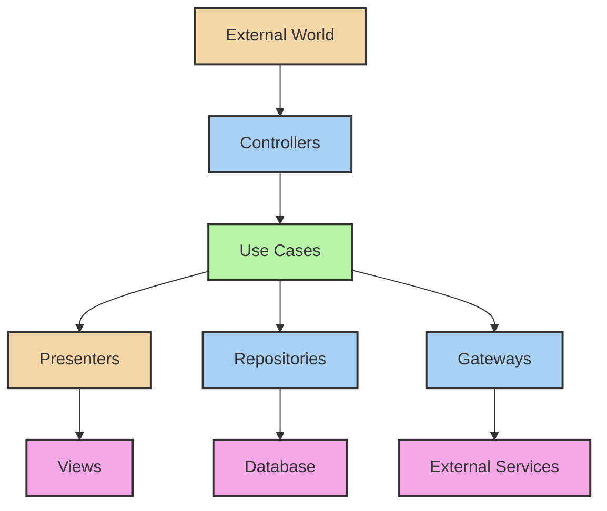

# 🔄 Interface Adapters Layer in Clean Architecture

## 1. Overview and Purpose

### Definition
The Interface Adapters layer converts data between the formats most convenient for use cases/entities and the formats most convenient for external agencies (UI, databases, external services).

### Key Responsibilities
- Data format conversion
- External interface implementation
- Framework integration
- UI/Database adaptation
- External service integration
- Request/Response handling

### Business Value
- Clean separation of concerns
- Framework independence
- Enhanced maintainability
- Simplified testing
- Easy technology migration
- Consistent interfaces

## 2. 🏗️ Core Components



## 3. 💻 Implementation Examples

### Controllers

```java
// Controller Interface
public interface OrderController {
    ResponseEntity<OrderResponse> createOrder(OrderRequest request);
    ResponseEntity<OrderResponse> getOrder(String orderId);
    ResponseEntity<List<OrderResponse>> getOrders(OrderSearchCriteria criteria);
}

// REST Controller Implementation
@RestController
@RequestMapping("/api/orders")
public class OrderRestController implements OrderController {
    private final CreateOrderUseCase createOrderUseCase;
    private final GetOrderUseCase getOrderUseCase;
    private final SearchOrdersUseCase searchOrdersUseCase;
    private final OrderPresenter presenter;
    
    @PostMapping
    public ResponseEntity<OrderResponse> createOrder(@RequestBody OrderRequest request) {
        try {
            CreateOrderCommand command = mapToCommand(request);
            OrderId orderId = createOrderUseCase.execute(command);
            Order order = getOrderUseCase.execute(orderId);
            return ResponseEntity.ok(presenter.present(order));
        } catch (ValidationException e) {
            throw new ResponseStatusException(
                HttpStatus.BAD_REQUEST, 
                e.getMessage()
            );
        }
    }
    
    private CreateOrderCommand mapToCommand(OrderRequest request) {
        return new CreateOrderCommand(
            new CustomerId(request.getCustomerId()),
            request.getItems().stream()
                .map(this::mapToOrderItem)
                .collect(Collectors.toList())
        );
    }
}
```

### Presenters

```java
// Presenter Interface
public interface OrderPresenter {
    OrderResponse present(Order order);
    OrderListResponse presentList(List<Order> orders);
    ErrorResponse presentError(Exception error);
}

// REST Presenter Implementation
@Component
public class OrderRestPresenter implements OrderPresenter {
    private final MessageSource messageSource;
    
    @Override
    public OrderResponse present(Order order) {
        return new OrderResponse(
            order.getId().toString(),
            formatCustomerInfo(order.getCustomer()),
            mapOrderItems(order.getItems()),
            formatMoney(order.getTotal()),
            formatStatus(order.getStatus()),
            formatDateTime(order.getCreatedAt())
        );
    }
    
    @Override
    public OrderListResponse presentList(List<Order> orders) {
        List<OrderResponse> orderResponses = orders.stream()
            .map(this::present)
            .collect(Collectors.toList());
            
        return new OrderListResponse(
            orderResponses,
            orders.size(),
            calculateTotalValue(orders)
        );
    }
    
    @Override
    public ErrorResponse presentError(Exception error) {
        return new ErrorResponse(
            translateErrorCode(error),
            getLocalizedMessage(error),
            getErrorDetails(error)
        );
    }
    
    private String formatMoney(Money money) {
        return NumberFormat.getCurrencyInstance()
            .format(money.amount());
    }
    
    private String formatDateTime(Instant dateTime) {
        return DateTimeFormatter.ofLocalizedDateTime(FormatStyle.MEDIUM)
            .format(dateTime.atZone(ZoneId.systemDefault()));
    }
}
```

### Repository Adapters

```java
// Repository Implementation
@Repository
public class JpaOrderRepository implements OrderRepository {
    private final JpaOrderEntityRepository jpaRepository;
    private final OrderMapper mapper;
    
    @Override
    public Order save(Order order) {
        OrderEntity entity = mapper.toEntity(order);
        OrderEntity savedEntity = jpaRepository.save(entity);
        return mapper.toDomain(savedEntity);
    }
    
    @Override
    public Optional<Order> findById(OrderId id) {
        return jpaRepository.findById(id.toString())
            .map(mapper::toDomain);
    }
    
    @Override
    public List<Order> findByCustomer(CustomerId customerId) {
        return jpaRepository.findByCustomerId(customerId.toString())
            .stream()
            .map(mapper::toDomain)
            .collect(Collectors.toList());
    }
}

// Entity Mapper
@Component
public class OrderMapper {
    public OrderEntity toEntity(Order order) {
        OrderEntity entity = new OrderEntity();
        entity.setId(order.getId().toString());
        entity.setCustomerId(order.getCustomerId().toString());
        entity.setStatus(order.getStatus().name());
        entity.setTotal(order.getTotal().amount());
        entity.setCurrency(order.getTotal().currency().getCurrencyCode());
        entity.setCreatedAt(order.getCreatedAt());
        entity.setItems(mapItems(order.getItems()));
        return entity;
    }
    
    public Order toDomain(OrderEntity entity) {
        return Order.reconstitute(
            new OrderId(entity.getId()),
            new CustomerId(entity.getCustomerId()),
            mapToDomainItems(entity.getItems()),
            OrderStatus.valueOf(entity.getStatus()),
            Money.of(entity.getTotal(), Currency.getInstance(entity.getCurrency())),
            entity.getCreatedAt()
        );
    }
}
```

### Gateway Adapters

```java
// Payment Gateway Implementation
@Component
public class StripePaymentGateway implements PaymentGateway {
    private final StripeClient stripeClient;
    private final PaymentMapper mapper;
    
    @Override
    public PaymentResult processPayment(Payment payment) {
        try {
            StripePaymentIntent intent = stripeClient.paymentIntents().create(
                PaymentIntentCreateParams.builder()
                    .setAmount(payment.getAmount().longValue())
                    .setCurrency(payment.getCurrency().getCode())
                    .setPaymentMethod(payment.getPaymentMethodId())
                    .build()
            );
            
            return mapper.toResult(intent);
        } catch (StripeException e) {
            throw translateException(e);
        }
    }
    
    private PaymentException translateException(StripeException e) {
        return switch (e) {
            case CardException ce -> new PaymentDeclinedException(ce.getMessage());
            case RateLimitException re -> new PaymentGatewayException("Rate limit exceeded");
            case InvalidRequestException ire -> new InvalidPaymentException(ire.getMessage());
            default -> new PaymentGatewayException("Payment processing failed");
        };
    }
}
```

## 4. 🔄 Data Flow & Transformation

### Request/Response Flow

```java
// Input Data Transformation
@Component
public class OrderRequestMapper {
    public CreateOrderCommand toCommand(OrderRequest request) {
        return new CreateOrderCommand(
            mapCustomerId(request.getCustomerId()),
            mapOrderItems(request.getItems()),
            mapPaymentInfo(request.getPayment())
        );
    }
    
    private List<OrderItemCommand> mapOrderItems(List<OrderItemRequest> items) {
        return items.stream()
            .map(item -> new OrderItemCommand(
                new ProductId(item.getProductId()),
                item.getQuantity(),
                Money.of(item.getPrice(), Currency.getInstance(item.getCurrency()))
            ))
            .collect(Collectors.toList());
    }
}

// Output Data Transformation
@Component
public class OrderResponseMapper {
    public OrderResponse toResponse(Order order) {
        return new OrderResponse(
            order.getId().toString(),
            mapCustomerInfo(order.getCustomer()),
            mapOrderItems(order.getItems()),
            mapMoney(order.getTotal()),
            order.getStatus().toString(),
            formatDateTime(order.getCreatedAt())
        );
    }
    
    private List<OrderItemResponse> mapOrderItems(List<OrderItem> items) {
        return items.stream()
            .map(this::mapOrderItem)
            .collect(Collectors.toList());
    }
}
```

## 5. 🧪 Testing Strategies

### Controller Tests

```java
@WebMvcTest(OrderRestController.class)
public class OrderControllerTest {
    @Autowired private MockMvc mockMvc;
    @MockBean private CreateOrderUseCase createOrderUseCase;
    @MockBean private OrderPresenter presenter;
    
    @Test
    void shouldCreateOrder() throws Exception {
        // Arrange
        OrderRequest request = createTestRequest();
        OrderResponse response = createTestResponse();
        
        when(createOrderUseCase.execute(any()))
            .thenReturn(new OrderId("test-id"));
        when(presenter.present(any()))
            .thenReturn(response);
            
        // Act & Assert
        mockMvc.perform(post("/api/orders")
            .contentType(MediaType.APPLICATION_JSON)
            .content(asJson(request)))
            .andExpect(status().isOk())
            .andExpect(jsonPath("$.orderId").value("test-id"));
    }
}
```

### Presenter Tests

```java
public class OrderPresenterTest {
    private OrderPresenter presenter;
    
    @Test
    void shouldPresentOrderSuccessfully() {
        // Arrange
        Order order = createTestOrder();
        
        // Act
        OrderResponse response = presenter.present(order);
        
        // Assert
        assertEquals("$99.99", response.getTotal());
        assertEquals("March 15, 2024", response.getOrderDate());
        assertEquals("PENDING", response.getStatus());
    }
    
    @Test
    void shouldPresentErrorAppropriately() {
        // Arrange
        ValidationException error = new ValidationException("Invalid order");
        
        // Act
        ErrorResponse response = presenter.presentError(error);
        
        // Assert
        assertEquals("VALIDATION_ERROR", response.getCode());
        assertEquals("Invalid order", response.getMessage());
    }
}
```

## 6. 🎯 Best Practices

### 1. Clean Separation

```java
// Good: Clear separation of concerns
public class OrderController {
    private final CreateOrderUseCase createOrderUseCase;
    private final OrderRequestMapper requestMapper;
    private final OrderPresenter presenter;
    
    public ResponseEntity<OrderResponse> createOrder(OrderRequest request) {
        CreateOrderCommand command = requestMapper.toCommand(request);
        Order order = createOrderUseCase.execute(command);
        return ResponseEntity.ok(presenter.present(order));
    }
}

// Bad: Mixed concerns
public class OrderController {
    private final OrderRepository repository;
    
    public ResponseEntity<OrderResponse> createOrder(OrderRequest request) {
        // Business logic in controller
        Order order = new Order(request.getCustomerId());
        order.addItems(request.getItems());
        order.validate();
        
        // Direct repository access
        repository.save(order);
        
        // Manual response mapping
        return ResponseEntity.ok(new OrderResponse(/*...*/));
    }
}
```

### 2. Framework Isolation

```java
// Good: Framework-agnostic interface
public interface OrderPresenter {
    OrderResponse present(Order order);
    ErrorResponse presentError(Exception error);
}

// Bad: Framework-specific interface
public interface OrderPresenter {
    @ResponseBody
    ResponseEntity<OrderDTO> present(Order order);
    
    @ExceptionHandler
    ResponseEntity<ErrorDTO> presentError(Exception error);
}
```

## 7. 🚫 Anti-patterns

### Common Mistakes to Avoid

1. **Leaking Domain Logic**
```java
// Wrong: Domain logic in controller
@RestController
public class OrderController {
    public ResponseEntity<OrderResponse> createOrder(OrderRequest request) {
        if (request.getTotal().compareTo(BigDecimal.ZERO) <= 0) {
            throw new ValidationException("Invalid total");
        }
        // More business rules...
    }
}

// Better: Domain logic in entities/use cases
public class Order {
    private void validateTotal() {
        if (total.isLessThanOrEqualToZero()) {
            throw new InvalidOrderException("Invalid total");
        }
    }
}
```

2. **Direct Domain Object Exposure**
```java
// Wrong: Exposing domain objects
@RestController
public class OrderController {
    @GetMapping("/{id}")
    public Order getOrder(@PathVariable String id) {
        return orderRepository.findById(id);
    }
}

// Better: Using DTOs
@RestController
public class OrderController {
    @GetMapping("/{id}")
    public OrderResponse getOrder(@PathVariable String id) {
        Order order = orderRepository.findById(id);
        return presenter.present(order);
    }
}
```

## 8. 📚 References

### Books
- "Clean Architecture" by Robert C. Martin
- "Implementing Domain-Driven Design" by Vaughn Vernon
- "Building Evolutionary Architectures" by Neal Ford, Rebecca Parsons, and Patrick Kua

### Articles
- [Clean Architecture: Controllers and Presenters](https://blog.cleancoder.com/uncle-bob/2012/08/13/the-clean-architecture.html)
- [Interface Adapters in Clean Architecture](https://www.baeldung.com/spring-boot-clean-architecture)