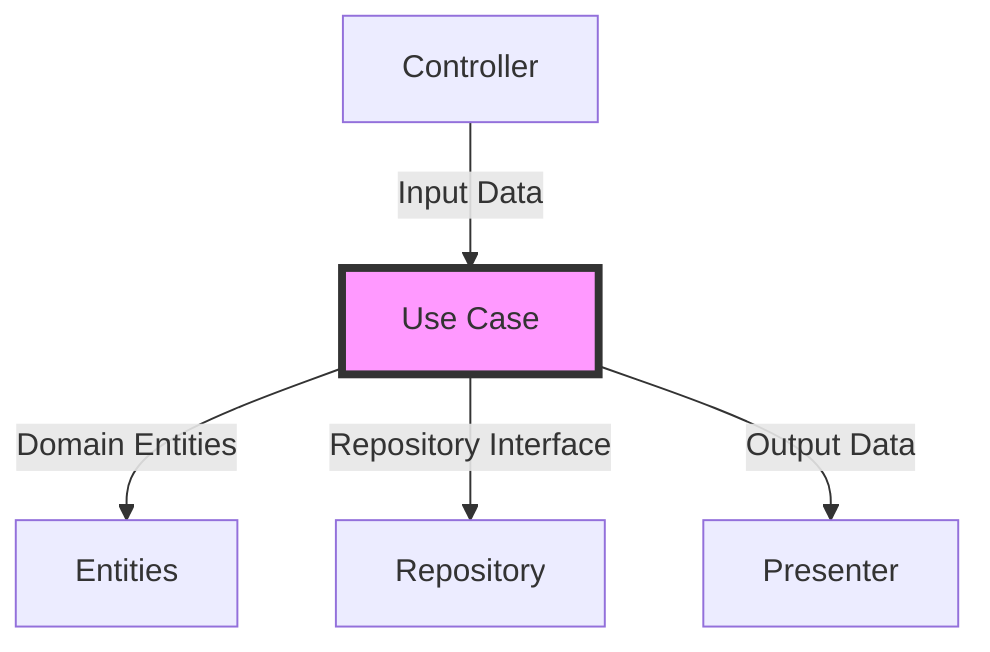

# 🎯 Clean Architecture Use Cases Documentation

## Overview and Problem Statement

### Definition
Use Cases (or Interactors) represent the application-specific business rules in Clean Architecture. They orchestrate the flow of data to and from entities and implement the application's use case scenarios.

### Problems Solved
- Business logic organization
- Separation of concerns
- Code reusability
- Testing complexity
- Business rule isolation
- Domain integrity preservation

### Business Value
- Faster feature implementation
- Reduced maintenance costs
- Improved code quality
- Better testing coverage
- Clearer business logic representation
- Easier requirement tracing

## Detailed Solution/Architecture

### Core Concepts



### Key Components

1. **Input Ports (Request Models)**
   - Data structures defining input
   - Validation rules
   - Input boundaries

2. **Output Ports (Response Models)**
   - Success responses
   - Error responses
   - Data transformation rules

3. **Use Case Implementation**
   - Business logic
   - Orchestration
   - Domain rules enforcement

## Technical Implementation

### Basic Use Case Structure

```typescript
// Input port
interface CreateOrderRequest {
    userId: string;
    products: Array<{
        productId: string;
        quantity: number;
    }>;
}

// Output port
interface CreateOrderResponse {
    orderId: string;
    totalAmount: number;
    status: OrderStatus;
}

// Use case interface
interface CreateOrderUseCase {
    execute(request: CreateOrderRequest): Promise<CreateOrderResponse>;
}

// Use case implementation
class CreateOrder implements CreateOrderUseCase {
    constructor(
        private readonly orderRepository: OrderRepository,
        private readonly productRepository: ProductRepository,
        private readonly userRepository: UserRepository
    ) {}

    async execute(request: CreateOrderRequest): Promise<CreateOrderResponse> {
        // 1. Validate request
        this.validateRequest(request);

        // 2. Get user
        const user = await this.userRepository.findById(request.userId);
        if (!user) {
            throw new UserNotFoundError(request.userId);
        }

        // 3. Get products and validate inventory
        const products = await this.validateAndGetProducts(request.products);

        // 4. Calculate order details
        const orderDetails = this.calculateOrderDetails(products);

        // 5. Create order entity
        const order = new Order({
            userId: user.id,
            products: products,
            totalAmount: orderDetails.totalAmount,
            status: OrderStatus.PENDING
        });

        // 6. Save order
        const savedOrder = await this.orderRepository.save(order);

        // 7. Return response
        return {
            orderId: savedOrder.id,
            totalAmount: savedOrder.totalAmount,
            status: savedOrder.status
        };
    }

    private validateRequest(request: CreateOrderRequest): void {
        if (!request.userId) {
            throw new ValidationError('User ID is required');
        }
        if (!request.products?.length) {
            throw new ValidationError('Products are required');
        }
    }

    private async validateAndGetProducts(products: Array<{productId: string; quantity: number}>) {
        // Implementation details...
    }

    private calculateOrderDetails(products: Product[]) {
        // Implementation details...
    }
}
```

### Complex Use Case Example with Transactions

```typescript
class TransferMoney implements TransferMoneyUseCase {
    constructor(
        private readonly accountRepository: AccountRepository,
        private readonly transactionRepository: TransactionRepository,
        private readonly unitOfWork: UnitOfWork
    ) {}

    async execute(request: TransferMoneyRequest): Promise<TransferMoneyResponse> {
        return await this.unitOfWork.runInTransaction(async () => {
            // 1. Validate accounts
            const [sourceAccount, targetAccount] = await Promise.all([
                this.accountRepository.findById(request.sourceAccountId),
                this.accountRepository.findById(request.targetAccountId)
            ]);

            // 2. Validate business rules
            this.validateTransfer(sourceAccount, targetAccount, request.amount);

            // 3. Create transaction records
            const transaction = new Transaction({
                sourceAccountId: sourceAccount.id,
                targetAccountId: targetAccount.id,
                amount: request.amount,
                type: TransactionType.TRANSFER
            });

            // 4. Update account balances
            sourceAccount.withdraw(request.amount);
            targetAccount.deposit(request.amount);

            // 5. Save changes
            await Promise.all([
                this.accountRepository.save(sourceAccount),
                this.accountRepository.save(targetAccount),
                this.transactionRepository.save(transaction)
            ]);

            // 6. Return response
            return {
                transactionId: transaction.id,
                status: TransactionStatus.COMPLETED,
                timestamp: transaction.createdAt
            };
        });
    }
}
```

## Decision Criteria & Evaluation

### When to Create a New Use Case

| Criteria | Example | Decision |
|----------|----------|----------|
| Business Operation | Create Order | New Use Case ✅ |
| Simple CRUD | Get User by ID | Repository Method ❌ |
| Complex Business Rules | Calculate Insurance Premium | New Use Case ✅ |
| Multiple Entity Updates | Transfer Money | New Use Case ✅ |
| Data Transformation | Format Report | New Use Case ✅ |

### Comparison with Other Patterns

| Pattern | Pros | Cons | Best For |
|---------|------|------|-----------|
| Use Cases | Clear business intent, Testable | More boilerplate | Complex business operations |
| Services | Less code, Simpler | Mixed responsibilities | Simple CRUD operations |
| Domain Events | Loose coupling | Complex flow | Event-driven systems |

## Anti-Patterns <a name="anti-patterns"></a>

### ❌ Common Mistakes

1. **Anemic Use Cases**
```typescript
// Bad: Just passing through to repository
class GetUserUseCase {
    constructor(private userRepo: UserRepository) {}
    
    async execute(id: string): Promise<User> {
        return this.userRepo.findById(id);  // No business logic
    }
}
```

2. **Mixed Responsibilities**
```typescript
// Bad: HTTP concerns in use case
class CreateUserUseCase {
    async execute(req: Express.Request): Promise<Express.Response> {
        // HTTP-specific code doesn't belong here
        if (!req.body.email) {
            return res.status(400).json({ error: 'Email required' });
        }
    }
}
```

### ✅ Correct Implementations

1. **Rich Use Cases**
```typescript
class GetUserUseCase {
    constructor(
        private userRepo: UserRepository,
        private accessPolicy: AccessPolicy
    ) {}
    
    async execute(request: GetUserRequest): Promise<GetUserResponse> {
        // Validate access
        await this.accessPolicy.validateAccess(request.requesterId, request.userId);
        
        // Get user with business rules
        const user = await this.userRepo.findById(request.userId);
        
        // Apply business rules
        if (user.isDeleted && !request.includeDeleted) {
            throw new UserNotAccessibleError();
        }
        
        // Transform response based on access level
        return this.transformResponse(user, request.requesterId);
    }
}
```

2. **Clean Responsibility Separation**
```typescript
// Use case only handles business logic
class CreateUserUseCase {
    async execute(request: CreateUserRequest): Promise<CreateUserResponse> {
        // Validate business rules
        await this.validateBusinessRules(request);
        
        // Create user entity
        const user = new User({
            email: request.email,
            role: this.determineUserRole(request)
        });
        
        // Save and return
        const savedUser = await this.userRepo.save(user);
        return this.presenter.present(savedUser);
    }
}
```

## Best Practices & Guidelines

### 1. Input Validation
```typescript
class CreateOrderValidator {
    validate(request: CreateOrderRequest): ValidationResult {
        const errors: ValidationError[] = [];
        
        if (!request.userId) {
            errors.push(new ValidationError('userId', 'Required'));
        }
        
        if (!request.products?.length) {
            errors.push(new ValidationError('products', 'At least one product required'));
        }
        
        request.products?.forEach((product, index) => {
            if (product.quantity <= 0) {
                errors.push(new ValidationError(
                    `products[${index}].quantity`,
                    'Must be greater than 0'
                ));
            }
        });
        
        return new ValidationResult(errors);
    }
}
```

### 2. Error Handling
```typescript
// Domain errors
class InsufficientFundsError extends Error {
    constructor(accountId: string, required: number, available: number) {
        super(`Account ${accountId} has insufficient funds. Required: ${required}, Available: ${available}`);
        this.name = 'InsufficientFundsError';
    }
}

// Use case with error handling
class WithdrawMoneyUseCase {
    async execute(request: WithdrawRequest): Promise<WithdrawResponse> {
        try {
            const account = await this.accountRepo.findById(request.accountId);
            
            if (!account) {
                throw new AccountNotFoundError(request.accountId);
            }
            
            if (account.balance < request.amount) {
                throw new InsufficientFundsError(
                    account.id,
                    request.amount,
                    account.balance
                );
            }
            
            // Process withdrawal...
            
        } catch (error) {
            // Log error details
            this.logger.error('Withdrawal failed', { error, request });
            
            // Rethrow domain errors
            if (error instanceof DomainError) {
                throw error;
            }
            
            // Wrap unexpected errors
            throw new WithdrawFailedError(request.accountId, error);
        }
    }
}
```

## Testing Strategies

### Unit Testing Use Cases

```typescript
describe('CreateOrderUseCase', () => {
    let useCase: CreateOrderUseCase;
    let mockOrderRepo: MockOrderRepository;
    let mockProductRepo: MockProductRepository;
    let mockUserRepo: MockUserRepository;
    
    beforeEach(() => {
        mockOrderRepo = new MockOrderRepository();
        mockProductRepo = new MockProductRepository();
        mockUserRepo = new MockUserRepository();
        
        useCase = new CreateOrderUseCase(
            mockOrderRepo,
            mockProductRepo,
            mockUserRepo
        );
    });
    
    it('should create order successfully', async () => {
        // Arrange
        const request = createValidRequest();
        mockUserRepo.findById.mockResolvedValue(createValidUser());
        mockProductRepo.findByIds.mockResolvedValue(createValidProducts());
        
        // Act
        const response = await useCase.execute(request);
        
        // Assert
        expect(response.status).toBe('CREATED');
        expect(mockOrderRepo.save).toHaveBeenCalledWith(
            expect.objectContaining({
                userId: request.userId,
                products: expect.arrayContaining([
                    expect.objectContaining({
                        productId: request.products[0].productId
                    })
                ])
            })
        );
    });
    
    it('should throw error when user not found', async () => {
        // Arrange
        const request = createValidRequest();
        mockUserRepo.findById.mockResolvedValue(null);
        
        // Act & Assert
        await expect(useCase.execute(request))
            .rejects
            .toThrow(UserNotFoundError);
    });
});
```

## Real-world Use Cases <a name="real-world"></a>

### E-commerce Order Processing
```typescript
class ProcessOrderUseCase {
    async execute(request: ProcessOrderRequest): Promise<ProcessOrderResponse> {
        // 1. Validate order
        const order = await this.orderRepo.findById(request.orderId);
        this.validateOrderState(order);
        
        // 2. Check inventory
        await this.checkInventory(order.products);
        
        // 3. Process payment
        const payment = await this.paymentService.process({
            orderId: order.id,
            amount: order.totalAmount,
            paymentMethod: request.paymentMethod
        });
        
        // 4. Update inventory
        await this.updateInventory(order.products);
        
        // 5. Create shipment
        const shipment = await this.createShipment(order, request.shippingAddress);
        
        // 6. Update order status
        order.status = OrderStatus.PROCESSING;
        await this.orderRepo.save(order);
        
        // 7. Notify customer
        await this.notificationService.sendOrderConfirmation(order);
        
        return {
            orderId: order.id,
            paymentId: payment.id,
            shipmentId: shipment.id,
            status: order.status
        };
    }
}
```

## FAQ Section <a name="faq"></a>

### Common Questions

1. **Q: When should I create a new use case vs using an existing one?**
   A: Create a new use case when:
   - The business operation is unique
   - It involves multiple entities or repositories
   - It has specific business rules
   - It requires special validation or authorization

2. **Q: How should I handle cross-cutting concerns?**
   A: Use decorators or middleware:
   ```typescript
   class LoggedUseCase implements UseCase<Request, Response> {
       constructor(
           private useCase: UseCase<Request, Response>,
           private logger: Logger
       ) {}
       
       async execute(request: Request): Promise<Response> {
           this.logger.info('Starting use case', { request });
           const response = await this.useCase.execute(request);
           this.logger.info('Completed use case', { response });
           return response;
       }
   }
   ```

3. **Q: How to handle complex validation?**
   A: Use dedicated validator classes and composition:
   ```typescript
   class CreateOrderValidator {
       validate(request: CreateOrderRequest): ValidationResult {
           return new ValidationBuilder()
               .validateRequired('userId', request.userId)
               .validateArray('products', request.products)
               .validateMinValue('totalAmount', request.totalAmount, 0)
               .build();
       }
   }
   ```

## References 

### Books
- "Clean Architecture" by Robert C. Martin
- "Implementing Domain-Driven Design" by Vaughn Vernon
- "Patterns of Enterprise Application Architecture" by Martin Fowler

### Online Resources
- Clean Architecture GitHub Examples
- Enterprise Patterns Documentation
- DDD Community Forums

### Articles
- "Use Cases in Clean Architecture"
- "Testing Strategies for Use Cases"
- "Error Handling in Clean Architecture"