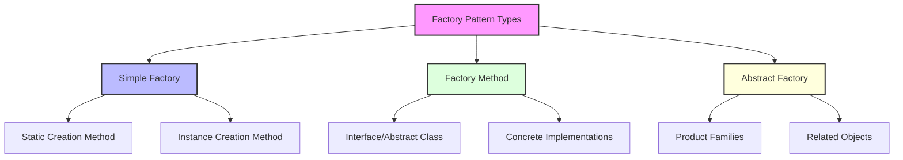
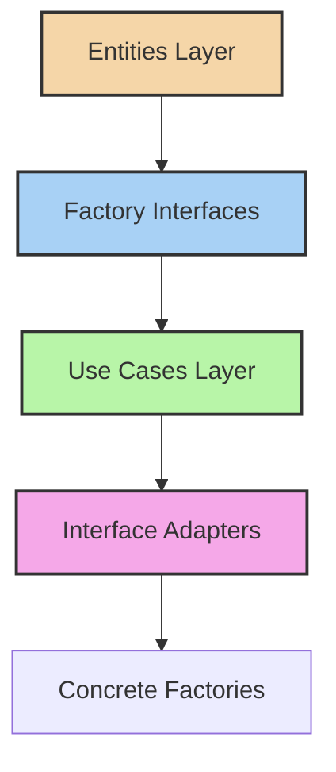

# 🏭 Factory Pattern in Clean Architecture

## 1. Overview and Purpose

### Definition
The Factory Pattern is a creational pattern that provides an interface for creating objects without explicitly specifying their exact classes, maintaining clean architecture principles by encapsulating object creation logic.

### Problems Solved
- Complex object creation
- Dependency management
- Testing complexity
- Configuration flexibility
- Implementation details isolation

### Business Value
- Improved maintainability
- Enhanced testability
- Reduced coupling
- Flexible object creation
- Better separation of concerns

## 2. 🏗️ Factory Pattern Types



## 3. 💻 Implementation Examples

### Simple Factory

```java
// Domain Entity
public class Order {
    private final OrderId id;
    private final CustomerId customerId;
    private final List<OrderItem> items;
    private OrderStatus status;

    // Private constructor ensures factory usage
    private Order(OrderId id, CustomerId customerId, List<OrderItem> items) {
        this.id = id;
        this.customerId = customerId;
        this.items = new ArrayList<>(items);
        this.status = OrderStatus.CREATED;
    }

    // Factory method
    public static Order create(CustomerId customerId, List<OrderItem> items) {
        validateItems(items);
        return new Order(OrderId.generate(), customerId, items);
    }

    private static void validateItems(List<OrderItem> items) {
        if (items == null || items.isEmpty()) {
            throw new InvalidOrderException("Order must have at least one item");
        }
    }
}

// Factory class
public class OrderFactory {
    public Order createOrder(CreateOrderRequest request) {
        List<OrderItem> items = createOrderItems(request.getItems());
        return Order.create(request.getCustomerId(), items);
    }

    private List<OrderItem> createOrderItems(List<OrderItemRequest> requests) {
        return requests.stream()
            .map(this::createOrderItem)
            .collect(Collectors.toList());
    }

    private OrderItem createOrderItem(OrderItemRequest request) {
        return new OrderItem(
            new ProductId(request.getProductId()),
            Money.of(request.getAmount()),
            request.getQuantity()
        );
    }
}
```

### Factory Method Pattern

```java
// Abstract Factory Method in Domain Layer
public interface PaymentProcessorFactory {
    PaymentProcessor createProcessor(PaymentMethod method);
}

// Concrete Factory in Infrastructure Layer
public class PaymentProcessorFactoryImpl implements PaymentProcessorFactory {
    private final StripeClient stripeClient;
    private final PayPalClient paypalClient;
    private final BankTransferClient bankClient;

    @Override
    public PaymentProcessor createProcessor(PaymentMethod method) {
        return switch (method) {
            case CREDIT_CARD -> new StripePaymentProcessor(stripeClient);
            case PAYPAL -> new PayPalPaymentProcessor(paypalClient);
            case BANK_TRANSFER -> new BankTransferProcessor(bankClient);
            default -> throw new UnsupportedPaymentMethodException(method);
        };
    }
}

// Usage in Use Case
public class ProcessPaymentUseCase {
    private final PaymentProcessorFactory processorFactory;
    private final PaymentRepository paymentRepository;

    public PaymentResult execute(Payment payment) {
        PaymentProcessor processor = processorFactory.createProcessor(payment.getMethod());
        PaymentResult result = processor.process(payment);
        paymentRepository.save(payment);
        return result;
    }
}
```

### Abstract Factory Pattern

```java
// Abstract Factory Interface
public interface NotificationFactory {
    NotificationSender createSender();
    NotificationTemplate createTemplate();
    NotificationFormatter createFormatter();
}

// Concrete Factories
public class EmailNotificationFactory implements NotificationFactory {
    @Override
    public NotificationSender createSender() {
        return new EmailSender();
    }

    @Override
    public NotificationTemplate createTemplate() {
        return new EmailTemplate();
    }

    @Override
    public NotificationFormatter createFormatter() {
        return new HTMLFormatter();
    }
}

public class SMSNotificationFactory implements NotificationFactory {
    @Override
    public NotificationSender createSender() {
        return new SMSSender();
    }

    @Override
    public NotificationTemplate createTemplate() {
        return new SMSTemplate();
    }

    @Override
    public NotificationFormatter createFormatter() {
        return new PlainTextFormatter();
    }
}

// Usage in Use Case
public class SendNotificationUseCase {
    private final NotificationFactory notificationFactory;

    public void execute(NotificationRequest request) {
        NotificationSender sender = notificationFactory.createSender();
        NotificationTemplate template = notificationFactory.createTemplate();
        NotificationFormatter formatter = notificationFactory.createFormatter();

        String content = template.generate(request.getData());
        String formattedContent = formatter.format(content);
        sender.send(request.getRecipient(), formattedContent);
    }
}
```

## 4. 🔄 Clean Architecture Integration

### Factory Location in Clean Architecture



### Implementation Example

```java
// Domain Layer - Entity Factory Interface
public interface UserFactory {
    User createUser(String email, String name, String password);
    User reconstitute(UserId id, String email, String name, String hashedPassword);
}

// Infrastructure Layer - Concrete Factory
public class DefaultUserFactory implements UserFactory {
    private final PasswordEncoder passwordEncoder;

    @Override
    public User createUser(String email, String name, String password) {
        return new User(
            UserId.generate(),
            new Email(email),
            new Name(name),
            passwordEncoder.encode(password)
        );
    }

    @Override
    public User reconstitute(UserId id, String email, String name, String hashedPassword) {
        return new User(
            id,
            new Email(email),
            new Name(name),
            Password.fromHash(hashedPassword)
        );
    }
}

// Use Case Layer
public class CreateUserUseCase {
    private final UserFactory userFactory;
    private final UserRepository userRepository;

    public UserId execute(CreateUserRequest request) {
        User user = userFactory.createUser(
            request.getEmail(),
            request.getName(),
            request.getPassword()
        );
        
        userRepository.save(user);
        return user.getId();
    }
}
```

## 5. 🧪 Testing with Factories

### Test Factories

```java
// Test Factory
public class TestUserFactory implements UserFactory {
    @Override
    public User createUser(String email, String name, String password) {
        return new User(
            UserId.generate(),
            new Email(email),
            new Name(name),
            Password.fromRaw(password)
        );
    }

    public User createDefaultUser() {
        return createUser("test@example.com", "Test User", "password123");
    }
}

// Test Examples
public class UserUseCaseTest {
    private TestUserFactory userFactory;
    
    @Test
    void shouldCreateUser() {
        // Arrange
        User user = userFactory.createDefaultUser();
        
        // Act
        userRepository.save(user);
        
        // Assert
        assertTrue(userRepository.findById(user.getId()).isPresent());
    }
}
```

## 6. 🎯 Best Practices

### Factory Design Guidelines

1. **Keep Factories Focused**
```java
// Good: Single responsibility
public interface OrderFactory {
    Order createOrder(CustomerId customerId, List<OrderItem> items);
    Order reconstitute(OrderId id, CustomerId customerId, List<OrderItem> items, OrderStatus status);
}

// Bad: Mixed responsibilities
public interface OrderFactory {
    Order createOrder(CustomerId customerId, List<OrderItem> items);
    void processOrder(Order order);  // Should be in a use case
    OrderStatus checkStatus(OrderId id);  // Should be in a repository
}
```

2. **Use Factory Methods for Validation**
```java
public class PaymentFactory {
    public Payment createPayment(CreatePaymentRequest request) {
        validateAmount(request.getAmount());
        validateCurrency(request.getCurrency());
        
        return new Payment(
            PaymentId.generate(),
            Money.of(request.getAmount(), request.getCurrency()),
            request.getPaymentMethod()
        );
    }

    private void validateAmount(BigDecimal amount) {
        if (amount.compareTo(BigDecimal.ZERO) <= 0) {
            throw new InvalidPaymentException("Amount must be greater than zero");
        }
    }
}
```

3. **Factory Method Naming**
```java
public interface DocumentFactory {
    // Clear, intention-revealing names
    Document createBlankDocument();
    Document createFromTemplate(TemplateId templateId);
    Document reconstitute(DocumentId id, byte[] content);
}
```

## 7. 🚫 Anti-patterns

### Common Mistakes to Avoid

1. **Exposing Implementation Details**
```java
// Wrong: Exposing database details
public class UserFactory {
    public User createUser(UserEntity entity) {  // Depends on infrastructure
        return new User(entity.getId(), entity.getEmail());
    }
}

// Better: Pure domain factory
public class UserFactory {
    public User createUser(UserId id, Email email) {
        return new User(id, email);
    }
}
```

2. **Complex Factory Logic**
```java
// Wrong: Too much logic in factory
public class OrderFactory {
    public Order createOrder(CreateOrderRequest request) {
        processPayment(request);  // Should be in use case
        updateInventory(request); // Should be in use case
        notifyCustomer(request);  // Should be in use case
        return new Order(/*...*/);
    }
}

// Better: Factory focuses on creation
public class OrderFactory {
    public Order createOrder(CreateOrderRequest request) {
        validateRequest(request);
        return new Order(
            OrderId.generate(),
            request.getCustomerId(),
            createOrderItems(request.getItems())
        );
    }
}
```

## 8. 📚 References

### Books
- "Clean Architecture" by Robert C. Martin
- "Design Patterns" by Gang of Four
- "Implementing Domain-Driven Design" by Vaughn Vernon

### Articles
- [Factory Pattern in Clean Architecture](https://blog.cleancoder.com/uncle-bob/2016/01/04/ALittleArchitecture.html)
- [Factory Method Pattern](https://refactoring.guru/design-patterns/factory-method)