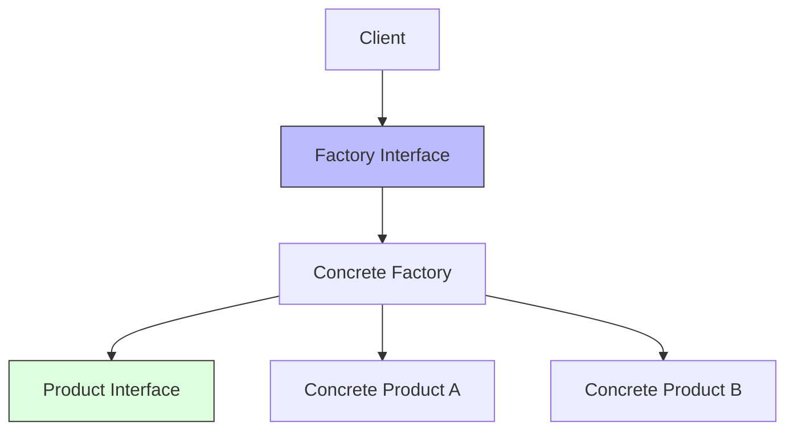
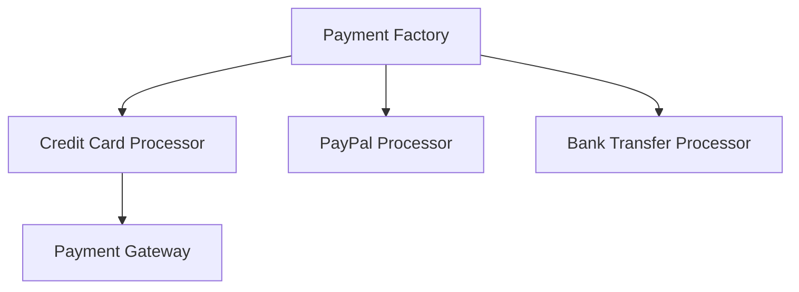

import Tabs from '@theme/Tabs';
import TabItem from '@theme/TabItem';

# 🏭 Factory Pattern in Clean Architecture

## Overview

The Factory Pattern is a creational pattern that provides an interface for creating objects without specifying their exact classes. In Clean Architecture, factories are crucial for maintaining dependency rules and ensuring proper object creation across architectural boundaries.

### Real World Analogy
Think of a car manufacturing plant. When you order a car, you don't need to know how to assemble each component. The factory handles all the complexity of creation, providing you with a complete car based on your specifications. Similarly, software factories create complex objects while hiding the creation details from the client code.

## 🎯 Key Concepts

### Component Structure



### Types of Factories

1. **Simple Factory**
    - Basic object creation
    - Single creation method
    - No interface required

2. **Factory Method**
    - Creation through inheritance
    - Subclasses decide the class
    - Template method pattern

3. **Abstract Factory**
    - Family of related objects
    - Multiple factory methods
    - Complete abstraction

## 💻 Implementation

### Payment Processing Factory Example

<Tabs>
  <TabItem value="java" label="Java">
```java
// Domain Models
package com.example.domain.model;

public interface PaymentProcessor {
TransactionResult process(PaymentRequest request);
void validate(PaymentRequest request);
boolean supports(PaymentMethod method);
}

public interface PaymentProcessorFactory {
PaymentProcessor createProcessor(PaymentMethod method);
}

// Factory Implementation
package com.example.infrastructure.factory;

@Component
public class PaymentProcessorFactoryImpl implements PaymentProcessorFactory {
private final Map<PaymentMethod, PaymentProcessor> processors;
private final MetricsService metricsService;
private final ConfigurationService configService;

    public PaymentProcessorFactoryImpl(
            List<PaymentProcessor> availableProcessors,
            MetricsService metricsService,
            ConfigurationService configService) {
        this.processors = availableProcessors.stream()
            .collect(Collectors.toMap(
                processor -> processor.getMethod(),
                processor -> processor
            ));
        this.metricsService = metricsService;
        this.configService = configService;
    }
    
    @Override
    public PaymentProcessor createProcessor(PaymentMethod method) {
        PaymentProcessor baseProcessor = processors.get(method);
        if (baseProcessor == null) {
            throw new UnsupportedPaymentMethodException(method);
        }
        
        // Enhance processor with cross-cutting concerns
        return new PaymentProcessorDecorator(
            baseProcessor,
            metricsService,
            configService
        );
    }
}

// Concrete Implementation
@Component
public class CreditCardProcessor implements PaymentProcessor {
private final PaymentGateway gateway;
private final PaymentValidator validator;

    public CreditCardProcessor(
            PaymentGateway gateway,
            PaymentValidator validator) {
        this.gateway = gateway;
        this.validator = validator;
    }
    
    @Override
    public TransactionResult process(PaymentRequest request) {
        validate(request);
        return gateway.processPayment(request);
    }
    
    @Override
    public void validate(PaymentRequest request) {
        validator.validateCreditCard(request);
    }
    
    @Override
    public boolean supports(PaymentMethod method) {
        return PaymentMethod.CREDIT_CARD.equals(method);
    }
}

// Abstract Factory Example
public interface PaymentComponentFactory {
PaymentProcessor createProcessor();
PaymentValidator createValidator();
PaymentGateway createGateway();
}

@Component
public class CreditCardComponentFactory implements PaymentComponentFactory {
private final Configuration config;

    @Override
    public PaymentProcessor createProcessor() {
        return new CreditCardProcessor(
            createGateway(),
            createValidator()
        );
    }
    
    @Override
    public PaymentValidator createValidator() {
        return new CreditCardValidator(config);
    }
    
    @Override
    public PaymentGateway createGateway() {
        return new CreditCardGateway(config);
    }
}
```
  </TabItem>
  <TabItem value="go" label="Go">
```go
// Domain Models
package domain

type PaymentProcessor interface {
    Process(request *PaymentRequest) (*TransactionResult, error)
    Validate(request *PaymentRequest) error
    Supports(method PaymentMethod) bool
}

type PaymentProcessorFactory interface {
    CreateProcessor(method PaymentMethod) (PaymentProcessor, error)
}

// Factory Implementation
package infrastructure

type PaymentProcessorFactoryImpl struct {
    processors     map[PaymentMethod]PaymentProcessor
    metricsService MetricsService
    configService  ConfigurationService
}

func NewPaymentProcessorFactory(
    availableProcessors []PaymentProcessor,
    metricsService MetricsService,
    configService ConfigurationService) PaymentProcessorFactory {
    
    processors := make(map[PaymentMethod]PaymentProcessor)
    for _, p := range availableProcessors {
        processors[p.Method()] = p
    }
    
    return &PaymentProcessorFactoryImpl{
        processors:     processors,
        metricsService: metricsService,
        configService:  configService,
    }
}

func (f *PaymentProcessorFactoryImpl) CreateProcessor(
    method PaymentMethod) (PaymentProcessor, error) {
    
    processor, exists := f.processors[method]
    if !exists {
        return nil, fmt.Errorf("unsupported payment method: %v", method)
    }
    
    // Enhance processor with cross-cutting concerns
    return NewPaymentProcessorDecorator(
        processor,
        f.metricsService,
        f.configService,
    ), nil
}

// Concrete Implementation
type CreditCardProcessor struct {
    gateway   PaymentGateway
    validator PaymentValidator
}

func NewCreditCardProcessor(
    gateway PaymentGateway,
    validator PaymentValidator) *CreditCardProcessor {
    
    return &CreditCardProcessor{
        gateway:   gateway,
        validator: validator,
    }
}

func (p *CreditCardProcessor) Process(
    request *PaymentRequest) (*TransactionResult, error) {
    
    if err := p.Validate(request); err != nil {
        return nil, err
    }
    return p.gateway.ProcessPayment(request)
}

func (p *CreditCardProcessor) Validate(
    request *PaymentRequest) error {
    return p.validator.ValidateCreditCard(request)
}

func (p *CreditCardProcessor) Supports(
    method PaymentMethod) bool {
    return method == PaymentMethodCreditCard
}

// Abstract Factory Example
type PaymentComponentFactory interface {
    CreateProcessor() PaymentProcessor
    CreateValidator() PaymentValidator
    CreateGateway() PaymentGateway
}

type CreditCardComponentFactory struct {
    config Configuration
}

func NewCreditCardComponentFactory(
    config Configuration) *CreditCardComponentFactory {
    return &CreditCardComponentFactory{config: config}
}

func (f *CreditCardComponentFactory) CreateProcessor() PaymentProcessor {
    return NewCreditCardProcessor(
        f.CreateGateway(),
        f.CreateValidator(),
    )
}

func (f *CreditCardComponentFactory) CreateValidator() PaymentValidator {
    return NewCreditCardValidator(f.config)
}

func (f *CreditCardComponentFactory) CreateGateway() PaymentGateway {
    return NewCreditCardGateway(f.config)
}
```
  </TabItem>
</Tabs>

## 🔄 Related Patterns

1. **Builder Pattern**
    - Complements Factory for complex object creation
    - Handles step-by-step construction
    - Provides fine-grained control

2. **Dependency Injection**
    - Works with factories for object creation
    - Manages dependencies
    - Supports testing

3. **Strategy Pattern**
    - Often created by factories
    - Provides runtime behavior selection
    - Supports extensibility

## ✅ Best Practices

### Configuration
1. Use dependency injection for factory dependencies
2. Externalize configuration
3. Implement proper validation
4. Use builders for complex objects

### Monitoring
1. Track object creation metrics
2. Monitor factory performance
3. Log creation failures
4. Implement health checks

### Testing
1. Mock factory outputs
2. Test all creation paths
3. Verify validation rules
4. Use test doubles

## ⚠️ Common Pitfalls

1. **Complex Factories**
    - Symptom: Too many creation methods
    - Solution: Split into specialized factories

2. **Tight Coupling**
    - Symptom: Direct instantiation in factory
    - Solution: Use dependency injection

3. **Missing Validation**
    - Symptom: Invalid objects created
    - Solution: Implement validation in factory

4. **Hidden Dependencies**
    - Symptom: Objects need post-creation setup
    - Solution: Use proper initialization in factory

## 🎯 Use Cases

### 1. Payment Processing System



### 2. Document Generation System
- Multiple document formats
- Format-specific processing
- Configurable templates

### 3. Connection Pool Management
- Database connections
- Connection configuration
- Pool metrics

## 🔍 Deep Dive Topics

### Thread Safety

1. **Thread-Safe Factory**
```java
@ThreadSafe
public class ConcurrentFactory {
    private final ConcurrentMap<String, Object> cache
        = new ConcurrentHashMap<>();
    
    public Object getInstance(String key) {
        return cache.computeIfAbsent(key, this::createInstance);
    }
}
```

2. **Object Pool Factory**
```java
public class PooledObjectFactory {
    private final ObjectPool<Resource> pool;
    
    public Resource acquire() {
        return pool.borrowObject();
    }
    
    public void release(Resource resource) {
        pool.returnObject(resource);
    }
}
```

### Performance

1. **Lazy Initialization**
```java
public class LazyFactory {
    private volatile Resource instance;
    
    public Resource getInstance() {
        if (instance == null) {
            synchronized (this) {
                if (instance == null) {
                    instance = createResource();
                }
            }
        }
        return instance;
    }
}
```

2. **Caching Factory**
```java
public class CachingFactory {
    private final LoadingCache<String, Object> cache;
    
    public Object getInstance(String key) {
        return cache.get(key);
    }
}
```

## 📚 Additional Resources

### Books
1. "Design Patterns" by Gang of Four
2. "Clean Architecture" by Robert C. Martin
3. "Effective Java" by Joshua Bloch

### Tools
1. Spring Framework
2. Google Guice
3. Factory Boy (Testing)
4. JUnit/TestNG

### References
1. [Refactoring Guru - Factory Pattern](https://refactoring.guru/design-patterns/factory-method)
2. [Martin Fowler - Factory Pattern](https://martinfowler.com/articles/injection.html)

## ❓ FAQs

### Q: When should I use Factory vs Direct Construction?
A: Use Factory when creation logic is complex or might change, or when you need to maintain abstractions.

### Q: How do I handle factory errors?
A: Use custom exceptions and proper validation in the factory methods.

### Q: Should factories be stateless?
A: Generally yes, though caching factories may maintain state.

### Q: How to handle dependency injection in factories?
A: Inject dependencies into the factory and let it pass them to created objects.

### Q: When should I use Abstract Factory vs Factory Method?
A: Use Abstract Factory when you need to create families of related objects.