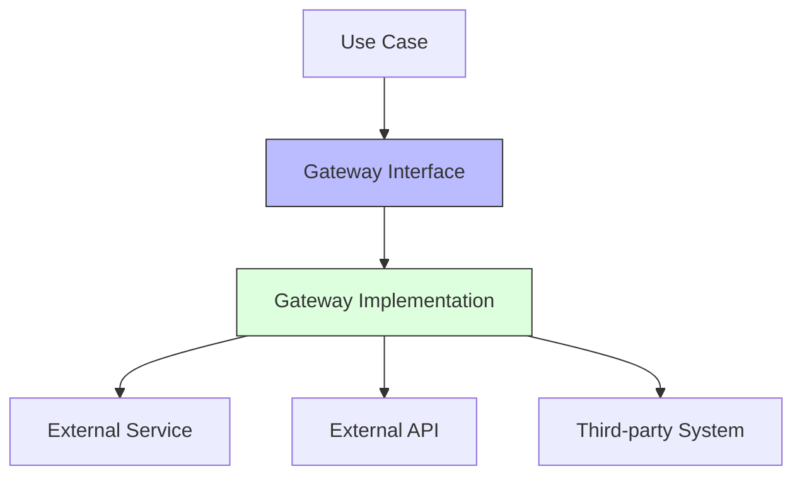
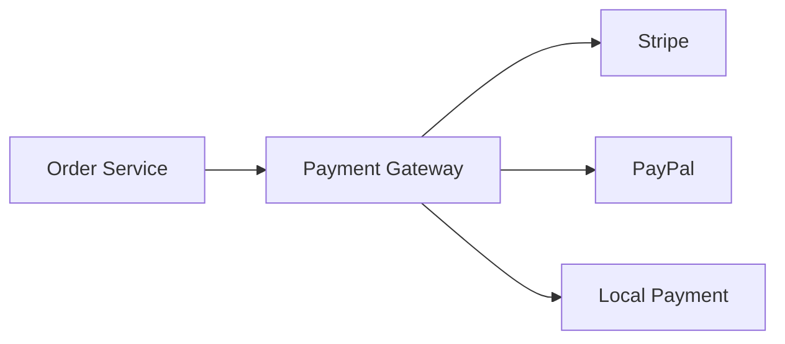

import Tabs from '@theme/Tabs';
import TabItem from '@theme/TabItem';

# 🔄 Gateway Pattern in Clean Architecture

## Overview

The Gateway Pattern is an architectural pattern that encapsulates access to external services or resources in Clean Architecture. It acts as a translator between your application's domain and external systems, providing a clean interface while hiding implementation details.

### Real World Analogy
Think of a universal travel adapter. When traveling internationally, you don't need to know the specific details of each country's electrical system. The adapter (Gateway) handles the conversion between your device and the local power supply, providing a consistent interface regardless of the underlying infrastructure.

## 🎯 Key Concepts

### Architecture Overview



### Components

1. **Gateway Interface**
    - Defines contract for external communication
    - Lives in domain/application layer
    - Technology-agnostic

2. **Gateway Implementation**
    - Implements the interface
    - Lives in infrastructure layer
    - Handles specific protocols/formats

3. **Request/Response Models**
    - Domain-specific models
    - Translation logic
    - Error handling

## 💻 Implementation

### Payment Gateway Example

<Tabs>
  <TabItem value="java" label="Java">
```java
// Gateway Interface
package com.example.domain.gateway;

public interface PaymentGateway {
PaymentResult processPayment(PaymentRequest request);
PaymentStatus checkStatus(String paymentId);
void refundPayment(String paymentId, Money amount);
}

// Domain Models
package com.example.domain.model;

@Value
public class PaymentRequest {
private final String orderId;
private final Money amount;
private final Currency currency;
private final PaymentMethod method;
private final CustomerInfo customer;
}

@Value
public class PaymentResult {
private final String paymentId;
private final PaymentStatus status;
private final String transactionReference;
private final LocalDateTime timestamp;
}

// Gateway Implementation for Stripe
package com.example.infrastructure.gateway;

@Component
public class StripePaymentGateway implements PaymentGateway {
private final Stripe stripeClient;
private final PaymentMapper mapper;
private final MetricsService metrics;

    public StripePaymentGateway(Stripe stripeClient, 
                               PaymentMapper mapper,
                               MetricsService metrics) {
        this.stripeClient = stripeClient;
        this.mapper = mapper;
        this.metrics = metrics;
    }
    
    @Override
    public PaymentResult processPayment(PaymentRequest request) {
        try {
            metrics.startTimer("stripe.payment");
            
            StripePaymentIntent intent = mapper.toStripeIntent(request);
            StripePaymentResult result = stripeClient.createPayment(intent);
            
            return mapper.toDomain(result);
        } catch (StripeException e) {
            throw new PaymentGatewayException("Payment processing failed", e);
        } finally {
            metrics.stopTimer("stripe.payment");
        }
    }
    
    @Override
    public PaymentStatus checkStatus(String paymentId) {
        try {
            StripePayment payment = stripeClient.getPayment(paymentId);
            return mapper.toPaymentStatus(payment.getStatus());
        } catch (StripeException e) {
            throw new PaymentGatewayException("Status check failed", e);
        }
    }
}

// Gateway Factory
package com.example.infrastructure.gateway;

@Component
public class PaymentGatewayFactory {
private final Map<String, PaymentGateway> gateways;

    public PaymentGatewayFactory(List<PaymentGateway> availableGateways) {
        this.gateways = availableGateways.stream()
            .collect(Collectors.toMap(
                PaymentGateway::getProvider,
                gateway -> gateway
            ));
    }
    
    public PaymentGateway getGateway(String provider) {
        return Optional.ofNullable(gateways.get(provider))
            .orElseThrow(() -> new GatewayNotFoundException(provider));
    }
}
```
  </TabItem>
  <TabItem value="go" label="Go">
```go
// Gateway Interface
package gateway

type PaymentGateway interface {
    ProcessPayment(request *PaymentRequest) (*PaymentResult, error)
    CheckStatus(paymentID string) (PaymentStatus, error)
    RefundPayment(paymentID string, amount Money) error
}

// Domain Models
package domain

type PaymentRequest struct {
    OrderID  string
    Amount   Money
    Currency Currency
    Method   PaymentMethod
    Customer CustomerInfo
}

type PaymentResult struct {
    PaymentID           string
    Status             PaymentStatus
    TransactionReference string
    Timestamp          time.Time
}

// Gateway Implementation
package infrastructure

type StripePaymentGateway struct {
    client  *stripe.Client
    mapper  PaymentMapper
    metrics MetricsService
}

func NewStripePaymentGateway(client *stripe.Client, 
                           mapper PaymentMapper,
                           metrics MetricsService) PaymentGateway {
    return &StripePaymentGateway{
        client:  client,
        mapper:  mapper,
        metrics: metrics,
    }
}

func (g *StripePaymentGateway) ProcessPayment(
    request *PaymentRequest) (*PaymentResult, error) {
    
    timer := g.metrics.StartTimer("stripe.payment")
    defer timer.Stop()
    
    intent, err := g.mapper.ToStripeIntent(request)
    if err != nil {
        return nil, fmt.Errorf("mapping error: %w", err)
    }
    
    result, err := g.client.CreatePayment(intent)
    if err != nil {
        return nil, fmt.Errorf("stripe error: %w", err)
    }
    
    return g.mapper.ToDomain(result)
}

func (g *StripePaymentGateway) CheckStatus(
    paymentID string) (PaymentStatus, error) {
    
    payment, err := g.client.GetPayment(paymentID)
    if err != nil {
        return "", fmt.Errorf("stripe error: %w", err)
    }
    
    return g.mapper.ToPaymentStatus(payment.Status), nil
}

// Gateway Factory
package infrastructure

type PaymentGatewayFactory struct {
    gateways map[string]PaymentGateway
}

func NewPaymentGatewayFactory(
    availableGateways []PaymentGateway) *PaymentGatewayFactory {
    
    gateways := make(map[string]PaymentGateway)
    for _, g := range availableGateways {
        gateways[g.Provider()] = g
    }
    
    return &PaymentGatewayFactory{gateways: gateways}
}

func (f *PaymentGatewayFactory) GetGateway(
    provider string) (PaymentGateway, error) {
    
    if gateway, exists := f.gateways[provider]; exists {
        return gateway, nil
    }
    return nil, fmt.Errorf("gateway not found: %s", provider)
}
```
  </TabItem>
</Tabs>

## 🔄 Related Patterns

1. **Adapter Pattern**
    - Similar purpose for interface adaptation
    - Often used within Gateway implementation
    - More focused on interface conversion

2. **Factory Pattern**
    - Creates appropriate Gateway instances
    - Handles configuration and dependencies
    - Provides flexibility in implementation choice

3. **Strategy Pattern**
    - Allows switching between different Gateway implementations
    - Supports runtime Gateway selection
    - Maintains consistent interface

## ✅ Best Practices

### Configuration
1. Use dependency injection for Gateway dependencies
2. Externalize configuration (URLs, credentials)
3. Implement proper retry policies
4. Use circuit breakers for external calls

### Monitoring
1. Track gateway performance metrics
2. Log all external interactions
3. Monitor error rates
4. Implement health checks

### Testing
1. Create test doubles for external services
2. Test error scenarios comprehensively
3. Implement integration tests
4. Use contract tests

## ⚠️ Common Pitfalls

1. **Leaking External Details**
    - Symptom: External system specifics in domain
    - Solution: Proper abstraction and mapping

2. **Missing Error Handling**
    - Symptom: Uncaught external exceptions
    - Solution: Comprehensive error mapping

3. **Tight Coupling**
    - Symptom: Direct dependency on external systems
    - Solution: Use proper abstractions and interfaces

4. **Complex Gateway Logic**
    - Symptom: Business logic in gateways
    - Solution: Keep gateways focused on communication

## 🎯 Use Cases

### 1. Payment Processing System


### 2. Email Service Integration
- Multiple provider support
- Template rendering
- Delivery tracking

### 3. External API Integration
- Rate limiting
- Authentication handling
- Response caching

## 🔍 Deep Dive Topics

### Thread Safety

1. **Connection Management**
```java
public class ThreadSafeGateway {
    private final ClientPool clientPool;
    
    public Response execute(Request request) {
        try (Client client = clientPool.acquire()) {
            return client.execute(request);
        }
    }
}
```

2. **Caching Considerations**
```java
public class CachingGateway implements ServiceGateway {
    private final Cache<String, Response> cache;
    private final ServiceGateway delegate;
    
    public Response execute(Request request) {
        String key = request.cacheKey();
        return cache.get(key, () -> delegate.execute(request));
    }
}
```

### Distributed Systems

1. **Circuit Breaker**
```java
public class ResilientGateway implements ServiceGateway {
    private final CircuitBreaker circuitBreaker;
    private final ServiceGateway delegate;
    
    public Response execute(Request request) {
        return circuitBreaker.execute(() -> 
            delegate.execute(request)
        );
    }
}
```

2. **Retry Handling**
```java
public class RetryingGateway implements ServiceGateway {
    private final RetryPolicy retryPolicy;
    private final ServiceGateway delegate;
    
    public Response execute(Request request) {
        return retryPolicy.execute(() -> 
            delegate.execute(request)
        );
    }
}
```

### Performance

1. **Batch Operations**
```java
public interface BatchGateway {
    List<Response> executeBatch(List<Request> requests);
}
```

2. **Response Caching**
```java
public class CacheableGateway implements ServiceGateway {
    private final LoadingCache<String, Response> cache;
    
    public Response execute(Request request) {
        return cache.get(request.cacheKey());
    }
}
```

## 📚 Additional Resources

### Books
1. "Clean Architecture" by Robert C. Martin
2. "Cloud Design Patterns" by Microsoft
3. "Release It!" by Michael Nygard

### Tools
1. Resilience4j
2. Istio
3. Prometheus (for monitoring)
4. OpenFeign (Java)

### References
1. [Microsoft - Gateway Pattern](https://docs.microsoft.com/en-us/azure/architecture/patterns/gateway-aggregation)
2. [Martin Fowler - Gateway Pattern](https://martinfowler.com/eaaCatalog/gateway.html)

## ❓ FAQs

### Q: When should I use a Gateway vs direct integration?
A: Use a Gateway when you need to abstract external system details or support multiple providers.

### Q: How do I handle authentication in Gateways?
A: Use decorators or middleware for authentication, keeping it separate from core Gateway logic.

### Q: Should Gateways handle retries?
A: Yes, but implement them using decorators to maintain single responsibility.

### Q: How to handle versioning of external APIs?
A: Create separate Gateway implementations or use adapters for different versions.

### Q: Can I share Gateways between different bounded contexts?
A: Generally no, each bounded context should have its own Gateways to maintain independence.