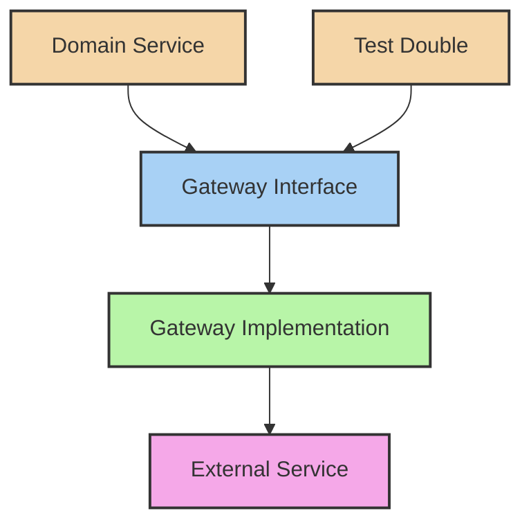

# 🔄 Gateway Pattern in Clean Architecture

## 1. Overview and Purpose

### Definition
The Gateway Pattern provides a simplified interface to complex external systems, encapsulating the implementation details of external service communication while maintaining clean architecture principles.

### Problems Solved
- External service coupling
- Complex integration logic
- Protocol dependencies
- Testing difficulties
- Configuration management
- Error handling standardization

### Business Value
- Simplified integration
- Enhanced maintainability
- Improved testability
- Better error handling
- Easier service migration
- Consistent interfaces

## 2. 🏗️ Gateway Pattern Structure



## 3. 💻 Implementation Examples

### Payment Gateway Example

```java
// Domain Layer - Gateway Interface
public interface PaymentGateway {
    PaymentResult processPayment(Payment payment);
    PaymentStatus checkStatus(PaymentId paymentId);
    PaymentRefund refundPayment(PaymentId paymentId, Money amount);
}

// Domain Layer - Value Objects
public record Payment(
    PaymentId id,
    Money amount,
    Currency currency,
    PaymentMethod method,
    CustomerInfo customer
) {}

public record PaymentResult(
    PaymentId id,
    PaymentStatus status,
    String transactionId,
    Instant processedAt
) {}

// Infrastructure Layer - Stripe Implementation
public class StripePaymentGateway implements PaymentGateway {
    private final StripeClient stripeClient;
    private final PaymentMapper mapper;
    
    @Override
    public PaymentResult processPayment(Payment payment) {
        try {
            StripePaymentIntent intent = stripeClient.paymentIntents().create(
                PaymentIntentCreateParams.builder()
                    .setAmount(payment.amount().longValue())
                    .setCurrency(payment.currency().getCode())
                    .setPaymentMethod(mapPaymentMethod(payment.method()))
                    .setCustomer(payment.customer().id())
                    .build()
            );
            
            return mapper.toPaymentResult(intent);
        } catch (StripeException e) {
            throw new PaymentProcessingException("Failed to process payment", e);
        }
    }
    
    @Override
    public PaymentStatus checkStatus(PaymentId paymentId) {
        try {
            StripePaymentIntent intent = stripeClient.paymentIntents()
                .retrieve(paymentId.toString());
            return mapper.toPaymentStatus(intent.getStatus());
        } catch (StripeException e) {
            throw new PaymentStatusCheckException("Failed to check payment status", e);
        }
    }
}

// Use Case Layer
public class ProcessPaymentUseCase {
    private final PaymentGateway paymentGateway;
    private final PaymentRepository paymentRepository;
    
    public PaymentResult execute(ProcessPaymentCommand command) {
        Payment payment = createPayment(command);
        PaymentResult result = paymentGateway.processPayment(payment);
        
        paymentRepository.save(payment.withResult(result));
        return result;
    }
}
```

### Email Gateway Example

```java
// Domain Layer - Gateway Interface
public interface EmailGateway {
    void sendEmail(Email email);
    List<EmailStatus> checkBulkStatus(List<EmailId> emailIds);
    EmailTemplate getTemplate(TemplateId templateId);
}

// Domain Layer - Email Value Object
public record Email(
    EmailId id,
    EmailAddress from,
    List<EmailAddress> to,
    List<EmailAddress> cc,
    String subject,
    EmailContent content,
    List<Attachment> attachments
) {
    public static Email createTransactional(
        EmailAddress to, 
        String subject, 
        EmailContent content
    ) {
        return new Email(
            EmailId.generate(),
            EmailAddress.getDefaultFrom(),
            List.of(to),
            List.of(),
            subject,
            content,
            List.of()
        );
    }
}

// Infrastructure Layer - AWS SES Implementation
public class SESEmailGateway implements EmailGateway {
    private final AmazonSimpleEmailService sesClient;
    private final EmailMapper mapper;
    
    @Override
    public void sendEmail(Email email) {
        try {
            SendEmailRequest request = mapper.toSESRequest(email);
            SendEmailResult result = sesClient.sendEmail(request);
            
            if (!result.getMessageId().isPresent()) {
                throw new EmailSendException("Failed to send email");
            }
        } catch (AmazonSESException e) {
            throw new EmailSendException("Failed to send email via SES", e);
        }
    }
    
    @Override
    public List<EmailStatus> checkBulkStatus(List<EmailId> emailIds) {
        return emailIds.stream()
            .map(this::getEmailStatus)
            .collect(Collectors.toList());
    }
}
```

### Third-Party API Gateway Example

```java
// Domain Layer - Gateway Interface
public interface WeatherGateway {
    WeatherInfo getCurrentWeather(Location location);
    WeatherForecast getForecast(Location location, int days);
    List<WeatherAlert> getAlerts(Location location);
}

// Infrastructure Layer - OpenWeather Implementation
public class OpenWeatherGateway implements WeatherGateway {
    private final OpenWeatherClient client;
    private final WeatherMapper mapper;
    private final Cache cache;
    
    @Override
    public WeatherInfo getCurrentWeather(Location location) {
        String cacheKey = buildCacheKey("current", location);
        return cache.get(cacheKey, () -> {
            OpenWeatherResponse response = client.getCurrentWeather(
                location.latitude(),
                location.longitude()
            );
            return mapper.toWeatherInfo(response);
        });
    }
    
    @Override
    public WeatherForecast getForecast(Location location, int days) {
        validateDaysRange(days);
        
        String cacheKey = buildCacheKey("forecast", location, days);
        return cache.get(cacheKey, () -> {
            OpenWeatherForecastResponse response = client.getForecast(
                location.latitude(),
                location.longitude(),
                days
            );
            return mapper.toWeatherForecast(response);
        });
    }
}

// Use Case Layer
public class GetWeatherForecastUseCase {
    private final WeatherGateway weatherGateway;
    private final LocationService locationService;
    
    public WeatherForecast execute(GetForecastRequest request) {
        Location location = locationService.getLocation(request.getLocationId());
        return weatherGateway.getForecast(location, request.getDays());
    }
}
```

## 4. 🛡️ Error Handling

### Standardized Error Handling

```java
// Domain Layer - Custom Exceptions
public class GatewayException extends RuntimeException {
    private final ErrorCode errorCode;
    
    public GatewayException(String message, ErrorCode errorCode) {
        super(message);
        this.errorCode = errorCode;
    }
}

public enum ErrorCode {
    NETWORK_ERROR,
    AUTHENTICATION_FAILED,
    SERVICE_UNAVAILABLE,
    INVALID_REQUEST,
    RATE_LIMIT_EXCEEDED
}

// Infrastructure Layer - Error Handling
public class ResilientGateway<T> {
    private final T gateway;
    private final CircuitBreaker circuitBreaker;
    private final RetryPolicy retryPolicy;
    
    public <R> R execute(GatewayOperation<T, R> operation) {
        return circuitBreaker.execute(() -> 
            retryPolicy.execute(() -> {
                try {
                    return operation.execute(gateway);
                } catch (Exception e) {
                    throw translateException(e);
                }
            })
        );
    }
    
    private GatewayException translateException(Exception e) {
        if (e instanceof ConnectException) {
            return new GatewayException(
                "Service unavailable", 
                ErrorCode.SERVICE_UNAVAILABLE
            );
        }
        // Handle other exceptions...
        return new GatewayException(
            "Unknown error", 
            ErrorCode.NETWORK_ERROR
        );
    }
}
```

## 5. 🧪 Testing Strategies

### Gateway Test Doubles

```java
// Test Double Implementation
public class TestPaymentGateway implements PaymentGateway {
    private final Map<PaymentId, PaymentResult> payments = new HashMap<>();
    
    @Override
    public PaymentResult processPayment(Payment payment) {
        PaymentResult result = new PaymentResult(
            payment.id(),
            PaymentStatus.COMPLETED,
            "test-transaction-" + payment.id(),
            Instant.now()
        );
        payments.put(payment.id(), result);
        return result;
    }
    
    @Override
    public PaymentStatus checkStatus(PaymentId paymentId) {
        return payments.get(paymentId).status();
    }
}

// Integration Test
public class StripePaymentGatewayIntegrationTest {
    private PaymentGateway gateway;
    
    @Test
    void shouldProcessPayment() {
        // Arrange
        Payment payment = createTestPayment();
        
        // Act
        PaymentResult result = gateway.processPayment(payment);
        
        // Assert
        assertNotNull(result.transactionId());
        assertEquals(PaymentStatus.COMPLETED, result.status());
    }
}

// Use Case Test
public class ProcessPaymentUseCaseTest {
    @Mock private PaymentGateway paymentGateway;
    
    @Test
    void shouldProcessPaymentSuccessfully() {
        // Arrange
        ProcessPaymentCommand command = createTestCommand();
        when(paymentGateway.processPayment(any()))
            .thenReturn(createSuccessResult());
        
        // Act
        PaymentResult result = useCase.execute(command);
        
        // Assert
        verify(paymentGateway).processPayment(any());
        assertEquals(PaymentStatus.COMPLETED, result.status());
    }
}
```

## 6. 🎯 Best Practices

### Gateway Design Guidelines

1. **Keep Gateway Interfaces Clean**
```java
// Good: Clean interface
public interface UserProfileGateway {
    UserProfile getProfile(UserId userId);
    void updateProfile(UserProfile profile);
}

// Bad: Leaking implementation details
public interface UserProfileGateway {
    RestResponse<UserProfileDTO> getProfile(String userId);
    void updateProfile(UserProfileDTO profile, Headers headers);
}
```

2. **Use Mappers for Data Transformation**
```java
public class PaymentMapper {
    public StripePaymentIntent toStripeIntent(Payment payment) {
        return PaymentIntent.builder()
            .setAmount(payment.amount().longValue())
            .setCurrency(payment.currency().getCode())
            .setPaymentMethod(payment.method().toString())
            .build();
    }
    
    public PaymentResult fromStripeIntent(StripePaymentIntent intent) {
        return new PaymentResult(
            PaymentId.from(intent.getId()),
            mapStatus(intent.getStatus()),
            intent.getId(),
            Instant.ofEpochSecond(intent.getCreated())
        );
    }
}
```

3. **Implement Resilience Patterns**
```java
public class ResilientEmailGateway implements EmailGateway {
    private final EmailGateway delegate;
    private final CircuitBreaker circuitBreaker;
    private final RetryPolicy retryPolicy;
    
    @Override
    public void sendEmail(Email email) {
        circuitBreaker.execute(() -> 
            retryPolicy.execute(() -> 
                delegate.sendEmail(email)
            )
        );
    }
}
```

## 7. 🚫 Anti-patterns

### Common Mistakes to Avoid

1. **Leaking Implementation Details**
```java
// Wrong: Exposing HTTP concepts
public interface ApiGateway {
    HttpResponse get(String url, Map<String, String> headers);
}

// Better: Domain-focused interface
public interface ProductGateway {
    Product getProduct(ProductId id);
    List<Product> searchProducts(SearchCriteria criteria);
}
```

2. **Missing Error Translation**
```java
// Wrong: Propagating third-party exceptions
public class PayPalGateway implements PaymentGateway {
    public PaymentResult processPayment(Payment payment) {
        return paypalClient.processPayment(payment); // Leaks PayPal exceptions
    }
}

// Better: Translating to domain exceptions
public class PayPalGateway implements PaymentGateway {
    public PaymentResult processPayment(Payment payment) {
        try {
            return paypalClient.processPayment(payment);
        } catch (PayPalException e) {
            throw new PaymentProcessingException(
                "Failed to process payment", 
                translateErrorCode(e)
            );
        }
    }
}
```

## 8. 📚 References

### Books
- "Clean Architecture" by Robert C. Martin
- "Patterns of Enterprise Application Architecture" by Martin Fowler
- "Building Microservices" by Sam Newman

### Articles
- [Gateway Pattern in Clean Architecture](https://blog.cleancoder.com/uncle-bob/2016/01/04/ALittleArchitecture.html)
- [Integration Patterns](https://www.enterpriseintegrationpatterns.com/)