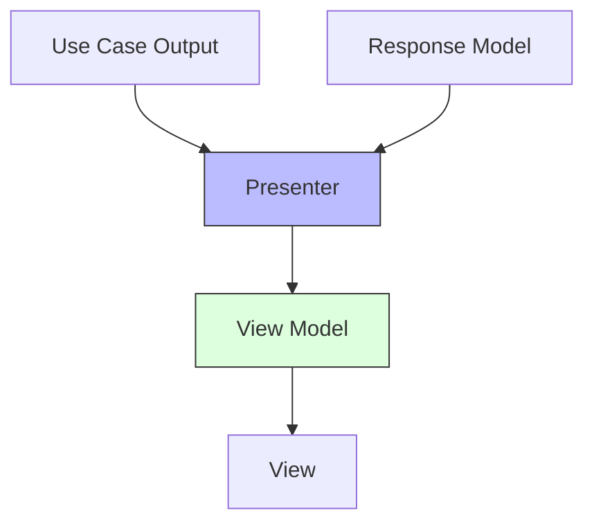
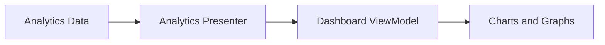

import Tabs from '@theme/Tabs';
import TabItem from '@theme/TabItem';

# 🎭 Presenter Pattern in Clean Architecture

## Overview

The Presenter Pattern is a key component of Clean Architecture's interface adapters layer, responsible for transforming data from use cases into a format suitable for the view/UI. It ensures a clear separation between business logic and presentation logic.

### Real World Analogy
Think of a professional interpreter at the United Nations. They take complex diplomatic language and translate it into terms that everyone can understand, while maintaining the original meaning. Similarly, a presenter takes complex business data and transforms it into a format that's ready for display, without changing the underlying meaning.

## 🎯 Key Concepts

### Core Components



1. **Presenter Interface**
    - Defines transformation contract
    - Independent of UI framework
    - Part of application boundary

2. **Presenter Implementation**
    - Transforms domain/use case data
    - Creates view models
    - Handles formatting logic

3. **View Model**
    - UI-specific data structure
    - Ready-to-display format
    - No business logic

4. **View Interface**
    - Defines display contract
    - Implemented by UI layer
    - Receives view model

## 💻 Implementation

### Basic Presenter Pattern Implementation

<Tabs>
  <TabItem value="java" label="Java">
```java
// Domain Entity
package com.example.domain;

public class User {
private final String id;
private final String name;
private final String email;
private final LocalDateTime createdAt;
private final UserStatus status;

    public User(String id, String name, String email, 
                LocalDateTime createdAt, UserStatus status) {
        this.id = id;
        this.name = name;
        this.email = email;
        this.createdAt = createdAt;
        this.status = status;
    }

    // Getters
}

// Use Case Response
package com.example.usecase;

public class UserResponse {
private final User user;
private final List<String> roles;

    public UserResponse(User user, List<String> roles) {
        this.user = user;
        this.roles = roles;
    }

    // Getters
}

// View Model
package com.example.presenter;

public class UserViewModel {
private final String id;
private final String displayName;
private final String emailAddress;
private final String createdDate;
private final String statusBadge;
private final List<String> permissions;
private final String statusColor;

    private UserViewModel(Builder builder) {
        this.id = builder.id;
        this.displayName = builder.displayName;
        this.emailAddress = builder.emailAddress;
        this.createdDate = builder.createdDate;
        this.statusBadge = builder.statusBadge;
        this.permissions = builder.permissions;
        this.statusColor = builder.statusColor;
    }

    // Builder and getters
    public static class Builder {
        // Builder implementation
    }
}

// Presenter Interface
package com.example.presenter;

public interface UserPresenter {
UserViewModel present(UserResponse response);
}

// Presenter Implementation
package com.example.presenter;

@Component
public class UserPresenterImpl implements UserPresenter {
private final DateTimeFormatter dateFormatter;
private final StatusFormatter statusFormatter;

    public UserPresenterImpl(DateTimeFormatter dateFormatter, 
                           StatusFormatter statusFormatter) {
        this.dateFormatter = dateFormatter;
        this.statusFormatter = statusFormatter;
    }

    @Override
    public UserViewModel present(UserResponse response) {
        User user = response.getUser();
        
        return new UserViewModel.Builder()
            .id(user.getId())
            .displayName(formatDisplayName(user))
            .emailAddress(user.getEmail())
            .createdDate(formatDate(user.getCreatedAt()))
            .statusBadge(statusFormatter.format(user.getStatus()))
            .statusColor(getStatusColor(user.getStatus()))
            .permissions(mapRolesToPermissions(response.getRoles()))
            .build();
    }

    private String formatDisplayName(User user) {
        return String.format("%s (%s)", 
            user.getName(), 
            user.getEmail().split("@")[0]
        );
    }

    private String formatDate(LocalDateTime date) {
        return dateFormatter.format(date);
    }

    private String getStatusColor(UserStatus status) {
        return switch (status) {
            case ACTIVE -> "green";
            case INACTIVE -> "gray";
            case SUSPENDED -> "red";
            default -> "black";
        };
    }

    private List<String> mapRolesToPermissions(List<String> roles) {
        // Implementation
        return roles.stream()
            .flatMap(this::getRolePermissions)
            .distinct()
            .collect(Collectors.toList());
    }
}
```
  </TabItem>
  <TabItem value="go" label="Go">
```go
// Domain Entity
package domain

type User struct {
    ID        string
    Name      string
    Email     string
    CreatedAt time.Time
    Status    UserStatus
}

// Use Case Response
package usecase

type UserResponse struct {
    User  *domain.User
    Roles []string
}

// View Model
package presenter

type UserViewModel struct {
    ID           string   `json:"id"`
    DisplayName  string   `json:"displayName"`
    EmailAddress string   `json:"emailAddress"`
    CreatedDate  string   `json:"createdDate"`
    StatusBadge  string   `json:"statusBadge"`
    Permissions  []string `json:"permissions"`
    StatusColor  string   `json:"statusColor"`
}

// Presenter Interface
package presenter

type UserPresenter interface {
    Present(response *usecase.UserResponse) *UserViewModel
}

// Presenter Implementation
package presenter

type userPresenter struct {
    dateFormatter   DateFormatter
    statusFormatter StatusFormatter
}

func NewUserPresenter(df DateFormatter, sf StatusFormatter) UserPresenter {
    return &userPresenter{
        dateFormatter:   df,
        statusFormatter: sf,
    }
}

func (p *userPresenter) Present(response *usecase.UserResponse) *UserViewModel {
    user := response.User
    
    return &UserViewModel{
        ID:           user.ID,
        DisplayName:  p.formatDisplayName(user),
        EmailAddress: user.Email,
        CreatedDate:  p.formatDate(user.CreatedAt),
        StatusBadge:  p.statusFormatter.Format(user.Status),
        StatusColor:  p.getStatusColor(user.Status),
        Permissions:  p.mapRolesToPermissions(response.Roles),
    }
}

func (p *userPresenter) formatDisplayName(user *domain.User) string {
    username := strings.Split(user.Email, "@")[0]
    return fmt.Sprintf("%s (%s)", user.Name, username)
}

func (p *userPresenter) formatDate(date time.Time) string {
    return p.dateFormatter.Format(date)
}

func (p *userPresenter) getStatusColor(status domain.UserStatus) string {
    switch status {
    case domain.StatusActive:
        return "green"
    case domain.StatusInactive:
        return "gray"
    case domain.StatusSuspended:
        return "red"
    default:
        return "black"
    }
}

func (p *userPresenter) mapRolesToPermissions(roles []string) []string {
    // Implementation
    permissions := make(map[string]struct{})
    for _, role := range roles {
        for _, perm := range p.getRolePermissions(role) {
            permissions[perm] = struct{}{}
        }
    }
    
    result := make([]string, 0, len(permissions))
    for perm := range permissions {
        result = append(result, perm)
    }
    return result
}
```
  </TabItem>
</Tabs>

## 🔄 Related Patterns

1. **Model-View-Presenter (MVP)**
    - Traditional UI pattern
    - Presenter acts as mediator
    - View is passive

2. **View-Model Pattern**
    - Complements Presenter Pattern
    - Provides UI-specific data structure
    - Supports view state management

3. **Adapter Pattern**
    - Similar transformation role
    - Different interfaces adaptation
    - Often used together with Presenter

## ✅ Best Practices

### Configuration
1. Use dependency injection for formatters and utilities
2. Configure locale and formatting rules centrally
3. Implement proper error handling
4. Use builder pattern for complex view models

### Monitoring
1. Log transformation errors
2. Track presentation performance
3. Monitor memory usage
4. Implement error boundaries

### Testing
1. Unit test each transformation
2. Test edge cases and formatting
3. Verify localization handling
4. Test error scenarios

## ⚠️ Common Pitfalls

1. **Business Logic in Presenters**
    - Symptom: Complex calculations in presenter
    - Solution: Move to use cases

2. **View Logic in Presenters**
    - Symptom: UI-specific code in presenter
    - Solution: Move to view layer

3. **Complex View Models**
    - Symptom: Too many responsibilities
    - Solution: Split into smaller models

4. **Tight Coupling to Framework**
    - Symptom: Framework annotations in presenter
    - Solution: Use clean interfaces

## 🎯 Use Cases

### 1. Dashboard Analytics


### 2. User Profile Management
- Complex data transformation
- Localization requirements
- Status and permission handling

### 3. Financial Reports
- Number formatting
- Currency conversion
- Date/time handling

## 🔍 Deep Dive Topics

### Thread Safety

1. **Immutable View Models**
```java
@Immutable
public final class SafeViewModel {
    private final String data;
    
    public SafeViewModel(String data) {
        this.data = data;
    }
    
    public String getData() {
        return data;
    }
}
```

2. **Thread-Safe Formatters**
```java
public class ThreadSafePresenter {
    private final ThreadLocal<DateFormat> dateFormat = 
        ThreadLocal.withInitial(() -> new SimpleDateFormat("yyyy-MM-dd"));
        
    public String formatDate(Date date) {
        return dateFormat.get().format(date);
    }
}
```

### Performance

1. **Caching View Models**
```java
public class CachingPresenter {
    private final LoadingCache<String, ViewModel> cache;
    
    public ViewModel present(Response response) {
        return cache.get(response.getId(), () -> transform(response));
    }
}
```

2. **Lazy Loading**
```java
public class LazyViewModel {
    private final Supplier<String> expensiveOperation;
    
    public String getData() {
        return expensiveOperation.get();
    }
}
```

## 📚 Additional Resources

### Books
1. "Clean Architecture" by Robert C. Martin
2. "Patterns of Enterprise Application Architecture" by Martin Fowler
3. "Building Evolutionary Architectures" by Neal Ford

### Tools
1. MapStruct (Java)
2. AutoMapper (Go)
3. Formatting libraries
4. Testing frameworks

### References
1. [Martin Fowler - Presentation Patterns](https://martinfowler.com/eaaDev/PresentationModel.html)
2. [Clean Architecture Blog](https://blog.cleancoder.com)

## ❓ FAQs

### Q: When should I use a Presenter vs direct mapping?
A: Use a Presenter when you need complex transformations or formatting logic.

### Q: How do I handle different view types?
A: Create specific presenters or presenter methods for each view type.

### Q: Should presenters handle errors?
A: Yes, but only presentation-related errors. Business errors should be handled earlier.

### Q: How to handle localization?
A: Inject localization services into presenters and keep all formatting logic centralized.

### Q: Can I reuse presenters?
A: Yes, but ensure they remain focused and don't become too complex.