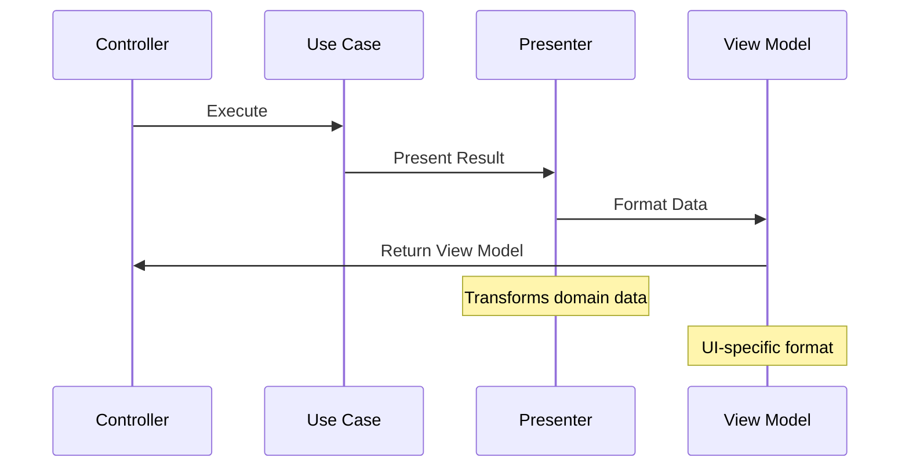

# 🎭 Presenter Pattern in Clean Architecture

## 1. Overview and Purpose

### Definition
The Presenter Pattern transforms use case output data into a format suitable for the view layer, maintaining a clear separation between business logic and presentation concerns in Clean Architecture.

### Problems Solved
- Mixed presentation and business logic
- Complex view formatting
- View layer coupling
- Testing visualization logic
- Localization complexity
- Response format flexibility

### Business Value
- Improved maintainability
- Enhanced testability
- Better separation of concerns
- Simplified view logic
- Easier format changes
- Consistent user experience

## 2. 🏗️ Presenter Pattern Structure



## 3. 💻 Implementation Examples

### Basic Presenter Pattern

```java
// Domain Layer - Output Port
public interface OrderPresenter {
    void presentSuccess(Order order);
    void presentError(Exception error);
    OrderViewModel getViewModel();
}

// Application Layer - Use Case
public class CreateOrderUseCase {
    private final OrderRepository orderRepository;
    private final OrderPresenter presenter;
    
    public void execute(CreateOrderRequest request) {
        try {
            Order order = Order.create(
                CustomerId.from(request.getCustomerId()),
                request.getItems().stream()
                    .map(this::toOrderItem)
                    .collect(Collectors.toList())
            );
            
            orderRepository.save(order);
            presenter.presentSuccess(order);
        } catch (Exception e) {
            presenter.presentError(e);
        }
    }
}

// Interface Adapters Layer - Presenter Implementation
public class OrderPresenterImpl implements OrderPresenter {
    private OrderViewModel viewModel;
    
    @Override
    public void presentSuccess(Order order) {
        this.viewModel = new OrderViewModel(
            order.getId().toString(),
            formatCustomerInfo(order.getCustomer()),
            formatOrderItems(order.getItems()),
            formatTotalAmount(order.getTotal()),
            formatOrderStatus(order.getStatus()),
            formatOrderDate(order.getCreatedAt())
        );
    }
    
    @Override
    public void presentError(Exception error) {
        this.viewModel = OrderViewModel.error(
            translateErrorMessage(error)
        );
    }
    
    @Override
    public OrderViewModel getViewModel() {
        return viewModel;
    }
    
    private String formatTotalAmount(Money total) {
        return NumberFormat.getCurrencyInstance()
            .format(total.getAmount());
    }
    
    private String formatOrderDate(Instant date) {
        return DateTimeFormatter.ofLocalizedDateTime(FormatStyle.MEDIUM)
            .format(date.atZone(ZoneId.systemDefault()));
    }
}

// Interface Adapters Layer - View Model
public record OrderViewModel(
    String orderId,
    String customerInfo,
    List<OrderItemViewModel> items,
    String totalAmount,
    String status,
    String orderDate,
    boolean hasError,
    String errorMessage
) {
    public static OrderViewModel error(String message) {
        return new OrderViewModel(
            null, null, List.of(), null, null, null,
            true, message
        );
    }
}
```

### REST API Presenter

```java
// Domain Layer - Output Port
public interface UserPresenter {
    void presentUser(User user);
    void presentUsers(List<User> users);
    void presentError(Exception error);
    ResponseEntity<?> getResponse();
}

// Interface Adapters Layer - REST Presenter
public class UserRestPresenter implements UserPresenter {
    private ResponseEntity<?> response;
    
    @Override
    public void presentUser(User user) {
        UserResponse userResponse = mapToResponse(user);
        response = ResponseEntity.ok(userResponse);
    }
    
    @Override
    public void presentUsers(List<User> users) {
        List<UserResponse> userResponses = users.stream()
            .map(this::mapToResponse)
            .collect(Collectors.toList());
            
        PagedResponse<UserResponse> pagedResponse = new PagedResponse<>(
            userResponses,
            userResponses.size(),
            1,
            1
        );
        
        response = ResponseEntity.ok(pagedResponse);
    }
    
    @Override
    public void presentError(Exception error) {
        ErrorResponse errorResponse = new ErrorResponse(
            translateErrorCode(error),
            error.getMessage()
        );
        
        HttpStatus status = determineHttpStatus(error);
        response = ResponseEntity.status(status)
            .body(errorResponse);
    }
    
    @Override
    public ResponseEntity<?> getResponse() {
        return response;
    }
    
    private UserResponse mapToResponse(User user) {
        return new UserResponse(
            user.getId().toString(),
            user.getName().getFullName(),
            user.getEmail().getValue(),
            user.getRole().toString(),
            formatDateTime(user.getCreatedAt())
        );
    }
    
    private HttpStatus determineHttpStatus(Exception error) {
        return switch (error) {
            case ValidationException e -> HttpStatus.BAD_REQUEST;
            case NotFoundException e -> HttpStatus.NOT_FOUND;
            case AuthorizationException e -> HttpStatus.FORBIDDEN;
            default -> HttpStatus.INTERNAL_SERVER_ERROR;
        };
    }
}
```

### Localized Presenter

```java
// Domain Layer - Output Port
public interface ProductPresenter {
    void presentProduct(Product product);
    void presentError(Exception error);
    LocalizedViewModel getViewModel();
}

// Interface Adapters Layer - Localized Presenter
public class LocalizedProductPresenter implements ProductPresenter {
    private final MessageSource messageSource;
    private final Locale locale;
    private LocalizedViewModel viewModel;
    
    @Override
    public void presentProduct(Product product) {
        this.viewModel = new LocalizedViewModel(
            product.getId().toString(),
            localizeProductName(product),
            localizeDescription(product),
            formatPrice(product.getPrice()),
            localizeCategories(product.getCategories()),
            localizeTags(product.getTags())
        );
    }
    
    private String localizeProductName(Product product) {
        String key = "product.name." + product.getNameKey();
        return messageSource.getMessage(key, null, locale);
    }
    
    private String formatPrice(Money price) {
        NumberFormat formatter = NumberFormat.getCurrencyInstance(locale);
        return formatter.format(price.getAmount());
    }
    
    private List<String> localizeCategories(List<Category> categories) {
        return categories.stream()
            .map(category -> messageSource.getMessage(
                "category." + category.getKey(),
                null,
                locale
            ))
            .collect(Collectors.toList());
    }
}

// Controller Usage
@RestController
public class ProductController {
    private final GetProductUseCase getProductUseCase;
    private final ProductPresenterFactory presenterFactory;
    
    @GetMapping("/products/{id}")
    public LocalizedViewModel getProduct(
            @PathVariable String id,
            @RequestHeader(name = "Accept-Language", defaultValue = "en") 
            String language) {
        Locale locale = Locale.forLanguageTag(language);
        ProductPresenter presenter = presenterFactory.createPresenter(locale);
        
        getProductUseCase.execute(id, presenter);
        return presenter.getViewModel();
    }
}
```

## 4. 🧪 Testing Strategies

### Presenter Unit Tests

```java
public class OrderPresenterTest {
    private OrderPresenter presenter;
    private TestClock clock;
    
    @BeforeEach
    void setUp() {
        clock = new TestClock();
        presenter = new OrderPresenterImpl(clock);
    }
    
    @Test
    void shouldFormatOrderSuccessfully() {
        // Arrange
        Order order = createTestOrder();
        
        // Act
        presenter.presentSuccess(order);
        OrderViewModel viewModel = presenter.getViewModel();
        
        // Assert
        assertNotNull(viewModel);
        assertEquals("$99.99", viewModel.totalAmount());
        assertEquals("March 15, 2024", viewModel.orderDate());
        assertFalse(viewModel.hasError());
    }
    
    @Test
    void shouldHandleErrorPresentation() {
        // Arrange
        Exception error = new OrderValidationException("Invalid order");
        
        // Act
        presenter.presentError(error);
        OrderViewModel viewModel = presenter.getViewModel();
        
        // Assert
        assertTrue(viewModel.hasError());
        assertEquals("Invalid order", viewModel.errorMessage());
    }
}

// Integration Test
public class OrderControllerIntegrationTest {
    @Test
    void shouldReturnFormattedOrder() {
        // Act
        MvcResult result = mockMvc.perform(get("/orders/{id}", orderId)
            .accept(MediaType.APPLICATION_JSON))
            .andExpect(status().isOk())
            .andReturn();
            
        // Assert
        OrderViewModel viewModel = objectMapper.readValue(
            result.getResponse().getContentAsString(),
            OrderViewModel.class
        );
        
        assertNotNull(viewModel);
        assertEquals("$99.99", viewModel.totalAmount());
    }
}
```

## 5. 🎯 Best Practices

### 1. Keep Presenters Focused

```java
// Good: Single responsibility
public class UserPresenter implements Presenter<User, UserViewModel> {
    @Override
    public UserViewModel present(User user) {
        return new UserViewModel(
            user.getId().toString(),
            formatName(user.getName()),
            formatEmail(user.getEmail()),
            formatCreatedAt(user.getCreatedAt())
        );
    }
}

// Bad: Mixed responsibilities
public class UserPresenter {
    public UserViewModel present(User user) {
        validateUser(user);  // Validation doesn't belong here
        updateLastAccess(user);  // Business logic doesn't belong here
        return new UserViewModel(/*...*/);
    }
}
```

### 2. Use Builder Pattern for Complex ViewModels

```java
public class OrderViewModelBuilder {
    private String orderId;
    private String customerInfo;
    private List<OrderItemViewModel> items = new ArrayList<>();
    private String totalAmount;
    private String status;
    private String orderDate;
    
    public OrderViewModelBuilder withOrder(Order order) {
        this.orderId = order.getId().toString();
        this.customerInfo = formatCustomerInfo(order.getCustomer());
        return this;
    }
    
    public OrderViewModelBuilder withItems(List<OrderItem> items) {
        this.items = items.stream()
            .map(this::createItemViewModel)
            .collect(Collectors.toList());
        return this;
    }
    
    public OrderViewModel build() {
        return new OrderViewModel(
            orderId,
            customerInfo,
            items,
            totalAmount,
            status,
            orderDate,
            false,
            null
        );
    }
}
```

### 3. Implement Error Handling

```java
public class ErrorPresenter {
    private final MessageSource messageSource;
    private final Locale locale;
    
    public ErrorViewModel presentException(Exception ex) {
        return switch (ex) {
            case ValidationException e -> presentValidationError(e);
            case BusinessException e -> presentBusinessError(e);
            case TechnicalException e -> presentTechnicalError(e);
            default -> presentUnexpectedError(ex);
        };
    }
    
    private ErrorViewModel presentValidationError(ValidationException ex) {
        return new ErrorViewModel(
            "VALIDATION_ERROR",
            localizeMessage(ex.getMessageKey()),
            ex.getFieldErrors().stream()
                .map(this::localizeFieldError)
                .collect(Collectors.toList())
        );
    }
    
    private String localizeMessage(String key) {
        return messageSource.getMessage(key, null, locale);
    }
}
```

## 6. 🚫 Anti-patterns

### Common Mistakes to Avoid

1. **Business Logic in Presenters**
```java
// Wrong: Business logic in presenter
public class OrderPresenter implements OrderPresenter {
    public void presentOrder(Order order) {
        if (order.getTotal().isGreaterThan(Money.of(1000))) {
            applyDiscount(order);  // Business logic!
        }
        // ... presentation logic
    }
}

// Better: Keep presenter focused on presentation
public class OrderPresenter implements OrderPresenter {
    public void presentOrder(Order order) {
        viewModel = new OrderViewModel(
            formatOrderId(order.getId()),
            formatAmount(order.getTotal()),
            formatDiscount(order.getDiscount())
        );
    }
}
```

2. **Direct View Updates**
```java
// Wrong: Presenter updating view directly
public class UserPresenter {
    private final UserView view;
    
    public void presentUser(User user) {
        view.setName(user.getName());  // Direct view manipulation
        view.setEmail(user.getEmail());
    }
}

// Better: Return view model
public class UserPresenter {
    public UserViewModel presentUser(User user) {
        return new UserViewModel(
            formatName(user.getName()),
            formatEmail(user.getEmail())
        );
    }
}
```

## 7. 📚 References

### Books
- "Clean Architecture" by Robert C. Martin
- "Patterns of Enterprise Application Architecture" by Martin Fowler
- "GUI Architectures" by Martin Fowler

### Articles
- [The Clean Architecture](https://blog.cleancoder.com/uncle-bob/2012/08/13/the-clean-architecture.html)
- [Presentation Domain Data Layering](https://martinfowler.com/bliki/PresentationDomainDataLayering.html)