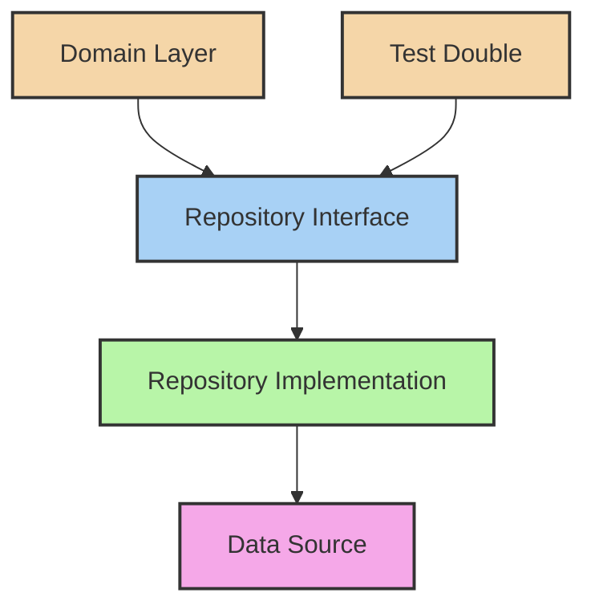

# 📦 Repository Pattern in Clean Architecture

## 1. Overview and Purpose

### Definition
The Repository Pattern provides a collection-like interface for accessing domain objects, abstracting the underlying data source details and maintaining Clean Architecture's separation of concerns.

### Problems Solved
- Data access coupling
- Complex query logic
- Testing difficulty
- Data source dependencies
- Transaction management
- Caching requirements
- Query optimization

### Business Value
- Improved maintainability
- Enhanced testability
- Data source flexibility
- Consistent data access
- Better performance control
- Simpler domain logic

## 2. 🏗️ Repository Pattern Structure



## 3. 💻 Implementation Examples

### Basic Repository Pattern

```java
// Domain Layer - Repository Interface
public interface UserRepository {
    User save(User user);
    Optional<User> findById(UserId id);
    List<User> findByEmail(Email email);
    void delete(UserId id);
}

// Domain Layer - Entity
public class User {
    private final UserId id;
    private Email email;
    private Name name;
    private Password password;
    
    // Constructor and methods
}

// Infrastructure Layer - JPA Implementation
@Repository
public class JpaUserRepository implements UserRepository {
    private final JpaUserEntityRepository jpaRepository;
    private final UserMapper mapper;
    
    @Override
    public User save(User user) {
        UserEntity entity = mapper.toEntity(user);
        UserEntity savedEntity = jpaRepository.save(entity);
        return mapper.toDomain(savedEntity);
    }
    
    @Override
    public Optional<User> findById(UserId id) {
        return jpaRepository.findById(id.toString())
            .map(mapper::toDomain);
    }
    
    @Override
    public List<User> findByEmail(Email email) {
        return jpaRepository.findByEmail(email.getValue())
            .stream()
            .map(mapper::toDomain)
            .collect(Collectors.toList());
    }
}

// Infrastructure Layer - Entity Mapper
public class UserMapper {
    public UserEntity toEntity(User user) {
        return new UserEntity(
            user.getId().toString(),
            user.getEmail().getValue(),
            user.getName().getFullName(),
            user.getPassword().getHash()
        );
    }
    
    public User toDomain(UserEntity entity) {
        return new User(
            new UserId(entity.getId()),
            new Email(entity.getEmail()),
            new Name(entity.getName()),
            Password.fromHash(entity.getPasswordHash())
        );
    }
}
```

### Specification Pattern Integration

```java
// Domain Layer - Specification Interface
public interface Specification<T> {
    boolean isSatisfiedBy(T entity);
    Query toQuery();
}

// Domain Layer - Composite Specifications
public class UserSpecifications {
    public static Specification<User> withEmail(Email email) {
        return new EmailSpecification(email);
    }
    
    public static Specification<User> withRole(Role role) {
        return new RoleSpecification(role);
    }
    
    public static Specification<User> active() {
        return new ActiveSpecification();
    }
}

// Domain Layer - Repository Interface with Specifications
public interface UserRepository {
    List<User> findAll(Specification<User> spec);
    Optional<User> findOne(Specification<User> spec);
    long count(Specification<User> spec);
}

// Infrastructure Layer - JPA Implementation
public class JpaUserRepository implements UserRepository {
    private final EntityManager em;
    
    @Override
    public List<User> findAll(Specification<User> spec) {
        CriteriaBuilder cb = em.getCriteriaBuilder();
        CriteriaQuery<UserEntity> query = cb.createQuery(UserEntity.class);
        Root<UserEntity> root = query.from(UserEntity.class);
        
        query.where(spec.toPredicate(root, query, cb));
        
        return em.createQuery(query)
            .getResultList()
            .stream()
            .map(mapper::toDomain)
            .collect(Collectors.toList());
    }
}
```

### Repository with Caching

```java
// Infrastructure Layer - Cached Repository
public class CachedUserRepository implements UserRepository {
    private final UserRepository delegate;
    private final Cache cache;
    
    @Override
    public Optional<User> findById(UserId id) {
        String cacheKey = "user:" + id;
        
        return cache.get(cacheKey, () -> 
            delegate.findById(id)
        );
    }
    
    @Override
    public User save(User user) {
        User savedUser = delegate.save(user);
        cache.put("user:" + user.getId(), savedUser);
        return savedUser;
    }
    
    @Override
    public void delete(UserId id) {
        delegate.delete(id);
        cache.evict("user:" + id);
    }
}

// Infrastructure Layer - Cache Implementation
public class RedisCache implements Cache {
    private final RedisTemplate<String, Object> redisTemplate;
    private final Duration defaultTtl;
    
    @Override
    public <T> Optional<T> get(String key, Class<T> type) {
        return Optional.ofNullable(
            redisTemplate.opsForValue().get(key)
        ).map(type::cast);
    }
    
    @Override
    public void put(String key, Object value) {
        redisTemplate.opsForValue().set(
            key, 
            value, 
            defaultTtl
        );
    }
    
    @Override
    public void evict(String key) {
        redisTemplate.delete(key);
    }
}
```

### Async Repository

```java
// Domain Layer - Async Repository Interface
public interface AsyncUserRepository {
    CompletableFuture<User> save(User user);
    CompletableFuture<Optional<User>> findById(UserId id);
    CompletableFuture<List<User>> findAll(Specification<User> spec);
}

// Infrastructure Layer - Async Implementation
@Repository
public class AsyncUserRepositoryImpl implements AsyncUserRepository {
    private final UserRepository synchronousRepository;
    private final Executor executor;
    
    @Override
    public CompletableFuture<User> save(User user) {
        return CompletableFuture.supplyAsync(
            () -> synchronousRepository.save(user),
            executor
        );
    }
    
    @Override
    public CompletableFuture<Optional<User>> findById(UserId id) {
        return CompletableFuture.supplyAsync(
            () -> synchronousRepository.findById(id),
            executor
        );
    }
}

// Use Case Layer - Async Usage
public class CreateUserUseCase {
    private final AsyncUserRepository userRepository;
    
    public CompletableFuture<UserId> execute(CreateUserCommand command) {
        return userRepository.save(
            new User(
                UserId.generate(),
                command.getEmail(),
                command.getName(),
                command.getPassword()
            )
        ).thenApply(User::getId);
    }
}
```

## 4. 🧪 Testing Strategies

### Repository Tests

```java
// Repository Test Double
public class InMemoryUserRepository implements UserRepository {
    private final Map<UserId, User> users = new ConcurrentHashMap<>();
    
    @Override
    public User save(User user) {
        users.put(user.getId(), user);
        return user;
    }
    
    @Override
    public Optional<User> findById(UserId id) {
        return Optional.ofNullable(users.get(id));
    }
    
    @Override
    public List<User> findByEmail(Email email) {
        return users.values().stream()
            .filter(user -> user.getEmail().equals(email))
            .collect(Collectors.toList());
    }
}

// Repository Integration Test
@DataJpaTest
public class JpaUserRepositoryIntegrationTest {
    @Autowired private JpaUserRepository repository;
    
    @Test
    void shouldSaveAndRetrieveUser() {
        // Arrange
        User user = createTestUser();
        
        // Act
        User savedUser = repository.save(user);
        Optional<User> foundUser = repository.findById(savedUser.getId());
        
        // Assert
        assertTrue(foundUser.isPresent());
        assertEquals(user.getEmail(), foundUser.get().getEmail());
    }
    
    @Test
    void shouldFindByEmailPattern() {
        // Arrange
        repository.save(createTestUser("test1@example.com"));
        repository.save(createTestUser("test2@example.com"));
        repository.save(createTestUser("other@example.com"));
        
        // Act
        List<User> users = repository.findByEmailPattern("test%");
        
        // Assert
        assertEquals(2, users.size());
    }
}
```

## 5. 🎯 Best Practices

### 1. Keep Repository Interfaces Clean

```java
// Good: Clean and focused interface
public interface OrderRepository {
    Order save(Order order);
    Optional<Order> findById(OrderId id);
    List<Order> findByCustomer(CustomerId customerId);
    void delete(OrderId id);
}

// Bad: Mixed responsibilities and leaked implementation details
public interface OrderRepository {
    @Transactional
    Order save(Order order, boolean flush);
    Optional<Order> findById(String id);  // Leaks String ID
    Page<Order> findAll(Pageable pageable);  // Leaks Spring Data
    @Query("SELECT o FROM Order o")  // Leaks JPA
    List<Order> customQuery();
}
```

### 2. Use Specifications for Complex Queries

```java
public class OrderSpecifications {
    public static Specification<Order> withStatus(OrderStatus status) {
        return (root, query, cb) ->
            cb.equal(root.get("status"), status);
    }
    
    public static Specification<Order> createdAfter(Instant date) {
        return (root, query, cb) ->
            cb.greaterThan(root.get("createdAt"), date);
    }
    
    // Usage
    List<Order> orders = orderRepository.findAll(
        withStatus(OrderStatus.PENDING)
            .and(createdAfter(yesterday()))
    );
}
```

### 3. Implement Proper Transaction Management

```java
public class TransactionalOrderRepository implements OrderRepository {
    private final OrderRepository delegate;
    private final TransactionManager txManager;
    
    @Override
    public Order save(Order order) {
        return txManager.executeInTransaction(() -> {
            Order savedOrder = delegate.save(order);
            publishEvent(new OrderSavedEvent(savedOrder));
            return savedOrder;
        });
    }
}
```

## 6. 🚫 Anti-patterns

### Common Mistakes to Avoid

1. **Exposing ORM Details**
```java
// Wrong: Exposing JPA details
public interface OrderRepository {
    @Query("SELECT o FROM Order o WHERE o.status = :status")
    List<Order> findByStatus(@Param("status") String status);
}

// Better: Hide implementation details
public interface OrderRepository {
    List<Order> findByStatus(OrderStatus status);
}
```

2. **Business Logic in Repositories**
```java
// Wrong: Business logic in repository
public class OrderRepository {
    public void processOrder(Order order) {
        order.calculateTotal();  // Business logic!
        order.validate();        // Business logic!
        save(order);
    }
}

// Better: Keep repository focused on persistence
public class OrderRepository {
    public Order save(Order order) {
        return entityManager.merge(order);
    }
}
```

## 7. 📚 References

### Books
- "Patterns of Enterprise Application Architecture" by Martin Fowler
- "Domain-Driven Design" by Eric Evans
- "Clean Architecture" by Robert C. Martin

### Articles
- [Repository Pattern](https://martinfowler.com/eaaCatalog/repository.html)
- [The Repository Pattern](https://ardalis.com/the-repository-pattern/)