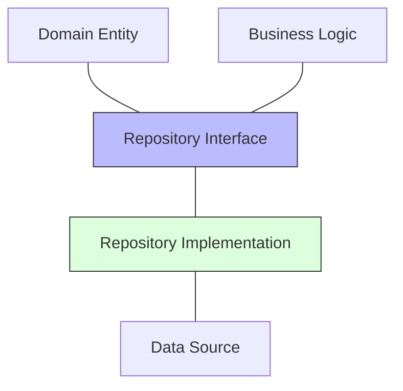
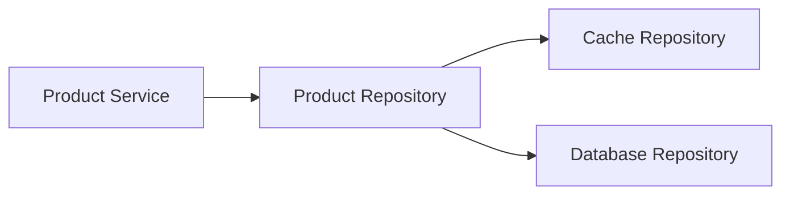

import Tabs from '@theme/Tabs';
import TabItem from '@theme/TabItem';

# 🗄️ Repository Pattern in Clean Architecture

## Overview

The Repository Pattern is an abstraction layer between domain logic and data access logic. It provides a collection-like interface for accessing domain objects while encapsulating the details of data access technologies.

### Real World Analogy
Think of a library. You don't need to know how books are organized in the storage room or whether they're in different buildings. The librarian (repository) handles all these details. You simply request a book by its attributes (title, author, etc.), and the librarian manages the retrieval process.

## 🎯 Key Concepts

### Components



1. **Repository Interface**
    - Defines available operations
    - Lives in the domain layer
    - Technology-agnostic

2. **Repository Implementation**
    - Implements the interface
    - Lives in the infrastructure layer
    - Technology-specific

3. **Domain Entities**
    - Pure domain objects
    - No persistence concerns
    - Business logic only

4. **Data Mappers**
    - Convert between domain and persistence models
    - Handle data format transformations
    - Protect domain model integrity

## 💻 Implementation

### Basic Repository Pattern Implementation

<Tabs>
  <TabItem value="java" label="Java">
```java
// Domain Entity
package com.example.domain;

public class User {
private final String id;
private String name;
private String email;

    public User(String id, String name, String email) {
        this.id = id;
        this.name = name;
        this.email = email;
    }

    // Getters and domain methods
    public String getId() { return id; }
    public String getName() { return name; }
    public String getEmail() { return email; }
}

// Repository Interface
package com.example.domain.repository;

public interface UserRepository {
User findById(String id);
List<User> findByName(String name);
void save(User user);
void delete(String id);
List<User> findAll();
}

// Data Model
package com.example.infrastructure.persistence;

@Entity
@Table(name = "users")
public class UserEntity {
@Id
private String id;
private String name;
private String email;

    // Getters and setters
}

// Mapper
package com.example.infrastructure.persistence;

@Component
public class UserMapper {
public User toDomain(UserEntity entity) {
return new User(
entity.getId(),
entity.getName(),
entity.getEmail()
);
}

    public UserEntity toEntity(User domain) {
        UserEntity entity = new UserEntity();
        entity.setId(domain.getId());
        entity.setName(domain.getName());
        entity.setEmail(domain.getEmail());
        return entity;
    }
}

// Repository Implementation
package com.example.infrastructure.persistence;

@Repository
public class JpaUserRepository implements UserRepository {
private final JpaRepository<UserEntity, String> jpaRepository;
private final UserMapper mapper;

    public JpaUserRepository(JpaRepository<UserEntity, String> jpaRepository, UserMapper mapper) {
        this.jpaRepository = jpaRepository;
        this.mapper = mapper;
    }

    @Override
    public User findById(String id) {
        return jpaRepository.findById(id)
            .map(mapper::toDomain)
            .orElseThrow(() -> new EntityNotFoundException("User not found"));
    }

    @Override
    public List<User> findByName(String name) {
        return jpaRepository.findByName(name).stream()
            .map(mapper::toDomain)
            .collect(Collectors.toList());
    }

    @Override
    @Transactional
    public void save(User user) {
        UserEntity entity = mapper.toEntity(user);
        jpaRepository.save(entity);
    }
}
```
  </TabItem>
  <TabItem value="go" label="Go">
```go
// Domain Entity
package domain

type User struct {
    ID    string
    Name  string
    Email string
}

// Repository Interface
package domain

type UserRepository interface {
    FindById(id string) (*User, error)
    FindByName(name string) ([]*User, error)
    Save(user *User) error
    Delete(id string) error
    FindAll() ([]*User, error)
}

// Data Model
package infrastructure

type UserEntity struct {
    ID    string `db:"id"`
    Name  string `db:"name"`
    Email string `db:"email"`
}

// Mapper
package infrastructure

func toEntity(user *domain.User) *UserEntity {
    return &UserEntity{
        ID:    user.ID,
        Name:  user.Name,
        Email: user.Email,
    }
}

func toDomain(entity *UserEntity) *domain.User {
    return &domain.User{
        ID:    entity.ID,
        Name:  entity.Name,
        Email: entity.Email,
    }
}

// Repository Implementation
package infrastructure

type PostgresUserRepository struct {
    db *sql.DB
}

func NewPostgresUserRepository(db *sql.DB) domain.UserRepository {
    return &PostgresUserRepository{db: db}
}

func (r *PostgresUserRepository) FindById(id string) (*domain.User, error) {
    entity := &UserEntity{}
    err := r.db.QueryRow(
        "SELECT id, name, email FROM users WHERE id = $1",
        id,
    ).Scan(&entity.ID, &entity.Name, &entity.Email)
    
    if err == sql.ErrNoRows {
        return nil, fmt.Errorf("user not found")
    }
    if err != nil {
        return nil, err
    }
    
    return toDomain(entity), nil
}

func (r *PostgresUserRepository) Save(user *domain.User) error {
    entity := toEntity(user)
    _, err := r.db.Exec(
        "INSERT INTO users (id, name, email) VALUES ($1, $2, $3) "+
        "ON CONFLICT (id) DO UPDATE SET name = $2, email = $3",
        entity.ID, entity.Name, entity.Email,
    )
    return err
}
```
  </TabItem>
</Tabs>

## 🔄 Related Patterns

1. **Unit of Work Pattern**
    - Tracks changes to objects
    - Coordinates writing out changes
    - Maintains object identity

2. **Data Mapper Pattern**
    - Separates domain from persistence
    - Handles data transformations
    - Complements Repository Pattern

3. **Specification Pattern**
    - Encapsulates query criteria
    - Combines with Repository for complex queries
    - Keeps domain logic clean

## ✅ Best Practices

### Configuration
1. Use dependency injection for repositories
2. Configure connection pools appropriately
3. Use appropriate transaction boundaries
4. Implement retry policies

### Monitoring
1. Log repository operations
2. Track query performance
3. Monitor connection pool usage
4. Implement health checks

### Testing
1. Use in-memory repositories for unit tests
2. Implement integration tests with test databases
3. Test edge cases and error conditions
4. Mock repositories in service tests

## ⚠️ Common Pitfalls

1. **Fat Repositories**
    - Symptom: Too many query methods
    - Solution: Use specification pattern or query objects

2. **Leaking Infrastructure Concerns**
    - Symptom: Domain knows about database details
    - Solution: Strict separation using interfaces and mappers

3. **Missing Error Handling**
    - Symptom: Uncaught database errors
    - Solution: Proper error mapping and handling

4. **N+1 Query Problems**
    - Symptom: Multiple queries for related data
    - Solution: Implement batch loading and proper eager loading

## 🎯 Use Cases

### 1. E-commerce Product Catalog


### 2. User Management System
- Multiple data sources (DB, LDAP, External API)
- Caching layer
- Audit logging

### 3. Content Management System
- Document storage
- Version control
- Multiple storage backends

## 🔍 Deep Dive Topics

### Thread Safety

1. **Connection Management**
```java
@Repository
public class ThreadSafeRepository {
    private final DataSource dataSource;
    
    public ThreadSafeRepository(DataSource dataSource) {
        this.dataSource = dataSource;
    }
    
    public void save(User user) {
        try (Connection conn = dataSource.getConnection()) {
            // Use connection within transaction
        }
    }
}
```

2. **Caching Considerations**
```java
@Repository
public class CachingRepository {
    private final Cache cache;
    private final UserRepository delegate;
    
    public User findById(String id) {
        return cache.get(id, () -> delegate.findById(id));
    }
}
```

### Distributed Systems

1. **Sharding**
```java
public class ShardedRepository implements UserRepository {
    private final Map<String, UserRepository> shards;
    
    public User findById(String id) {
        String shardKey = getShardKey(id);
        return shards.get(shardKey).findById(id);
    }
}
```

2. **Replication**
```java
public class ReplicatedRepository implements UserRepository {
    private final UserRepository master;
    private final List<UserRepository> replicas;
    
    public User findById(String id) {
        return loadBalancer.next(replicas).findById(id);
    }
    
    public void save(User user) {
        master.save(user);
    }
}
```

### Performance

1. **Batch Operations**
```java
public interface BatchUserRepository extends UserRepository {
    List<User> findByIds(List<String> ids);
    void saveAll(List<User> users);
}
```

2. **Caching Strategies**
```java
public class CacheableRepository implements UserRepository {
    private final LoadingCache<String, User> cache;
    
    @Override
    public User findById(String id) {
        return cache.get(id);
    }
}
```

## 📚 Additional Resources

### Books
1. "Patterns of Enterprise Application Architecture" by Martin Fowler
2. "Domain-Driven Design" by Eric Evans
3. "Clean Architecture" by Robert C. Martin

### Tools
1. Spring Data JPA
2. GORM (Go)
3. Dapper
4. Entity Framework

### References
1. [Microsoft Docs - Repository Pattern](https://docs.microsoft.com/en-us/dotnet/architecture/microservices/microservice-ddd-cqrs-patterns/infrastructure-persistence-layer-implementation-entity-framework-core)
2. [Martin Fowler - Repository Pattern](https://martinfowler.com/eaaCatalog/repository.html)

## ❓ FAQs

### Q: When should I use the Repository Pattern?
A: Use it when you need to abstract data access logic and maintain a clean domain model.

### Q: Should repositories return domain objects or DTOs?
A: Domain objects within the domain layer, DTOs when crossing boundaries.

### Q: How do I handle complex queries?
A: Use the Specification Pattern or dedicated query objects.

### Q: Should I implement a generic repository?
A: Generally no, as it often leads to leaky abstractions. Create specific repositories for each aggregate root.

### Q: How do I handle transactions across multiple repositories?
A: Use a Unit of Work pattern or service-level transaction boundaries.