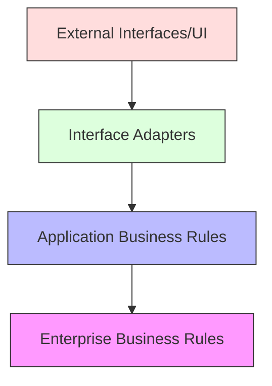
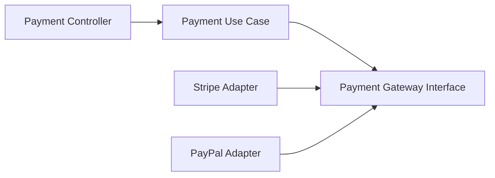

import Tabs from '@theme/Tabs';
import TabItem from '@theme/TabItem';

# 🏛️ Clean Architecture Deep Dive: Core Principles

## Overview

Clean Architecture's foundation rests on specific principles that ensure system maintainability and scalability: The Dependency Rule, SOLID Principles, Architectural Boundaries, and Dependency Injection. These principles work together to create robust, maintainable software systems.

### Real World Analogy
Think of a modern city's power grid. The core power plants (domain logic) don't depend on individual buildings (UI/external systems), but buildings depend on the power grid. The power company's internal policies (business rules) remain unchanged regardless of which buildings connect to it, and standardized interfaces (boundaries) ensure safe connections.

## 🎯 Key Concepts

### 1. The Dependency Rule 🔄

The fundamental rule stating that source code dependencies must only point inwards, meaning that:

- Inner circles are policies
- Outer circles are mechanisms
- Inner circles must not know about outer circles
- Data formats declared in outer circles must not be used by inner circles

#### Dependency Rule Visualization



### 2. SOLID Principles 📐

1. **Single Responsibility Principle (SRP)**
    - A class should have one, and only one, reason to change
    - Maps to separation of concerns in Clean Architecture

2. **Open-Closed Principle (OCP)**
    - Software entities should be open for extension but closed for modification
    - Enables adding new features without changing existing code

3. **Liskov Substitution Principle (LSP)**
    - Objects should be replaceable with instances of their subtypes
    - Ensures that interfaces are properly abstracted

4. **Interface Segregation Principle (ISP)**
    - Many client-specific interfaces are better than one general-purpose interface
    - Prevents interface pollution

5. **Dependency Inversion Principle (DIP)**
    - High-level modules should not depend on low-level modules
    - Both should depend on abstractions

### 3. Architectural Boundaries 🛡️

Boundaries define:
- Where one component ends and another begins
- How components communicate
- What crosses the boundaries and how
- Data structure ownership

### 4. Dependency Injection 💉

A technique where:
- Objects receive their dependencies instead of creating them
- Supports the Dependency Inversion Principle
- Enables testability and flexibility

## 💻 Implementation

### Dependency Rule Implementation

<Tabs>
  <TabItem value="java" label="Java">
```java
// Domain Layer (Innermost)
package com.example.domain;

public class User {
private final String id;
private String email;

    public User(String id, String email) {
        this.id = id;
        this.email = email;
    }
    
    // Domain logic
    public boolean isValidEmail() {
        return email != null && email.contains("@");
    }
}

// Use Case Layer
package com.example.usecase;

public interface UserRepository {
void save(User user);
}

public class CreateUserUseCase {
private final UserRepository repository;

    public CreateUserUseCase(UserRepository repository) {
        this.repository = repository;
    }
    
    public void execute(String id, String email) {
        User user = new User(id, email);
        if (!user.isValidEmail()) {
            throw new IllegalArgumentException("Invalid email");
        }
        repository.save(user);
    }
}

// Interface Adapter Layer
package com.example.adapter;

public class MySQLUserRepository implements UserRepository {
private final JdbcTemplate jdbcTemplate;

    public MySQLUserRepository(JdbcTemplate jdbcTemplate) {
        this.jdbcTemplate = jdbcTemplate;
    }
    
    @Override
    public void save(User user) {
        // Implementation
    }
}

// Framework Layer (Outermost)
package com.example.framework;

@Configuration
public class UserConfig {
@Bean
public UserRepository userRepository(JdbcTemplate jdbcTemplate) {
return new MySQLUserRepository(jdbcTemplate);
}

    @Bean
    public CreateUserUseCase createUserUseCase(UserRepository repository) {
        return new CreateUserUseCase(repository);
    }
}
```
  </TabItem>
  <TabItem value="go" label="Go">
```go
// Domain Layer (Innermost)
package domain

import "strings"

type User struct {
    ID    string
    Email string
}

func NewUser(id, email string) *User {
    return &User{
        ID:    id,
        Email: email,
    }
}

func (u *User) IsValidEmail() bool {
    return u.Email != "" && strings.Contains(u.Email, "@")
}

// Use Case Layer
package usecase

type UserRepository interface {
    Save(user *domain.User) error
}

type CreateUserUseCase struct {
    repository UserRepository
}

func NewCreateUserUseCase(repo UserRepository) *CreateUserUseCase {
    return &CreateUserUseCase{repository: repo}
}

func (uc *CreateUserUseCase) Execute(id, email string) error {
    user := domain.NewUser(id, email)
    if !user.IsValidEmail() {
        return fmt.Errorf("invalid email")
    }
    return uc.repository.Save(user)
}

// Interface Adapter Layer
package adapter

type MySQLUserRepository struct {
    db *sql.DB
}

func NewMySQLUserRepository(db *sql.DB) *MySQLUserRepository {
    return &MySQLUserRepository{db: db}
}

func (r *MySQLUserRepository) Save(user *domain.User) error {
    // Implementation
}

// Framework Layer (Outermost)
package main

func main() {
    db := initDB()
    repo := adapter.NewMySQLUserRepository(db)
    useCase := usecase.NewCreateUserUseCase(repo)
    
    server := NewServer(useCase)
    server.Start()
}
```
  </TabItem>
</Tabs>

## 🔄 Related Patterns

1. **Factory Pattern**
    - Complements Dependency Injection
    - Creates concrete implementations of interfaces

2. **Strategy Pattern**
    - Supports the Open-Closed Principle
    - Enables swappable implementations

3. **Observer Pattern**
    - Helps maintain boundaries
    - Enables loose coupling between components

## ✅ Best Practices

### Dependency Rule
1. Always depend inward
2. Use interfaces at boundaries
3. Keep domain models pure
4. Isolate framework code

### SOLID
1. Keep classes focused (SRP)
2. Use composition over inheritance
3. Design interfaces for clients
4. Inject dependencies

### Boundaries
1. Define clear contracts
2. Use DTOs for crossing boundaries
3. Keep boundary crossing explicit
4. Document boundary constraints

### Dependency Injection
1. Use constructor injection when possible
2. Avoid service locator pattern
3. Configure at composition root
4. Use DI containers judiciously

## ⚠️ Common Pitfalls

1. **Circular Dependencies**
    - Symptom: Components depending on each other
    - Solution: Introduce abstraction layer

2. **Leaky Abstractions**
    - Symptom: Implementation details bleeding through interfaces
    - Solution: Design interfaces based on client needs

3. **God Objects**
    - Symptom: Classes with too many responsibilities
    - Solution: Apply SRP strictly

4. **Tight Coupling to Frameworks**
    - Symptom: Framework annotations in domain layer
    - Solution: Use clean boundaries and adapters

## 🎯 Use Cases

### 1. Payment Processing System


### 2. Authentication Service
- Clear separation between auth logic and providers
- Swappable implementations (OAuth, JWT, Basic)
- Independent business rules

### 3. Order Management System
- Domain-driven core business logic
- Multiple delivery mechanisms
- Pluggable external services

## 🔍 Deep Dive Topics

### Thread Safety
1. **Immutable Domain Objects**
    - Use final fields
    - Initialize in constructors
    - No setters

2. **Thread-Safe Boundaries**
    - Use thread-safe collections
    - Implement proper synchronization
    - Consider using actors

### Distributed Systems
1. **Boundary Considerations**
    - Use message-based communication
    - Implement retry policies
    - Handle partial failures

2. **Dependency Management**
    - Use service discovery
    - Implement circuit breakers
    - Handle versioning

### Performance
1. **Boundary Optimization**
    - Batch operations
    - Caching strategies
    - Connection pooling

2. **Dependency Optimization**
    - Lazy loading
    - Resource pooling
    - Asynchronous processing

## 📚 Additional Resources

### Books
1. "Clean Architecture" by Robert C. Martin
2. "Dependency Injection Principles, Practices, and Patterns" by Steven van Deursen
3. "Building Evolutionary Architectures" by Neal Ford

### Tools
1. Spring Framework (DI Container)
2. Wire (Go DI toolkit)
3. ArchUnit (Architecture testing)
4. SonarQube (Code quality)

### References
1. [Clean Architecture Blog](https://blog.cleancoder.com)
2. [SOLID Principles in Practice](https://www.digitalocean.com/community/conceptual_articles/s-o-l-i-d-the-first-five-principles-of-object-oriented-design)

## ❓ FAQs

### Q: How strict should I be with the Dependency Rule?
A: Very strict in the domain and use case layers, more flexible in outer layers.

### Q: When should I create an interface?
A: When you need to protect against changes or support multiple implementations.

### Q: How do I handle cross-cutting concerns?
A: Use aspects or decorators at the boundary level, never in the domain.

### Q: Should I use DI containers everywhere?
A: No, use them at the composition root only. Keep domain and use cases pure.

### Q: How do I test components across boundaries?
A: Use integration tests for boundaries, unit tests for components, and mocks for dependencies.