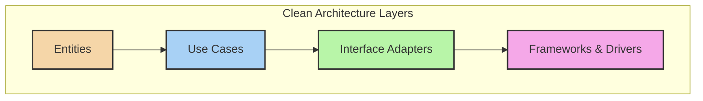
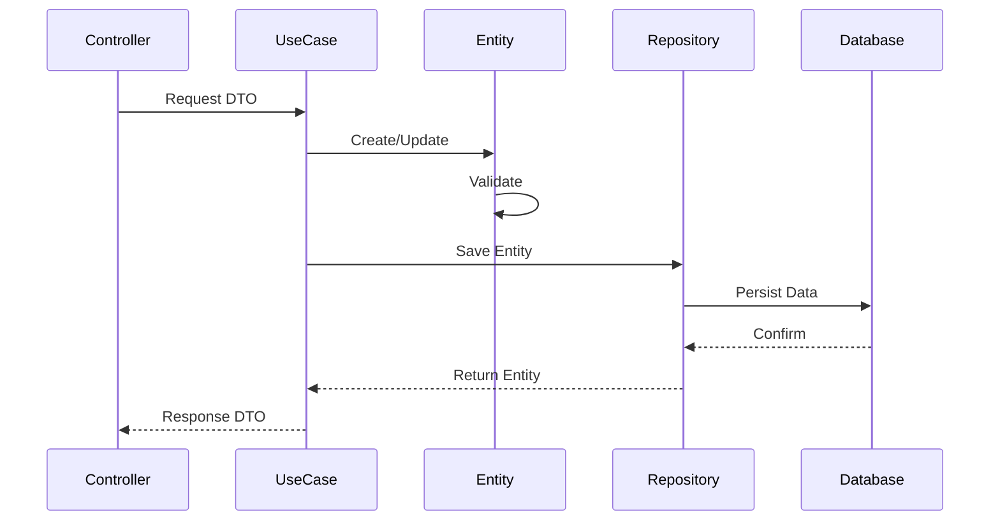

# 🏛️ Clean Architecture Principles

## 1. Overview and Fundamentals

### Core Principles
1. **Independence of Frameworks**
2. **Testability**
3. **Independence of UI**
4. **Independence of Database**
5. **Independence of External Agencies**

### The Dependency Rule
All source code dependencies can only point inwards. Nothing in an inner circle can know anything about something in an outer circle.



## 2. 🎯 SOLID Principles in Clean Architecture

### Single Responsibility Principle (SRP)

```java
// Wrong: Multiple responsibilities
public class UserService {
    public void createUser(User user) {
        validateUser(user);
        saveToDatabase(user);
        sendWelcomeEmail(user);
        notifyAdmins(user);
    }
}

// Right: Separated responsibilities
public class UserCreator {
    private final UserValidator validator;
    private final UserRepository repository;
    private final UserNotifier notifier;

    public void createUser(User user) {
        validator.validate(user);
        User savedUser = repository.save(user);
        notifier.notifyCreation(savedUser);
    }
}

public class UserValidator {
    public void validate(User user) {
        validateEmail(user.getEmail());
        validatePassword(user.getPassword());
    }
}

public class UserNotifier {
    private final EmailService emailService;
    private final AdminNotificationService adminService;

    public void notifyCreation(User user) {
        emailService.sendWelcomeEmail(user);
        adminService.notifyNewUser(user);
    }
}
```

### Open/Closed Principle (OCP)

```java
// Interface in domain layer
public interface PaymentGateway {
    PaymentResult process(Payment payment);
}

// Implementations in infrastructure layer
public class StripePaymentGateway implements PaymentGateway {
    @Override
    public PaymentResult process(Payment payment) {
        // Stripe-specific implementation
        return stripeClient.processPayment(mapToStripePayment(payment));
    }
}

public class PayPalPaymentGateway implements PaymentGateway {
    @Override
    public PaymentResult process(Payment payment) {
        // PayPal-specific implementation
        return paypalClient.executePayment(mapToPayPalPayment(payment));
    }
}

// Use case remains unchanged
public class ProcessPaymentUseCase {
    private final PaymentGateway paymentGateway;

    public PaymentResult execute(Payment payment) {
        return paymentGateway.process(payment);
    }
}
```

### Liskov Substitution Principle (LSP)

```java
// Base class in domain layer
public abstract class User {
    protected UserId id;
    protected Email email;
    
    public abstract boolean canAccessResource(Resource resource);
}

// Derived classes maintain contract
public class AdminUser extends User {
    @Override
    public boolean canAccessResource(Resource resource) {
        return true; // Admins can access all resources
    }
}

public class RegularUser extends User {
    @Override
    public boolean canAccessResource(Resource resource) {
        return resource.isPublic() || resource.getOwnerId().equals(this.id);
    }
}

// Usage in use case
public class ResourceAccessUseCase {
    public void accessResource(User user, Resource resource) {
        if (!user.canAccessResource(resource)) {
            throw new AccessDeniedException();
        }
        // Process resource access
    }
}
```

### Interface Segregation Principle (ISP)

```java
// Wrong: Fat interface
public interface UserRepository {
    User save(User user);
    void delete(UserId id);
    User findById(UserId id);
    List<User> findAll();
    List<User> findByRole(Role role);
    void updatePassword(UserId id, Password password);
    void updateEmail(UserId id, Email email);
}

// Right: Segregated interfaces
public interface UserReader {
    Optional<User> findById(UserId id);
    List<User> findByRole(Role role);
}

public interface UserWriter {
    User save(User user);
    void delete(UserId id);
}

public interface UserCredentialManager {
    void updatePassword(UserId id, Password password);
    void updateEmail(UserId id, Email email);
}

// Implementation can choose which interfaces to implement
public class PostgresUserRepository implements UserReader, UserWriter {
    // Implement only needed methods
}

public class ReadOnlyUserRepository implements UserReader {
    // Implement only read methods
}
```

### Dependency Inversion Principle (DIP)

```java
// High-level policy (domain layer)
public interface NotificationSender {
    void send(Notification notification);
}

public class NotificationService {
    private final NotificationSender sender;
    
    public NotificationService(NotificationSender sender) {
        this.sender = sender;
    }
    
    public void notify(User user, String message) {
        Notification notification = new Notification(user, message);
        sender.send(notification);
    }
}

// Low-level implementation (infrastructure layer)
public class EmailNotificationSender implements NotificationSender {
    private final EmailClient emailClient;
    
    @Override
    public void send(Notification notification) {
        Email email = mapToEmail(notification);
        emailClient.send(email);
    }
}
```

## 3. 🏗️ Boundary Rules

### Input/Output Boundaries

```java
// Input boundary (Use case interface)
public interface CreateOrder {
    OrderId execute(CreateOrderRequest request);
}

// Output boundary (Presenter interface)
public interface OrderPresenter {
    void presentSuccess(Order order);
    void presentError(Exception error);
}

// Input data structure
public record CreateOrderRequest(
    CustomerId customerId,
    List<OrderItem> items,
    PaymentInfo paymentInfo
) {}

// Use case implementation
public class CreateOrderUseCase implements CreateOrder {
    private final OrderRepository repository;
    private final OrderPresenter presenter;
    
    @Override
    public OrderId execute(CreateOrderRequest request) {
        try {
            Order order = Order.create(
                request.customerId(),
                request.items(),
                request.paymentInfo()
            );
            
            repository.save(order);
            presenter.presentSuccess(order);
            return order.getId();
        } catch (Exception e) {
            presenter.presentError(e);
            throw e;
        }
    }
}
```

## 4. 🔄 Data Flow

### Clean Data Flow Example



### Implementation Example

```java
// Controller (Interface Adapter Layer)
@RestController
public class OrderController {
    private final CreateOrder createOrder;
    private final OrderPresenter presenter;
    
    @PostMapping("/orders")
    public ResponseEntity<OrderResponse> createOrder(@RequestBody OrderRequest request) {
        CreateOrderRequest useCaseRequest = mapper.toUseCaseRequest(request);
        createOrder.execute(useCaseRequest);
        return ResponseEntity.ok(presenter.getViewModel());
    }
}

// Use Case (Application Layer)
public class CreateOrderUseCase implements CreateOrder {
    private final OrderRepository repository;
    private final PaymentGateway paymentGateway;
    private final OrderPresenter presenter;
    
    @Override
    public void execute(CreateOrderRequest request) {
        // 1. Create domain entity
        Order order = Order.create(request.getCustomerId(), request.getItems());
        
        // 2. Execute business rules
        order.validate();
        
        // 3. Process payment
        PaymentResult result = paymentGateway.process(order.getPayment());
        order.confirmPayment(result);
        
        // 4. Save and present
        repository.save(order);
        presenter.present(order);
    }
}
```

## 5. 🛡️ Entity Protection

### Encapsulation Rules

```java
// Domain Entity with proper encapsulation
public class Order {
    private OrderId id;
    private OrderStatus status;
    private Money total;
    private List<OrderItem> items;
    
    // Private constructor enforces creation through factory method
    private Order(OrderId id, List<OrderItem> items) {
        this.id = id;
        this.items = new ArrayList<>(items);
        this.status = OrderStatus.CREATED;
        this.total = calculateTotal();
    }
    
    // Factory method ensures valid creation
    public static Order create(CustomerId customerId, List<OrderItem> items) {
        validateItems(items);
        return new Order(OrderId.generate(), items);
    }
    
    // Protected mutation methods
    public void addItem(OrderItem item) {
        validateOrderStatus();
        validateItem(item);
        items.add(item);
        total = calculateTotal();
    }
    
    // Private validation methods
    private void validateOrderStatus() {
        if (status != OrderStatus.CREATED) {
            throw new OrderAlreadyProcessedException();
        }
    }
    
    // Immutable view of collections
    public List<OrderItem> getItems() {
        return Collections.unmodifiableList(items);
    }
}
```

## 6. ⚡ Performance Considerations

### Balancing Clean Architecture and Performance

```java
// Use Case with performance optimization
public class GetUserOrdersUseCase {
    private final OrderRepository orderRepository;
    private final OrderPresenter presenter;
    private final Cache cache;
    
    public void execute(GetUserOrdersRequest request) {
        // Try cache first
        Optional<List<Order>> cachedOrders = cache.get(getCacheKey(request));
        
        if (cachedOrders.isPresent()) {
            presenter.present(cachedOrders.get());
            return;
        }
        
        // Repository access with optimization hints
        List<Order> orders = orderRepository.findByUserIdWithFetchStrategy(
            request.getUserId(),
            request.getFetchStrategy()
        );
        
        // Cache for future requests
        cache.put(getCacheKey(request), orders);
        
        presenter.present(orders);
    }
}

// Repository implementation with performance considerations
public class JpaOrderRepository implements OrderRepository {
    @Override
    public List<Order> findByUserIdWithFetchStrategy(UserId userId, FetchStrategy strategy) {
        EntityGraph<Order> graph = createEntityGraph(strategy);
        return entityManager.createQuery(
                "SELECT o FROM Order o WHERE o.userId = :userId", Order.class)
            .setHint("javax.persistence.fetchgraph", graph)
            .setParameter("userId", userId)
            .getResultList();
    }
}
```

## 7. 🔍 Testing Strategies

### Testing Clean Architecture Components

```java
// Domain Entity Test
public class OrderTest {
    @Test
    void shouldCalculateTotalCorrectly() {
        List<OrderItem> items = Arrays.asList(
            new OrderItem(new ProductId("1"), Money.of(10), 2),
            new OrderItem(new ProductId("2"), Money.of(20), 1)
        );
        
        Order order = Order.create(new CustomerId("1"), items);
        
        assertEquals(Money.of(40), order.getTotal());
    }
}

// Use Case Test
public class CreateOrderUseCaseTest {
    @Mock private OrderRepository repository;
    @Mock private PaymentGateway paymentGateway;
    @Mock private OrderPresenter presenter;
    
    @Test
    void shouldCreateOrderSuccessfully() {
        CreateOrderRequest request = new CreateOrderRequest(
            new CustomerId("1"),
            Collections.singletonList(new OrderItem(new ProductId("1"), Money.of(10), 1))
        );
        
        when(paymentGateway.process(any())).thenReturn(PaymentResult.success());
        
        createOrderUseCase.execute(request);
        
        verify(repository).save(any(Order.class));
        verify(presenter).present(any(Order.class));
    }
}

// Controller Integration Test
@SpringBootTest
public class OrderControllerIntegrationTest {
    @Autowired private WebTestClient webTestClient;
    
    @Test
    void shouldCreateOrder() {
        OrderRequest request = new OrderRequest(/* ... */);
        
        webTestClient.post().uri("/orders")
            .bodyValue(request)
            .exchange()
            .expectStatus().isOk()
            .expectBody(OrderResponse.class)
            .value(response -> {
                assertNotNull(response.getId());
                assertEquals(OrderStatus.CREATED, response.getStatus());
            });
    }
}
```

## 8. 📚 Best Practices and Guidelines

1. **Keep Entities Pure**
   - No framework dependencies
   - Business rules only
   - Self-validation

2. **Use Cases Single Purpose**
   - One primary operation
   - Clear input/output boundaries
   - Independent of UI/database

3. **Interface Adapters**
   - Convert data between layers
   - Handle framework specifics
   - Implement interfaces defined by inner layers

4. **Framework Independence**
   - Delay framework decisions
   - Use dependency injection
   - Abstract external dependencies

5. **Testing Pyramid**
   - Unit tests for entities and use cases
   - Integration tests for adapters
   - End-to-end tests for critical paths

## 9. 🎓 Learning Resources

### Books
- "Clean Architecture" by Robert C. Martin
- "Implementing Domain-Driven Design" by Vaughn Vernon
- "Get Your Hands Dirty on Clean Architecture" by Tom Hombergs

### Online Resources
- [The Clean Architecture Blog Post](https://blog.cleancoder.com/uncle-bob/2012/08/13/the-clean-architecture.html)
- [Clean Architecture Example](https://github.com/mattia-battiston/clean-architecture-example)
- [Practical Clean Architecture](https://www.youtube.com/watch?v=_wQqz_7S-zQ)