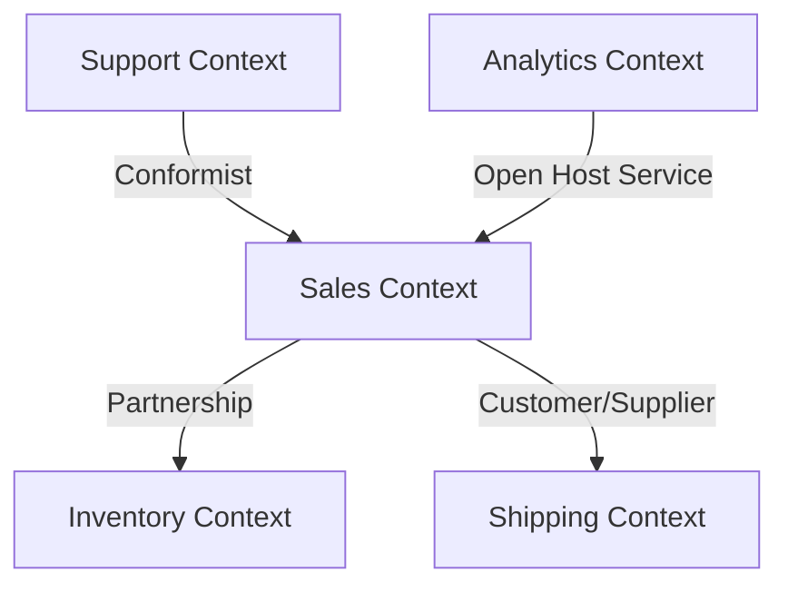

# Bounded Contexts in Domain-Driven Design 🔲

## Overview and Problem Statement

In large software systems, different parts of the organization often have different perspectives on the same business concepts. For example, a "Customer" might mean something different to the sales team than it does to the support team. This leads to confusion, inconsistent implementations, and brittle integrations between different parts of the system.

Bounded Contexts solve this problem by explicitly defining the scope within which a particular model applies. They create clear boundaries between different parts of the system, each with its own unified and internally consistent model. This separation allows teams to work independently while still maintaining clear integration points with other contexts.

The business impact of properly implementing Bounded Contexts includes:
- Reduced complexity through clear separation of concerns
- Improved team autonomy and parallel development
- Better alignment with organizational structure
- Clearer integration contracts between different parts of the system
- Enhanced maintainability and evolvability of the system

## Detailed Solution/Architecture 🏛️

### Core Concepts

A Bounded Context provides an explicit boundary within which a domain model exists. Each bounded context contains its own:
- Ubiquitous Language
- Domain Model
- Technical Implementation
- Team Ownership

Let's examine how this works in practice with an e-commerce system:

```java
// Sales Bounded Context
public class Customer {
    private CustomerId id;
    private ShoppingCart cart;
    private WishList wishList;
    private PaymentMethod preferredPaymentMethod;
    
    public void addToCart(Product product, Quantity quantity) {
        cart.add(new LineItem(product, quantity));
    }
}

// Support Bounded Context
public class Customer {
    private CustomerId id;
    private List<SupportTicket> tickets;
    private SupportTier tier;
    private TimeZone preferredContactTime;
    
    public void raiseTicket(String issue) {
        tickets.add(new SupportTicket(issue, tier.getResponseTime()));
    }
}
```

Notice how the same concept (Customer) has different attributes and behaviors in each context, reflecting the different needs and perspectives of each domain.

### Context Mapping Patterns

Contexts need to interact with each other. Here are the key patterns for managing these relationships:

```java
// Partnership Pattern Example
public class OrderFulfillment {
    private final InventoryContext inventoryContext;
    private final ShippingContext shippingContext;
    
    public void processFulfillment(Order order) {
        // Coordinate with both contexts
        InventoryAllocation allocation = inventoryContext.allocateInventory(order);
        if (allocation.isSuccessful()) {
            ShippingLabel label = shippingContext.createShippingLabel(order);
            // Continue fulfillment process
        }
    }
}

// Downstream Integration Example
public class CustomerContextAdapter {
    private final DownstreamCustomerContext customerContext;
    
    public CustomerProfile translateToAnalytics(Customer customer) {
        return new CustomerProfile(
            customer.getId(),
            customer.getPurchaseHistory(),
            customer.getPreferences()
        );
    }
}
```

### Context Map Diagram

What this diagram represents: The relationships between different bounded contexts in an e-commerce system
Key components: Sales, Support, Inventory, and Shipping contexts
Important relationships: Partnership, Customer/Supplier, Conformist
What to look for: Direction of dependencies and integration patterns



## Technical Implementation 💻

Let's look at how to implement bounded contexts in practice:

### Context Boundaries

```java
// Clear module structure reflecting bounded contexts
com.company.sales/
    Customer.java
    Order.java
    Product.java
    
com.company.support/
    Customer.java
    Ticket.java
    Resolution.java

// Context boundary enforcement
public class SalesContext {
    private final EntityManager entityManager;
    
    // Public interface for other contexts
    public Order createOrder(CustomerId customerId, List<LineItem> items) {
        Customer customer = findCustomer(customerId);
        Order order = customer.createOrder(items);
        entityManager.persist(order);
        return order;
    }
    
    // Private implementation details
    private Customer findCustomer(CustomerId id) {
        return entityManager.find(Customer.class, id);
    }
}
```

### Context Integration

Let's implement a real-world integration between contexts:

```java
public class OrderFulfillmentService {
    private final SalesContext salesContext;
    private final InventoryContext inventoryContext;
    private final ShippingContext shippingContext;
    
    @Transactional
    public FulfillmentResult fulfillOrder(OrderId orderId) {
        // Get order from sales context
        Order order = salesContext.getOrder(orderId);
        
        // Translate to inventory context
        InventoryAllocation allocation = 
            inventoryContext.allocateInventory(
                toInventoryRequest(order)
            );
            
        if (!allocation.isSuccessful()) {
            return FulfillmentResult.failed("Insufficient inventory");
        }
        
        // Translate to shipping context
        ShippingLabel label = 
            shippingContext.createShippingLabel(
                toShippingRequest(order)
            );
            
        return FulfillmentResult.success(label);
    }
    
    // Context translation methods
    private InventoryRequest toInventoryRequest(Order order) {
        return new InventoryRequest(
            order.getItems().stream()
                .map(item -> new InventoryItem(
                    item.getSku(),
                    item.getQuantity()
                ))
                .collect(toList())
        );
    }
    
    private ShippingRequest toShippingRequest(Order order) {
        return new ShippingRequest(
            order.getShippingAddress(),
            order.getDeliveryPreference(),
            order.getItems()
        );
    }
}
```

## Anti-Patterns 🚫

Here are common mistakes to avoid when implementing bounded contexts:

### Leaky Contexts

```java
// Bad: Context leak
public class SalesCustomer {
    private SupportTicket currentTicket; // Support context concept leaking into Sales
    
    public void createTicket(String issue) {
        this.currentTicket = new SupportTicket(issue); // Direct dependency on Support context
    }
}

// Good: Clear context boundary
public class SalesCustomer {
    private CustomerId id;
    
    public CustomerSupportRequest requestSupport(String issue) {
        return new CustomerSupportRequest(id, issue); // Creates a neutral DTO for context translation
    }
}
```

### Missing Translation Layer

```java
// Bad: Direct usage of models across contexts
public class InventoryService {
    public void allocateInventory(SalesOrder order) { // Direct dependency on Sales context
        // Implementation
    }
}

// Good: Explicit translation layer
public class InventoryService {
    public void allocateInventory(InventoryAllocationRequest request) {
        // Implementation using inventory context concepts
    }
}
```

## Best Practices & Guidelines 🎯

### Context Definition Guidelines

When defining bounded contexts:

```java
// Clear context boundaries in package structure
package com.company.sales {
    // Sales-specific implementations
    public class Order {
        private OrderStatus status;
        private List<LineItem> items;
        
        public void submit() {
            validateOrderRules();
            status = OrderStatus.SUBMITTED;
        }
    }
}

// Separate integration contracts
package com.company.sales.api {
    // Public contracts for other contexts
    public interface OrderFacade {
        OrderDTO getOrder(OrderId id);
        void submitOrder(OrderRequest request);
    }
}
```

### Integration Best Practices

```java
public class ContextIntegrationExample {
    // Use events for loose coupling between contexts
    @EventListener
    public void onOrderSubmitted(OrderSubmittedEvent event) {
        // Translate event to inventory context
        InventoryAllocationRequest request = 
            inventoryTranslator.translateFromOrder(event);
            
        // Process in inventory context
        inventoryContext.processAllocation(request);
    }
    
    // Use anti-corruption layer when integrating with legacy systems
    public class LegacySystemAdapter {
        public ModernOrder translateFromLegacy(LegacyOrder legacyOrder) {
            return new ModernOrder(
                new OrderId(legacyOrder.getOrderNumber()),
                translateLineItems(legacyOrder.getItems()),
                translateCustomer(legacyOrder.getCustomerInfo())
            );
        }
    }
}
```

## Real-world Use Cases 🌍

### E-commerce Platform Example

A real-world e-commerce platform might define these bounded contexts:

```java
// Catalog Context
public class Product {
    private SKU sku;
    private String name;
    private Money price;
    private List<Category> categories;
    private List<Attribute> attributes;
}

// Order Context
public class Product {
    private SKU sku;
    private Money priceAtOrder;
    private Quantity quantity;
    private List<Discount> appliedDiscounts;
}

// Inventory Context
public class Product {
    private SKU sku;
    private StockLevel currentStock;
    private Location storageLocation;
    private ReorderPoint reorderPoint;
}
```

Each context has its own view of a "Product" that serves its specific needs while maintaining consistency within its boundaries.

## References and Additional Resources 📚

Essential reading materials:
- "Domain-Driven Design" by Eric Evans (Chapters on Context Mapping)
- "Implementing Domain-Driven Design" by Vaughn Vernon
- "Context Mapping" by Alberto Brandolini
- "Strategic Domain-Driven Design with Context Mapping" by Nick Tune

Community resources:
- DDD Community Discord
- Context Mapping Pattern Repository
- Bounded Context Canvas

The effective implementation of bounded contexts is crucial for managing complexity in large-scale systems. When done properly, it enables teams to work independently while maintaining clear integration points and ensuring system consistency at the appropriate level of granularity.