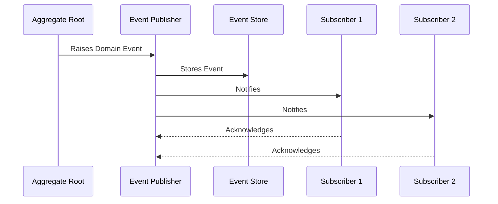

# Domain-Driven Design (DDD) Technical Documentation 🏗️

## Overview and Problem Statement

Domain-Driven Design (DDD) addresses one of software engineering's most persistent challenges: managing complexity in large-scale applications. As software systems grow, they often become difficult to maintain, evolve, and understand due to tangled business logic, unclear boundaries, and poor alignment with business needs.

DDD solves these problems by providing a structured approach to software design that:
- Places the focus on the core business domain and domain logic
- Bases complex designs on a model of the domain
- Initiates creative collaboration between technical and domain experts

The business value of DDD includes:
- Reduced maintenance costs through better organized code
- Improved communication between technical and business teams
- More flexible and adaptable systems
- Better alignment between business needs and technical solutions

## Detailed Solution/Architecture 🏛️

### Core Concepts

Domain-Driven Design is built upon several foundational concepts that work together to create a comprehensive approach to software design:

1. **Ubiquitous Language:**
   A shared language between developers and domain experts that is used consistently in code, documentation, and conversation. This language evolves as understanding of the domain deepens.

2. **Bounded Contexts:**
   Explicit boundaries within which a particular domain model is defined and applicable. Each bounded context contains its own ubiquitous language and domain model.

3. **Strategic Design:**
   The practice of designing the relationships between bounded contexts and organizing large-scale structures.

### Key Components

Domain-Driven Design uses specific building blocks to express the model:

1. **Entities:**
   Objects defined by their identity continuity rather than their attributes.

2. **Value Objects:**
   Objects that describe characteristics of a thing, defined by their attributes rather than identity.

3. **Aggregates:**
   Clusters of domain objects that can be treated as a single unit.

4. **Domain Events:**
   Objects that capture something that happened in the domain that domain experts care about.

## Technical Implementation 💻

Let's look at practical implementations of DDD concepts:

### Example: Entity Implementation

**Purpose**: Demonstrate how to implement an entity with identity and behavior

**Problem**: Representing a customer in an e-commerce system

**Dependencies**: None

**Expected outcome**: A well-encapsulated entity that maintains invariants

```java
public class Customer {
    private final CustomerId id;
    private Email email;
    private Name name;
    private List<Order> orders;
    
    // Constructor ensures required fields
    public Customer(CustomerId id, Email email, Name name) {
        this.id = Objects.requireNonNull(id);
        this.email = Objects.requireNonNull(email);
        this.name = Objects.requireNonNull(name);
        this.orders = new ArrayList<>();
    }
    
    // Business behavior
    public void placeOrder(Order order) {
        validateOrderLimit();
        orders.add(order);
    }
    
    // Domain logic/invariants
    private void validateOrderLimit() {
        if (orders.stream()
                .filter(Order::isPending)
                .count() >= 10) {
            throw new DomainException("Customer cannot have more than 10 pending orders");
        }
    }
}
```

### Example: Value Object Implementation

**Purpose:** Show how to implement immutable value objects

**Problem:** Representing money in a financial system

**Dependencies:** None

**Expected outcome:** An immutable value object with equality based on attributes

```java
public final class Money {
    private final BigDecimal amount;
    private final Currency currency;
    
    public Money(BigDecimal amount, Currency currency) {
        this.amount = amount.setScale(2, RoundingMode.HALF_UP);
        this.currency = Objects.requireNonNull(currency);
    }
    
    public Money add(Money other) {
        if (!this.currency.equals(other.currency)) {
            throw new DomainException("Cannot add different currencies");
        }
        return new Money(this.amount.add(other.amount), this.currency);
    }
    
    @Override
    public boolean equals(Object o) {
        if (this == o) return true;
        if (o == null || getClass() != o.getClass()) return false;
        Money money = (Money) o;
        return amount.equals(money.amount) && currency.equals(money.currency);
    }
}
```

### Domain Events Diagram

**What the diagram represents:** Flow of domain events in a system

**Key components:** Event publishers, subscribers, and event store

**Important relationships:** Publishing and subscription patterns

**What to look for:** Event propagation and handling




## Anti-Patterns 🚫

Understanding common mistakes helps avoid pitfalls in DDD implementation:

### Anemic Domain Model
**Problem:** Creating models that are just data holders without behavior

**Solution:** Ensure domain objects encapsulate both data and behavior

**Wrong Implementation:**
```java
// Anti-pattern: Anemic domain model
public class Order {
    private String id;
    private List<OrderLine> lines;
    private OrderStatus status;
    
    // Only getters and setters
    public void setStatus(OrderStatus status) {
        this.status = status;
    }
}
```

**Correct Implementation:**
```java
public class Order {
    private final OrderId id;
    private final List<OrderLine> lines;
    private OrderStatus status;
    
    public void submit() {
        validateOrderLines();
        this.status = OrderStatus.SUBMITTED;
    }
    
    private void validateOrderLines() {
        if (lines.isEmpty()) {
            throw new DomainException("Order must have at least one line");
        }
    }
}
```

## Best Practices & Guidelines 🎯

### Design Principles

1. **Model-Driven Design:**
   Start with the domain model and let it drive the design of the software. The code should reflect the model explicitly.

2. **Hands-on Domain Experts:**
   Involve domain experts directly in the modeling process. Regular collaboration between developers and domain experts is essential.

3. **Continuous Refinement:**
   The model and ubiquitous language should evolve as understanding of the domain deepens.

Example of implementing these principles:

```java
// Domain model reflecting business concepts directly
public class LoanApplication {
    private final ApplicantId applicantId;
    private final CreditScore creditScore;
    private final Income monthlyIncome;
    private ApplicationStatus status;
    
    public LoanDecision evaluate() {
        if (creditScore.getValue() < 600) {
            return LoanDecision.rejected("Credit score too low");
        }
        
        if (monthlyIncome.calculateDebtToIncomeRatio().exceeds(0.43)) {
            return LoanDecision.rejected("Debt-to-income ratio too high");
        }
        
        return LoanDecision.approved();
    }
}
```

## Testing Strategies 🧪

DDD requires a comprehensive testing approach that covers both technical correctness and domain rule validation.

### Unit Testing Example

Purpose: Demonstrate testing of domain logic
Problem: Ensuring loan application rules are correctly implemented
Dependencies: JUnit, AssertJ
Expected outcome: Verified domain rules

```java
public class LoanApplicationTest {
    @Test
    void shouldRejectApplicationWithLowCreditScore() {
        // Arrange
        var application = new LoanApplication(
            ApplicantId.generate(),
            new CreditScore(550),
            new Income(Money.of(5000))
        );
        
        // Act
        var decision = application.evaluate();
        
        // Assert
        assertThat(decision.isRejected()).isTrue();
        assertThat(decision.getReason()).contains("Credit score too low");
    }
}
```

## Real-world Use Cases 🌍

### E-commerce Platform Migration

A large online retailer successfully applied DDD to restructure their monolithic application into bounded contexts:

1. Order Management Context
- Handles order processing, fulfillment, and tracking
- Clear boundaries with Inventory and Customer contexts
- Domain events for cross-context communication

2. Customer Context
- Manages customer profiles, preferences, and history
- Maintains customer-specific business rules
- Provides customer-related domain events

3. Inventory Context
- Manages product availability and warehouse locations
- Handles stock levels and replenishment
- Communicates stock changes via domain events

## References and Additional Resources 📚

Books:
- "Domain-Driven Design" by Eric Evans
- "Implementing Domain-Driven Design" by Vaughn Vernon
- "Domain-Driven Design Distilled" by Vaughn Vernon

Articles:
- "Strategic Domain-Driven Design" - Martin Fowler
- "DDD and Microservices" - Chris Richardson

Documentation:
- DDD Pattern Repository
- Microsoft's DDD Architecture Guide

Community Resources:
- DDD Community on GitHub
- Domain-Driven Design Weekly Newsletter

