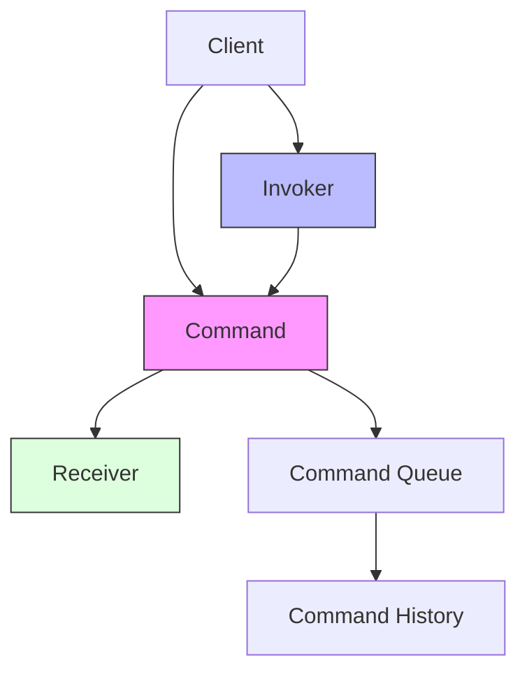

# Command Pattern

## Overview

The Command pattern is a behavioral design pattern that turns a request into a stand-alone object that contains all information about the request. This transformation allows you to parameterize methods with different requests, delay or queue a request's execution, and support undoable operations.

### Real-World Analogy
Think of a restaurant where customers (clients) place orders (commands) through waiters (invokers). The orders go to the kitchen (receiver) where the chef prepares the food. The order ticket serves as a command object, encapsulating all the information needed to prepare the dish. This system allows for queuing orders, tracking them, and even canceling them if needed.



## Key Concepts

### Core Components

1. **Command**: Interface declaring command execution method
2. **Concrete Command**: Implements command interface, binds receiver with actions
3. **Invoker**: Asks command to carry out request
4. **Receiver**: Knows how to perform the action
5. **Client**: Creates command and sets its receiver

### Implementation Example
import Tabs from '@theme/Tabs';
import TabItem from '@theme/TabItem';

<Tabs>
  <TabItem value="java" label="Java">
    ```java
    // Command interface
    interface Command {
        void execute();
        void undo();
    }

    // Receiver
    class TextEditor {
        private StringBuilder content = new StringBuilder();
        private int cursorPosition = 0;

        public void insertText(String text) {
            content.insert(cursorPosition, text);
            cursorPosition += text.length();
        }

        public void deleteText(int length) {
            if (cursorPosition >= length) {
                content.delete(cursorPosition - length, cursorPosition);
                cursorPosition -= length;
            }
        }

        public void moveCursor(int position) {
            if (position >= 0 && position <= content.length()) {
                cursorPosition = position;
            }
        }

        public String getContent() {
            return content.toString();
        }

        public int getCursorPosition() {
            return cursorPosition;
        }
    }

    // Concrete Commands
    class InsertTextCommand implements Command {
        private TextEditor editor;
        private String text;
        private int insertPosition;

        public InsertTextCommand(TextEditor editor, String text) {
            this.editor = editor;
            this.text = text;
            this.insertPosition = editor.getCursorPosition();
        }

        @Override
        public void execute() {
            editor.moveCursor(insertPosition);
            editor.insertText(text);
        }

        @Override
        public void undo() {
            editor.moveCursor(insertPosition + text.length());
            editor.deleteText(text.length());
        }
    }

    class DeleteTextCommand implements Command {
        private TextEditor editor;
        private String deletedText;
        private int deletePosition;
        private int length;

        public DeleteTextCommand(TextEditor editor, int length) {
            this.editor = editor;
            this.length = length;
            this.deletePosition = editor.getCursorPosition();
            this.deletedText = editor.getContent().substring(
                Math.max(0, deletePosition - length), deletePosition);
        }

        @Override
        public void execute() {
            editor.deleteText(length);
        }

        @Override
        public void undo() {
            editor.moveCursor(deletePosition - length);
            editor.insertText(deletedText);
        }
    }

    // Invoker with Command History
    class TextEditorInvoker {
        private final Stack<Command> undoStack = new Stack<>();
        private final Stack<Command> redoStack = new Stack<>();

        public void executeCommand(Command command) {
            command.execute();
            undoStack.push(command);
            redoStack.clear(); // Clear redo stack when new command is executed
        }

        public void undo() {
            if (!undoStack.isEmpty()) {
                Command command = undoStack.pop();
                command.undo();
                redoStack.push(command);
            }
        }

        public void redo() {
            if (!redoStack.isEmpty()) {
                Command command = redoStack.pop();
                command.execute();
                undoStack.push(command);
            }
        }
    }

    // Client code
    class TextEditorClient {
        public static void main(String[] args) {
            TextEditor editor = new TextEditor();
            TextEditorInvoker invoker = new TextEditorInvoker();

            // Insert some text
            Command insertHello = new InsertTextCommand(editor, "Hello ");
            invoker.executeCommand(insertHello);
            System.out.println(editor.getContent()); // Output: Hello 

            // Insert more text
            Command insertWorld = new InsertTextCommand(editor, "World!");
            invoker.executeCommand(insertWorld);
            System.out.println(editor.getContent()); // Output: Hello World!

            // Undo last command
            invoker.undo();
            System.out.println(editor.getContent()); // Output: Hello 

            // Redo last command
            invoker.redo();
            System.out.println(editor.getContent()); // Output: Hello World!
        }
    }
    ```
  </TabItem>
  <TabItem value="go" label="Go">
    ```go
    package main

    import (
        "fmt"
        "strings"
    )

    // Command interface
    type Command interface {
        Execute()
        Undo()
    }

    // Receiver
    type TextEditor struct {
        content        strings.Builder
        cursorPosition int
    }

    func NewTextEditor() *TextEditor {
        return &TextEditor{}
    }

    func (t *TextEditor) InsertText(text string) {
        content := t.content.String()
        newContent := content[:t.cursorPosition] + text + content[t.cursorPosition:]
        t.content = strings.Builder{}
        t.content.WriteString(newContent)
        t.cursorPosition += len(text)
    }

    func (t *TextEditor) DeleteText(length int) {
        if t.cursorPosition >= length {
            content := t.content.String()
            newContent := content[:t.cursorPosition-length] + content[t.cursorPosition:]
            t.content = strings.Builder{}
            t.content.WriteString(newContent)
            t.cursorPosition -= length
        }
    }

    func (t *TextEditor) MoveCursor(position int) {
        if position >= 0 && position <= len(t.content.String()) {
            t.cursorPosition = position
        }
    }

    func (t *TextEditor) GetContent() string {
        return t.content.String()
    }

    func (t *TextEditor) GetCursorPosition() int {
        return t.cursorPosition
    }

    // Concrete Commands
    type InsertTextCommand struct {
        editor        *TextEditor
        text         string
        insertPosition int
    }

    func NewInsertTextCommand(editor *TextEditor, text string) *InsertTextCommand {
        return &InsertTextCommand{
            editor:        editor,
            text:         text,
            insertPosition: editor.GetCursorPosition(),
        }
    }

    func (c *InsertTextCommand) Execute() {
        c.editor.MoveCursor(c.insertPosition)
        c.editor.InsertText(c.text)
    }

    func (c *InsertTextCommand) Undo() {
        c.editor.MoveCursor(c.insertPosition + len(c.text))
        c.editor.DeleteText(len(c.text))
    }

    type DeleteTextCommand struct {
        editor        *TextEditor
        deletedText   string
        deletePosition int
        length        int
    }

    func NewDeleteTextCommand(editor *TextEditor, length int) *DeleteTextCommand {
        deletePosition := editor.GetCursorPosition()
        content := editor.GetContent()
        deletedText := ""
        if deletePosition >= length {
            deletedText = content[deletePosition-length : deletePosition]
        }

        return &DeleteTextCommand{
            editor:         editor,
            deletedText:    deletedText,
            deletePosition: deletePosition,
            length:         length,
        }
    }

    func (c *DeleteTextCommand) Execute() {
        c.editor.DeleteText(c.length)
    }

    func (c *DeleteTextCommand) Undo() {
        c.editor.MoveCursor(c.deletePosition - c.length)
        c.editor.InsertText(c.deletedText)
    }

    // Invoker with Command History
    type TextEditorInvoker struct {
        undoStack []Command
        redoStack []Command
    }

    func NewTextEditorInvoker() *TextEditorInvoker {
        return &TextEditorInvoker{
            undoStack: make([]Command, 0),
            redoStack: make([]Command, 0),
        }
    }

    func (t *TextEditorInvoker) ExecuteCommand(command Command) {
        command.Execute()
        t.undoStack = append(t.undoStack, command)
        t.redoStack = nil // Clear redo stack
    }

    func (t *TextEditorInvoker) Undo() {
        if len(t.undoStack) > 0 {
            lastIndex := len(t.undoStack) - 1
            command := t.undoStack[lastIndex]
            t.undoStack = t.undoStack[:lastIndex]
            
            command.Undo()
            t.redoStack = append(t.redoStack, command)
        }
    }

    func (t *TextEditorInvoker) Redo() {
        if len(t.redoStack) > 0 {
            lastIndex := len(t.redoStack) - 1
            command := t.redoStack[lastIndex]
            t.redoStack = t.redoStack[:lastIndex]
            
            command.Execute()
            t.undoStack = append(t.undoStack, command)
        }
    }

    // Client code
    func main() {
        editor := NewTextEditor()
        invoker := NewTextEditorInvoker()

        // Insert some text
        insertHello := NewInsertTextCommand(editor, "Hello ")
        invoker.ExecuteCommand(insertHello)
        fmt.Println(editor.GetContent()) // Output: Hello 

        // Insert more text
        insertWorld := NewInsertTextCommand(editor, "World!")
        invoker.ExecuteCommand(insertWorld)
        fmt.Println(editor.GetContent()) // Output: Hello World!

        // Undo last command
        invoker.Undo()
        fmt.Println(editor.GetContent()) // Output: Hello 

        // Redo last command
        invoker.Redo()
        fmt.Println(editor.GetContent()) // Output: Hello World!
    }
    ```
  </TabItem>
</Tabs>

## Related Patterns

1. **Memento Pattern**
    - Often used together for implementing undo operations
    - Memento stores the state, Command uses it for restoration

2. **Strategy Pattern**
    - Both encapsulate behaviors
    - Command focuses on encapsulating complete requests with parameters

3. **Observer Pattern**
    - Can be used to notify about command execution
    - Useful for logging and monitoring command execution

## Best Practices

### Configuration
1. Keep commands immutable
2. Implement undo/redo carefully
3. Consider command validation

### Monitoring
1. Log command execution
2. Track command execution time
3. Monitor command queue size

### Testing
1. Test command execution
2. Verify undo/redo behavior
3. Test command validation

## Common Pitfalls

1. **Complex Command State**
    - Solution: Use Memento pattern for state management
    - Keep commands focused and simple

2. **Memory Leaks**
    - Solution: Limit command history size
    - Implement cleanup for completed commands

3. **Inconsistent State**
    - Solution: Implement transaction-like behavior
    - Roll back on partial failures

## Use Cases

### 1. Text Editors
- Undo/redo operations
- Macro recording
- Command history

### 2. Transaction Systems
- Database operations
- Financial transactions
- Distributed operations

### 3. GUI Applications
- Menu actions
- Keyboard shortcuts
- Batch operations

## Deep Dive Topics

### Thread Safety

```java
public class ThreadSafeCommandQueue {
    private final BlockingQueue<Command> commandQueue;
    private final ConcurrentLinkedQueue<Command> history;
    private final ExecutorService executor;

    public ThreadSafeCommandQueue() {
        this.commandQueue = new LinkedBlockingQueue<>();
        this.history = new ConcurrentLinkedQueue<>();
        this.executor = Executors.newSingleThreadExecutor();
    }

    public void enqueueCommand(Command command) {
        commandQueue.offer(command);
        executor.submit(() -> {
            try {
                Command cmd = commandQueue.take();
                cmd.execute();
                history.offer(cmd);
            } catch (InterruptedException e) {
                Thread.currentThread().interrupt();
            }
        });
    }

    public void shutdown() {
        executor.shutdown();
    }
}
```

### Distributed Systems
1. Command replication
2. Distributed command queues
3. Consistency management

### Performance Considerations
1. Command queue optimization
2. Memory management
3. History size limits

## Additional Resources

### References
1. "Design Patterns" by Gang of Four
2. "Patterns of Enterprise Application Architecture" by Martin Fowler
3. "Clean Code" by Robert C. Martin

### Tools
1. Command pattern implementations
2. Command queue frameworks
3. Testing utilities

## FAQ

**Q: When should I use the Command pattern?**  
A: Use it when you need to:
- Parameterize objects with operations
- Queue operations, schedule their execution, or execute them remotely
- Implement undo/redo functionality
- Structure a system around high-level operations

**Q: How do I handle command failure?**  
A: Implement compensation logic in the undo method and use try-catch blocks in execute. Consider using the Command Chain pattern for complex operations.

**Q: How do I manage command history size?**  
A: Implement a size limit for the command history and remove old commands using strategies like FIFO or LRU.

**Q: Can commands be serialized?**  
A: Yes, commands can be serialized if they contain all necessary state. This is useful for distributed systems and persistence.

**Q: How do I implement composite commands?**  
A: Create a MacroCommand that contains a list of commands and executes them in sequence. Remember to implement proper undo functionality.

## Implementation Considerations

### Command Validation
```java
abstract class ValidatedCommand implements Command {
    public final void execute() {
        if (!validate()) {
            throw new IllegalStateException("Command validation failed");
        }
        doExecute();
    }

    protected abstract boolean validate();
    protected abstract void doExecute();
}
```

### Macro Commands
```java
class MacroCommand implements Command {
    private final List<Command> commands;

    public MacroCommand(List<Command> commands) {
        this.commands = new ArrayList<>(commands);
    }

    @Override
    public void execute() {
        commands.forEach(Command::execute);
    }

    @Override
    public void undo() {
        ListIterator<Command> iterator = 
            commands.listIterator(commands.size());
        while (iterator.hasPrevious()) {
            iterator.previous().undo();
        }
    }
}
```
