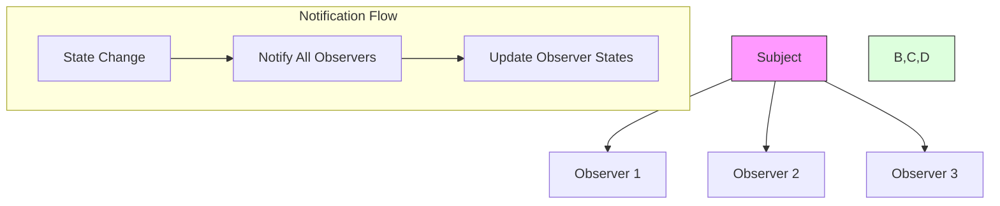

# Observer Pattern

## Overview

The Observer pattern is a behavioral design pattern where an object, called the subject (or publisher), maintains a list of its dependents, called observers (or subscribers), and notifies them automatically of any state changes, usually by calling one of their methods.

### Real-World Analogy
Think of a newspaper subscription service. Subscribers (observers) sign up to receive the newspaper, and the publishing house (subject) delivers the newspaper to all subscribers whenever a new edition is published. If someone cancels their subscription, they stop receiving the newspaper, while new subscribers start receiving it upon signing up.



## Key Concepts

### Core Components

1. **Subject**: Maintains observers and sends notifications
2. **Observer**: Defines updating interface for objects that need to be notified
3. **Concrete Subject**: Stores state and sends notifications to observers
4. **Concrete Observer**: Implements the Observer updating interface

### Implementation Example
import Tabs from '@theme/Tabs';
import TabItem from '@theme/TabItem';

<Tabs>
  <TabItem value="java" label="Java">
    ```java
    // Observer Interface
    interface StockObserver {
        void update(String stock, double price);
    }

    // Subject Interface
    interface StockSubject {
        void attach(StockObserver observer);
        void detach(StockObserver observer);
        void notifyObservers();
    }

    // Concrete Subject
    class StockMarket implements StockSubject {
        private List<StockObserver> observers = new ArrayList<>();
        private Map<String, Double> stocks = new HashMap<>();
        
        public void setStockPrice(String symbol, double price) {
            stocks.put(symbol, price);
            notifyObservers();
        }
        
        @Override
        public void attach(StockObserver observer) {
            if (!observers.contains(observer)) {
                observers.add(observer);
            }
        }
        
        @Override
        public void detach(StockObserver observer) {
            observers.remove(observer);
        }
        
        @Override
        public void notifyObservers() {
            for (Map.Entry<String, Double> stock : stocks.entrySet()) {
                for (StockObserver observer : observers) {
                    observer.update(stock.getKey(), stock.getValue());
                }
            }
        }
    }

    // Concrete Observers
    class StockTrader implements StockObserver {
        private String name;
        private Map<String, Double> portfolio = new HashMap<>();

        public StockTrader(String name) {
            this.name = name;
        }

        @Override
        public void update(String stock, double price) {
            portfolio.put(stock, price);
            System.out.printf("Trader %s: Updated %s price to %.2f%n", 
                name, stock, price);
        }
    }

    class StockAnalyst implements StockObserver {
        private List<Double> priceHistory = new ArrayList<>();
        
        @Override
        public void update(String stock, double price) {
            priceHistory.add(price);
            analyzePrice(stock, price);
        }
        
        private void analyzePrice(String stock, double price) {
            double average = priceHistory.stream()
                .mapToDouble(Double::doubleValue)
                .average()
                .orElse(0.0);
                
            System.out.printf("Analysis for %s: Current: %.2f, Average: %.2f%n", 
                stock, price, average);
        }
    }

    // Usage Example
    class StockMarketDemo {
        public static void main(String[] args) {
            StockMarket market = new StockMarket();
            
            StockTrader trader1 = new StockTrader("John");
            StockTrader trader2 = new StockTrader("Alice");
            StockAnalyst analyst = new StockAnalyst();
            
            market.attach(trader1);
            market.attach(trader2);
            market.attach(analyst);
            
            market.setStockPrice("AAPL", 150.0);
            market.setStockPrice("GOOGL", 2800.0);
        }
    }
    ```
  </TabItem>
  <TabItem value="go" label="Go">
    ```go
    package main

    import (
        "fmt"
        "sync"
    )

    // Observer Interface
    type StockObserver interface {
        Update(stock string, price float64)
    }

    // Subject Interface
    type StockSubject interface {
        Attach(observer StockObserver)
        Detach(observer StockObserver)
        NotifyObservers()
    }

    // Concrete Subject
    type StockMarket struct {
        observers sync.Map
        stocks    sync.Map
        mutex    sync.RWMutex
    }

    func NewStockMarket() *StockMarket {
        return &StockMarket{}
    }

    func (s *StockMarket) SetStockPrice(symbol string, price float64) {
        s.mutex.Lock()
        s.stocks.Store(symbol, price)
        s.mutex.Unlock()
        s.NotifyObservers()
    }

    func (s *StockMarket) Attach(observer StockObserver) {
        s.observers.Store(observer, true)
    }

    func (s *StockMarket) Detach(observer StockObserver) {
        s.observers.Delete(observer)
    }

    func (s *StockMarket) NotifyObservers() {
        s.mutex.RLock()
        defer s.mutex.RUnlock()
        
        s.stocks.Range(func(k, v interface{}) bool {
            stock := k.(string)
            price := v.(float64)
            
            s.observers.Range(func(o, _ interface{}) bool {
                observer := o.(StockObserver)
                observer.Update(stock, price)
                return true
            })
            return true
        })
    }

    // Concrete Observers
    type StockTrader struct {
        name      string
        portfolio sync.Map
    }

    func NewStockTrader(name string) *StockTrader {
        return &StockTrader{name: name}
    }

    func (t *StockTrader) Update(stock string, price float64) {
        t.portfolio.Store(stock, price)
        fmt.Printf("Trader %s: Updated %s price to %.2f\n", 
            t.name, stock, price)
    }

    type StockAnalyst struct {
        priceHistory []float64
        mutex        sync.RWMutex
    }

    func NewStockAnalyst() *StockAnalyst {
        return &StockAnalyst{
            priceHistory: make([]float64, 0),
        }
    }

    func (a *StockAnalyst) Update(stock string, price float64) {
        a.mutex.Lock()
        a.priceHistory = append(a.priceHistory, price)
        a.mutex.Unlock()
        a.analyzePrice(stock, price)
    }

    func (a *StockAnalyst) analyzePrice(stock string, price float64) {
        a.mutex.RLock()
        defer a.mutex.RUnlock()
        
        var sum float64
        for _, p := range a.priceHistory {
            sum += p
        }
        average := sum / float64(len(a.priceHistory))
        
        fmt.Printf("Analysis for %s: Current: %.2f, Average: %.2f\n", 
            stock, price, average)
    }

    // Usage Example
    func main() {
        market := NewStockMarket()
        
        trader1 := NewStockTrader("John")
        trader2 := NewStockTrader("Alice")
        analyst := NewStockAnalyst()
        
        market.Attach(trader1)
        market.Attach(trader2)
        market.Attach(analyst)
        
        market.SetStockPrice("AAPL", 150.0)
        market.SetStockPrice("GOOGL", 2800.0)
    }
    ```
  </TabItem>
</Tabs>

## Related Patterns

1. **Mediator Pattern**
    - Often used together to coordinate complex updates
    - Reduces coupling between objects

2. **Singleton Pattern**
    - Subject is often implemented as a singleton
    - Ensures single point of event distribution

3. **State Pattern**
    - Can notify observers of state changes
    - Maintains consistency across dependent objects

## Best Practices

### Configuration
1. Use weak references for observers
2. Implement unsubscribe mechanism
3. Consider event filtering

### Monitoring
1. Track observer count
2. Monitor notification frequency
3. Log update patterns

### Testing
1. Mock observers for testing
2. Verify notification order
3. Test concurrent modifications

## Common Pitfalls

1. **Memory Leaks**
    - Solution: Clean up observer references
    - Use weak references when appropriate

2. **Update Loops**
    - Solution: Implement cycle detection
    - Break circular dependencies

3. **Performance Issues**
    - Solution: Batch notifications
    - Filter unnecessary updates

## Use Cases

### 1. Event Management Systems
- GUI event handling
- User interaction tracking
- System event monitoring

### 2. Data Synchronization
- Real-time data updates
- Distributed system synchronization
- Cache invalidation

### 3. Monitoring Systems
- System metrics collection
- Log aggregation
- Health monitoring

## Deep Dive Topics

### Thread Safety

```java
public class ThreadSafeSubject {
    private final List<Observer> observers = 
        Collections.synchronizedList(new ArrayList<>());
    private final ReentrantReadWriteLock lock = new ReentrantReadWriteLock();
    
    public void notifyObservers() {
        lock.readLock().lock();
        try {
            for (Observer observer : observers) {
                observer.update(getState());
            }
        } finally {
            lock.readLock().unlock();
        }
    }
}
```

### Distributed Systems
1. Event ordering
2. Network failure handling
3. Message delivery guarantees

### Performance Considerations
1. Notification batching
2. Observer prioritization
3. Event filtering

## Additional Resources

### References
1. "Design Patterns" by Gang of Four
2. "Reactive Programming with RxJava" by Tomasz Nurkiewicz
3. "Head First Design Patterns" by Freeman et al.

### Tools
1. Event processing frameworks
2. Reactive programming libraries
3. Monitoring tools

## FAQ

**Q: When should I use the Observer pattern?**  
A: Use it when you need a one-to-many dependency between objects where a change in one object needs to be reflected in multiple dependent objects.

**Q: How do I handle slow observers?**  
A: Consider using asynchronous notifications, timeouts, or separate threads for slow observers.

**Q: Is Observer pattern thread-safe?**  
A: Not by default. You need to implement thread safety explicitly for concurrent scenarios.

**Q: How do I prevent memory leaks?**  
A: Always implement proper cleanup, use weak references, and ensure observers are detached when no longer needed.

**Q: What's the difference between Observer and Pub/Sub?**  
A: Observer typically involves direct notification between subject and observers, while Pub/Sub usually involves a message broker or event channel.