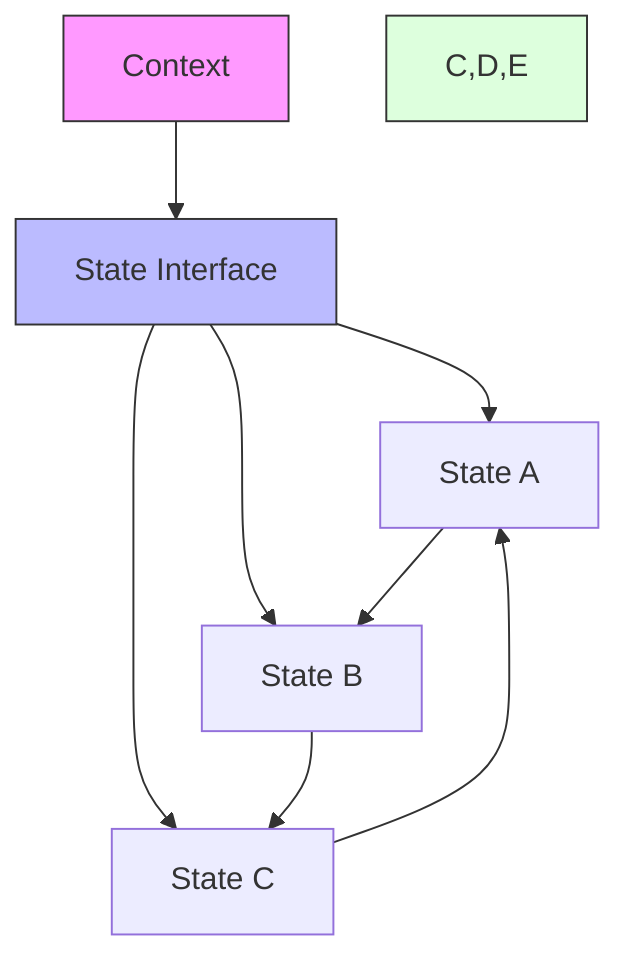

# State Pattern

## Overview

The State pattern is a behavioral design pattern that lets an object alter its behavior when its internal state changes. It appears as if the object changed its class. This pattern encapsulates state-specific behavior into separate state classes and delegates the behavior to the current state object.

### Real-World Analogy
Think of a vending machine. Its behavior changes based on its current state. When it's out of stock, it refuses money and selections. When it has items but no money inserted, it accepts money but won't dispense items. When it has both items and money, it can dispense products. Each state determines how the machine responds to user actions.



## Key Concepts

### Core Components

1. **Context**: Maintains an instance of concrete state as the current state
2. **State**: Defines an interface for state-specific behavior
3. **Concrete States**: Implement behavior associated with a state
4. **State Transitions**: Logic for moving between states

### Implementation Example
import Tabs from '@theme/Tabs';
import TabItem from '@theme/TabItem';

<Tabs>
  <TabItem value="java" label="Java">
    ```java
    // State Interface
    interface VendingMachineState {
        void insertMoney(VendingMachine machine, int amount);
        void selectProduct(VendingMachine machine, String product);
        void dispense(VendingMachine machine);
        void refund(VendingMachine machine);
    }

    // Context
    class VendingMachine {
        private VendingMachineState currentState;
        private Map<String, Integer> inventory = new HashMap<>();
        private int currentAmount = 0;
        private static final int PRODUCT_PRICE = 100; // cents

        public VendingMachine() {
            currentState = new NoMoneyState();
            // Initialize inventory
            inventory.put("Cola", 5);
            inventory.put("Chips", 3);
        }

        public void setState(VendingMachineState state) {
            this.currentState = state;
        }

        public void insertMoney(int amount) {
            currentState.insertMoney(this, amount);
        }

        public void selectProduct(String product) {
            currentState.selectProduct(this, product);
        }

        public void dispense() {
            currentState.dispense(this);
        }

        public void refund() {
            currentState.refund(this);
        }

        // Getters and setters
        public int getCurrentAmount() {
            return currentAmount;
        }

        public void setCurrentAmount(int amount) {
            this.currentAmount = amount;
        }

        public boolean hasProduct(String product) {
            return inventory.getOrDefault(product, 0) > 0;
        }

        public void dispenseProduc t(String product) {
            inventory.put(product, inventory.get(product) - 1);
        }
    }

    // Concrete States
    class NoMoneyState implements VendingMachineState {
        @Override
        public void insertMoney(VendingMachine machine, int amount) {
            machine.setCurrentAmount(amount);
            System.out.println("Accepted $" + amount/100.0);
            machine.setState(new HasMoneyState());
        }

        @Override
        public void selectProduct(VendingMachine machine, String product) {
            System.out.println("Please insert money first");
        }

        @Override
        public void dispense(VendingMachine machine) {
            System.out.println("Please insert money first");
        }

        @Override
        public void refund(VendingMachine machine) {
            System.out.println("No money to refund");
        }
    }

    class HasMoneyState implements VendingMachineState {
        @Override
        public void insertMoney(VendingMachine machine, int amount) {
            machine.setCurrentAmount(machine.getCurrentAmount() + amount);
            System.out.println("Total amount: $" + machine.getCurrentAmount()/100.0);
        }

        @Override
        public void selectProduct(VendingMachine machine, String product) {
            if (!machine.hasProduct(product)) {
                System.out.println("Product out of stock");
                return;
            }
            if (machine.getCurrentAmount() >= VendingMachine.PRODUCT_PRICE) {
                machine.dispenseProduc t(product);
                machine.setCurrentAmount(machine.getCurrentAmount() - VendingMachine.PRODUCT_PRICE);
                machine.setState(new DispensingState());
                machine.dispense();
            } else {
                System.out.println("Insufficient amount");
            }
        }

        @Override
        public void dispense(VendingMachine machine) {
            System.out.println("Please select a product first");
        }

        @Override
        public void refund(VendingMachine machine) {
            System.out.println("Refunding $" + machine.getCurrentAmount()/100.0);
            machine.setCurrentAmount(0);
            machine.setState(new NoMoneyState());
        }
    }

    class DispensingState implements VendingMachineState {
        @Override
        public void insertMoney(VendingMachine machine, int amount) {
            System.out.println("Please wait, dispensing product");
        }

        @Override
        public void selectProduct(VendingMachine machine, String product) {
            System.out.println("Please wait, dispensing product");
        }

        @Override
        public void dispense(VendingMachine machine) {
            System.out.println("Dispensing product");
            if (machine.getCurrentAmount() > 0) {
                System.out.println("Returning change: $" + machine.getCurrentAmount()/100.0);
                machine.setCurrentAmount(0);
            }
            machine.setState(new NoMoneyState());
        }

        @Override
        public void refund(VendingMachine machine) {
            System.out.println("Cannot refund during dispensing");
        }
    }
    ```
  </TabItem>
  <TabItem value="go" label="Go">
    ```go
    package main

    import (
        "fmt"
        "sync"
    )

    // State Interface
    type VendingMachineState interface {
        InsertMoney(machine *VendingMachine, amount int)
        SelectProduct(machine *VendingMachine, product string)
        Dispense(machine *VendingMachine)
        Refund(machine *VendingMachine)
    }

    // Context
    type VendingMachine struct {
        currentState  VendingMachineState
        inventory    map[string]int
        currentAmount int
        mutex        sync.RWMutex
    }

    const ProductPrice = 100 // cents

    func NewVendingMachine() *VendingMachine {
        machine := &VendingMachine{
            inventory: make(map[string]int),
        }
        machine.currentState = &NoMoneyState{}
        machine.inventory["Cola"] = 5
        machine.inventory["Chips"] = 3
        return machine
    }

    func (v *VendingMachine) SetState(state VendingMachineState) {
        v.mutex.Lock()
        defer v.mutex.Unlock()
        v.currentState = state
    }

    func (v *VendingMachine) InsertMoney(amount int) {
        v.currentState.InsertMoney(v, amount)
    }

    func (v *VendingMachine) SelectProduct(product string) {
        v.currentState.SelectProduct(v, product)
    }

    func (v *VendingMachine) Dispense() {
        v.currentState.Dispense(v)
    }

    func (v *VendingMachine) Refund() {
        v.currentState.Refund(v)
    }

    func (v *VendingMachine) GetCurrentAmount() int {
        v.mutex.RLock()
        defer v.mutex.RUnlock()
        return v.currentAmount
    }

    func (v *VendingMachine) SetCurrentAmount(amount int) {
        v.mutex.Lock()
        defer v.mutex.Unlock()
        v.currentAmount = amount
    }

    func (v *VendingMachine) HasProduct(product string) bool {
        v.mutex.RLock()
        defer v.mutex.RUnlock()
        return v.inventory[product] > 0
    }

    func (v *VendingMachine) DispenseProduct(product string) {
        v.mutex.Lock()
        defer v.mutex.Unlock()
        v.inventory[product]--
    }

    // Concrete States
    type NoMoneyState struct{}

    func (s *NoMoneyState) InsertMoney(machine *VendingMachine, amount int) {
        machine.SetCurrentAmount(amount)
        fmt.Printf("Accepted $%.2f\n", float64(amount)/100)
        machine.SetState(&HasMoneyState{})
    }

    func (s *NoMoneyState) SelectProduct(machine *VendingMachine, product string) {
        fmt.Println("Please insert money first")
    }

    func (s *NoMoneyState) Dispense(machine *VendingMachine) {
        fmt.Println("Please insert money first")
    }

    func (s *NoMoneyState) Refund(machine *VendingMachine) {
        fmt.Println("No money to refund")
    }

    type HasMoneyState struct{}

    func (s *HasMoneyState) InsertMoney(machine *VendingMachine, amount int) {
        newAmount := machine.GetCurrentAmount() + amount
        machine.SetCurrentAmount(newAmount)
        fmt.Printf("Total amount: $%.2f\n", float64(newAmount)/100)
    }

    func (s *HasMoneyState) SelectProduct(machine *VendingMachine, product string) {
        if !machine.HasProduct(product) {
            fmt.Println("Product out of stock")
            return
        }
        if machine.GetCurrentAmount() >= ProductPrice {
            machine.DispenseProduct(product)
            machine.SetCurrentAmount(machine.GetCurrentAmount() - ProductPrice)
            machine.SetState(&DispensingState{})
            machine.Dispense()
        } else {
            fmt.Println("Insufficient amount")
        }
    }

    func (s *HasMoneyState) Dispense(machine *VendingMachine) {
        fmt.Println("Please select a product first")
    }

    func (s *HasMoneyState) Refund(machine *VendingMachine) {
        fmt.Printf("Refunding $%.2f\n", float64(machine.GetCurrentAmount())/100)
        machine.SetCurrentAmount(0)
        machine.SetState(&NoMoneyState{})
    }

    type DispensingState struct{}

    func (s *DispensingState) InsertMoney(machine *VendingMachine, amount int) {
        fmt.Println("Please wait, dispensing product")
    }

    func (s *DispensingState) SelectProduct(machine *VendingMachine, product string) {
        fmt.Println("Please wait, dispensing product")
    }

    func (s *DispensingState) Dispense(machine *VendingMachine) {
        fmt.Println("Dispensing product")
        if machine.GetCurrentAmount() > 0 {
            fmt.Printf("Returning change: $%.2f\n", float64(machine.GetCurrentAmount())/100)
            machine.SetCurrentAmount(0)
        }
        machine.SetState(&NoMoneyState{})
    }

    func (s *DispensingState) Refund(machine *VendingMachine) {
        fmt.Println("Cannot refund during dispensing")
    }
    ```
  </TabItem>
</Tabs>

## Related Patterns

1. **Strategy Pattern**
    - Both patterns encapsulate behavior
    - State focuses on object state transitions, Strategy on algorithm selection

2. **Command Pattern**
    - Can be used together to track state transitions
    - Commands can trigger state changes

3. **Singleton Pattern**
    - Often used for state objects that don't maintain instance data
    - Reduces memory usage for states

## Best Practices

### Configuration
1. Keep state transitions clear and well-documented
2. Use state factory if state creation is complex
3. Consider state initialization logic

### Monitoring
1. Log state transitions
2. Track state duration
3. Monitor invalid state transitions

### Testing
1. Test each state independently
2. Verify state transitions
3. Test invalid operations in each state

## Common Pitfalls

1. **State Explosion**
    - Solution: Combine similar states
    - Use state hierarchies

2. **Complex State Transitions**
    - Solution: Create transition tables
    - Document state machine

3. **Shared State**
    - Solution: Use immutable state objects
    - Clear state ownership

## Use Cases

### 1. Order Processing
- Order states: New, Paid, Shipping, Delivered
- State-specific validations
- Transaction management

### 2. Game Development
- Character states: Standing, Walking, Running, Jumping
- Animation control
- Input handling

### 3. Network Connections
- Connection states: Disconnected, Connecting, Connected, Failed
- Protocol management
- Error handling

## Deep Dive Topics

### Thread Safety

```java
public class ThreadSafeContext {
    private volatile State state;
    private final ReentrantReadWriteLock lock = new ReentrantReadWriteLock();

    public void setState(State newState) {
        lock.writeLock().lock();
        try {
            state = newState;
        } finally {
            lock.writeLock().unlock();
        }
    }

    public void request() {
        lock.readLock().lock();
        try {
            state.handle(this);
        } finally {
            lock.readLock().unlock();
        }
    }
}
```

### Distributed Systems
1. State synchronization
2. Consistency management
3. Distributed state machines

### Performance Considerations
1. State object pooling
2. Lazy state initialization
3. State caching strategies

## Additional Resources

### References
1. "Design Patterns" by Gang of Four
2. "Patterns of Enterprise Application Architecture" by Martin Fowler
3. "State Pattern" in "Head First Design Patterns"

### Tools
1. State machine frameworks
2. UML modeling tools
3. State diagram generators

## FAQ

**Q: When should I use the State pattern?**  
A: Use it when:
- An object's behavior depends on its state
- State transitions are complex
- State-specific code appears throughout multiple object methods

**Q: How is State different from Strategy pattern?**  
A: State pattern manages object state transitions while Strategy focuses on interchangeable algorithms. States know about each other, strategies typically don't.

**Q: Can states be shared between contexts?**  
A: Yes, if states don't maintain instance data. Consider using Singleton pattern for stateless state objects.

**Q: How do I handle invalid state transitions?**  
A: Implement validation in state transition methods and throw appropriate exceptions for invalid transitions.

**Q: Should states store data?**  
A: Generally no. Keep state-specific data in the context and let states operate on it.

## Implementation Considerations

### State History
```java
class StateContext {
    private Stack<State> stateHistory = new Stack<>();
    
    public void setState(State state) {
        stateHistory.push(currentState);
        currentState = state;
    }
    
    public void undo() {
        if (!stateHistory.isEmpty()) {
            currentState = stateHistory.pop();
        }
    }
}
```

### State Factory
```java
class StateFactory {
    private Map<String, State> stateCache = new ConcurrentHashMap<>();
    
    public State getState(String type) {
        return stateCache.computeIfAbsent(type, this::createState);
    }
    
    private State createState(String type) {
        switch(type) {
            case "A": return new StateA();
            case "B": return new StateB();
            default: throw new IllegalArgumentException("Unknown state type");
        }
    }
}
```