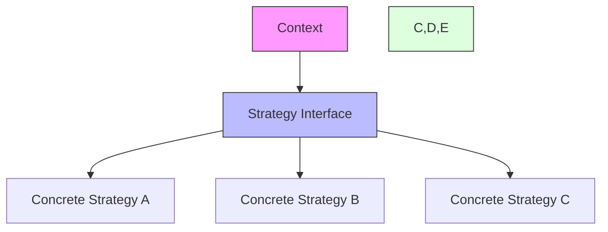

# Strategy Pattern

## Overview

The Strategy pattern is a behavioral design pattern that enables selecting an algorithm's implementation at runtime. It defines a family of algorithms, encapsulates each one, and makes them interchangeable within that family.

### Real-World Analogy
Think of different payment methods at a store. A customer can choose to pay using various strategies (credit card, cash, PayPal, etc.). The store doesn't need to know the internal details of each payment method; it just knows that each method can process a payment.



## Key Concepts

### Core Components

1. **Strategy**: The interface common to all supported algorithms
2. **Concrete Strategy**: Specific algorithm implementations
3. **Context**: Maintains a reference to the current strategy and delegates to it
4. **Client**: Creates and configures the context with desired strategy

### Implementation Example
import Tabs from '@theme/Tabs';
import TabItem from '@theme/TabItem';

<Tabs>
  <TabItem value="java" label="Java">
    ```java
    // Strategy Interface
    interface PaymentStrategy {
        void pay(double amount);
        boolean validate();
    }

    // Concrete Strategies
    class CreditCardPayment implements PaymentStrategy {
        private String cardNumber;
        private String cvv;
        private String expiryDate;

        public CreditCardPayment(String cardNumber, String cvv, String expiryDate) {
            this.cardNumber = cardNumber;
            this.cvv = cvv;
            this.expiryDate = expiryDate;
        }

        @Override
        public void pay(double amount) {
            if (validate()) {
                System.out.printf("Paid %.2f using Credit Card%n", amount);
            } else {
                throw new IllegalStateException("Invalid credit card");
            }
        }

        @Override
        public boolean validate() {
            // Credit card validation logic
            return cardNumber != null && cardNumber.length() == 16;
        }
    }

    class PayPalPayment implements PaymentStrategy {
        private String email;
        private String password;

        public PayPalPayment(String email, String password) {
            this.email = email;
            this.password = password;
        }

        @Override
        public void pay(double amount) {
            if (validate()) {
                System.out.printf("Paid %.2f using PayPal%n", amount);
            } else {
                throw new IllegalStateException("Invalid PayPal credentials");
            }
        }

        @Override
        public boolean validate() {
            // PayPal authentication logic
            return email != null && !email.isEmpty();
        }
    }

    // Context
    class PaymentContext {
        private PaymentStrategy strategy;

        public PaymentContext(PaymentStrategy strategy) {
            this.strategy = strategy;
        }

        public void setStrategy(PaymentStrategy strategy) {
            this.strategy = strategy;
        }

        public void processPayment(double amount) {
            strategy.pay(amount);
        }
    }

    // Advanced Usage with Caching and Error Handling
    class EnhancedPaymentContext {
        private PaymentStrategy strategy;
        private Map<String, Boolean> validationCache = new ConcurrentHashMap<>();
        private int retryCount = 3;

        public void processPayment(double amount) {
            String strategyKey = strategy.getClass().getSimpleName();
            
            if (!validationCache.computeIfAbsent(strategyKey, 
                k -> strategy.validate())) {
                throw new IllegalStateException("Payment strategy validation failed");
            }

            for (int i = 0; i < retryCount; i++) {
                try {
                    strategy.pay(amount);
                    return;
                } catch (Exception e) {
                    if (i == retryCount - 1) {
                        throw e;
                    }
                    // Wait before retry
                    try {
                        Thread.sleep(1000);
                    } catch (InterruptedException ie) {
                        Thread.currentThread().interrupt();
                        throw new RuntimeException(ie);
                    }
                }
            }
        }
    }
    ```
  </TabItem>
  <TabItem value="go" label="Go">
    ```go
    package main

    import (
        "fmt"
        "sync"
    )

    // Strategy Interface
    type PaymentStrategy interface {
        Pay(amount float64)
        Validate() bool
    }

    // Concrete Strategies
    type CreditCardPayment struct {
        cardNumber string
        cvv       string
        expiryDate string
    }

    func NewCreditCardPayment(cardNumber, cvv, expiryDate string) *CreditCardPayment {
        return &CreditCardPayment{
            cardNumber: cardNumber,
            cvv:       cvv,
            expiryDate: expiryDate,
        }
    }

    func (c *CreditCardPayment) Pay(amount float64) {
        if c.Validate() {
            fmt.Printf("Paid %.2f using Credit Card\n", amount)
        } else {
            panic("Invalid credit card")
        }
    }

    func (c *CreditCardPayment) Validate() bool {
        return len(c.cardNumber) == 16
    }

    type PayPalPayment struct {
        email    string
        password string
    }

    func NewPayPalPayment(email, password string) *PayPalPayment {
        return &PayPalPayment{
            email:    email,
            password: password,
        }
    }

    func (p *PayPalPayment) Pay(amount float64) {
        if p.Validate() {
            fmt.Printf("Paid %.2f using PayPal\n", amount)
        } else {
            panic("Invalid PayPal credentials")
        }
    }

    func (p *PayPalPayment) Validate() bool {
        return p.email != ""
    }

    // Context
    type PaymentContext struct {
        strategy PaymentStrategy
    }

    func NewPaymentContext(strategy PaymentStrategy) *PaymentContext {
        return &PaymentContext{strategy: strategy}
    }

    func (pc *PaymentContext) SetStrategy(strategy PaymentStrategy) {
        pc.strategy = strategy
    }

    func (pc *PaymentContext) ProcessPayment(amount float64) {
        pc.strategy.Pay(amount)
    }

    // Enhanced Context with Caching and Error Handling
    type EnhancedPaymentContext struct {
        strategy        PaymentStrategy
        validationCache sync.Map
        retryCount      int
    }

    func NewEnhancedPaymentContext(strategy PaymentStrategy) *EnhancedPaymentContext {
        return &EnhancedPaymentContext{
            strategy:   strategy,
            retryCount: 3,
        }
    }

    func (epc *EnhancedPaymentContext) ProcessPayment(amount float64) error {
        strategyName := fmt.Sprintf("%T", epc.strategy)
        
        if _, ok := epc.validationCache.Load(strategyName); !ok {
            if epc.strategy.Validate() {
                epc.validationCache.Store(strategyName, true)
            } else {
                return fmt.Errorf("payment strategy validation failed")
            }
        }

        var lastErr error
        for i := 0; i < epc.retryCount; i++ {
            func() {
                defer func() {
                    if r := recover(); r != nil {
                        lastErr = fmt.Errorf("payment failed: %v", r)
                    }
                }()
                epc.strategy.Pay(amount)
                lastErr = nil
            }()

            if lastErr == nil {
                return nil
            }
            
            // Wait before retry
            if i < epc.retryCount-1 {
                time.Sleep(time.Second)
            }
        }
        
        return lastErr
    }
    ```
  </TabItem>
</Tabs>

## Related Patterns

1. **State Pattern**
    - Similar structure but different intent
    - State encapsulates state-specific behavior

2. **Command Pattern**
    - Strategy is like a simplified Command without undo
    - Both encapsulate behavior

3. **Template Method**
    - Strategy uses composition, Template Method uses inheritance
    - Both define algorithmic skeletons

## Best Practices

### Configuration
1. Use dependency injection for strategies
2. Consider strategy factories
3. Implement strategy validation

### Monitoring
1. Log strategy changes
2. Track strategy performance
3. Monitor error rates

### Testing
1. Test each strategy independently
2. Verify strategy switching
3. Test edge cases

## Common Pitfalls

1. **Strategy Proliferation**
    - Solution: Use strategy factories
    - Combine similar strategies

2. **Context Bloat**
    - Solution: Keep context focused
    - Use composition for additional features

3. **Performance Overhead**
    - Solution: Cache strategy instances
    - Minimize strategy switches

## Use Cases

### 1. Payment Processing
- Multiple payment methods
- Payment validation
- Transaction handling

### 2. Sorting Algorithms
- Different sorting strategies
- Performance optimization
- Data-specific sorting

### 3. Compression Algorithms
- Various compression methods
- Format-specific compression
- Adaptive compression

## Deep Dive Topics

### Thread Safety

```java
public class ThreadSafeContext {
    private volatile Strategy strategy;
    private final ReadWriteLock lock = new ReentrantReadWriteLock();

    public void setStrategy(Strategy newStrategy) {
        lock.writeLock().lock();
        try {
            strategy = newStrategy;
        } finally {
            lock.writeLock().unlock();
        }
    }

    public void executeStrategy() {
        lock.readLock().lock();
        try {
            strategy.execute();
        } finally {
            lock.readLock().unlock();
        }
    }
}
```

### Distributed Systems
1. Strategy selection based on load
2. Distributed strategy coordination
3. Failover strategies

### Performance Considerations
1. Strategy caching
2. Lazy strategy initialization
3. Strategy pooling

## Additional Resources

### References
1. "Design Patterns" by Gang of Four
2. "Head First Design Patterns" by Freeman et al.
3. "Patterns of Enterprise Application Architecture" by Martin Fowler

### Tools
1. Strategy generators
2. Performance monitoring tools
3. Testing frameworks

## FAQ

**Q: When should I use the Strategy pattern?**  
A: Use it when you need to switch between different algorithms or behaviors at runtime.

**Q: How is Strategy different from Command pattern?**  
A: Strategy focuses on interchangeable algorithms, while Command encapsulates complete commands with possible undo functionality.

**Q: Can I have multiple active strategies?**  
A: Yes, you can maintain multiple strategy instances for different aspects of your system.

**Q: How do I handle strategy validation?**  
A: Implement validation in the strategy interface and check before execution.

**Q: What's the performance impact of strategy switching?**  
A: There's minimal overhead, but consider caching strategies if switching frequency is high.