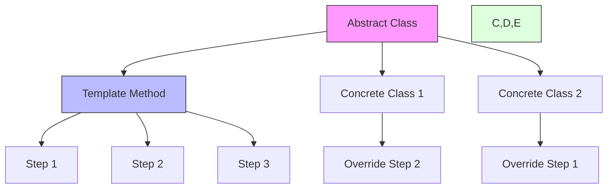

# Template Method Pattern

## Overview

The Template Method pattern is a behavioral design pattern that defines the skeleton of an algorithm in a base class and lets subclasses override specific steps without changing the algorithm's structure. It enables you to reuse code while allowing for variations in certain steps.

### Real-World Analogy
Think of a manufacturing process for different types of vehicles. The basic steps (create frame, install engine, add wheels, paint) remain the same, but the specific details vary for each vehicle type. The Template Method provides the basic sequence while allowing customization of individual steps.



## Key Concepts

### Core Components

1. **Abstract Class**: Defines template method and abstract operations
2. **Concrete Classes**: Implement the abstract operations
3. **Template Method**: Defines the algorithm skeleton
4. **Hook Methods**: Optional steps with default implementations

### Implementation Example
import Tabs from '@theme/Tabs';
import TabItem from '@theme/TabItem';

<Tabs>
  <TabItem value="java" label="Java">
    ```java
    // Abstract Class
    abstract class DataMiner {
        // Template method
        public final void mine(String path) {
            String data = extractData(path);
            String processed = parseData(data);
            String analyzed = analyzeData(processed);
            sendReport(analyzed);
        }

        // Abstract steps
        protected abstract String extractData(String path);
        protected abstract String parseData(String data);

        // Concrete steps
        protected String analyzeData(String data) {
            return "Analyzed: " + data;
        }

        // Hook method
        protected void sendReport(String report) {
            System.out.println(report);
        }
    }

    // Concrete Implementation - CSV
    class CSVDataMiner extends DataMiner {
        @Override
        protected String extractData(String path) {
            System.out.println("Extracting data from CSV: " + path);
            return "CSV data";
        }

        @Override
        protected String parseData(String data) {
            System.out.println("Parsing CSV data");
            return "Parsed " + data;
        }

        @Override
        protected void sendReport(String report) {
            System.out.println("Sending CSV report via email: " + report);
        }
    }

    // Concrete Implementation - PDF
    class PDFDataMiner extends DataMiner {
        @Override
        protected String extractData(String path) {
            System.out.println("Extracting data from PDF: " + path);
            return "PDF data";
        }

        @Override
        protected String parseData(String data) {
            System.out.println("Parsing PDF data");
            return "Parsed " + data;
        }
    }

    // Advanced Template with Hooks
    abstract class AdvancedDataMiner {
        private final List<Consumer<String>> observers = new ArrayList<>();

        public final void mine(String path) {
            beforeExtract(path);
            String data = extractData(path);
            
            if (shouldParse(data)) {
                data = parseData(data);
            }

            if (shouldAnalyze(data)) {
                data = analyzeData(data);
            }

            notifyObservers(data);
            afterAnalysis(data);
            sendReport(data);
        }

        // Hook methods
        protected void beforeExtract(String path) {}
        protected boolean shouldParse(String data) { return true; }
        protected boolean shouldAnalyze(String data) { return true; }
        protected void afterAnalysis(String data) {}

        // Abstract methods
        protected abstract String extractData(String path);
        protected abstract String parseData(String data);
        protected abstract String analyzeData(String data);
        protected abstract void sendReport(String report);

        // Observer support
        public void addObserver(Consumer<String> observer) {
            observers.add(observer);
        }

        private void notifyObservers(String data) {
            observers.forEach(o -> o.accept(data));
        }
    }
    ```
  </TabItem>
  <TabItem value="go" label="Go">
    ```go
    package main

    import (
        "fmt"
        "strings"
    )

    // Abstract class equivalent
    type DataMiner interface {
        Mine(path string)
        ExtractData(path string) string
        ParseData(data string) string
        AnalyzeData(data string) string
        SendReport(report string)
    }

    // Base implementation
    type BaseDataMiner struct {
        DataMiner
    }

    func (b *BaseDataMiner) Mine(path string) {
        data := b.ExtractData(path)
        processed := b.ParseData(data)
        analyzed := b.AnalyzeData(processed)
        b.SendReport(analyzed)
    }

    func (b *BaseDataMiner) AnalyzeData(data string) string {
        return "Analyzed: " + data
    }

    func (b *BaseDataMiner) SendReport(report string) {
        fmt.Println(report)
    }

    // CSV Implementation
    type CSVDataMiner struct {
        BaseDataMiner
    }

    func NewCSVDataMiner() *CSVDataMiner {
        miner := &CSVDataMiner{}
        miner.DataMiner = miner
        return miner
    }

    func (c *CSVDataMiner) ExtractData(path string) string {
        fmt.Printf("Extracting data from CSV: %s\n", path)
        return "CSV data"
    }

    func (c *CSVDataMiner) ParseData(data string) string {
        fmt.Println("Parsing CSV data")
        return "Parsed " + data
    }

    func (c *CSVDataMiner) SendReport(report string) {
        fmt.Printf("Sending CSV report via email: %s\n", report)
    }

    // PDF Implementation
    type PDFDataMiner struct {
        BaseDataMiner
    }

    func NewPDFDataMiner() *PDFDataMiner {
        miner := &PDFDataMiner{}
        miner.DataMiner = miner
        return miner
    }

    func (p *PDFDataMiner) ExtractData(path string) string {
        fmt.Printf("Extracting data from PDF: %s\n", path)
        return "PDF data"
    }

    func (p *PDFDataMiner) ParseData(data string) string {
        fmt.Println("Parsing PDF data")
        return "Parsed " + data
    }

    // Advanced Template with Hooks
    type AdvancedDataMiner struct {
        BaseDataMiner
        observers []func(string)
        hooks    DataMinerHooks
    }

    type DataMinerHooks interface {
        BeforeExtract(path string)
        ShouldParse(data string) bool
        ShouldAnalyze(data string) bool
        AfterAnalysis(data string)
    }

    func NewAdvancedDataMiner(hooks DataMinerHooks) *AdvancedDataMiner {
        return &AdvancedDataMiner{
            observers: make([]func(string), 0),
            hooks:    hooks,
        }
    }

    func (a *AdvancedDataMiner) Mine(path string) {
        a.hooks.BeforeExtract(path)
        data := a.ExtractData(path)

        if a.hooks.ShouldParse(data) {
            data = a.ParseData(data)
        }

        if a.hooks.ShouldAnalyze(data) {
            data = a.AnalyzeData(data)
        }

        a.notifyObservers(data)
        a.hooks.AfterAnalysis(data)
        a.SendReport(data)
    }

    func (a *AdvancedDataMiner) AddObserver(observer func(string)) {
        a.observers = append(a.observers, observer)
    }

    func (a *AdvancedDataMiner) notifyObservers(data string) {
        for _, observer := range a.observers {
            observer(data)
        }
    }
    ```
  </TabItem>
</Tabs>

## Related Patterns

1. **Strategy Pattern**
    - Template Method uses inheritance, Strategy uses composition
    - Template Method is best for fixed algorithms with variable steps
    - Strategy is better for interchangeable algorithms

2. **Factory Method**
    - Often used within Template Methods
    - Creates objects whose exact types are decided by subclasses

3. **Observer Pattern**
    - Can be used to notify about step completion
    - Useful for monitoring template method execution

## Best Practices

### Configuration
1. Make template method final
2. Clearly document which methods must be overridden
3. Use hook methods for optional steps

### Monitoring
1. Log execution of each step
2. Track performance metrics
3. Monitor hook method usage

### Testing
1. Test each concrete implementation
2. Verify hook method behavior
3. Test step sequence

## Common Pitfalls

1. **Breaking Template Method**
    - Solution: Make template method final
    - Document method dependencies

2. **Deep Inheritance Hierarchies**
    - Solution: Use composition when possible
    - Keep inheritance levels shallow

3. **Rigid Structure**
    - Solution: Use hook methods for flexibility
    - Consider strategy pattern for variable algorithms

## Use Cases

### 1. Data Processing Pipelines
- ETL operations
- Data validation
- Report generation

### 2. Document Generation
- Different format handling
- Template processing
- Custom rendering

### 3. Application Initialization
- Startup sequences
- Resource loading
- Configuration setup

## Deep Dive Topics

### Thread Safety

```java
public abstract class ThreadSafeTemplate {
    private final ReentrantLock lock = new ReentrantLock();

    public final void templateMethod() {
        lock.lock();
        try {
            beforeHook();
            step1();
            step2();
            afterHook();
        } finally {
            lock.unlock();
        }
    }

    protected abstract void step1();
    protected abstract void step2();

    // Hook methods with default implementations
    protected void beforeHook() {}
    protected void afterHook() {}
}
```

### Distributed Systems
1. Distributed step execution
2. Step synchronization
3. Failure handling

### Performance Considerations
1. Step caching
2. Lazy execution
3. Resource pooling

## Additional Resources

### References
1. "Design Patterns" by Gang of Four
2. "Clean Code" by Robert C. Martin
3. "Head First Design Patterns" by Freeman et al.

### Tools
1. IDE templates
2. Code generation tools
3. Performance monitoring tools

## FAQ

**Q: When should I use Template Method pattern?**  
A: Use it when you have:
- An algorithm with fixed steps but flexible implementations
- Common code that should be reused across similar classes
- Control over the algorithm structure while allowing customization

**Q: How is it different from Strategy pattern?**  
A: Template Method uses inheritance to vary parts of an algorithm, while Strategy uses composition to vary the entire algorithm.

**Q: Can I have multiple template methods in a class?**  
A: Yes, but keep them focused and related to maintain single responsibility principle.

**Q: Should hook methods be protected or public?**  
A: Generally protected, unless there's a specific need for public access.

**Q: How do I handle optional steps?**  
A: Use hook methods with default implementations that can be overridden when needed.
