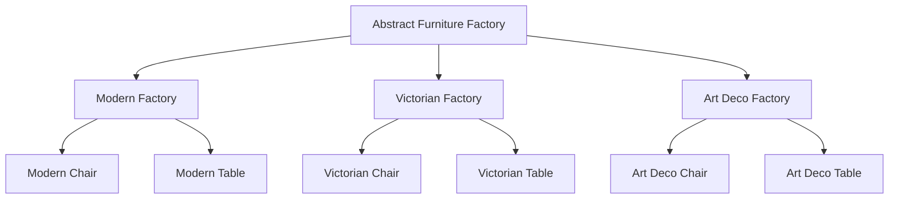

# Abstract Factory Pattern

## Overview

The Abstract Factory pattern is a creational design pattern that provides an interface for creating families of related or dependent objects without specifying their concrete classes. Think of it as a super-factory that creates other factories - hence it's sometimes called a "Factory of factories."

### Real-World Analogy
Imagine a furniture manufacturer that specializes in different styles (Modern, Victorian, Art Deco). Each style has its own collection of furniture (chairs, sofas, tables). The Abstract Factory pattern is like having different furniture factories, where each factory produces complete sets of furniture in a particular style.



## Key Concepts

### Core Components

1. **Abstract Factory**: Declares an interface for operations that create abstract product objects
2. **Concrete Factory**: Implements operations to create concrete product objects
3. **Abstract Product**: Declares an interface for a type of product object
4. **Concrete Product**: Defines a product object to be created by the corresponding concrete factory
5. **Client**: Uses the interfaces declared by Abstract Factory and Abstract Product classes

### Implementation Example

import Tabs from '@theme/Tabs';
import TabItem from '@theme/TabItem';

<Tabs>
  <TabItem value="java" label="Java">
    ```java
    // Abstract Products
    interface Chair {
        void sitOn();
    }

    interface Table {
        void putOn();
    }

    // Concrete Products
    class ModernChair implements Chair {
        @Override
        public void sitOn() {
            System.out.println("Sitting on modern chair");
        }
    }

    class ModernTable implements Table {
        @Override
        public void putOn() {
            System.out.println("Putting on modern table");
        }
    }

    class VictorianChair implements Chair {
        @Override
        public void sitOn() {
            System.out.println("Sitting on victorian chair");
        }
    }

    class VictorianTable implements Table {
        @Override
        public void putOn() {
            System.out.println("Putting on victorian table");
        }
    }

    // Abstract Factory
    interface FurnitureFactory {
        Chair createChair();
        Table createTable();
    }

    // Concrete Factories
    class ModernFurnitureFactory implements FurnitureFactory {
        @Override
        public Chair createChair() {
            return new ModernChair();
        }

        @Override
        public Table createTable() {
            return new ModernTable();
        }
    }

    class VictorianFurnitureFactory implements FurnitureFactory {
        @Override
        public Chair createChair() {
            return new VictorianChair();
        }

        @Override
        public Table createTable() {
            return new VictorianTable();
        }
    }

    // Client code
    public class Client {
        private final FurnitureFactory factory;

        public Client(FurnitureFactory factory) {
            this.factory = factory;
        }

        public void createFurniture() {
            Chair chair = factory.createChair();
            Table table = factory.createTable();
            
            chair.sitOn();
            table.putOn();
        }
    }
    ```
  </TabItem>
  <TabItem value="go" label="Go">
    ```go
    package main

    import "fmt"

    // Abstract Products
    type Chair interface {
        SitOn()
    }

    type Table interface {
        PutOn()
    }

    // Concrete Products
    type ModernChair struct{}

    func (m *ModernChair) SitOn() {
        fmt.Println("Sitting on modern chair")
    }

    type ModernTable struct{}

    func (m *ModernTable) PutOn() {
        fmt.Println("Putting on modern table")
    }

    type VictorianChair struct{}

    func (v *VictorianChair) SitOn() {
        fmt.Println("Sitting on victorian chair")
    }

    type VictorianTable struct{}

    func (v *VictorianTable) PutOn() {
        fmt.Println("Putting on victorian table")
    }

    // Abstract Factory
    type FurnitureFactory interface {
        CreateChair() Chair
        CreateTable() Table
    }

    // Concrete Factories
    type ModernFurnitureFactory struct{}

    func (m *ModernFurnitureFactory) CreateChair() Chair {
        return &ModernChair{}
    }

    func (m *ModernFurnitureFactory) CreateTable() Table {
        return &ModernTable{}
    }

    type VictorianFurnitureFactory struct{}

    func (v *VictorianFurnitureFactory) CreateChair() Chair {
        return &VictorianChair{}
    }

    func (v *VictorianFurnitureFactory) CreateTable() Table {
        return &VictorianTable{}
    }

    // Client
    type Client struct {
        factory FurnitureFactory
    }

    func NewClient(factory FurnitureFactory) *Client {
        return &Client{factory: factory}
    }

    func (c *Client) CreateFurniture() {
        chair := c.factory.CreateChair()
        table := c.factory.CreateTable()

        chair.SitOn()
        table.PutOn()
    }
    ```
  </TabItem>
</Tabs>

## Related Patterns

1. **Factory Method Pattern**
   - Abstract Factory is often implemented using Factory Methods
   - While Factory Method creates one product, Abstract Factory creates families of related products

2. **Singleton Pattern**
   - Abstract Factories are often implemented as Singletons
   - Ensures only one instance of a factory exists

3. **Builder Pattern**
   - Can be used together when creating complex objects
   - Builder focuses on constructing complex objects step by step

## Best Practices

### Configuration
1. Use dependency injection to provide the correct factory
2. Consider using configuration files to determine factory type
3. Implement factory caching for frequently used objects

### Monitoring
1. Add logging to factory creation methods
2. Track object creation metrics
3. Implement health checks for factory operations

### Testing
1. Use mock factories for testing
2. Create test-specific product implementations
3. Implement factory verification methods

## Common Pitfalls

1. **Complexity Overload**
   - Solution: Only use when dealing with families of related objects
   - Keep the number of product types manageable

2. **Tight Coupling**
   - Solution: Use dependency injection
   - Avoid hardcoding factory selections

3. **Extensibility Issues**
   - Solution: Design for extension from the start
   - Use interfaces for maximum flexibility

## Use Cases

### 1. Cross-Platform UI Components
- Different UI factories for Windows, macOS, and Linux
- Ensures consistent look and feel across platforms
- Manages platform-specific implementations

### 2. Database Connectors
- Separate factories for different database types (MySQL, PostgreSQL, MongoDB)
- Handles connection pooling and resource management
- Maintains consistent interface across different databases

### 3. Document Generation
- Factories for different document formats (PDF, DOC, HTML)
- Manages formatting and styling
- Handles different output requirements

## Deep Dive Topics

### Thread Safety

1. **Factory Instance Management**
```java
public class ThreadSafeFactory {
    private static volatile FurnitureFactory instance;
    private static final Object mutex = new Object();

    public static FurnitureFactory getInstance() {
        FurnitureFactory result = instance;
        if (result == null) {
            synchronized (mutex) {
                result = instance;
                if (result == null)
                    instance = result = new ModernFurnitureFactory();
            }
        }
        return result;
    }
}
```

### Distributed Systems
1. Factory registration and discovery
2. Load balancing between factory instances
3. Handling factory failures and failover

### Performance Considerations
1. Object pooling for expensive products
2. Lazy initialization of factories
3. Caching strategies for frequently used products

## Additional Resources

### References
1. "Design Patterns: Elements of Reusable Object-Oriented Software" by Gang of Four
2. "Head First Design Patterns" by Freeman et al.
3. "Clean Code" by Robert C. Martin

### Tools
1. Factory generators for various languages
2. UML diagram tools for pattern visualization
3. Testing frameworks for design patterns

## FAQ

**Q: When should I use Abstract Factory instead of Factory Method?**  
A: Use Abstract Factory when you need to create families of related objects. Use Factory Method when dealing with a single product type.

**Q: How do I handle new product types?**  
A: Add new methods to the abstract factory interface and implement them in all concrete factories. Consider using the Extension Interface pattern for backward compatibility.

**Q: Can Abstract Factory be used with dependency injection?**  
A: Yes, Abstract Factory works well with DI containers. The concrete factory can be injected based on configuration or runtime requirements.

**Q: How do I handle optional products in the factory?**  
A: Consider using the Null Object pattern or Optional return types for products that might not be available in all factories.

**Q: What's the performance impact of using Abstract Factory?**  
A: The pattern itself has minimal overhead. The main considerations are object creation costs and potential memory usage from maintaining multiple factory instances.