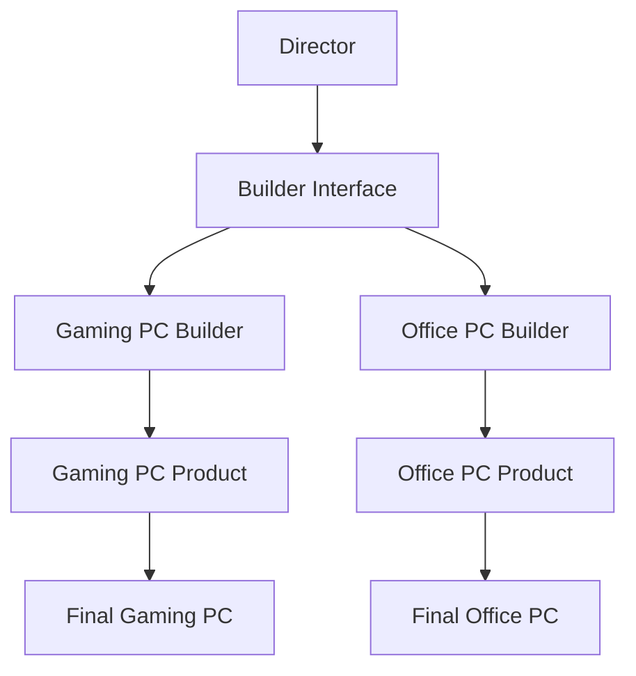

# Builder Pattern

## Overview

The Builder pattern is a creational design pattern that lets you construct complex objects step by step. It's particularly useful when you need to create an object with numerous possible configurations.

### Real-World Analogy
Think of ordering a custom computer. Instead of building the entire computer at once, you specify each component step by step: the processor, memory, storage, graphics card, etc. The computer store (Builder) handles the complex assembly process and delivers the final product according to your specifications.



## Key Concepts

### Core Components

1. **Builder**: Declares the construction steps interface
2. **Concrete Builder**: Provides implementation for construction steps
3. **Product**: The complex object being built
4. **Director**: Controls the building algorithm
5. **Client**: Creates builder instance and passes it to the director

### Implementation Example

import Tabs from '@theme/Tabs';
import TabItem from '@theme/TabItem';

<Tabs>
  <TabItem value="java" label="Java">
    ```java
    // Product
    class Computer {
        private String cpu;
        private String memory;
        private String storage;
        private String gpu;

        public void setCpu(String cpu) { this.cpu = cpu; }
        public void setMemory(String memory) { this.memory = memory; }
        public void setStorage(String storage) { this.storage = storage; }
        public void setGpu(String gpu) { this.gpu = gpu; }

        @Override
        public String toString() {
            return "Computer{" +
                    "cpu='" + cpu + '\'' +
                    ", memory='" + memory + '\'' +
                    ", storage='" + storage + '\'' +
                    ", gpu='" + gpu + '\'' +
                    '}';
        }
    }

    // Builder Interface
    interface ComputerBuilder {
        ComputerBuilder addCPU(String cpu);
        ComputerBuilder addMemory(String memory);
        ComputerBuilder addStorage(String storage);
        ComputerBuilder addGPU(String gpu);
        Computer build();
    }

    // Concrete Builder
    class GamingComputerBuilder implements ComputerBuilder {
        private Computer computer = new Computer();

        @Override
        public ComputerBuilder addCPU(String cpu) {
            computer.setCpu(cpu);
            return this;
        }

        @Override
        public ComputerBuilder addMemory(String memory) {
            computer.setMemory(memory);
            return this;
        }

        @Override
        public ComputerBuilder addStorage(String storage) {
            computer.setStorage(storage);
            return this;
        }

        @Override
        public ComputerBuilder addGPU(String gpu) {
            computer.setGpu(gpu);
            return this;
        }

        @Override
        public Computer build() {
            return computer;
        }
    }

    // Director
    class ComputerAssembler {
        private ComputerBuilder builder;

        public ComputerAssembler(ComputerBuilder builder) {
            this.builder = builder;
        }

        public Computer constructGamingPC() {
            return builder.addCPU("AMD Ryzen 9")
                         .addMemory("32GB DDR4")
                         .addStorage("2TB NVMe SSD")
                         .addGPU("NVIDIA RTX 4080")
                         .build();
        }
    }
    ```
  </TabItem>
  <TabItem value="go" label="Go">
    ```go
    package main

    import "fmt"

    // Product
    type Computer struct {
        cpu     string
        memory  string
        storage string
        gpu     string
    }

    func (c *Computer) String() string {
        return fmt.Sprintf("Computer{cpu='%s', memory='%s', storage='%s', gpu='%s'}", 
            c.cpu, c.memory, c.storage, c.gpu)
    }

    // Builder Interface
    type ComputerBuilder interface {
        AddCPU(cpu string) ComputerBuilder
        AddMemory(memory string) ComputerBuilder
        AddStorage(storage string) ComputerBuilder
        AddGPU(gpu string) ComputerBuilder
        Build() *Computer
    }

    // Concrete Builder
    type GamingComputerBuilder struct {
        computer *Computer
    }

    func NewGamingComputerBuilder() *GamingComputerBuilder {
        return &GamingComputerBuilder{computer: &Computer{}}
    }

    func (b *GamingComputerBuilder) AddCPU(cpu string) ComputerBuilder {
        b.computer.cpu = cpu
        return b
    }

    func (b *GamingComputerBuilder) AddMemory(memory string) ComputerBuilder {
        b.computer.memory = memory
        return b
    }

    func (b *GamingComputerBuilder) AddStorage(storage string) ComputerBuilder {
        b.computer.storage = storage
        return b
    }

    func (b *GamingComputerBuilder) AddGPU(gpu string) ComputerBuilder {
        b.computer.gpu = gpu
        return b
    }

    func (b *GamingComputerBuilder) Build() *Computer {
        return b.computer
    }

    // Director
    type ComputerAssembler struct {
        builder ComputerBuilder
    }

    func NewComputerAssembler(builder ComputerBuilder) *ComputerAssembler {
        return &ComputerAssembler{builder: builder}
    }

    func (a *ComputerAssembler) ConstructGamingPC() *Computer {
        return a.builder.
            AddCPU("AMD Ryzen 9").
            AddMemory("32GB DDR4").
            AddStorage("2TB NVMe SSD").
            AddGPU("NVIDIA RTX 4080").
            Build()
    }
    ```
  </TabItem>
</Tabs>

## Related Patterns

1. **Abstract Factory**
    - Can be used together when creating complex objects
    - Builder focuses on step-by-step construction while Abstract Factory creates families of related objects

2. **Prototype**
    - Can be combined with Builder to create copies of complex objects
    - Builder can use Prototype to create some parts of the product

3. **Composite**
    - Builder often builds objects that follow the Composite pattern
    - Useful for creating complex hierarchical structures

## Best Practices

### Configuration
1. Use method chaining for a fluent interface
2. Implement reasonable defaults for optional parameters
3. Validate parameters at build time

### Monitoring
1. Add logging to track build steps
2. Implement build time metrics
3. Monitor resource usage during construction

### Testing
1. Test each build step independently
2. Verify final product configuration
3. Test error handling and validation

## Common Pitfalls

1. **Mutable Products**
    - Solution: Make product immutable after construction
    - Implement validation in the build() method

2. **Complex Build Process**
    - Solution: Use director class to encapsulate common build sequences
    - Break down complex builds into smaller steps

3. **Inconsistent State**
    - Solution: Implement mandatory parameters in constructor
    - Add state validation before building

## Use Cases

### 1. Document Generation
- Building complex documents (PDF, HTML, etc.)
- Adding different sections and formatting
- Handling different document types

### 2. Query Builder
- Constructing complex SQL queries
- Building REST API requests
- Creating search criteria

### 3. Configuration Objects
- Building application configurations
- Creating complex test fixtures
- Setting up environment variables

## Deep Dive Topics

### Thread Safety

```java
public class ThreadSafeBuilder {
    private final Object lock = new Object();
    private volatile Computer computer;

    public Computer build() {
        synchronized(lock) {
            // Perform thread-safe building
            return computer;
        }
    }
}
```

### Distributed Systems
1. Building distributed configurations
2. Handling partial builds
3. Implementing build recovery

### Performance Considerations
1. Lazy initialization of expensive components
2. Caching commonly used configurations
3. Optimizing build sequence

## Additional Resources

### References
1. "Design Patterns" by Gang of Four
2. "Effective Java" by Joshua Bloch
3. "Clean Code" by Robert C. Martin

### Tools
1. Builder pattern code generators
2. Testing frameworks for builders
3. Performance monitoring tools

## FAQ

**Q: When should I use Builder instead of constructors?**  
A: Use Builder when dealing with many optional parameters or complex object construction processes.

**Q: Do I always need a Director class?**  
A: No, Director is optional and most useful when you have standard ways to construct an object.

**Q: How do I handle required vs optional parameters?**  
A: Required parameters can be passed in the builder constructor, while optional ones can be set through builder methods.

**Q: Can Builder pattern be used with immutable objects?**  
A: Yes, Builder is especially useful for creating immutable objects with many parameters.

**Q: What's the performance impact of using Builder?**  
A: Builder has minimal overhead and can actually improve performance through optimized construction sequences.