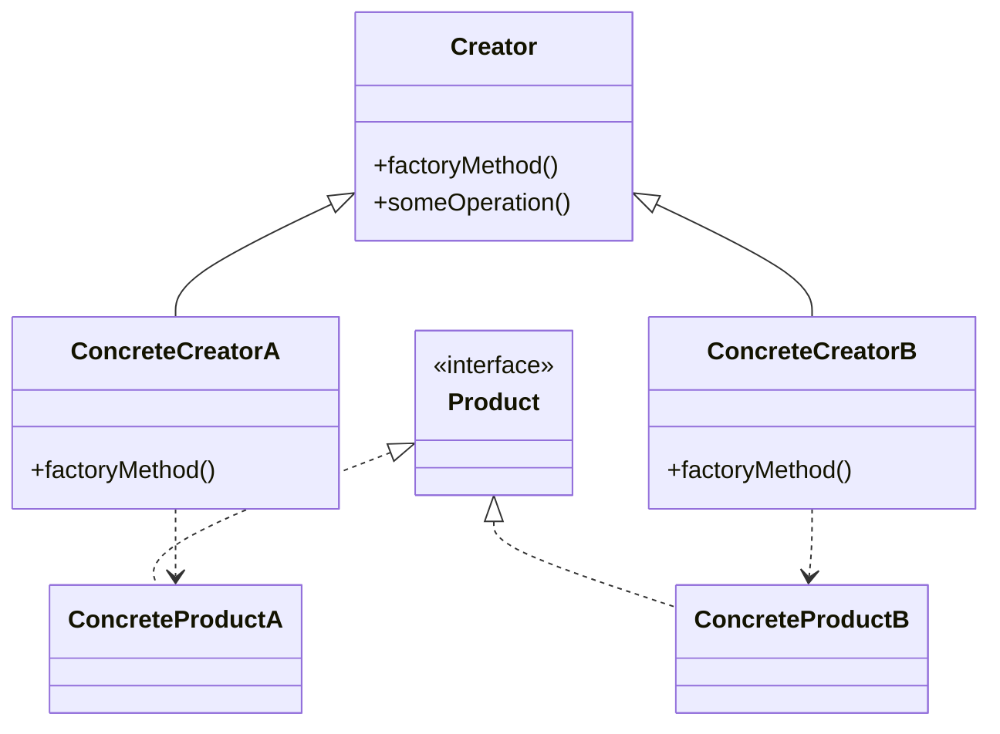

# Factory Method Pattern

## Overview

The Factory Method is a creational design pattern that provides an interface for creating objects but allows subclasses to alter the type of objects that will be created.

### Real-World Analogy
Think of a logistics company that needs to deliver packages. They might use trucks for land delivery and ships for sea delivery. While both are means of transportation, they have different implementations. The logistics company (factory) decides which type of transport to create based on the delivery requirements.

## Key Concepts

### Core Components

1. **Product**: The common interface for all objects that can be produced by the factory
2. **Concrete Products**: Specific implementations of the product interface
3. **Creator**: The abstract class/interface declaring the factory method
4. **Concrete Creators**: Classes that implement the factory method to produce specific products

### Structure


## Implementation

Here's a practical implementation using a document processing system as an example:

import Tabs from '@theme/Tabs';
import TabItem from '@theme/TabItem';

<Tabs>
  <TabItem value="java" label="Java">

```java title="Document.java"
// Product interface
public interface Document {
    void open();
    void save();
}

// Concrete products
public class PDFDocument implements Document {
    @Override
    public void open() {
        System.out.println("Opening PDF document");
    }
    
    @Override
    public void save() {
        System.out.println("Saving PDF document");
    }
}

public class WordDocument implements Document {
    @Override
    public void open() {
        System.out.println("Opening Word document");
    }
    
    @Override
    public void save() {
        System.out.println("Saving Word document");
    }
}

// Creator
public abstract class DocumentCreator {
    abstract Document createDocument();
    
    public void processDocument() {
        Document doc = createDocument();
        doc.open();
        doc.save();
    }
}

// Concrete creators
public class PDFCreator extends DocumentCreator {
    @Override
    Document createDocument() {
        return new PDFDocument();
    }
}

public class WordCreator extends DocumentCreator {
    @Override
    Document createDocument() {
        return new WordDocument();
    }
}
```

  </TabItem>
  <TabItem value="go" label="Go">

```go title="document.go"
// Product interface
type Document interface {
    Open()
    Save()
}

// Concrete products
type PDFDocument struct{}

func (p *PDFDocument) Open() {
    fmt.Println("Opening PDF document")
}

func (p *PDFDocument) Save() {
    fmt.Println("Saving PDF document")
}

type WordDocument struct{}

func (w *WordDocument) Open() {
    fmt.Println("Opening Word document")
}

func (w *WordDocument) Save() {
    fmt.Println("Saving Word document")
}

// Creator interface
type DocumentCreator interface {
    CreateDocument() Document
    ProcessDocument()
}

// Base creator
type BaseDocumentCreator struct{}

func (b *BaseDocumentCreator) ProcessDocument(doc Document) {
    doc.Open()
    doc.Save()
}

// Concrete creators
type PDFCreator struct {
    BaseDocumentCreator
}

func (p *PDFCreator) CreateDocument() Document {
    return &PDFDocument{}
}

type WordCreator struct {
    BaseDocumentCreator
}

func (w *WordCreator) CreateDocument() Document {
    return &WordDocument{}
}
```

  </TabItem>
</Tabs>

## Related Patterns

1. **Abstract Factory**: While Factory Method creates a single type of product, Abstract Factory creates families of related products
2. **Builder**: Used when object construction needs to be separated from its representation
3. **Prototype**: Can be used with Factory Method to create objects by cloning a prototype

## Best Practices

### Configuration
1. Use dependency injection to provide factory implementations
2. Implement factory configuration through external configuration files
3. Consider using factory registries for dynamic factory creation

### Monitoring
1. Add logging to track object creation
2. Implement metrics for factory performance
3. Monitor resource usage in factory implementations

### Testing
1. Create mock factories for testing
2. Test each concrete product implementation
3. Verify factory method behavior with different inputs

## Common Pitfalls

1. **Overuse of the Pattern**
    - Solution: Only use when you need flexibility in object creation

2. **Complex Hierarchies**
    - Solution: Keep the inheritance hierarchy shallow

3. **Tight Coupling**
    - Solution: Use interfaces and dependency injection

## Use Cases

### 1. UI Component Library

<Tabs>
  <TabItem value="java" label="Java">

```java title="UIComponentFactory.java"
public interface UIComponent {
    void render();
}

public class MaterialButton implements UIComponent {
    @Override
    public void render() {
        // Render Material Design button
    }
}

public class iOSButton implements UIComponent {
    @Override
    public void render() {
        // Render iOS style button
    }
}
```

  </TabItem>
  <TabItem value="go" label="Go">

```go title="ui_component.go"
type UIComponent interface {
    Render()
}

type MaterialButton struct{}

func (m *MaterialButton) Render() {
    // Render Material Design button
}

type IOSButton struct{}

func (i *IOSButton) Render() {
    // Render iOS style button
}
```

  </TabItem>
</Tabs>

### 2. Database Connections

<Tabs>
  <TabItem value="java" label="Java">

```java title="DatabaseFactory.java"
public interface DatabaseConnection {
    void connect();
    void query(String sql);
}

public class MySQLConnection implements DatabaseConnection {
    @Override
    public void connect() {
        // MySQL specific connection logic
    }
    
    @Override
    public void query(String sql) {
        // MySQL specific query logic
    }
}

public class PostgreSQLConnection implements DatabaseConnection {
    @Override
    public void connect() {
        // PostgreSQL specific connection logic
    }
    
    @Override
    public void query(String sql) {
        // PostgreSQL specific query logic
    }
}
```

  </TabItem>
  <TabItem value="go" label="Go">

```go title="database.go"
type DatabaseConnection interface {
    Connect()
    Query(sql string)
}

type MySQLConnection struct{}

func (m *MySQLConnection) Connect() {
    // MySQL specific connection logic
}

func (m *MySQLConnection) Query(sql string) {
    // MySQL specific query logic
}

type PostgreSQLConnection struct{}

func (p *PostgreSQLConnection) Connect() {
    // PostgreSQL specific connection logic
}

func (p *PostgreSQLConnection) Query(sql string) {
    // PostgreSQL specific query logic
}
```

  </TabItem>
</Tabs>

### 3. Payment Processing

<Tabs>
  <TabItem value="java" label="Java">

```java title="PaymentFactory.java"
public interface PaymentProcessor {
    void process(double amount);
}

public class CreditCardProcessor implements PaymentProcessor {
    @Override
    public void process(double amount) {
        // Credit card processing logic
    }
}

public class PayPalProcessor implements PaymentProcessor {
    @Override
    public void process(double amount) {
        // PayPal processing logic
    }
}
```

  </TabItem>
  <TabItem value="go" label="Go">

```go title="payment.go"
type PaymentProcessor interface {
    Process(amount float64)
}

type CreditCardProcessor struct{}

func (c *CreditCardProcessor) Process(amount float64) {
    // Credit card processing logic
}

type PayPalProcessor struct{}

func (p *PayPalProcessor) Process(amount float64) {
    // PayPal processing logic
}
```

  </TabItem>
</Tabs>

## Deep Dive Topics

### Thread Safety

1. **Singleton Factories**
    - Use double-checked locking pattern
    - Consider using enum-based singletons
    - Implement thread-safe initialization

2. **Pool Management**
    - Implement thread-safe object pools
    - Use concurrent collections
    - Consider using ThreadLocal for factory instances

### Distributed Systems

1. **Remote Factory Pattern**
    - Implement factory methods over RPC
    - Handle network failures
    - Consider caching factory results

2. **Scalability**
    - Use factory pools
    - Implement load balancing
    - Consider distributed caching

### Performance Considerations

1. **Object Creation**
    - Use object pooling for expensive objects
    - Implement lazy initialization
    - Consider flyweight pattern for shared objects

2. **Caching**
    - Cache frequently created objects
    - Implement cache eviction policies
    - Monitor cache hit rates

## Additional Resources

### References
1. "Design Patterns: Elements of Reusable Object-Oriented Software" - Gang of Four
2. "Head First Design Patterns" - Freeman & Robson
3. "Effective Java" - Joshua Bloch

### Tools
1. IDE Plugins for Design Patterns
2. UML Modeling Tools
3. Code Generation Tools

## FAQs

**Q: When should I use Factory Method instead of Simple Factory?**  
A: Use Factory Method when you need to delegate the instantiation logic to subclasses or when the creation logic might change in the future.

**Q: How does Factory Method support the Open/Closed Principle?**  
A: It allows adding new product types by creating new concrete creators without modifying existing code.

**Q: Can Factory Method be used with dependency injection?**  
A: Yes, factories can be injected as dependencies, making the system more flexible and testable.

**Q: How do I handle factory method failure?**  
A: Implement proper exception handling and consider using the Null Object pattern for default cases.

**Q: What's the difference between Factory Method and Abstract Factory?**  
A: Factory Method creates a single product, while Abstract Factory creates families of related products.