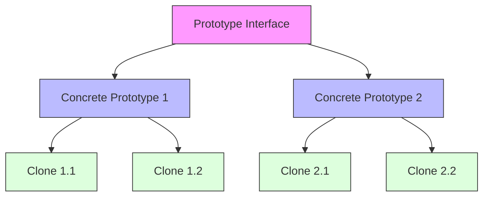

# Prototype Pattern

## Overview

The Prototype pattern is a creational design pattern that lets you copy existing objects without making your code dependent on their classes. It delegates the cloning process to the actual objects that are being cloned.

### Real-World Analogy
Think of biological cell division. When a cell splits, it creates an exact copy of itself. The new cell is independent but contains the same genetic information. Similarly, the Prototype pattern creates new objects by cloning an existing instance - the prototype.



## Key Concepts

### Core Components

1. **Prototype**: Declares the interface for cloning itself
2. **Concrete Prototype**: Implements the cloning operation
3. **Client**: Creates new objects by asking a prototype to clone itself

### Implementation Example

import Tabs from '@theme/Tabs';
import TabItem from '@theme/TabItem';

<Tabs>
  <TabItem value="java" label="Java">
    ```java
    // Prototype Interface
    interface DocumentPrototype extends Cloneable {
        DocumentPrototype clone();
        void customize(String content);
        String getContent();
    }

    // Concrete Prototypes
    class TextDocument implements DocumentPrototype {
        private String content;
        private String formatting;
        private Map<String, String> metadata;

        public TextDocument() {
            this.formatting = "default";
            this.metadata = new HashMap<>();
        }

        @Override
        public DocumentPrototype clone() {
            TextDocument clone = new TextDocument();
            clone.content = this.content;
            clone.formatting = this.formatting;
            clone.metadata = new HashMap<>(this.metadata);
            return clone;
        }

        @Override
        public void customize(String content) {
            this.content = content;
        }

        @Override
        public String getContent() {
            return this.content;
        }

        public void addMetadata(String key, String value) {
            this.metadata.put(key, value);
        }
    }

    // Registry for managing prototypes
    class DocumentRegistry {
        private Map<String, DocumentPrototype> prototypes = new HashMap<>();

        public void addPrototype(String key, DocumentPrototype prototype) {
            prototypes.put(key, prototype);
        }

        public DocumentPrototype createDocument(String key) {
            DocumentPrototype prototype = prototypes.get(key);
            if (prototype == null) {
                throw new IllegalArgumentException("Prototype not found");
            }
            return prototype.clone();
        }
    }

    // Client Usage
    class DocumentManager {
        private DocumentRegistry registry;

        public DocumentManager() {
            registry = new DocumentRegistry();
            // Initialize with some prototypes
            TextDocument baseDocument = new TextDocument();
            baseDocument.addMetadata("type", "text");
            registry.addPrototype("basic", baseDocument);
        }

        public DocumentPrototype createDocument(String type, String content) {
            DocumentPrototype doc = registry.createDocument(type);
            doc.customize(content);
            return doc;
        }
    }
    ```
  </TabItem>
  <TabItem value="go" label="Go">
    ```go
    package main

    import "fmt"

    // Prototype Interface
    type DocumentPrototype interface {
        Clone() DocumentPrototype
        Customize(content string)
        GetContent() string
    }

    // Concrete Prototype
    type TextDocument struct {
        content    string
        formatting string
        metadata   map[string]string
    }

    func NewTextDocument() *TextDocument {
        return &TextDocument{
            formatting: "default",
            metadata:   make(map[string]string),
        }
    }

    func (d *TextDocument) Clone() DocumentPrototype {
        clonedMetadata := make(map[string]string)
        for k, v := range d.metadata {
            clonedMetadata[k] = v
        }

        return &TextDocument{
            content:    d.content,
            formatting: d.formatting,
            metadata:   clonedMetadata,
        }
    }

    func (d *TextDocument) Customize(content string) {
        d.content = content
    }

    func (d *TextDocument) GetContent() string {
        return d.content
    }

    func (d *TextDocument) AddMetadata(key, value string) {
        d.metadata[key] = value
    }

    // Registry for managing prototypes
    type DocumentRegistry struct {
        prototypes map[string]DocumentPrototype
    }

    func NewDocumentRegistry() *DocumentRegistry {
        return &DocumentRegistry{
            prototypes: make(map[string]DocumentPrototype),
        }
    }

    func (r *DocumentRegistry) AddPrototype(key string, prototype DocumentPrototype) {
        r.prototypes[key] = prototype
    }

    func (r *DocumentRegistry) CreateDocument(key string) (DocumentPrototype, error) {
        prototype, exists := r.prototypes[key]
        if !exists {
            return nil, fmt.Errorf("prototype not found")
        }
        return prototype.Clone(), nil
    }

    // Document Manager
    type DocumentManager struct {
        registry *DocumentRegistry
    }

    func NewDocumentManager() *DocumentManager {
        manager := &DocumentManager{
            registry: NewDocumentRegistry(),
        }
        
        // Initialize with some prototypes
        baseDocument := NewTextDocument()
        baseDocument.AddMetadata("type", "text")
        manager.registry.AddPrototype("basic", baseDocument)
        
        return manager
    }

    func (m *DocumentManager) CreateDocument(docType, content string) (DocumentPrototype, error) {
        doc, err := m.registry.CreateDocument(docType)
        if err != nil {
            return nil, err
        }
        doc.Customize(content)
        return doc, nil
    }
    ```
  </TabItem>
</Tabs>

## Related Patterns

1. **Factory Method**
    - Can use Prototype to avoid creating subclasses for every product
    - Prototype acts as an alternative to class-based creation

2. **Abstract Factory**
    - Can use Prototype to implement product variants
    - Useful when product families share similar characteristics

3. **Command**
    - Can use Prototype to store command history
    - Useful for implementing undo/redo functionality

## Best Practices

### Configuration
1. Implement deep cloning when objects contain references
2. Use a registry to manage prototypes
3. Consider serialization for complex object cloning

### Monitoring
1. Track clone operations for performance metrics
2. Monitor memory usage during cloning
3. Log prototype creation and cloning events

### Testing
1. Verify deep cloning functionality
2. Test prototype registry operations
3. Validate clone independence

## Common Pitfalls

1. **Shallow vs Deep Copy**
    - Solution: Implement proper deep copying for nested objects
    - Use serialization for complex object graphs

2. **Circular References**
    - Solution: Implement special handling for circular references
    - Consider using copy constructors

3. **Resource Handling**
    - Solution: Properly manage resources in cloned objects
    - Implement clean-up methods if needed

## Use Cases

### 1. Document Templates
- Creating documents from predefined templates
- Maintaining consistent formatting
- Customizing content while preserving structure

### 2. Game Object Spawning
- Creating multiple instances of game entities
- Applying variations to base objects
- Managing object pools

### 3. Configuration Objects
- Creating variations of base configurations
- Managing environment-specific settings
- Handling feature flags

## Deep Dive Topics

### Thread Safety

```java
public class ThreadSafePrototype {
    private final Object lock = new Object();
    
    @Override
    public Prototype clone() {
        synchronized(lock) {
            // Perform thread-safe cloning
            return deepCopy();
        }
    }
    
    private Prototype deepCopy() {
        // Implementation of deep copy
    }
}
```

### Distributed Systems
1. Handling distributed object cloning
2. Managing prototype synchronization
3. Dealing with network-related issues

### Performance Considerations
1. Implementing efficient deep copy mechanisms
2. Using object pools for frequently cloned objects
3. Optimizing memory usage during cloning

## Additional Resources

### References
1. "Design Patterns" by Gang of Four
2. "Effective Java" by Joshua Bloch
3. "Patterns of Enterprise Application Architecture" by Martin Fowler

### Tools
1. Deep cloning libraries
2. Serialization frameworks
3. Memory profiling tools

## FAQ

**Q: When should I use Prototype instead of constructors?**  
A: Use Prototype when object creation is expensive or complex, or when you need to create variations of objects at runtime.

**Q: How do I handle deep copying of complex objects?**  
A: You can use serialization, implement custom deep copy logic, or use specialized libraries for deep cloning.

**Q: Is Prototype thread-safe by default?**  
A: No, you need to implement thread safety explicitly if the prototype will be used in a multi-threaded environment.

**Q: How does Prototype pattern handle inheritance?**  
A: Cloned objects maintain their concrete type while implementing the prototype interface, preserving the inheritance hierarchy.

**Q: What's the performance impact of using Prototype?**  
A: While cloning is generally faster than creating new objects, deep copying can be resource-intensive for complex objects.