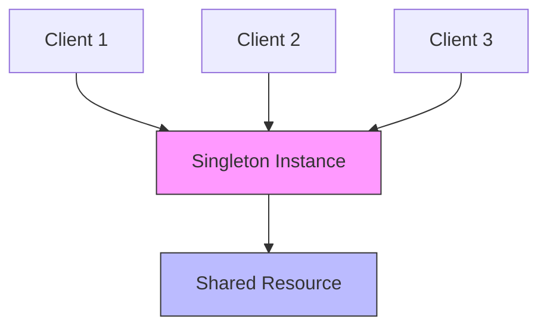

# Singleton Pattern

## Overview

The Singleton pattern is a creational design pattern that ensures a class has only one instance and provides a global point of access to that instance. It's one of the simplest design patterns but also one of the most controversial due to its global state nature.

### Real-World Analogy
Think of a country's government - there can only be one official government at a time, and that government maintains control over its resources and responsibilities. Similarly, a Singleton manages exclusive control over its resources and ensures system-wide coordination.



## Key Concepts

### Core Components

1. **Private Constructor**: Prevents direct construction
2. **Private Static Instance**: Holds the single instance
3. **Public Static Access Method**: Provides access to the instance
4. **Thread Safety Mechanism**: Ensures single instance in concurrent environments

### Implementation Example

import Tabs from '@theme/Tabs';
import TabItem from '@theme/TabItem';

<Tabs>
  <TabItem value="java" label="Java">
    ```java
    // Basic Singleton (Not Thread Safe)
    public class BasicSingleton {
        private static BasicSingleton instance;

        private BasicSingleton() {}
        
        public static BasicSingleton getInstance() {
            if (instance == null) {
                instance = new BasicSingleton();
            }
            return instance;
        }
    }

    // Thread-Safe Singleton with Double-Checked Locking
    public class ThreadSafeSingleton {
        private static volatile ThreadSafeSingleton instance;
        private static final Object lock = new Object();
        
        private ThreadSafeSingleton() {
            // Prevent reflection instantiation
            if (instance != null) {
                throw new IllegalStateException("Already initialized");
            }
        }
        
        public static ThreadSafeSingleton getInstance() {
            ThreadSafeSingleton result = instance;
            if (result == null) {
                synchronized (lock) {
                    result = instance;
                    if (result == null) {
                        instance = result = new ThreadSafeSingleton();
                    }
                }
            }
            return result;
        }
    }

    // Enum Singleton (Best Practice in Java)
    public enum EnumSingleton {
        INSTANCE;
        
        private final ConnectionPool pool;
        
        EnumSingleton() {
            pool = new ConnectionPool();
        }
        
        public ConnectionPool getPool() {
            return pool;
        }
        
        public void executeTask() {
            // Singleton behavior
        }
    }

    // Initialization-on-demand holder idiom
    public class HolderSingleton {
        private HolderSingleton() {}
        
        private static class Holder {
            static final HolderSingleton INSTANCE = new HolderSingleton();
        }
        
        public static HolderSingleton getInstance() {
            return Holder.INSTANCE;
        }
    }
    ```
  </TabItem>
  <TabItem value="go" label="Go">
    ```go
    package main

    import (
        "sync"
        "sync/atomic"
    )

    // Basic Singleton with sync.Once
    type Singleton struct {
        data string
    }

    var (
        instance *Singleton
        once     sync.Once
    )

    func GetInstance() *Singleton {
        once.Do(func() {
            instance = &Singleton{data: "Singleton data"}
        })
        return instance
    }

    // Thread-Safe Singleton with atomic.Value
    type AtomicSingleton struct {
        value atomic.Value
    }

    var atomicInstance AtomicSingleton

    func init() {
        atomicInstance.value.Store(&Singleton{data: "Atomic Singleton data"})
    }

    func GetAtomicInstance() *Singleton {
        return atomicInstance.value.Load().(*Singleton)
    }

    // Singleton with lazy initialization and mutex
    type LazySingleton struct {
        data string
    }

    var (
        lazyInstance *LazySingleton
        mutex       sync.Mutex
    )

    func GetLazyInstance() *LazySingleton {
        if lazyInstance == nil {
            mutex.Lock()
            defer mutex.Unlock()
            if lazyInstance == nil {
                lazyInstance = &LazySingleton{data: "Lazy Singleton data"}
            }
        }
        return lazyInstance
    }
    ```
  </TabItem>
</Tabs>

## Related Patterns

1. **Factory Method**
    - Singleton often used to implement factories
    - Provides controlled access to object creation

2. **Abstract Factory**
    - Can use Singleton to ensure single factory instance
    - Manages product family creation

3. **Builder**
    - Can use Singleton for director class
    - Ensures consistent object construction

## Best Practices

### Configuration
1. Use lazy initialization when possible
2. Implement proper serialization handling
3. Protect against reflection attacks

### Monitoring
1. Add logging for instance creation
2. Monitor resource usage
3. Track access patterns

### Testing
1. Use dependency injection for better testability
2. Implement reset functionality for tests
3. Consider test-specific singletons

## Common Pitfalls

1. **Global State**
    - Solution: Minimize mutable state
    - Use dependency injection when possible

2. **Thread Safety Issues**
    - Solution: Use thread-safe implementation
    - Consider using enum singleton in Java

3. **Testing Difficulties**
    - Solution: Implement reset mechanism
    - Use interfaces for better mockability

## Use Cases

### 1. Database Connection Pools
- Managing shared database connections
- Controlling resource allocation
- Ensuring consistent access patterns

### 2. Configuration Management
- Storing application settings
- Managing environment variables
- Handling feature flags

### 3. Logger Implementation
- Centralizing logging operations
- Managing log levels
- Controlling output streams

## Deep Dive Topics

### Thread Safety

```java
public class ThreadSafeSingletonExample {
    private static class LazyHolder {
        private static final ThreadSafeSingletonExample INSTANCE = 
            new ThreadSafeSingletonExample();
    }

    private ThreadSafeSingletonExample() {
        if (LazyHolder.INSTANCE != null) {
            throw new IllegalStateException("Already initialized");
        }
    }

    public static ThreadSafeSingletonExample getInstance() {
        return LazyHolder.INSTANCE;
    }
}
```

### Distributed Systems
1. Clustering considerations
2. Cache coherence
3. Distributed locking mechanisms

### Performance Considerations
1. Lazy vs eager initialization
2. Memory impact
3. Synchronization overhead

## Additional Resources

### References
1. "Design Patterns" by Gang of Four
2. "Effective Java" by Joshua Bloch
3. "Java Concurrency in Practice" by Brian Goetz

### Tools
1. Static code analyzers
2. Performance monitoring tools
3. Thread analysis tools

## FAQ

**Q: When should I use Singleton?**  
A: Use Singleton when you need exactly one instance of a class, and it must be accessible from a global point. Common examples include configuration managers and connection pools.

**Q: How do I make Singleton thread-safe?**  
A: Use thread-safe implementations like double-checked locking, initialization-on-demand holder idiom, or enum singleton in Java. In Go, use sync.Once or atomic.Value.

**Q: How do I test code that uses Singleton?**  
A: Use dependency injection, interfaces, and implement reset functionality for tests. Consider using test-specific singleton implementations.

**Q: Is Singleton an anti-pattern?**  
A: While often criticized for introducing global state, Singleton can be appropriate when used judiciously for managing shared resources or ensuring coordination.

**Q: How do I handle Singleton in a microservices architecture?**  
A: Consider using distributed caching, configuration services, or moving to a more appropriate pattern like dependency injection.