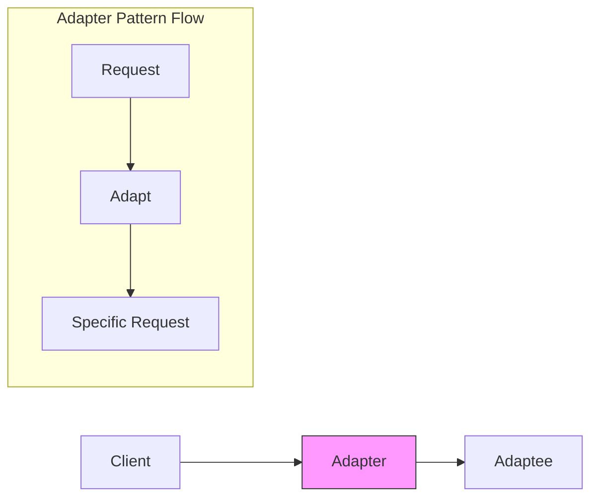

# Adapter Pattern

## Overview

The Adapter pattern is a structural design pattern that allows objects with incompatible interfaces to collaborate. It acts as a wrapper between two objects, catching calls for one object and transforming them to format and interface recognizable by the second object.

### Real-World Analogy
Think of a power adapter for international travel. When you travel from the US to Europe, you need an adapter to plug your US devices into European power outlets. The adapter provides a different interface that allows your device to work with the foreign socket. The adapter pattern works similarly in software, translating one interface into another.



## Key Concepts

### Core Components

1. **Target**: The interface that the client wants to use
2. **Adapter**: Implements the target interface and wraps the adaptee
3. **Adaptee**: The class that needs adapting
4. **Client**: Collaborates with objects conforming to the Target interface

### Implementation Example
import Tabs from '@theme/Tabs';
import TabItem from '@theme/TabItem';

<Tabs>
  <TabItem value="java" label="Java">
    ```java
    // Target Interface
    interface MediaPlayer {
        void play(String audioType, String fileName);
    }

    // Adaptee Interface
    interface AdvancedMediaPlayer {
        void playMp4(String fileName);
        void playVlc(String fileName);
    }

    // Concrete Adaptee
    class VlcPlayer implements AdvancedMediaPlayer {
        @Override
        public void playMp4(String fileName) {
            // do nothing
        }

        @Override
        public void playVlc(String fileName) {
            System.out.println("Playing vlc file: " + fileName);
        }
    }

    class Mp4Player implements AdvancedMediaPlayer {
        @Override
        public void playMp4(String fileName) {
            System.out.println("Playing mp4 file: " + fileName);
        }

        @Override
        public void playVlc(String fileName) {
            // do nothing
        }
    }

    // Adapter
    class MediaAdapter implements MediaPlayer {
        private AdvancedMediaPlayer advancedMusicPlayer;

        public MediaAdapter(String audioType) {
            if (audioType.equalsIgnoreCase("vlc")) {
                advancedMusicPlayer = new VlcPlayer();
            } else if (audioType.equalsIgnoreCase("mp4")) {
                advancedMusicPlayer = new Mp4Player();
            }
        }

        @Override
        public void play(String audioType, String fileName) {
            if (audioType.equalsIgnoreCase("vlc")) {
                advancedMusicPlayer.playVlc(fileName);
            } else if (audioType.equalsIgnoreCase("mp4")) {
                advancedMusicPlayer.playMp4(fileName);
            }
        }
    }

    // Client
    class AudioPlayer implements MediaPlayer {
        private MediaAdapter mediaAdapter;

        @Override
        public void play(String audioType, String fileName) {
            // Built-in support for mp3 music files
            if (audioType.equalsIgnoreCase("mp3")) {
                System.out.println("Playing mp3 file: " + fileName);
            }
            // MediaAdapter provides support for other formats
            else if (audioType.equalsIgnoreCase("vlc") || 
                     audioType.equalsIgnoreCase("mp4")) {
                mediaAdapter = new MediaAdapter(audioType);
                mediaAdapter.play(audioType, fileName);
            } else {
                System.out.println("Invalid media type: " + audioType);
            }
        }
    }
    ```
  </TabItem>
  <TabItem value="go" label="Go">
    ```go
    package main

    import "fmt"

    // Target Interface
    type MediaPlayer interface {
        Play(audioType, fileName string)
    }

    // Adaptee Interface
    type AdvancedMediaPlayer interface {
        PlayMp4(fileName string)
        PlayVlc(fileName string)
    }

    // Concrete Adaptee
    type VlcPlayer struct{}

    func (v *VlcPlayer) PlayMp4(fileName string) {
        // do nothing
    }

    func (v *VlcPlayer) PlayVlc(fileName string) {
        fmt.Printf("Playing vlc file: %s\n", fileName)
    }

    type Mp4Player struct{}

    func (m *Mp4Player) PlayMp4(fileName string) {
        fmt.Printf("Playing mp4 file: %s\n", fileName)
    }

    func (m *Mp4Player) PlayVlc(fileName string) {
        // do nothing
    }

    // Adapter
    type MediaAdapter struct {
        advancedMusicPlayer AdvancedMediaPlayer
    }

    func NewMediaAdapter(audioType string) *MediaAdapter {
        adapter := &MediaAdapter{}
        
        if audioType == "vlc" {
            adapter.advancedMusicPlayer = &VlcPlayer{}
        } else if audioType == "mp4" {
            adapter.advancedMusicPlayer = &Mp4Player{}
        }
        
        return adapter
    }

    func (m *MediaAdapter) Play(audioType, fileName string) {
        if audioType == "vlc" {
            m.advancedMusicPlayer.PlayVlc(fileName)
        } else if audioType == "mp4" {
            m.advancedMusicPlayer.PlayMp4(fileName)
        }
    }

    // Client
    type AudioPlayer struct {
        mediaAdapter *MediaAdapter
    }

    func (a *AudioPlayer) Play(audioType, fileName string) {
        // Built-in support for mp3 music files
        if audioType == "mp3" {
            fmt.Printf("Playing mp3 file: %s\n", fileName)
        } else if audioType == "vlc" || audioType == "mp4" {
            a.mediaAdapter = NewMediaAdapter(audioType)
            a.mediaAdapter.Play(audioType, fileName)
        } else {
            fmt.Printf("Invalid media type: %s\n", audioType)
        }
    }
    ```
  </TabItem>
</Tabs>

## Related Patterns

1. **Bridge Pattern**
    - Similar structure but different intent
    - Bridge prevents a permanent binding between an abstraction and its implementation

2. **Decorator Pattern**
    - Both wrap objects but with different purposes
    - Decorator adds responsibilities while Adapter changes interface

3. **Proxy Pattern**
    - Similar to Adapter but provides the same interface
    - Controls access rather than translating between interfaces

## Best Practices

### Configuration
1. Use composition over inheritance
2. Keep adapters simple and focused
3. Consider using interfaces for flexibility

### Monitoring
1. Log adapter method calls
2. Track performance metrics
3. Monitor error rates

### Testing
1. Test both adapter and adaptee
2. Mock external dependencies
3. Verify interface compliance

## Common Pitfalls

1. **Complex Adaptation**
    - Solution: Break down complex adaptations into smaller steps
    - Use multiple adapters if necessary

2. **Performance Overhead**
    - Solution: Cache adapted objects
    - Minimize unnecessary conversions

3. **Two-Way Adaptation**
    - Solution: Create separate adapters for each direction
    - Consider using the Bridge pattern instead

## Use Cases

### 1. Legacy System Integration
- Adapting old system interfaces to new code
- Converting data formats
- Maintaining backward compatibility

### 2. Third-Party Library Integration
- Wrapping external libraries
- Standardizing interfaces across different providers
- Isolating dependency changes

### 3. Data Format Conversion
- Converting between different data formats (XML to JSON)
- Transforming database results
- API response adaptation

## Deep Dive Topics

### Thread Safety

```java
public class ThreadSafeAdapter {
    private final Object lock = new Object();
    private final Map<String, Object> cache = new ConcurrentHashMap<>();
    
    public Object adapt(Object source) {
        synchronized(lock) {
            String key = createCacheKey(source);
            return cache.computeIfAbsent(key, k -> performAdaptation(source));
        }
    }
}
```

### Distributed Systems
1. Handling network protocols
2. Managing different data serialization formats
3. Dealing with service versioning

### Performance Considerations
1. Caching adapted objects
2. Lazy adaptation strategies
3. Batch processing optimizations

## Additional Resources

### References
1. "Design Patterns" by Gang of Four
2. "Head First Design Patterns" by Freeman & Freeman
3. "Patterns of Enterprise Application Architecture" by Martin Fowler

### Tools
1. Adapter code generators
2. Interface analysis tools
3. Performance monitoring frameworks

## FAQ

**Q: When should I use the Adapter pattern?**  
A: Use it when you need to make incompatible interfaces work together, especially when integrating new code with legacy systems or third-party libraries.

**Q: What's the difference between Class and Object Adapter patterns?**  
A: Class Adapter uses multiple inheritance (where available), while Object Adapter uses composition. Object Adapter is generally preferred as it's more flexible.

**Q: How do I handle multiple adaptations?**  
A: You can either create separate adapters for each case or use a Facade pattern in combination with multiple adapters.

**Q: Can Adapter pattern impact performance?**  
A: Yes, it can add overhead. Minimize this by caching adapted objects and avoiding unnecessary adaptations.

**Q: How do I test Adapter implementations?**  
A: Test both the adapter's interface compliance and the correctness of the adaptation. Use mocks for external dependencies.