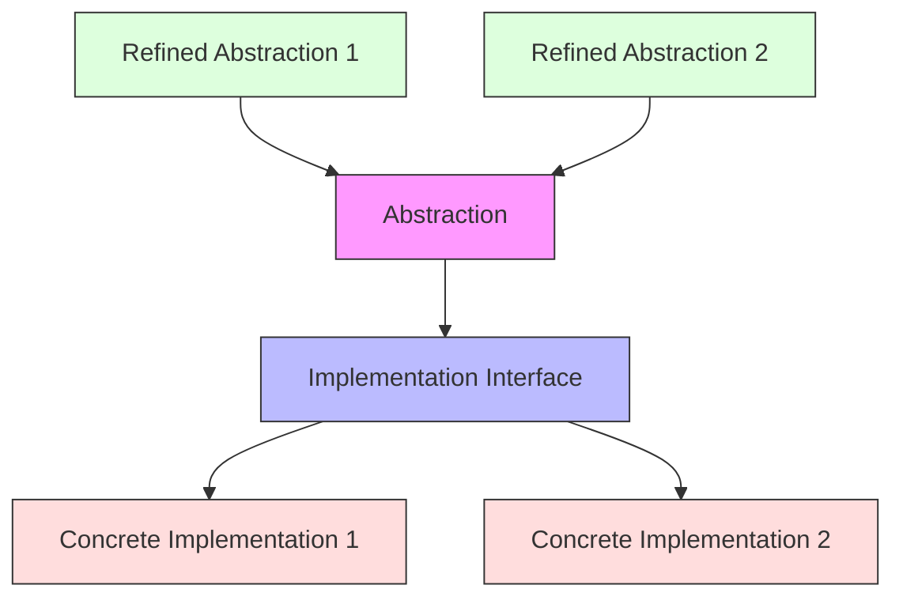

# Bridge Pattern

## Overview

The Bridge pattern is a structural design pattern that splits a large class or a set of closely related classes into two separate hierarchies—abstraction and implementation—which can be developed independently of each other. This pattern decouples an abstraction from its implementation so that the two can vary independently.

### Real-World Analogy
Think of a remote control (abstraction) and a TV (implementation). You can change the TV's brand without changing how you use the remote control. Similarly, you can upgrade the remote control without affecting the TV's functionality. The remote control "bridges" to the TV through a common interface.



## Key Concepts

### Core Components

1. **Abstraction**: Defines the abstract interface and maintains a reference to the implementation
2. **Refined Abstraction**: Extends the abstraction with additional features
3. **Implementation**: Defines the interface for implementation classes
4. **Concrete Implementation**: Implements the implementation interface

### Implementation Example
import Tabs from '@theme/Tabs';
import TabItem from '@theme/TabItem';


<Tabs>
  <TabItem value="java" label="Java">
    ```java
    // Implementation Interface
    interface Device {
        boolean isEnabled();
        void enable();
        void disable();
        int getVolume();
        void setVolume(int volume);
        int getChannel();
        void setChannel(int channel);
    }

    // Concrete Implementations
    class TV implements Device {
        private boolean on = false;
        private int volume = 30;
        private int channel = 1;

        @Override
        public boolean isEnabled() {
            return on;
        }

        @Override
        public void enable() {
            on = true;
        }

        @Override
        public void disable() {
            on = false;
        }

        @Override
        public int getVolume() {
            return volume;
        }

        @Override
        public void setVolume(int volume) {
            if (volume > 100) {
                this.volume = 100;
            } else if (volume < 0) {
                this.volume = 0;
            } else {
                this.volume = volume;
            }
        }

        @Override
        public int getChannel() {
            return channel;
        }

        @Override
        public void setChannel(int channel) {
            this.channel = channel;
        }
    }

    class Radio implements Device {
        private boolean on = false;
        private int volume = 30;
        private int channel = 1;

        // Similar implementation as TV
        // ... (implement all methods)
    }

    // Abstraction
    abstract class RemoteControl {
        protected Device device;

        public RemoteControl(Device device) {
            this.device = device;
        }

        public void togglePower() {
            if (device.isEnabled()) {
                device.disable();
            } else {
                device.enable();
            }
        }

        public void volumeDown() {
            device.setVolume(device.getVolume() - 10);
        }

        public void volumeUp() {
            device.setVolume(device.getVolume() + 10);
        }

        public void channelDown() {
            device.setChannel(device.getChannel() - 1);
        }

        public void channelUp() {
            device.setChannel(device.getChannel() + 1);
        }
    }

    // Refined Abstraction
    class AdvancedRemoteControl extends RemoteControl {
        public AdvancedRemoteControl(Device device) {
            super(device);
        }

        public void mute() {
            device.setVolume(0);
        }

        public void jumpToChannel(int channel) {
            device.setChannel(channel);
        }
    }
    ```
  </TabItem>
  <TabItem value="go" label="Go">
    ```go
    package main

    // Implementation Interface
    type Device interface {
        IsEnabled() bool
        Enable()
        Disable()
        GetVolume() int
        SetVolume(volume int)
        GetChannel() int
        SetChannel(channel int)
    }

    // Concrete Implementation
    type TV struct {
        on      bool
        volume  int
        channel int
    }

    func NewTV() *TV {
        return &TV{
            volume:  30,
            channel: 1,
        }
    }

    func (t *TV) IsEnabled() bool {
        return t.on
    }

    func (t *TV) Enable() {
        t.on = true
    }

    func (t *TV) Disable() {
        t.on = false
    }

    func (t *TV) GetVolume() int {
        return t.volume
    }

    func (t *TV) SetVolume(volume int) {
        if volume > 100 {
            t.volume = 100
        } else if volume < 0 {
            t.volume = 0
        } else {
            t.volume = volume
        }
    }

    func (t *TV) GetChannel() int {
        return t.channel
    }

    func (t *TV) SetChannel(channel int) {
        t.channel = channel
    }

    // Abstraction
    type RemoteControl struct {
        device Device
    }

    func NewRemoteControl(device Device) *RemoteControl {
        return &RemoteControl{device: device}
    }

    func (r *RemoteControl) TogglePower() {
        if r.device.IsEnabled() {
            r.device.Disable()
        } else {
            r.device.Enable()
        }
    }

    func (r *RemoteControl) VolumeDown() {
        r.device.SetVolume(r.device.GetVolume() - 10)
    }

    func (r *RemoteControl) VolumeUp() {
        r.device.SetVolume(r.device.GetVolume() + 10)
    }

    func (r *RemoteControl) ChannelDown() {
        r.device.SetChannel(r.device.GetChannel() - 1)
    }

    func (r *RemoteControl) ChannelUp() {
        r.device.SetChannel(r.device.GetChannel() + 1)
    }

    // Refined Abstraction
    type AdvancedRemoteControl struct {
        RemoteControl
    }

    func NewAdvancedRemoteControl(device Device) *AdvancedRemoteControl {
        return &AdvancedRemoteControl{
            RemoteControl: RemoteControl{device: device},
        }
    }

    func (a *AdvancedRemoteControl) Mute() {
        a.device.SetVolume(0)
    }

    func (a *AdvancedRemoteControl) JumpToChannel(channel int) {
        a.device.SetChannel(channel)
    }
    ```
  </TabItem>
</Tabs>

## Related Patterns

1. **Abstract Factory**
    - Can be used to create related objects in a bridge implementation
    - Helps manage creation of different implementations

2. **Adapter Pattern**
    - Bridge prevents permanent binding while Adapter makes incompatible interfaces work together
    - Can be used together when adapting multiple implementations

3. **State Pattern**
    - Can use Bridge to share common state handling code
    - Helps manage different states across implementations

## Best Practices

### Configuration
1. Define clear interfaces for both abstraction and implementation
2. Keep the interfaces minimal and focused
3. Use dependency injection for implementation selection

### Monitoring
1. Log state changes in both abstraction and implementation
2. Track performance metrics across the bridge
3. Monitor error conditions and edge cases

### Testing
1. Test abstraction and implementation independently
2. Create mock implementations for testing
3. Verify interface compliance

## Common Pitfalls

1. **Interface Bloat**
    - Solution: Keep interfaces focused and minimal
    - Split large interfaces into smaller ones

2. **Implementation Leakage**
    - Solution: Maintain strict separation between abstraction and implementation
    - Avoid exposing implementation details

3. **Complex Initialization**
    - Solution: Use factories or dependency injection
    - Implement builder pattern for complex setup

## Use Cases

### 1. GUI Frameworks
- Different rendering engines
- Platform-specific implementations
- Custom widget implementations

### 2. Persistence Layer
- Multiple database implementations
- Different storage mechanisms
- Cache implementations

### 3. Device Drivers
- Hardware abstraction layer
- Multiple device support
- Cross-platform compatibility

## Deep Dive Topics

### Thread Safety

```java
public class ThreadSafeBridge {
    private final Object lock = new Object();
    private volatile Implementation impl;
    
    public void operation() {
        synchronized(lock) {
            impl.operationImpl();
        }
    }
}
```

### Distributed Systems
1. Network protocol implementations
2. Service discovery
3. Load balancing strategies

### Performance Considerations
1. Implementation caching
2. Lazy loading strategies
3. Resource management

## Additional Resources

### References
1. "Design Patterns" by Gang of Four
2. "Head First Design Patterns" by Freeman et al.
3. "Pattern-Oriented Software Architecture" by Buschmann et al.

### Tools
1. UML modeling tools
2. Static code analyzers
3. Performance profiling tools

## FAQ

**Q: When should I use the Bridge pattern?**  
A: Use Bridge when you need to separate an abstraction from its implementation, especially when both need to vary independently.

**Q: How is Bridge different from Adapter?**  
A: Bridge is designed up-front to let abstraction and implementation vary independently, while Adapter makes unrelated classes work together.

**Q: Can Bridge pattern affect performance?**  
A: There's a small overhead due to the extra level of indirection, but it's usually negligible compared to the flexibility gained.

**Q: How do I handle error conditions across the bridge?**  
A: Define error handling in the implementation interface and propagate errors through the abstraction layer appropriately.

**Q: Can I have multiple implementations at runtime?**  
A: Yes, you can switch implementations at runtime as long as they implement the correct interface.