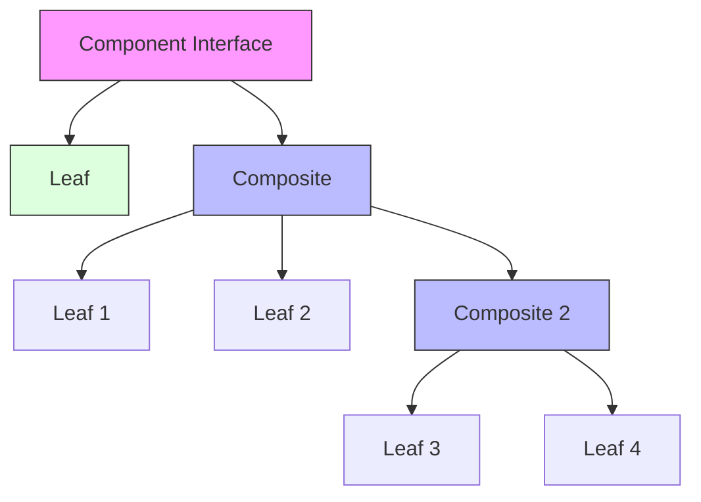

# Composite Pattern

## Overview

The Composite pattern is a structural design pattern that lets you compose objects into tree structures to represent part-whole hierarchies. Using this pattern, clients can treat individual objects and compositions of objects uniformly.

### Real-World Analogy
Think of an organization's employee hierarchy. An organization has employees (leaf nodes) and departments (composites). Each department can contain employees and other departments. Both employees and departments can perform work, but a department delegates work to its members. The client can interact with both individual employees and entire departments through the same interface.



## Key Concepts

### Core Components

1. **Component**: Declares interface for objects in composition
2. **Leaf**: Represents end objects of composition
3. **Composite**: Stores child components and implements child-related operations
4. **Client**: Works with elements through component interface

### Implementation Example
import Tabs from '@theme/Tabs';
import TabItem from '@theme/TabItem';

<Tabs>
  <TabItem value="java" label="Java">
    ```java
    // Component Interface
    interface FileSystemComponent {
        void ls();
        int getSize();
        void add(FileSystemComponent component);
        void remove(FileSystemComponent component);
    }

    // Leaf
    class File implements FileSystemComponent {
        private String name;
        private int size;

        public File(String name, int size) {
            this.name = name;
            this.size = size;
        }

        @Override
        public void ls() {
            System.out.println(String.format("File: %s [%d bytes]", name, size));
        }

        @Override
        public int getSize() {
            return size;
        }

        @Override
        public void add(FileSystemComponent component) {
            throw new UnsupportedOperationException();
        }

        @Override
        public void remove(FileSystemComponent component) {
            throw new UnsupportedOperationException();
        }
    }

    // Composite
    class Directory implements FileSystemComponent {
        private String name;
        private List<FileSystemComponent> children = new ArrayList<>();

        public Directory(String name) {
            this.name = name;
        }

        @Override
        public void ls() {
            System.out.println(String.format("Directory: %s [%d bytes]", name, getSize()));
            for (FileSystemComponent component : children) {
                component.ls();
            }
        }

        @Override
        public int getSize() {
            int totalSize = 0;
            for (FileSystemComponent component : children) {
                totalSize += component.getSize();
            }
            return totalSize;
        }

        @Override
        public void add(FileSystemComponent component) {
            children.add(component);
        }

        @Override
        public void remove(FileSystemComponent component) {
            children.remove(component);
        }
    }

    // Client usage
    class FileSystemClient {
        public static void main(String[] args) {
            Directory root = new Directory("root");
            Directory home = new Directory("home");
            Directory documents = new Directory("documents");
            
            File file1 = new File("file1.txt", 100);
            File file2 = new File("file2.txt", 200);
            
            root.add(home);
            home.add(documents);
            documents.add(file1);
            documents.add(file2);
            
            root.ls();  // Will display entire hierarchy
        }
    }
    ```
  </TabItem>
  <TabItem value="go" label="Go">
    ```go
    package main

    import "fmt"

    // Component Interface
    type FileSystemComponent interface {
        Ls()
        GetSize() int
        Add(FileSystemComponent)
        Remove(FileSystemComponent)
    }

    // Leaf
    type File struct {
        name string
        size int
    }

    func NewFile(name string, size int) *File {
        return &File{name: name, size: size}
    }

    func (f *File) Ls() {
        fmt.Printf("File: %s [%d bytes]\n", f.name, f.size)
    }

    func (f *File) GetSize() int {
        return f.size
    }

    func (f *File) Add(component FileSystemComponent) {
        panic("Cannot add to a file")
    }

    func (f *File) Remove(component FileSystemComponent) {
        panic("Cannot remove from a file")
    }

    // Composite
    type Directory struct {
        name     string
        children []FileSystemComponent
    }

    func NewDirectory(name string) *Directory {
        return &Directory{
            name:     name,
            children: make([]FileSystemComponent, 0),
        }
    }

    func (d *Directory) Ls() {
        fmt.Printf("Directory: %s [%d bytes]\n", d.name, d.GetSize())
        for _, child := range d.children {
            child.Ls()
        }
    }

    func (d *Directory) GetSize() int {
        totalSize := 0
        for _, child := range d.children {
            totalSize += child.GetSize()
        }
        return totalSize
    }

    func (d *Directory) Add(component FileSystemComponent) {
        d.children = append(d.children, component)
    }

    func (d *Directory) Remove(component FileSystemComponent) {
        for i, child := range d.children {
            if child == component {
                d.children = append(d.children[:i], d.children[i+1:]...)
                break
            }
        }
    }

    // Client usage
    func main() {
        root := NewDirectory("root")
        home := NewDirectory("home")
        documents := NewDirectory("documents")
        
        file1 := NewFile("file1.txt", 100)
        file2 := NewFile("file2.txt", 200)
        
        root.Add(home)
        home.Add(documents)
        documents.Add(file1)
        documents.Add(file2)
        
        root.Ls()  // Will display entire hierarchy
    }
    ```
  </TabItem>
</Tabs>

## Related Patterns

1. **Iterator Pattern**
    - Used to traverse composite structures
    - Provides uniform way to access elements

2. **Visitor Pattern**
    - Can be used to perform operations on elements of a composite
    - Helps add new operations without changing classes

3. **Decorator Pattern**
    - Can be used to extend behavior of components
    - Works well with composites for adding features

## Best Practices

### Configuration
1. Define clear component interface
2. Implement safe type checking
3. Consider caching composite results

### Monitoring
1. Track hierarchy depth
2. Monitor performance metrics
3. Log structural changes

### Testing
1. Test both leaf and composite objects
2. Verify hierarchy operations
3. Test edge cases and error conditions

## Common Pitfalls

1. **Deep Hierarchies**
    - Solution: Implement depth limits
    - Consider flattening where possible

2. **Type Safety**
    - Solution: Use runtime type checking
    - Implement proper error handling

3. **Performance Issues**
    - Solution: Cache intermediate results
    - Implement lazy loading

## Use Cases

### 1. GUI Components
- Building complex layouts
- Handling nested components
- Managing component hierarchies

### 2. File Systems
- Managing files and directories
- Handling nested structures
- Processing file hierarchies

### 3. Organization Structures
- Managing employee hierarchies
- Handling department structures
- Processing organizational units

## Deep Dive Topics

### Thread Safety

```java
public class ThreadSafeComposite {
    private final List<Component> children = 
        Collections.synchronizedList(new ArrayList<>());
    private final ReentrantReadWriteLock lock = new ReentrantReadWriteLock();

    public void operation() {
        lock.readLock().lock();
        try {
            for (Component child : children) {
                child.operation();
            }
        } finally {
            lock.readLock().unlock();
        }
    }

    public void add(Component component) {
        lock.writeLock().lock();
        try {
            children.add(component);
        } finally {
            lock.writeLock().unlock();
        }
    }
}
```

### Distributed Systems
1. Handling distributed hierarchies
2. Managing consistency
3. Dealing with partial failures

### Performance Considerations
1. Caching strategies
2. Lazy loading
3. Memory management

## Additional Resources

### References
1. "Design Patterns" by Gang of Four
2. "Head First Design Patterns" by Freeman et al.
3. "Patterns of Enterprise Application Architecture" by Martin Fowler

### Tools
1. UML modeling tools
2. Static code analyzers
3. Performance profilers

## FAQ

**Q: When should I use the Composite pattern?**  
A: Use it when you need to represent part-whole hierarchies of objects and want clients to treat individual objects and compositions uniformly.

**Q: How do I handle type safety?**  
A: Use runtime type checking and clear interfaces. Consider implementing type-safe variations using generics.

**Q: Can Composite pattern affect performance?**  
A: Yes, especially with deep hierarchies. Use caching and lazy loading to mitigate performance issues.

**Q: How do I handle cycles in the hierarchy?**  
A: Implement cycle detection or use reference counting to prevent infinite recursion.

**Q: Should leaf nodes implement all operations?**  
A: They should implement operations that make sense and throw exceptions for others, documenting the behavior clearly.