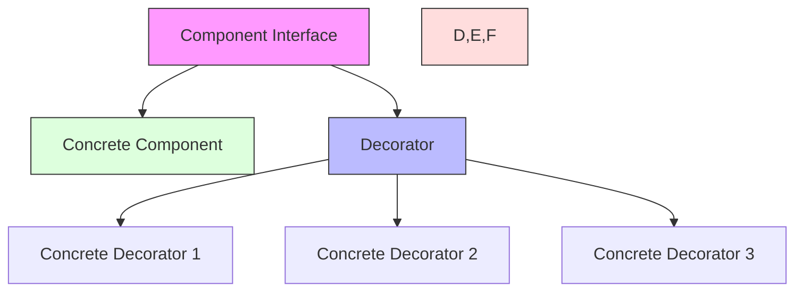

# Decorator Pattern

## Overview

The Decorator pattern is a structural design pattern that lets you dynamically add new behaviors to objects by placing these objects inside wrapper objects that contain the behaviors. It provides a flexible alternative to subclassing for extending functionality.

### Real-World Analogy
Think of ordering a coffee at a coffee shop. You start with a basic coffee (component) and can add various "decorators" like milk, sugar, caramel, whipped cream, etc. Each addition wraps the previous configuration and adds its own behavior (cost and description) while maintaining the same interface.



## Key Concepts

### Core Components

1. **Component**: Defines the interface for objects that can have responsibilities added
2. **Concrete Component**: Defines an object to which additional responsibilities can be attached
3. **Decorator**: Maintains a reference to a Component object and defines an interface conforming to Component's interface
4. **Concrete Decorator**: Adds responsibilities to the component

### Implementation Example
import Tabs from '@theme/Tabs';
import TabItem from '@theme/TabItem';

v
<Tabs>
  <TabItem value="java" label="Java">
    ```java
    // Component Interface
    interface Coffee {
        String getDescription();
        double getCost();
    }

    // Concrete Component
    class SimpleCoffee implements Coffee {
        @Override
        public String getDescription() {
            return "Simple Coffee";
        }

        @Override
        public double getCost() {
            return 2.0;
        }
    }

    // Decorator
    abstract class CoffeeDecorator implements Coffee {
        protected final Coffee decoratedCoffee;

        public CoffeeDecorator(Coffee coffee) {
            this.decoratedCoffee = coffee;
        }

        @Override
        public String getDescription() {
            return decoratedCoffee.getDescription();
        }

        @Override
        public double getCost() {
            return decoratedCoffee.getCost();
        }
    }

    // Concrete Decorators
    class MilkDecorator extends CoffeeDecorator {
        public MilkDecorator(Coffee coffee) {
            super(coffee);
        }

        @Override
        public String getDescription() {
            return decoratedCoffee.getDescription() + ", Milk";
        }

        @Override
        public double getCost() {
            return decoratedCoffee.getCost() + 0.5;
        }
    }

    class SugarDecorator extends CoffeeDecorator {
        public SugarDecorator(Coffee coffee) {
            super(coffee);
        }

        @Override
        public String getDescription() {
            return decoratedCoffee.getDescription() + ", Sugar";
        }

        @Override
        public double getCost() {
            return decoratedCoffee.getCost() + 0.2;
        }
    }

    class WhipDecorator extends CoffeeDecorator {
        public WhipDecorator(Coffee coffee) {
            super(coffee);
        }

        @Override
        public String getDescription() {
            return decoratedCoffee.getDescription() + ", Whip";
        }

        @Override
        public double getCost() {
            return decoratedCoffee.getCost() + 0.7;
        }
    }

    // Client Usage
    class CoffeeShop {
        public static void main(String[] args) {
            Coffee coffee = new SimpleCoffee();
            coffee = new MilkDecorator(coffee);
            coffee = new SugarDecorator(coffee);
            coffee = new WhipDecorator(coffee);

            System.out.println("Description: " + coffee.getDescription());
            System.out.println("Cost: $" + coffee.getCost());
        }
    }
    ```
  </TabItem>
  <TabItem value="go" label="Go">
    ```go
    package main

    import "fmt"

    // Component Interface
    type Coffee interface {
        GetDescription() string
        GetCost() float64
    }

    // Concrete Component
    type SimpleCoffee struct{}

    func (c *SimpleCoffee) GetDescription() string {
        return "Simple Coffee"
    }

    func (c *SimpleCoffee) GetCost() float64 {
        return 2.0
    }

    // Base Decorator
    type CoffeeDecorator struct {
        coffee Coffee
    }

    func (c *CoffeeDecorator) GetDescription() string {
        return c.coffee.GetDescription()
    }

    func (c *CoffeeDecorator) GetCost() float64 {
        return c.coffee.GetCost()
    }

    // Concrete Decorators
    type MilkDecorator struct {
        CoffeeDecorator
    }

    func NewMilkDecorator(coffee Coffee) *MilkDecorator {
        return &MilkDecorator{CoffeeDecorator{coffee}}
    }

    func (m *MilkDecorator) GetDescription() string {
        return m.coffee.GetDescription() + ", Milk"
    }

    func (m *MilkDecorator) GetCost() float64 {
        return m.coffee.GetCost() + 0.5
    }

    type SugarDecorator struct {
        CoffeeDecorator
    }

    func NewSugarDecorator(coffee Coffee) *SugarDecorator {
        return &SugarDecorator{CoffeeDecorator{coffee}}
    }

    func (s *SugarDecorator) GetDescription() string {
        return s.coffee.GetDescription() + ", Sugar"
    }

    func (s *SugarDecorator) GetCost() float64 {
        return s.coffee.GetCost() + 0.2
    }

    type WhipDecorator struct {
        CoffeeDecorator
    }

    func NewWhipDecorator(coffee Coffee) *WhipDecorator {
        return &WhipDecorator{CoffeeDecorator{coffee}}
    }

    func (w *WhipDecorator) GetDescription() string {
        return w.coffee.GetDescription() + ", Whip"
    }

    func (w *WhipDecorator) GetCost() float64 {
        return w.coffee.GetCost() + 0.7
    }

    // Client Usage
    func main() {
        coffee := &SimpleCoffee{}
        coffee = NewMilkDecorator(coffee)
        coffee = NewSugarDecorator(coffee)
        coffee = NewWhipDecorator(coffee)

        fmt.Printf("Description: %s\n", coffee.GetDescription())
        fmt.Printf("Cost: $%.2f\n", coffee.GetCost())
    }
    ```
  </TabItem>
</Tabs>

## Related Patterns

1. **Composite Pattern**
    - Decorator can be viewed as a degenerate composite with only one component
    - Often used together to create complex structures

2. **Strategy Pattern**
    - Can be used together to vary both the interface and implementation
    - Decorator changes interface, Strategy changes implementation

3. **Chain of Responsibility**
    - Similar to decorator but focuses on handling requests rather than adding behavior
    - Can be combined for complex processing pipelines

## Best Practices

### Configuration
1. Keep decorators lightweight
2. Use meaningful names for decorators
3. Consider using a factory for creating decorated objects

### Monitoring
1. Track decorator chain depth
2. Monitor performance impact
3. Log decorator operations

### Testing
1. Test each decorator independently
2. Verify decorator ordering
3. Test complex combinations

## Common Pitfalls

1. **Decorator Order Dependency**
    - Solution: Document required ordering
    - Implement order validation when necessary

2. **Complex Decorator Chains**
    - Solution: Use builder pattern or factory
    - Consider combining decorators

3. **Interface Violation**
    - Solution: Ensure decorators fully implement interface
    - Maintain interface consistency

## Use Cases

### 1. UI Component Enhancement
- Adding borders
- Adding scrolling behavior
- Implementing dynamic styling

### 2. Stream/IO Operations
- Adding buffering
- Adding encryption
- Adding compression

### 3. Web Service Middleware
- Authentication
- Logging
- Rate limiting

## Deep Dive Topics

### Thread Safety

```java
public class ThreadSafeDecorator {
    private final Component component;
    private final ReadWriteLock lock = new ReentrantReadWriteLock();

    public Object operation() {
        lock.readLock().lock();
        try {
            return component.operation();
        } finally {
            lock.readLock().unlock();
        }
    }
}
```

### Distributed Systems
1. Network layer decorators
2. Service discovery decorators
3. Circuit breaker implementations

### Performance Considerations
1. Decorator chain optimization
2. Caching strategies
3. Memory impact

## Additional Resources

### References
1. "Design Patterns" by Gang of Four
2. "Head First Design Patterns" by Freeman et al.
3. "Clean Code" by Robert C. Martin

### Tools
1. Decorator code generators
2. Performance monitoring tools
3. Static analysis tools

## FAQ

**Q: When should I use the Decorator pattern?**  
A: Use it when you need to add behavior to objects dynamically and want to avoid a class explosion from subclassing.

**Q: How is Decorator different from inheritance?**  
A: Decorator provides more flexibility by allowing behavior to be added at runtime and avoiding class explosion.

**Q: Can decorators be applied in any order?**  
A: Generally yes, but some implementations might require specific ordering. Document any such requirements.

**Q: How do I handle decorator cleanup?**  
A: Implement proper cleanup in each decorator, possibly using try-with-resources or similar patterns.

**Q: What's the performance impact of many decorators?**  
A: Each decorator adds a level of indirection. Consider combining decorators if performance becomes an issue.