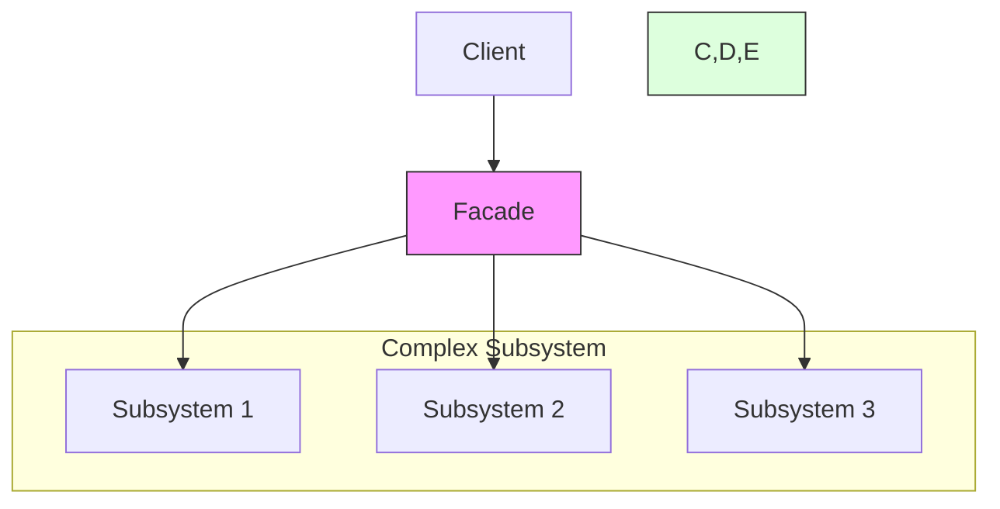

# Facade Pattern

## Overview

The Facade pattern provides a simplified interface to a complex subsystem. It acts as a high-level interface that makes the subsystem easier to use by reducing complexity and hiding the implementation details.

### Real-World Analogy
Think of a restaurant's waiter. The waiter provides a simple interface to the complex restaurant subsystem (kitchen, inventory, billing). Customers don't interact directly with the kitchen staff, accountants, and other restaurant employees. Instead, they just tell the waiter what they want, and the waiter coordinates with the various subsystems.



## Key Concepts

### Core Components

1. **Facade**: Provides unified interface to subsystem
2. **Subsystems**: Complex system components
3. **Client**: Uses facade to interact with subsystem
4. **Additional Facades**: Optional specialized facades for different use cases

### Implementation Example
import Tabs from '@theme/Tabs';
import TabItem from '@theme/TabItem';

<Tabs>
  <TabItem value="java" label="Java">
    ```java
    // Subsystem components
    class VideoFile {
        private String name;
        private String codecType;

        public VideoFile(String name) {
            this.name = name;
            this.codecType = name.substring(name.indexOf(".") + 1);
        }

        public String getCodecType() {
            return codecType;
        }

        public String getName() {
            return name;
        }
    }

    class CodecFactory {
        public static Codec extract(VideoFile file) {
            String type = file.getCodecType();
            if (type.equals("mp4")) {
                return new MPEG4CompressionCodec();
            } else {
                return new OggCompressionCodec();
            }
        }
    }

    interface Codec { }
    class MPEG4CompressionCodec implements Codec { }
    class OggCompressionCodec implements Codec { }

    class BitrateReader {
        public static VideoFile read(VideoFile file, Codec codec) {
            System.out.println("Reading file...");
            return file;
        }

        public static VideoFile convert(VideoFile buffer, Codec codec) {
            System.out.println("Converting file...");
            return buffer;
        }
    }

    class AudioMixer {
        public File fix(VideoFile result) {
            System.out.println("Fixing audio...");
            return new File("tmp");
        }
    }

    // Facade
    class VideoConverter {
        public File convertVideo(String fileName, String format) {
            VideoFile file = new VideoFile(fileName);
            Codec sourceCodec = CodecFactory.extract(file);
            Codec destinationCodec;
            
            if (format.equals("mp4")) {
                destinationCodec = new MPEG4CompressionCodec();
            } else {
                destinationCodec = new OggCompressionCodec();
            }
            
            VideoFile buffer = BitrateReader.read(file, sourceCodec);
            VideoFile intermediateResult = BitrateReader.convert(buffer, destinationCodec);
            File result = (new AudioMixer()).fix(intermediateResult);
            
            return result;
        }
    }

    // Client
    class Client {
        public static void main(String[] args) {
            VideoConverter converter = new VideoConverter();
            File mp4 = converter.convertVideo("video.ogg", "mp4");
        }
    }
    ```
  </TabItem>
  <TabItem value="go" label="Go">
    ```go
    package main

    import (
        "fmt"
        "strings"
    )

    // Subsystem components
    type VideoFile struct {
        name      string
        codecType string
    }

    func NewVideoFile(name string) *VideoFile {
        codecType := name[strings.LastIndex(name, ".")+1:]
        return &VideoFile{name: name, codecType: codecType}
    }

    type Codec interface{}
    type MPEG4CompressionCodec struct{}
    type OggCompressionCodec struct{}

    type CodecFactory struct{}

    func (f *CodecFactory) Extract(file *VideoFile) Codec {
        if file.codecType == "mp4" {
            return &MPEG4CompressionCodec{}
        }
        return &OggCompressionCodec{}
    }

    type BitrateReader struct{}

    func (r *BitrateReader) Read(file *VideoFile, codec Codec) *VideoFile {
        fmt.Println("Reading file...")
        return file
    }

    func (r *BitrateReader) Convert(buffer *VideoFile, codec Codec) *VideoFile {
        fmt.Println("Converting file...")
        return buffer
    }

    type AudioMixer struct{}

    func (a *AudioMixer) Fix(result *VideoFile) string {
        fmt.Println("Fixing audio...")
        return "tmp"
    }

    // Facade
    type VideoConverter struct {
        reader  *BitrateReader
        mixer   *AudioMixer
        factory *CodecFactory
    }

    func NewVideoConverter() *VideoConverter {
        return &VideoConverter{
            reader:  &BitrateReader{},
            mixer:   &AudioMixer{},
            factory: &CodecFactory{},
        }
    }

    func (c *VideoConverter) ConvertVideo(filename, format string) string {
        file := NewVideoFile(filename)
        sourceCodec := c.factory.Extract(file)
        
        var destinationCodec Codec
        if format == "mp4" {
            destinationCodec = &MPEG4CompressionCodec{}
        } else {
            destinationCodec = &OggCompressionCodec{}
        }
        
        buffer := c.reader.Read(file, sourceCodec)
        intermediateResult := c.reader.Convert(buffer, destinationCodec)
        result := c.mixer.Fix(intermediateResult)
        
        return result
    }

    // Client
    func main() {
        converter := NewVideoConverter()
        mp4 := converter.ConvertVideo("video.ogg", "mp4")
        fmt.Printf("Converted file: %s\n", mp4)
    }
    ```
  </TabItem>
</Tabs>

## Related Patterns

1. **Abstract Factory**
    - Can be used to create subsystem objects
    - Provides another level of abstraction

2. **Singleton**
    - Facade is often implemented as a singleton
    - Ensures single point of access to subsystem

3. **Mediator**
    - Similar to Facade but focused on peer-to-peer communication
    - More complex but more flexible

## Best Practices

### Configuration
1. Keep facade interface simple
2. Consider multiple facades for different use cases
3. Don't add business logic to facade

### Monitoring
1. Log facade operations
2. Track subsystem performance
3. Monitor resource usage

### Testing
1. Test facade methods independently
2. Mock subsystem components
3. Verify integration points

## Common Pitfalls

1. **Fat Facade**
    - Solution: Create multiple specialized facades
    - Split complex operations into smaller ones

2. **Tight Coupling**
    - Solution: Use dependency injection
    - Keep facade focused on coordination

3. **Hidden Complexity**
    - Solution: Document subsystem interactions
    - Provide access to subsystem when needed

## Use Cases

### 1. Library Integration
- Simplifying complex APIs
- Unifying multiple libraries
- Creating domain-specific interfaces

### 2. Legacy System Wrapping
- Modernizing interfaces
- Hiding complexity
- Providing clean APIs

### 3. Service Orchestration
- Coordinating microservices
- Managing distributed operations
- Simplifying client interactions

## Deep Dive Topics

### Thread Safety

```java
public class ThreadSafeFacade {
    private final Object lock = new Object();
    private final Map<String, Object> cache = new ConcurrentHashMap<>();
    
    public void operation() {
        synchronized(lock) {
            // Coordinate subsystem operations
            // Ensure thread-safe access
        }
    }
}
```

### Distributed Systems
1. Service discovery integration
2. Load balancing
3. Circuit breaker implementation

### Performance Considerations
1. Caching strategies
2. Lazy initialization
3. Resource pooling

## Additional Resources

### References
1. "Design Patterns" by Gang of Four
2. "Patterns of Enterprise Application Architecture" by Martin Fowler
3. "Clean Architecture" by Robert C. Martin

### Tools
1. Code generation tools
2. Performance monitoring
3. Testing frameworks

## FAQ

**Q: When should I use the Facade pattern?**  
A: Use it when you need to provide a simple interface to a complex subsystem, or when you want to decouple subsystems from clients.

**Q: How is Facade different from Adapter?**  
A: Facade simplifies an interface, while Adapter makes incompatible interfaces work together.

**Q: Can a system have multiple facades?**  
A: Yes, you can create multiple facades for different use cases or clients.

**Q: Should facade expose subsystem classes?**  
A: Generally no, but you might need to expose some for advanced users.

**Q: How do I handle facade method failures?**  
A: Implement proper error handling and provide meaningful feedback to clients.