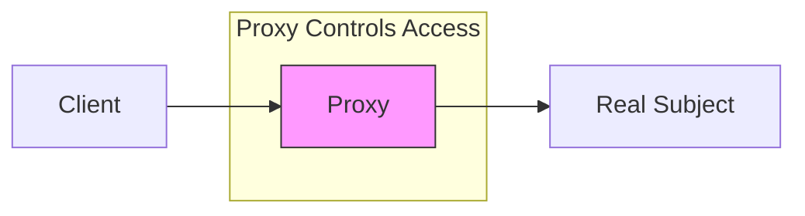

# Proxy Pattern

## Overview

The Proxy pattern is a structural design pattern that provides a surrogate or placeholder for another object to control access to it. The proxy controls access to the original object, allowing you to perform something either before or after the request gets through to the original object.

### Real-World Analogy
Think of a credit card as a proxy for a bank account. When you make a purchase using your credit card, it acts as a proxy to your bank account. The credit card protects your bank account details while providing the same payment interface. It can also add additional features like credit limits, fraud detection, and purchase tracking.



## Key Concepts

### Core Components

1. **Subject**: Interface implemented by both the RealSubject and Proxy
2. **RealSubject**: The real object that the proxy represents
3. **Proxy**: Maintains a reference to RealSubject and controls access to it
4. **Client**: Interacts with RealSubject through Proxy

### Implementation Example
import Tabs from '@theme/Tabs';
import TabItem from '@theme/TabItem';

<Tabs>
  <TabItem value="java" label="Java">
    ```java
    // Subject Interface
    interface Image {
        void display();
    }

    // Real Subject
    class RealImage implements Image {
        private String filename;

        public RealImage(String filename) {
            this.filename = filename;
            loadFromDisk();
        }

        private void loadFromDisk() {
            System.out.println("Loading " + filename);
        }

        @Override
        public void display() {
            System.out.println("Displaying " + filename);
        }
    }

    // Proxy
    class ProxyImage implements Image {
        private RealImage realImage;
        private String filename;
        private final Map<String, Integer> accessCount = new HashMap<>();

        public ProxyImage(String filename) {
            this.filename = filename;
        }

        @Override
        public void display() {
            // Lazy loading
            if (realImage == null) {
                realImage = new RealImage(filename);
            }

            // Access control
            if (!hasAccess()) {
                throw new SecurityException("Access denied");
            }

            // Logging
            logAccess();

            // Delegation
            realImage.display();
        }

        private boolean hasAccess() {
            // Implement access control logic
            return true;
        }

        private void logAccess() {
            accessCount.merge(filename, 1, Integer::sum);
            System.out.println("Access count for " + filename + ": " + 
                accessCount.get(filename));
        }

        // Additional proxy methods
        public int getAccessCount() {
            return accessCount.getOrDefault(filename, 0);
        }

        public void resetAccessCount() {
            accessCount.put(filename, 0);
        }
    }

    // Cache Proxy Example
    class CachedImageProxy implements Image {
        private RealImage realImage;
        private String filename;
        private static final Map<String, RealImage> cache = new ConcurrentHashMap<>();

        public CachedImageProxy(String filename) {
            this.filename = filename;
        }

        @Override
        public void display() {
            realImage = cache.computeIfAbsent(filename, RealImage::new);
            realImage.display();
        }
    }
    ```
  </TabItem>
  <TabItem value="go" label="Go">
    ```go
    package main

    import (
        "fmt"
        "sync"
    )

    // Subject Interface
    type Image interface {
        Display()
    }

    // Real Subject
    type RealImage struct {
        filename string
    }

    func NewRealImage(filename string) *RealImage {
        image := &RealImage{filename: filename}
        image.loadFromDisk()
        return image
    }

    func (r *RealImage) loadFromDisk() {
        fmt.Printf("Loading %s\n", r.filename)
    }

    func (r *RealImage) Display() {
        fmt.Printf("Displaying %s\n", r.filename)
    }

    // Proxy
    type ProxyImage struct {
        realImage *RealImage
        filename  string
        accessCount map[string]int
        mutex sync.RWMutex
    }

    func NewProxyImage(filename string) *ProxyImage {
        return &ProxyImage{
            filename: filename,
            accessCount: make(map[string]int),
        }
    }

    func (p *ProxyImage) Display() {
        // Lazy loading
        if p.realImage == nil {
            p.realImage = NewRealImage(p.filename)
        }

        // Access control
        if !p.hasAccess() {
            panic("Access denied")
        }

        // Logging
        p.logAccess()

        // Delegation
        p.realImage.Display()
    }

    func (p *ProxyImage) hasAccess() bool {
        // Implement access control logic
        return true
    }

    func (p *ProxyImage) logAccess() {
        p.mutex.Lock()
        defer p.mutex.Unlock()
        p.accessCount[p.filename]++
        fmt.Printf("Access count for %s: %d\n", 
            p.filename, p.accessCount[p.filename])
    }

    func (p *ProxyImage) GetAccessCount() int {
        p.mutex.RLock()
        defer p.mutex.RUnlock()
        return p.accessCount[p.filename]
    }

    func (p *ProxyImage) ResetAccessCount() {
        p.mutex.Lock()
        defer p.mutex.Unlock()
        p.accessCount[p.filename] = 0
    }

    // Cache Proxy
    type CachedImageProxy struct {
        filename string
        cache    sync.Map
    }

    func NewCachedImageProxy(filename string) *CachedImageProxy {
        return &CachedImageProxy{filename: filename}
    }

    func (c *CachedImageProxy) Display() {
        value, ok := c.cache.Load(c.filename)
        if !ok {
            value = NewRealImage(c.filename)
            c.cache.Store(c.filename, value)
        }
        value.(*RealImage).Display()
    }
    ```
  </TabItem>
</Tabs>

## Related Patterns

1. **Decorator Pattern**
    - Similar structure but different intent
    - Decorator adds behavior, Proxy controls access

2. **Adapter Pattern**
    - Both act as intermediaries
    - Adapter changes interface, Proxy maintains same interface

3. **Facade Pattern**
    - Both simplify complex systems
    - Proxy focuses on access control, Facade on simplification

## Best Practices

### Configuration
1. Keep proxy interface identical to subject
2. Use dependency injection for flexibility
3. Consider proxy chaining for multiple concerns

### Monitoring
1. Log access patterns
2. Track performance metrics
3. Monitor resource usage

### Testing
1. Test proxy independently
2. Verify access control rules
3. Test caching behavior

## Common Pitfalls

1. **Complex Proxy Logic**
    - Solution: Split into multiple specialized proxies
    - Keep single responsibility principle

2. **Performance Overhead**
    - Solution: Use caching when appropriate
    - Optimize proxy operations

3. **Transparency Issues**
    - Solution: Maintain identical interface
    - Document proxy behavior

## Use Cases

### 1. Virtual Proxy (Lazy Loading)
- Loading large images
- Database connections
- Heavy object initialization

### 2. Protection Proxy (Access Control)
- Authentication/Authorization
- Resource access control
- Sensitive data protection

### 3. Caching Proxy
- Web page caching
- Database query results
- Expensive computations

## Deep Dive Topics

### Thread Safety

```java
public class ThreadSafeProxy {
    private final ReadWriteLock lock = new ReentrantReadWriteLock();
    private volatile RealSubject subject;

    public void operation() {
        lock.readLock().lock();
        try {
            if (subject == null) {
                lock.readLock().unlock();
                lock.writeLock().lock();
                try {
                    if (subject == null) {
                        subject = new RealSubject();
                    }
                } finally {
                    lock.writeLock().unlock();
                    lock.readLock().lock();
                }
            }
            subject.operation();
        } finally {
            lock.readLock().unlock();
        }
    }
}
```

### Distributed Systems
1. Remote proxy implementation
2. Service discovery integration
3. Load balancing strategies

### Performance Considerations
1. Caching strategies
2. Lazy loading optimization
3. Resource pooling

## Additional Resources

### References
1. "Design Patterns" by Gang of Four
2. "Java Design Patterns" by Vaskaran Sarcar
3. "Head First Design Patterns" by Freeman et al.

### Tools
1. Proxy generation tools
2. Performance monitoring tools
3. Testing frameworks

## FAQ

**Q: When should I use the Proxy pattern?**  
A: Use it when you need to control access to an object, add lazy initialization, logging, access control, or caching.

**Q: What's the difference between Proxy and Decorator?**  
A: Proxy controls access to an object, while Decorator adds behavior to an object.

**Q: Can I have multiple proxies?**  
A: Yes, you can chain proxies for different responsibilities (e.g., caching + logging).

**Q: How do I handle proxy overhead?**  
A: Use caching, optimize proxy operations, and only add necessary functionality.

**Q: Is Proxy pattern thread-safe?**  
A: Not by default. You need to implement thread safety explicitly if required.