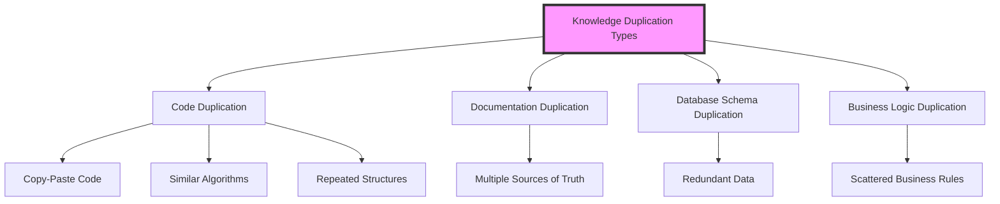

# Don't Repeat Yourself (DRY) Principle 🔄

import Tabs from '@theme/Tabs';
import TabItem from '@theme/TabItem';

## Overview 🎯

The Don't Repeat Yourself (DRY) principle states that "every piece of knowledge must have a single, unambiguous, authoritative representation within a system." This principle aims to reduce code duplication and improve maintainability.

### Real-World Analogy 🌍
Think of a restaurant's recipe book:
- Each recipe is written once in a central cookbook
- Chefs reference the same recipe rather than having their own copies
- When the recipe needs updating, it's changed in one place
- All chefs automatically work with the updated version
- No risk of different chefs using different versions

## Key Concepts 🔑

Let's visualize the core concepts with a Mermaid diagram:



### Core Components

1. **Knowledge Representation** 📚
    - Business rules
    - Algorithms
    - Data structures
    - Configuration

2. **Single Source of Truth** 🎯
    - Centralized definitions
    - Shared libraries
    - Common utilities
    - Unified configurations

3. **Code Organization** 📂
    - Modular design
    - Reusable components
    - Shared utilities
    - Common interfaces

## Implementation ⚙️

Here's a practical example showing both violation of DRY and its correct implementation:

<Tabs>
  <TabItem value="java" label="Java">
```java
// Bad Example - Violating DRY
class OrderProcessor {
    public double calculateOrderTotal(Order order) {
        double total = 0;
        for (Item item : order.getItems()) {
            total += item.getPrice();
        }
        double tax = total * 0.1; // 10% tax
        return total + tax;
    }
}

class InvoiceGenerator {
public double calculateInvoiceAmount(Order order) {
double total = 0;
for (Item item : order.getItems()) {
total += item.getPrice();
}
double tax = total * 0.1; // Same 10% tax calculation duplicated
return total + tax;
}
}

// Good Example - Following DRY
class PriceCalculator {
private static final double TAX_RATE = 0.1;

    public double calculateTotalWithTax(double subtotal) {
        return subtotal + (subtotal * TAX_RATE);
    }
    
    public double calculateSubtotal(List<Item> items) {
        return items.stream()
                   .mapToDouble(Item::getPrice)
                   .sum();
    }
}

class OrderProcessor {
private final PriceCalculator calculator;

    public OrderProcessor(PriceCalculator calculator) {
        this.calculator = calculator;
    }
    
    public double calculateOrderTotal(Order order) {
        double subtotal = calculator.calculateSubtotal(order.getItems());
        return calculator.calculateTotalWithTax(subtotal);
    }
}

class InvoiceGenerator {
private final PriceCalculator calculator;

    public InvoiceGenerator(PriceCalculator calculator) {
        this.calculator = calculator;
    }
    
    public double calculateInvoiceAmount(Order order) {
        double subtotal = calculator.calculateSubtotal(order.getItems());
        return calculator.calculateTotalWithTax(subtotal);
    }
}
```
  </TabItem>
  <TabItem value="go" label="Go">
```go
// Bad Example - Violating DRY
type OrderProcessor struct{}

func (op *OrderProcessor) CalculateOrderTotal(order Order) float64 {
    var total float64
    for _, item := range order.Items {
        total += item.Price
    }
    tax := total * 0.1 // 10% tax
    return total + tax
}

type InvoiceGenerator struct{}

func (ig *InvoiceGenerator) CalculateInvoiceAmount(order Order) float64 {
    var total float64
    for _, item := range order.Items {
        total += item.Price
    }
    tax := total * 0.1 // Same 10% tax calculation duplicated
    return total + tax
}

// Good Example - Following DRY
const taxRate = 0.1

type PriceCalculator struct{}

func (pc *PriceCalculator) CalculateTotalWithTax(subtotal float64) float64 {
    return subtotal + (subtotal * taxRate)
}

func (pc *PriceCalculator) CalculateSubtotal(items []Item) float64 {
    var subtotal float64
    for _, item := range items {
        subtotal += item.Price
    }
    return subtotal
}

type OrderProcessor struct {
    calculator *PriceCalculator
}

func NewOrderProcessor(calculator *PriceCalculator) *OrderProcessor {
    return &OrderProcessor{calculator: calculator}
}

func (op *OrderProcessor) CalculateOrderTotal(order Order) float64 {
    subtotal := op.calculator.CalculateSubtotal(order.Items)
    return op.calculator.CalculateTotalWithTax(subtotal)
}

type InvoiceGenerator struct {
    calculator *PriceCalculator
}

func NewInvoiceGenerator(calculator *PriceCalculator) *InvoiceGenerator {
    return &InvoiceGenerator{calculator: calculator}
}

func (ig *InvoiceGenerator) CalculateInvoiceAmount(order Order) float64 {
    subtotal := ig.calculator.CalculateSubtotal(order.Items)
    return ig.calculator.CalculateTotalWithTax(subtotal)
}
```
  </TabItem>
</Tabs>

## Related Patterns 🤝

1. **Template Method Pattern**
    - Reduces duplication in similar algorithms
    - Centralizes common logic
    - Allows specific customizations

2. **Strategy Pattern**
    - Eliminates duplicate decision logic
    - Centralizes algorithm implementations
    - Enables reuse across contexts

3. **Abstract Factory Pattern**
    - Centralizes object creation logic
    - Reduces duplicate construction code
    - Maintains consistency

## Best Practices 👍

### Design & Implementation ⚙️
1. Extract common code into utility classes
2. Use inheritance and composition effectively
3. Implement shared libraries
4. Create reusable components
5. Maintain a single source of truth

### Testing 🧪
1. Create reusable test fixtures
2. Share test utilities
3. Use test case inheritance
4. Implement parametrized tests
5. Centralize test configurations

### Monitoring 📊
1. Centralize logging configuration
2. Use shared metrics collectors
3. Implement common monitoring patterns
4. Create reusable dashboards

## Common Pitfalls ⚠️

1. **Over-Abstraction**
    - Problem: Creating unnecessary abstractions
    - Solution: Balance DRY with pragmatism

2. **False Duplication**
    - Problem: Forcing unification of coincidentally similar code
    - Solution: Identify true knowledge duplication

3. **Tight Coupling**
    - Problem: Creating dependencies to avoid duplication
    - Solution: Use proper abstraction levels

4. **Premature Abstraction**
    - Problem: Abstracting too early
    - Solution: Wait for clear patterns to emerge

## Use Cases 💼

### 1. Form Validation System
- **Scenario**: Web application forms
- **Implementation**:
    - Centralized validation rules
    - Shared validation functions
    - Common error messages
    - Reusable form components

### 2. Report Generation
- **Scenario**: Business reporting system
- **Implementation**:
    - Common report templates
    - Shared formatting logic
    - Centralized calculation methods
    - Reusable data transformations

### 3. API Integration
- **Scenario**: Third-party service integration
- **Implementation**:
    - Shared HTTP client
    - Common authentication logic
    - Centralized error handling
    - Reusable data mappers

## Deep Dive Topics 🏊‍♂️

### Thread Safety 🔒
- Shared resource access
- State management patterns
- Synchronization strategies
- Concurrent collections

### Distributed Systems 🌐
- Configuration management
- Service discovery
- Shared libraries
- Common protocols

### Performance 🚀
- Code optimization
- Resource sharing
- Caching strategies
- Memory optimization

## Additional Resources 📚

### Books 📖
1. "The Pragmatic Programmer" by Andy Hunt & Dave Thomas
2. "Clean Code" by Robert C. Martin
3. "Code Complete" by Steve McConnell

### Online Resources 🔗
1. [Refactoring Guru - DRY Principle](https://refactoring.guru)
2. [Martin Fowler's Blog](https://martinfowler.com)
3. [Clean Code Blog](https://blog.cleancoder.com)

### Tools 🛠️
1. SonarQube - Code duplication detection
2. PMD - Copy-paste detection
3. JaCoCo - Code coverage analysis

## FAQs ❓

### Q: How do I identify when to apply DRY?
A: Look for:
- Copied code blocks
- Similar algorithms
- Repeated business rules
- Duplicate configurations

### Q: Is DRY always the right choice?
A: No, consider:
- Development speed vs maintenance
- System complexity
- Team size and expertise
- Future change likelihood

### Q: How does DRY relate to microservices?
A: In microservices:
- Share common libraries
- Use service templates
- Centralize cross-cutting concerns
- Maintain service independence

### Q: How much abstraction is too much?
A: Balance these factors:
- Code clarity
- Maintenance overhead
- Team understanding
- System requirements

### Q: How to handle similar but not identical code?
A: Consider:
- Template Method pattern
- Strategy pattern
- Parameterization
- Careful abstraction