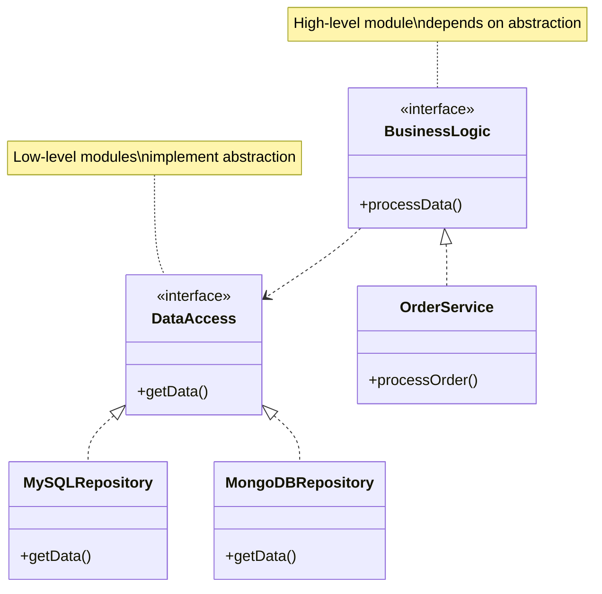

# Dependency Inversion Principle (DIP)

import Tabs from '@theme/Tabs';
import TabItem from '@theme/TabItem';

## Overview

The Dependency Inversion Principle (DIP) states that high-level modules should not depend on low-level modules; both should depend on abstractions. Furthermore, abstractions should not depend on details; details should depend on abstractions.

### Real-World Analogy
Think of a home electrical system:
- Your appliances (high-level modules) don't depend directly on the power plant (low-level module)
- Instead, both depend on a standard electrical outlet specification (abstraction)
- You can plug any compliant device into any standard outlet
- Power companies can change their generation methods without affecting your appliances

## Key Concepts

Let's visualize the core concepts with a Mermaid diagram:



### Core Components

1. **High-Level Modules**
  - Business logic
  - Policy
  - Workflow orchestration

2. **Low-Level Modules**
  - Implementation details
  - Data access
  - Infrastructure concerns

3. **Abstractions**
  - Interfaces
  - Abstract classes
  - Contracts

## Implementation

Here's a practical example showing both violation of DIP and its correct implementation:

<Tabs>
  <TabItem value="java" label="Java">
```java
// Bad Example - Violating DIP
class UserService {
    private MySQLDatabase database; // Depends on concrete class

    public UserService() {
        this.database = new MySQLDatabase();
    }
    
    public User getUser(String id) {
        return database.query("SELECT * FROM users WHERE id = " + id);
    }
}

class MySQLDatabase {
public User query(String sql) {
// Database specific implementation
return new User();
}
}

// Good Example - Following DIP
interface UserRepository {
User getUser(String id);
}

interface UserNotifier {
void notifyUser(User user);
}

class MySQLUserRepository implements UserRepository {
@Override
public User getUser(String id) {
// MySQL specific implementation
return new User();
}
}

class MongoUserRepository implements UserRepository {
@Override
public User getUser(String id) {
// MongoDB specific implementation
return new User();
}
}

class EmailNotifier implements UserNotifier {
@Override
public void notifyUser(User user) {
// Email implementation
}
}

class UserService {
private final UserRepository userRepository;
private final UserNotifier userNotifier;

    public UserService(UserRepository userRepository, UserNotifier userNotifier) {
        this.userRepository = userRepository;
        this.userNotifier = userNotifier;
    }
    
    public User getAndNotifyUser(String id) {
        User user = userRepository.getUser(id);
        userNotifier.notifyUser(user);
        return user;
    }
}

// Usage
class Application {
public static void main(String[] args) {
UserRepository repository = new MySQLUserRepository();
UserNotifier notifier = new EmailNotifier();
UserService service = new UserService(repository, notifier);

        User user = service.getAndNotifyUser("123");
    }
}
```
  </TabItem>
  <TabItem value="go" label="Go">
```go
// Bad Example - Violating DIP
type MySQLDatabase struct{}

func (db *MySQLDatabase) Query(sql string) User {
    // Database specific implementation
    return User{}
}

type UserService struct {
    database *MySQLDatabase
}

func NewUserService() *UserService {
    return &UserService{
        database: &MySQLDatabase{},
    }
}

func (s *UserService) GetUser(id string) User {
    return s.database.Query("SELECT * FROM users WHERE id = " + id)
}

// Good Example - Following DIP
type UserRepository interface {
    GetUser(id string) User
}

type UserNotifier interface {
    NotifyUser(user User)
}

type MySQLUserRepository struct{}

func (r *MySQLUserRepository) GetUser(id string) User {
    // MySQL specific implementation
    return User{}
}

type MongoUserRepository struct{}

func (r *MongoUserRepository) GetUser(id string) User {
    // MongoDB specific implementation
    return User{}
}

type EmailNotifier struct{}

func (n *EmailNotifier) NotifyUser(user User) {
    // Email implementation
}

type UserService struct {
    repository UserRepository
    notifier   UserNotifier
}

func NewUserService(repository UserRepository, notifier UserNotifier) *UserService {
    return &UserService{
        repository: repository,
        notifier:   notifier,
    }
}

func (s *UserService) GetAndNotifyUser(id string) User {
    user := s.repository.GetUser(id)
    s.notifier.NotifyUser(user)
    return user
}

// Usage
func main() {
    repository := &MySQLUserRepository{}
    notifier := &EmailNotifier{}
    service := NewUserService(repository, notifier)
    
    user := service.GetAndNotifyUser("123")
}
```
  </TabItem>
</Tabs>

## Related Patterns

1. **Factory Pattern**
  - Creates concrete implementations
  - Hides implementation details
  - Supports dependency injection

2. **Strategy Pattern**
  - Implements different algorithms
  - Depends on abstractions
  - Runtime strategy selection

3. **Abstract Factory Pattern**
  - Creates families of related objects
  - Supports multiple implementations
  - Maintains consistency

## Best Practices

### Design & Implementation
1. Use dependency injection
2. Create meaningful abstractions
3. Follow interface segregation
4. Use factories when appropriate
5. Apply inversion of control

### Testing
1. Use mock implementations
2. Test against interfaces
3. Implement contract tests
4. Create integration tests
5. Use dependency injection containers

### Monitoring
1. Track implementation usage
2. Monitor dependency graphs
3. Log dependency resolution
4. Profile abstraction overhead

## Common Pitfalls

1. **Concrete Class Dependencies**
  - Problem: Direct dependency on implementations
  - Solution: Depend on abstractions

2. **Leaky Abstractions**
  - Problem: Implementation details in interfaces
  - Solution: Clean, focused abstractions

3. **God Interfaces**
  - Problem: Too many methods in one interface
  - Solution: Interface segregation

4. **Circular Dependencies**
  - Problem: Components depending on each other
  - Solution: Proper abstraction layering

## Use Cases

### 1. E-commerce System
- **Scenario**: Payment processing
- **Implementation**:
  - Payment processor interface
  - Multiple provider implementations
  - Configurable payment strategies
  - Clean separation of concerns

### 2. Logging Framework
- **Scenario**: Multi-destination logging
- **Implementation**:
  - Logger interface
  - Multiple log destinations
  - Pluggable formatters
  - Flexible configuration

### 3. Notification Service
- **Scenario**: Multi-channel notifications
- **Implementation**:
  - Notifier interface
  - Email, SMS, Push implementations
  - Channel selection strategy
  - Extensible design

## Deep Dive Topics

### Thread Safety
- Abstraction thread safety
- Implementation synchronization
- Dependency lifecycle
- Resource sharing

### Distributed Systems
- Remote dependencies
- Service discovery
- Fault tolerance
- Scaling strategies

### Performance
- Abstraction overhead
- Implementation optimization
- Dependency resolution
- Caching strategies

## Additional Resources

### Books
1. "Clean Architecture" by Robert C. Martin
2. "Dependency Injection Principles, Practices, and Patterns" by Steven van Deursen & Mark Seemann
3. "Building Maintainable Software" by Joost Visser

### Online Resources
1. [Martin Fowler's Blog - Dependency Injection](https://martinfowler.com)
2. [Spring Framework Documentation](https://spring.io/docs)
3. [Go Dependency Injection](https://golang.org/doc)

### Tools
1. Spring Framework - Dependency injection
2. Google Guice - Lightweight DI
3. Wire - Go dependency injection

## FAQs

### Q: How is DIP different from Dependency Injection?
A: DIP is a principle about depending on abstractions, while Dependency Injection is a technique to implement DIP. DI is one way to achieve the goals of DIP.

### Q: When should I create new abstractions?
A: Create abstractions when:
- Multiple implementations are needed
- Implementation details should be hidden
- Testing requires isolation
- Change is expected

### Q: How does DIP affect system architecture?
A: DIP influences architecture by:
- Promoting loose coupling
- Enabling modularity
- Supporting testing
- Facilitating change

### Q: Can DIP increase complexity?
A: While it may add initial complexity, DIP:
- Reduces long-term maintenance costs
- Improves testability
- Increases flexibility
- Simplifies changes

### Q: How does DIP relate to microservices?
A: In microservices, DIP:
- Defines service contracts
- Enables service independence
- Supports service evolution
- Facilitates testing