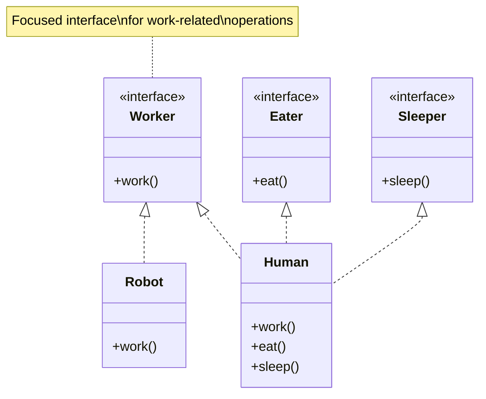

# Interface Segregation Principle (ISP)

import Tabs from '@theme/Tabs';
import TabItem from '@theme/TabItem';

## Overview

The Interface Segregation Principle (ISP) states that clients should not be forced to depend upon interfaces they don't use. This principle suggests breaking down large interfaces into smaller and more specific ones so that clients only need to know about the methods that are of interest to them.

### Real-World Analogy
Think of a universal remote control:
- A TV only needs TV-related buttons
- A DVD player only needs DVD-related buttons
- Having all possible buttons on every device's remote would be:
  - Confusing for users
  - Wasteful of resources
  - Prone to errors
    Instead, each device comes with its own specific remote with only the necessary buttons.

## Key Concepts

Let's visualize the core concepts with a Mermaid diagram:



### Core Components

1. **Interface Granularity**
  - Small, focused interfaces
  - Single responsibility
  - Client-specific abstractions

2. **Role Interfaces**
  - Based on client needs
  - Behavior-driven design
  - Cohesive operations

3. **Interface Composition**
  - Multiple small interfaces
  - Role-based composition
  - Flexible implementation

## Implementation

Here's a practical example showing both violation of ISP and its correct implementation:

<Tabs>
  <TabItem value="java" label="Java">
```java
// Bad Example - Violating ISP
interface Worker {
    void work();
    void eat();
    void sleep();
}

class Human implements Worker {
@Override
public void work() {
System.out.println("Working");
}

    @Override
    public void eat() {
        System.out.println("Eating");
    }
    
    @Override
    public void sleep() {
        System.out.println("Sleeping");
    }
}

class Robot implements Worker {
@Override
public void work() {
System.out.println("Working");
}

    @Override
    public void eat() {
        throw new UnsupportedOperationException("Robots don't eat");
    }
    
    @Override
    public void sleep() {
        throw new UnsupportedOperationException("Robots don't sleep");
    }
}

// Good Example - Following ISP
interface Workable {
void work();
}

interface Eatable {
void eat();
}

interface Sleepable {
void sleep();
}

class HumanWorker implements Workable, Eatable, Sleepable {
@Override
public void work() {
System.out.println("Working");
}

    @Override
    public void eat() {
        System.out.println("Eating");
    }
    
    @Override
    public void sleep() {
        System.out.println("Sleeping");
    }
}

class RobotWorker implements Workable {
@Override
public void work() {
System.out.println("Working");
}
}

// Usage example
class WorkModule {
private final Workable worker;

    public WorkModule(Workable worker) {
        this.worker = worker;
    }
    
    public void executeWork() {
        worker.work();  // Works for both Human and Robot
    }
}
```
  </TabItem>
  <TabItem value="go" label="Go">
```go
// Bad Example - Violating ISP
type Worker interface {
    Work()
    Eat()
    Sleep()
}

type Human struct{}

func (h *Human) Work() {
    fmt.Println("Working")
}

func (h *Human) Eat() {
    fmt.Println("Eating")
}

func (h *Human) Sleep() {
    fmt.Println("Sleeping")
}

type Robot struct{}

func (r *Robot) Work() {
    fmt.Println("Working")
}

func (r *Robot) Eat() {
    panic("Robots don't eat")
}

func (r *Robot) Sleep() {
    panic("Robots don't sleep")
}

// Good Example - Following ISP
type Workable interface {
    Work()
}

type Eatable interface {
    Eat()
}

type Sleepable interface {
    Sleep()
}

type HumanWorker struct{}

func (h *HumanWorker) Work() {
    fmt.Println("Working")
}

func (h *HumanWorker) Eat() {
    fmt.Println("Eating")
}

func (h *HumanWorker) Sleep() {
    fmt.Println("Sleeping")
}

type RobotWorker struct{}

func (r *RobotWorker) Work() {
    fmt.Println("Working")
}

// Usage example
type WorkModule struct {
    worker Workable
}

func NewWorkModule(w Workable) *WorkModule {
    return &WorkModule{worker: w}
}

func (wm *WorkModule) ExecuteWork() {
    wm.worker.Work()  // Works for both Human and Robot
}
```
  </TabItem>
</Tabs>

## Related Patterns

1. **Adapter Pattern**
  - Helps integrate interfaces
  - Converts interface incompatibilities
  - Supports gradual refactoring

2. **Facade Pattern**
  - Simplifies complex interfaces
  - Provides unified interface
  - Hides implementation details

3. **Decorator Pattern**
  - Adds responsibilities dynamically
  - Maintains interface segregation
  - Supports extension without modification

## Best Practices

### Design & Implementation
1. Keep interfaces small and focused
2. Design interfaces based on client needs
3. Favor composition over inheritance
4. Use role-based interfaces
5. Follow package/module boundaries

### Testing
1. Test each interface implementation separately
2. Create mock implementations easily
3. Verify interface contracts
4. Test client-specific usage
5. Use interface-based testing

### Monitoring
1. Track interface usage patterns
2. Monitor implementation performance
3. Log interface violations
4. Track dependency relationships

## Common Pitfalls

1. **Fat Interfaces**
  - Problem: Too many methods in one interface
  - Solution: Break down into smaller interfaces

2. **Interface Pollution**
  - Problem: Unnecessary method requirements
  - Solution: Create client-specific interfaces

3. **Forced Implementation**
  - Problem: Empty or thrown exception implementations
  - Solution: Segregate interfaces by responsibility

4. **Circular Dependencies**
  - Problem: Interfaces depending on each other
  - Solution: Proper interface segregation and layering

## Use Cases

### 1. Document Processing System
- **Scenario**: Multiple document operations
- **Implementation**:
  - Readable interface for reading operations
  - Writable interface for writing operations
  - Printable interface for printing operations
  - Searchable interface for search operations

### 2. Multi-functional Device
- **Scenario**: Printer/Scanner/Fax machine
- **Implementation**:
  - Printer interface for printing
  - Scanner interface for scanning
  - Fax interface for faxing
  - Separate clients for each function

### 3. Payment Gateway
- **Scenario**: Different payment capabilities
- **Implementation**:
  - Payment processor interface
  - Refund processor interface
  - Subscription manager interface
  - Report generator interface

## Deep Dive Topics

### Thread Safety
- Interface method atomicity
- Thread-safe implementations
- Concurrent interface usage
- Synchronization requirements

### Distributed Systems
- Remote interface design
- Network boundary considerations
- Service interface granularity
- API versioning strategies

### Performance
- Interface method overhead
- Implementation optimization
- Memory footprint
- Call delegation cost

## Additional Resources

### Books
1. "Clean Architecture" by Robert C. Martin
2. "Agile Software Development" by Robert C. Martin
3. "Designing Data-Intensive Applications" by Martin Kleppmann

### Online Resources
1. [Martin Fowler's Blog - Interface Segregation](https://martinfowler.com)
2. [SOLID Principles for Software Design](https://www.digitalocean.com/community/tutorials)
3. [Interface Design Patterns](https://refactoring.guru)

### Tools
1. SonarQube - Interface analysis
2. ArchUnit - Architecture testing
3. JDepend - Dependency analysis

## FAQs

### Q: How do I identify when to split an interface?
A: Look for these signs:
- Clients using only a subset of methods
- Methods serving different purposes
- Different implementation patterns
- Natural groupings of functionality

### Q: Won't many small interfaces increase complexity?
A: While it may seem to increase complexity initially, it actually:
- Reduces coupling
- Improves maintainability
- Makes the system more flexible
- Simplifies testing and mocking

### Q: How does ISP relate to microservices?
A: ISP principles align well with microservices:
- Focused service interfaces
- Client-specific APIs
- Clear service boundaries
- Independent deployability

### Q: Can ISP be applied to existing codebase?
A: Yes, through gradual refactoring:
1. Identify interface usage patterns
2. Create smaller interfaces
3. Update clients gradually
4. Use adapter pattern for transition

### Q: How does ISP affect API design?
A: ISP influences API design by:
- Promoting focused endpoints
- Supporting client-specific needs
- Enabling API versioning
- Improving documentation clarity