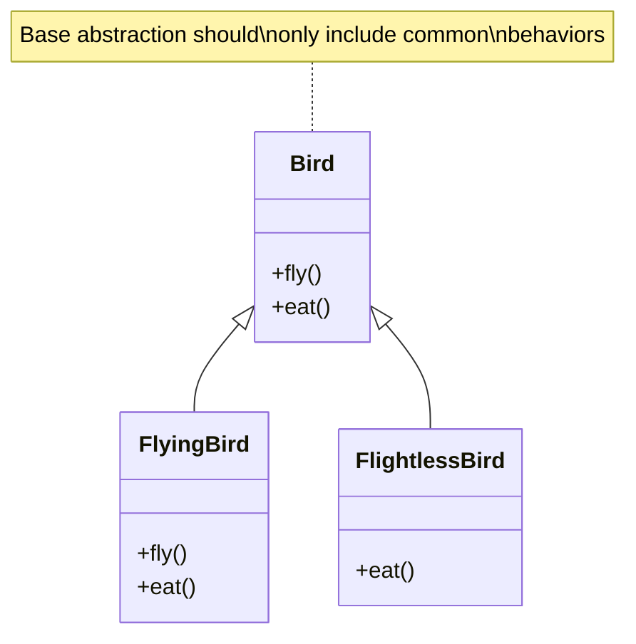

# Liskov Substitution Principle (LSP)

## Overview

The Liskov Substitution Principle (LSP), formulated by Barbara Liskov in 1987, states that objects in a program should be replaceable with instances of their subtypes without altering the correctness of the program. In other words, derived classes must be substitutable for their base classes.

### Real-World Analogy
Think of a professional sports team:
- Any player in a specific position can be substituted by another player trained for that position
- The replacement player may have different skills or styles
- But they must fulfill the same basic responsibilities
- The team should continue to function correctly regardless of which player is in position

## Key Concepts

### Core Components

1. **Behavioral Subtyping**
  - Subtypes must honor the contracts of their base types
  - Invariants must be preserved
  - Preconditions cannot be strengthened
  - Postconditions cannot be weakened

2. **Contract Specifications**
  - Method signatures
  - Type hierarchies
  - Expected behaviors
  - Exception handling

3. **Substitutability**
  - Runtime polymorphism
  - Type safety
  - Interface compliance
  - Behavioral compatibility

Let's visualize the LSP concept with a Mermaid diagram:



## Implementation

Here's a practical example showing both violation of LSP and its correct implementation:

import Tabs from '@theme/Tabs';
import TabItem from '@theme/TabItem';

<Tabs>
  <TabItem value="java" label="Java">
```java
// Bad Example - Violating LSP
class Bird {
    void fly() {
        // Flying implementation
    }
}

class Penguin extends Bird {
@Override
void fly() {
throw new UnsupportedOperationException("Penguins can't fly!");
}
}

// Good Example - Following LSP
interface Animal {
void move();
void eat();
}

class FlyingBird implements Animal {
@Override
public void move() {
fly();
}

    @Override
    public void eat() {
        // Eating implementation
    }
    
    private void fly() {
        // Flying implementation
    }
}

class FlightlessBird implements Animal {
@Override
public void move() {
walk();
}

    @Override
    public void eat() {
        // Eating implementation
    }
    
    private void walk() {
        // Walking implementation
    }
}

// Example of correct usage
class BirdManager {
private final List<Animal> birds;

    public BirdManager(List<Animal> birds) {
        this.birds = birds;
    }
    
    public void exerciseAnimals() {
        birds.forEach(bird -> {
            bird.move();  // Works correctly for both flying and flightless birds
            bird.eat();
        });
    }
}
```
  </TabItem>
  <TabItem value="go" label="Go">
```go
// Bad Example - Violating LSP
type Bird interface {
    Fly()
}

type Penguin struct{}

func (p *Penguin) Fly() {
    panic("Penguins can't fly!")
}

// Good Example - Following LSP
type Animal interface {
    Move()
    Eat()
}

type FlyingBird struct{}

func (b *FlyingBird) Move() {
    b.fly()
}

func (b *FlyingBird) Eat() {
    // Eating implementation
}

func (b *FlyingBird) fly() {
    // Flying implementation
}

type FlightlessBird struct{}

func (b *FlightlessBird) Move() {
    b.walk()
}

func (b *FlightlessBird) Eat() {
    // Eating implementation
}

func (b *FlightlessBird) walk() {
    // Walking implementation
}

// Example of correct usage
type BirdManager struct {
    birds []Animal
}

func NewBirdManager(birds []Animal) *BirdManager {
    return &BirdManager{birds: birds}
}

func (bm *BirdManager) ExerciseAnimals() {
    for _, bird := range bm.birds {
        bird.Move() // Works correctly for both flying and flightless birds
        bird.Eat()
    }
}
```
  </TabItem>
</Tabs>

## Related Patterns

1. **Template Method Pattern**
  - Supports LSP through well-defined extension points
  - Base class defines the algorithm structure
  - Subclasses implement specific steps

2. **Strategy Pattern**
  - Complements LSP by allowing behavior substitution
  - Supports runtime behavior changes
  - Maintains type safety

3. **Factory Method Pattern**
  - Creates objects following LSP
  - Ensures type compatibility
  - Manages object creation complexity

## Best Practices

### Design & Implementation
1. Design by contract
2. Use composition over inheritance when appropriate
3. Keep inheritance hierarchies shallow
4. Document behavioral contracts clearly
5. Use interface segregation

### Testing
1. Write tests at the interface level
2. Test all implementations against the same test suite
3. Include contract tests
4. Verify exception handling
5. Test edge cases for each implementation

### Monitoring
1. Track type usage patterns
2. Monitor exception rates by implementation
3. Log substitution failures
4. Profile performance across implementations

## Common Pitfalls

1. **Square-Rectangle Problem**
  - Problem: Violating behavioral contracts
  - Solution: Design immutable properties or use composition

2. **Exception Handling Inconsistency**
  - Problem: Different exception types across implementations
  - Solution: Standardize exception hierarchies

3. **Type Checking**
  - Problem: Runtime type checks (instanceof)
  - Solution: Proper abstraction and polymorphism

4. **Contract Violations**
  - Problem: Weakening postconditions
  - Solution: Strict adherence to base type contracts

## Use Cases

### 1. Payment Processing System
- **Scenario**: Multiple payment providers
- **Implementation**:
  - Common payment processor interface
  - Various provider implementations
  - Consistent error handling
  - Uniform transaction lifecycle

### 2. Database Access Layer
- **Scenario**: Multiple database types
- **Implementation**:
  - Abstract repository interface
  - Specific database implementations
  - Consistent CRUD operations
  - Uniform transaction handling

### 3. File Processing System
- **Scenario**: Different file formats
- **Implementation**:
  - Common file processor interface
  - Format-specific processors
  - Consistent validation
  - Uniform error handling

## Deep Dive Topics

### Thread Safety
- Contract preservation in concurrent contexts
- Thread safety consistency across implementations
- Synchronization requirements
- Immutability considerations

### Distributed Systems
- Remote proxy implementations
- Network error handling
- Consistency in distributed operations
- Service interface versioning

### Performance
- Implementation-specific optimizations
- Contract overhead considerations
- Memory usage patterns
- Polymorphic call overhead

## Additional Resources

### Books
1. "Object-Oriented Software Construction" by Bertrand Meyer
2. "Effective Java" by Joshua Bloch
3. "Design Patterns: Elements of Reusable Object-Oriented Software" by Gang of Four

### Online Resources
1. [Martin Fowler's Blog - LSP](https://martinfowler.com)
2. [Uncle Bob's Clean Code Blog](https://blog.cleancoder.com)
3. [SOLID Principles Explained](https://www.digitalocean.com/community/tutorials)

### Tools
1. ArchUnit - Architecture testing
2. Contract Tests frameworks
3. Static code analyzers

## FAQs

### Q: How does LSP differ from other SOLID principles?
A: While other SOLID principles focus on class relationships and responsibilities, LSP specifically deals with inheritance and subtyping behavior. It ensures that inheritance hierarchies are designed correctly for substitutability.

### Q: When should I use inheritance vs composition?
A: Use inheritance when:
- There's a true "is-a" relationship
- The subclass is truly substitutable
- The base class was designed for inheritance

Use composition when:
- You need implementation flexibility
- There's a "has-a" relationship
- You want to avoid inheritance complexity

### Q: How do I identify LSP violations?
A: Look for:
- Methods throwing UnsupportedOperationException
- Runtime type checks (instanceof)
- Different exception types in subtypes
- Violated invariants in subtypes

### Q: Can LSP be applied to functional programming?
A: Yes, through:
- Type classes
- Higher-order functions
- Parametric polymorphism
- Behavioral typing

### Q: How does LSP affect API design?
A: LSP influences API design by:
- Encouraging interface-based design
- Promoting consistent behavior
- Supporting extensibility
- Ensuring backward compatibility