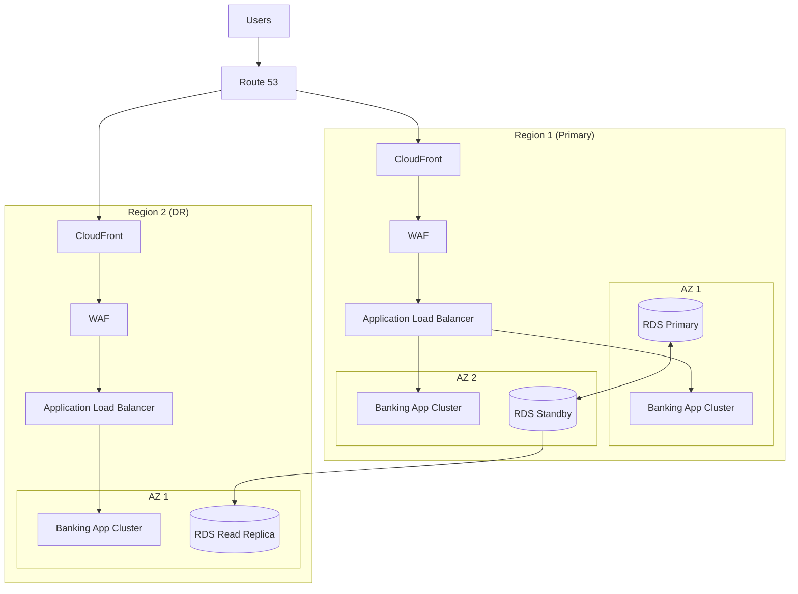
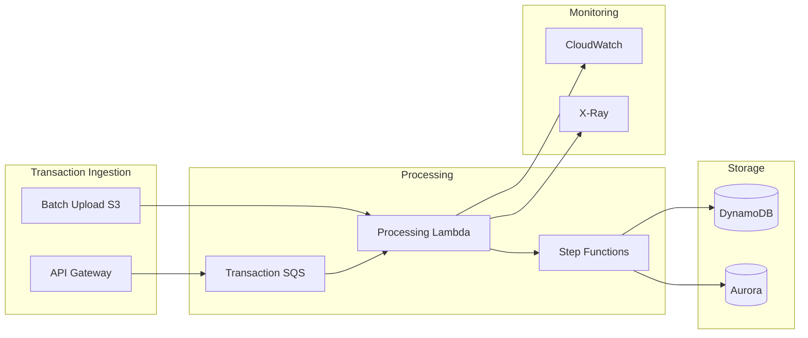
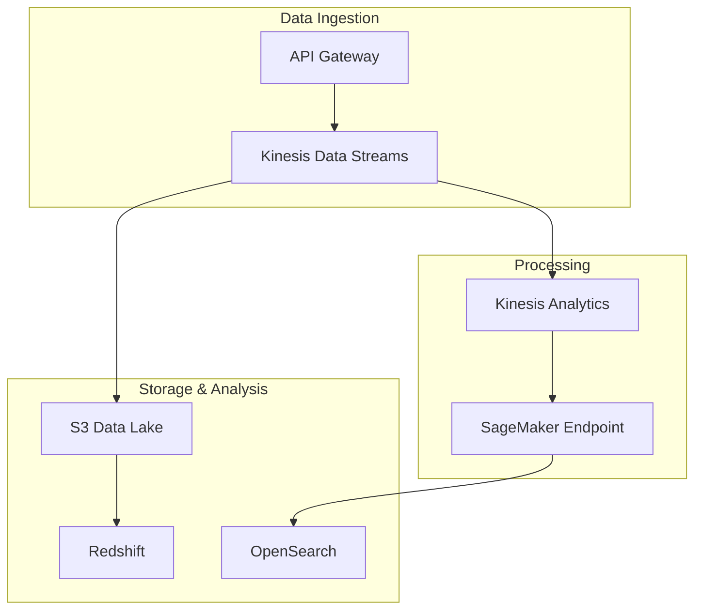
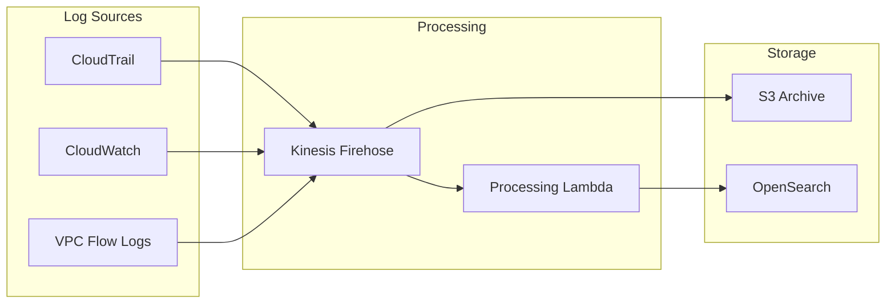
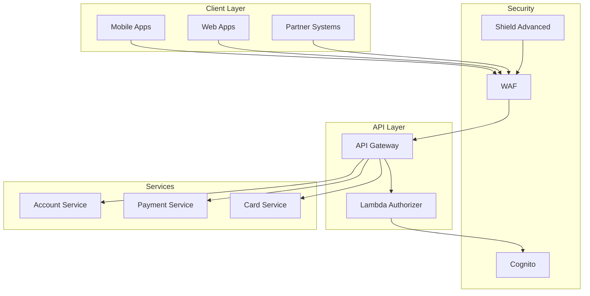
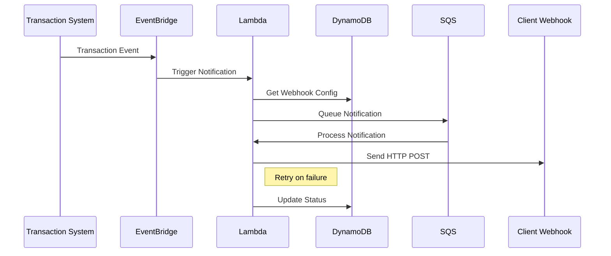

# Banking System Design & AWS Architecture Guide

## Section 1: High Availability Banking Architecture

### Core Banking System HA Design

Q: How would you design a highly available core banking system in AWS that handles transactions 24/7?

A: Let's break this down into components and requirements:

**Key Requirements:**
- 99.999% availability (5 minutes downtime per year)
- Strong consistency for transactions
- Sub-second response times
- Compliance with financial regulations
- Comprehensive audit logging
- Disaster recovery with RPO < 1 minute

**Architecture Solution:**



**Detailed Component Explanation:**

1. **Front-end Layer**
    - CloudFront for static content delivery
    - WAF for DDoS protection and security rules
    - Route 53 with health checks for DNS failover

2. **Application Layer**
    - ECS Fargate for containerized applications
    - Auto-scaling based on transaction volume
    - Session management using ElastiCache Redis

3. **Database Layer**
    - Multi-AZ RDS deployment
    - Read replicas for reporting workloads
    - Point-in-time recovery enabled

4. **Security Layer**
    - AWS Shield Advanced for DDoS protection
    - AWS KMS for encryption
    - AWS Secrets Manager for credential management

## Section 2: Transaction Processing System

Q: Design a scalable transaction processing system that handles both real-time and batch transactions.



**System Components:**

1. **Transaction Ingestion:**
    - API Gateway for real-time transactions
    - S3 for batch file uploads
    - SQS for message queuing

2. **Processing Layer:**
    - Lambda functions for stateless processing
    - Step Functions for transaction orchestration
    - DynamoDB for transaction status

3. **Storage Layer:**
    - Aurora for transaction records
    - DynamoDB for real-time lookups
    - S3 for document storage

## Section 3: Fraud Detection System

Q: Design a real-time fraud detection system for banking transactions.



**System Details:**

1. **Real-time Processing:**
    - Kinesis Data Streams for transaction ingestion
    - Kinesis Analytics for pattern detection
    - SageMaker endpoints for ML inference

2. **Storage & Analysis:**
    - S3 data lake for historical data
    - Redshift for analytical queries
    - OpenSearch for real-time search

## Section 4: Compliance & Audit System

Q: Design a comprehensive logging and audit system for banking operations.



**Implementation Details:**

1. **Log Collection:**
    - CloudTrail for API activity
    - CloudWatch Logs for application logs
    - VPC Flow Logs for network activity

2. **Processing & Storage:**
    - Kinesis Firehose for log aggregation
    - Lambda for log enrichment
    - S3 for long-term storage
    - OpenSearch for searching

## Section 5: Banking API Gateway

Q: Design a secure API gateway for banking services.



**Security Implementation:**

1. **Authentication & Authorization:**
    - Cognito for customer authentication
    - Lambda authorizers for fine-grained control
    - WAF for attack protection

2. **API Management:**
    - Rate limiting per customer
    - Request validation
    - Response transformation
    - Error handling

## Best Practices for Banking Systems

1. **Security:**
    - Encryption at rest and in transit
    - Regular security audits
    - Penetration testing
    - Compliance monitoring

2. **Performance:**
    - Cache frequently accessed data
    - Use read replicas for reporting
    - Implement circuit breakers
    - Monitor latency at all layers

3. **Monitoring:**
    - Real-time dashboards
    - Automated alerts
    - Transaction tracking
    - Error rate monitoring

4. **Compliance:**
    - PCI DSS compliance
    - SOX compliance
    - GDPR compliance
    - Regular audits

## 1. Lambda & API Gateway Questions

### Q1: How would you design a serverless API with rate limiting and authentication?

A: Let's build an example using Terraform:

```hcl
# API Gateway definition
resource "aws_api_gateway_rest_api" "banking_api" {
  name = "banking-api"
  
  endpoint_configuration {
    types = ["REGIONAL"]
  }
}

# Lambda function for authentication
resource "aws_lambda_function" "auth_lambda" {
  filename         = "auth.zip"
  function_name    = "api-authorizer"
  role            = aws_iam_role.lambda_role.arn
  handler         = "auth.handler"
  runtime         = "nodejs16.x"

  environment {
    variables = {
      JWT_SECRET = var.jwt_secret
    }
  }
}

# API Gateway Authorizer
resource "aws_api_gateway_authorizer" "api_authorizer" {
  name                   = "banking-authorizer"
  rest_api_id            = aws_api_gateway_rest_api.banking_api.id
  authorizer_uri         = aws_lambda_function.auth_lambda.invoke_arn
  authorizer_credentials = aws_iam_role.invocation_role.arn
}

# Usage plan for rate limiting
resource "aws_api_gateway_usage_plan" "banking_usage_plan" {
  name = "banking-usage-plan"

  api_stages {
    api_id = aws_api_gateway_rest_api.banking_api.id
    stage  = aws_api_gateway_stage.prod.stage_name
  }

  quota_settings {
    limit  = 1000
    period = "DAY"
  }

  throttle_settings {
    burst_limit = 100
    rate_limit  = 50
  }
}
```

Example of the Lambda authorizer code:

```javascript
exports.handler = async (event) => {
  try {
    // Extract JWT token from header
    const token = event.authorizationToken;
    
    // Verify token
    const decoded = jwt.verify(token, process.env.JWT_SECRET);
    
    // Generate IAM policy
    return generatePolicy('user', 'Allow', event.methodArn, decoded);
  } catch (error) {
    return generatePolicy('user', 'Deny', event.methodArn);
  }
};

const generatePolicy = (principalId, effect, resource, decoded = {}) => {
  return {
    principalId,
    policyDocument: {
      Version: '2012-10-17',
      Statement: [{
        Action: 'execute-api:Invoke',
        Effect: effect,
        Resource: resource
      }]
    },
    context: decoded
  };
};
```

### Q2: Explain how you would implement a dead letter queue for Lambda functions with error handling

```hcl
# SQS Dead Letter Queue
resource "aws_sqs_queue" "dlq" {
  name = "lambda-dlq"
  message_retention_seconds = 1209600 # 14 days
}

# Lambda Function with DLQ
resource "aws_lambda_function" "process_transaction" {
  filename         = "process_transaction.zip"
  function_name    = "process-transaction"
  role            = aws_iam_role.lambda_role.arn
  handler         = "index.handler"
  runtime         = "nodejs16.x"

  dead_letter_config {
    target_arn = aws_sqs_queue.dlq.arn
  }

  environment {
    variables = {
      RETRY_COUNT = "3"
    }
  }
}
```

Example Lambda code with error handling:

```javascript
exports.handler = async (event) => {
  const retryCount = parseInt(process.env.RETRY_COUNT);
  
  try {
    // Process transaction
    await processTransaction(event);
    
    return {
      statusCode: 200,
      body: JSON.stringify({ message: 'Transaction processed successfully' })
    };
  } catch (error) {
    if (event.retryAttempt && event.retryAttempt >= retryCount) {
      // Send to DLQ after max retries
      throw new Error(`Max retries reached: ${error.message}`);
    }
    
    // Implement exponential backoff
    const retryAttempt = (event.retryAttempt || 0) + 1;
    await new Promise(resolve => 
      setTimeout(resolve, Math.pow(2, retryAttempt) * 100)
    );
    
    return await exports.handler({
      ...event,
      retryAttempt
    });
  }
};
```

## 2. Infrastructure as Code Scenarios

### Q1: Design a multi-environment infrastructure using Terraform workspaces


graph TD
A[Project Root] --> B[modules/]
A --> C[environments/]
B --> D[vpc/]
B --> E[rds/]
B --> F[lambda/]
C --> G[dev/]
C --> H[staging/]
C --> I[prod/]
G --> J[main.tf]
G --> K[variables.tf]
G --> L[terraform.tfvars]


Example structure:

```hcl
# modules/vpc/main.tf
module "vpc" {
  source = "terraform-aws-modules/vpc/aws"

  name = "${var.environment}-banking-vpc"
  cidr = var.vpc_cidr

  azs             = var.availability_zones
  private_subnets = var.private_subnet_cidrs
  public_subnets  = var.public_subnet_cidrs

  enable_nat_gateway = true
  single_nat_gateway = var.environment != "prod"

  tags = {
    Environment = var.environment
    Terraform   = "true"
  }
}

# environments/prod/main.tf
module "banking_vpc" {
  source = "../../modules/vpc"

  environment         = "prod"
  vpc_cidr           = "10.0.0.0/16"
  availability_zones = ["us-west-2a", "us-west-2b", "us-west-2c"]
  private_subnet_cidrs = ["10.0.1.0/24", "10.0.2.0/24", "10.0.3.0/24"]
  public_subnet_cidrs  = ["10.0.101.0/24", "10.0.102.0/24", "10.0.103.0/24"]
}
```

### Q2: Implement a CI/CD pipeline for Infrastructure deployment

```yaml
# buildspec.yml for AWS CodeBuild
version: 0.2

phases:
  install:
    runtime-versions:
      python: 3.9
    commands:
      - wget https://releases.hashicorp.com/terraform/1.0.0/terraform_1.0.0_linux_amd64.zip
      - unzip terraform_1.0.0_linux_amd64.zip
      - mv terraform /usr/local/bin/
  
  pre_build:
    commands:
      - terraform init
      - terraform workspace select ${ENVIRONMENT}
      
  build:
    commands:
      - terraform plan -out=tfplan
      - terraform apply -auto-approve tfplan
      
  post_build:
    commands:
      - echo "Infrastructure deployment completed"

artifacts:
  files:
    - tfplan
    - terraform.tfstate
```

### Q3: Implement a serverless ETL pipeline using Step Functions

```hcl
# Step Function definition
resource "aws_sfn_state_machine" "etl_pipeline" {
  name     = "banking-etl-pipeline"
  role_arn = aws_iam_role.step_function_role.arn

  definition = <<EOF
{
  "StartAt": "ExtractData",
  "States": {
    "ExtractData": {
      "Type": "Task",
      "Resource": "${aws_lambda_function.extract.arn}",
      "Next": "TransformData",
      "Retry": [{
        "ErrorEquals": ["States.ALL"],
        "IntervalSeconds": 2,
        "MaxAttempts": 3,
        "BackoffRate": 2
      }]
    },
    "TransformData": {
      "Type": "Task",
      "Resource": "${aws_lambda_function.transform.arn}",
      "Next": "LoadData"
    },
    "LoadData": {
      "Type": "Task",
      "Resource": "${aws_lambda_function.load.arn}",
      "End": true
    }
  }
}
EOF
}
```

Example Lambda function for transformation:

```python
import pandas as pd

def handler(event, context):
    try:
        # Read data from S3
        df = pd.read_csv(f"s3://{event['bucket']}/{event['key']}")
        
        # Apply transformations
        df['transaction_date'] = pd.to_datetime(df['transaction_date'])
        df['amount'] = df['amount'].astype(float)
        
        # Calculate aggregations
        daily_totals = df.groupby('transaction_date')['amount'].sum()
        
        # Save transformed data
        output_key = f"transformed/{event['key']}"
        daily_totals.to_csv(f"s3://{event['bucket']}/{output_key}")
        
        return {
            'statusCode': 200,
            'body': {
                'output_bucket': event['bucket'],
                'output_key': output_key
            }
        }
    except Exception as e:
        raise Exception(f"Transform failed: {str(e)}")
```

## 3. Real-world Scenario Questions

### Q1: How would you implement a webhook system for real-time transaction notifications?



Implementation example:

```python
# Lambda function for webhook delivery
import boto3
import json
import requests
from aws_lambda_powertools import Logger

logger = Logger()
dynamodb = boto3.resource('dynamodb')
table = dynamodb.Table('webhook_configs')

@logger.inject_lambda_context
def handler(event, context):
    try:
        # Get webhook configuration
        webhook_config = table.get_item(
            Key={'clientId': event['clientId']}
        )['Item']
        
        # Prepare payload
        payload = {
            'event_type': event['type'],
            'transaction_id': event['transactionId'],
            'amount': event['amount'],
            'timestamp': event['timestamp']
        }
        
        # Send webhook
        response = requests.post(
            webhook_config['url'],
            json=payload,
            headers={
                'X-Signature': generate_signature(payload, webhook_config['secret']),
                'Content-Type': 'application/json'
            }
        )
        
        response.raise_for_status()
        
        # Update delivery status
        table.update_item(
            Key={'clientId': event['clientId']},
            UpdateExpression='SET lastDelivery = :timestamp, deliveryStatus = :status',
            ExpressionAttributeValues={
                ':timestamp': event['timestamp'],
                ':status': 'SUCCESS'
            }
        )
        
        return {
            'statusCode': 200,
            'body': 'Webhook delivered successfully'
        }
        
    except requests.exceptions.RequestException as e:
        logger.error(f"Webhook delivery failed: {str(e)}")
        raise
```
# Senior Cloud Engineer Conceptual Q&A Guide

## AWS Core Services

### Networking
Q: Explain the difference between Security Groups and NACLs.
A:
- Security Groups:
   - Stateful
   - Operate at instance level
   - Allow rules only (implicit deny)
   - Rules are evaluated all together

- NACLs:
   - Stateless
   - Operate at subnet level
   - Both allow and deny rules
   - Rules are evaluated in order

Q: What's the maximum number of VPCs and subnets you can have per region?
A:
- VPCs: 5 per region (soft limit)
- Subnets: 200 per VPC (hard limit)

Q: Explain Transit Gateway and its benefits.
A:
- Central hub for connecting VPCs and on-premises networks
- Simplifies network topology
- Reduces connection complexity
- Supports multicast routing
- Can share across accounts using RAM
- Enables global routing through inter-region peering

### Compute
Q: What are the different consistent states of an EC2 instance?
A:
- pending
- running
- stopping
- stopped
- shutting-down
- terminated

Q: Explain EC2 placement groups.
A:
1. Cluster: Low latency, high throughput (same rack)
2. Spread: Protect against hardware failures (different racks)
3. Partition: Distributed applications (different partitions)

### Storage
Q: Compare EBS volume types and their use cases.
A:
- gp3: General purpose SSD, balanced price/performance
- io2: High-performance SSD, mission-critical workloads
- st1: Throughput-optimized HDD, big data, data warehouses
- sc1: Cold HDD, infrequently accessed data

Q: What's the difference between EFS and FSx?
A:
- EFS:
   - Managed NFS for Linux
   - Dynamic scaling
   - Multi-AZ by default

- FSx:
   - Windows File Server (FSx for Windows)
   - Lustre (FSx for Lustre)
   - NetApp ONTAP
   - OpenZFS

## Advanced Concepts

### High Availability
Q: What's the difference between RTO and RPO?
A:
- RTO (Recovery Time Objective): Time to restore service
- RPO (Recovery Point Objective): Acceptable data loss period

Q: Explain Auto Scaling cooldown period.
A:
- Default: 300 seconds
- Prevents new scaling activities
- Can be customized per scaling policy
- Helps prevent scaling thrashing

### Security
Q: What is AWS KMS and what are its key concepts?
A:
- Customer Master Keys (CMKs)
- Key rotation
- Key policies
- Grants
- Envelope encryption
- Integration with AWS services

Q: Explain IAM role assumption process.
A:
1. Application calls AWS STS AssumeRole
2. STS returns temporary credentials
3. Application uses credentials to access AWS resources
4. Credentials expire after specified duration

### Cost Optimization
Q: Name key strategies for AWS cost optimization.
A:
1. Right sizing instances
2. Using Spot instances where applicable
3. Reserved Instances/Savings Plans
4. S3 lifecycle policies
5. Autoscaling based on demand
6. Tag-based cost allocation
7. Using managed services vs self-managed

### Performance
Q: What tools would you use for performance monitoring?
A:
1. CloudWatch
   - Metrics
   - Logs
   - Dashboards
2. X-Ray for tracing
3. CloudTrail for API activity
4. VPC Flow Logs
5. AWS Config for resource tracking

### DevOps Practices
Q: Explain Infrastructure as Code best practices.
A:
1. Version control everything
2. Use modular design
3. Implement least privilege
4. Use consistent naming conventions
5. Implement proper state management
6. Regular testing
7. Documentation as code

Q: What is GitOps and its benefits?
A:
- Git as single source of truth
- Declarative infrastructure
- Automated reconciliation
- Version control benefits
- Audit trail
- Easy rollbacks

## Troubleshooting Scenarios

Q: EC2 instance is unreachable via SSH. What steps would you take?
A:
1. Check security group rules
2. Verify network ACL settings
3. Ensure instance has public IP
4. Check route table configuration
5. Verify key pair
6. Check instance status checks
7. Review VPC flow logs

Q: RDS database performance is degrading. How do you investigate?
A:
1. Check CloudWatch metrics
   - CPU utilization
   - Memory pressure
   - I/O performance
2. Review slow query logs
3. Check connection count
4. Analyze Performance Insights
5. Review backup/maintenance windows

## Service Limits & Quotas

Q: Name some important AWS service quotas to monitor.
A:
1. EC2:
   - Running On-Demand instances
   - Spot instance requests
2. VPC:
   - VPCs per region
   - Subnets per VPC
3. IAM:
   - Roles per account
   - Policies per role
4. RDS:
   - Instances per region
   - Storage per instance

## Compliance & Governance

Q: Explain AWS Shared Responsibility Model.
A:
AWS is responsible for:
- Physical security
- Network infrastructure
- Virtualization layer

Customer is responsible for:
- Data encryption
- OS patching
- Network configuration
- Identity management

## Modern Architecture Patterns

Q: Explain the difference between horizontal and vertical scaling.
A:
Horizontal Scaling:
- Add more instances
- Distribute load
- Better fault tolerance
- Usually more cost-effective

Vertical Scaling:
- Increase instance size
- Simpler architecture
- Limited by hardware
- Potential downtime during scaling

Q: What is the strangler pattern and when would you use it?
A:
- Gradually replace legacy systems
- Minimize risk
- Maintain business continuity
- Incremental modernization
- Used in monolith to microservice transitions

## AWS Well-Architected Framework

Q: Name and briefly explain the six pillars.
A:
1. Operational Excellence
   - Run and monitor systems
2. Security
   - Protect data and systems
3. Reliability
   - Recover from disruptions
4. Performance Efficiency
   - Use resources efficiently
5. Cost Optimization
   - Avoid unnecessary costs
6. Sustainability
   - Minimize environmental impact

## Container & Serverless

Q: Compare ECS Launch Types.
A:
EC2 Launch Type:
- More control
- Can use reserved instances
- Better for large workloads

Fargate:
- Serverless
- Pay per task
- Less management overhead
- Better for variable workloads

Q: Explain Lambda cold starts and how to minimize them.
A:
Causes:
- New function version
- No recent invocations
- Concurrent execution limit

Mitigation:
- Provisioned concurrency
- Keep functions warm
- Optimize deployment package
- Use appropriate memory allocation
