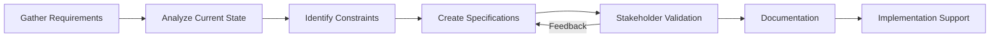
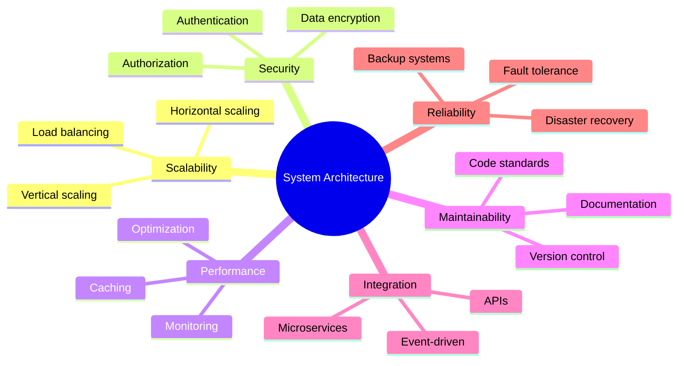
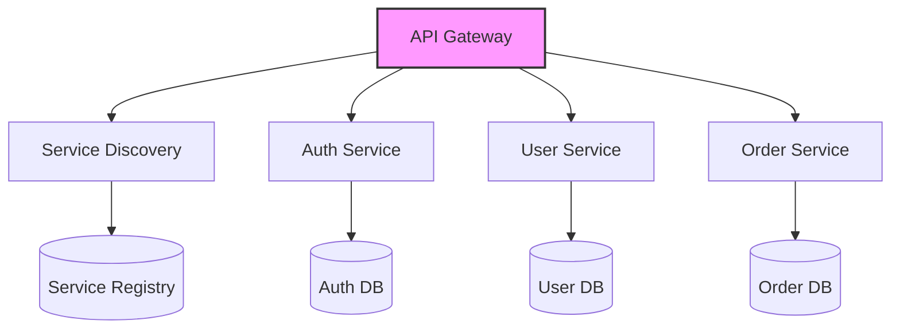
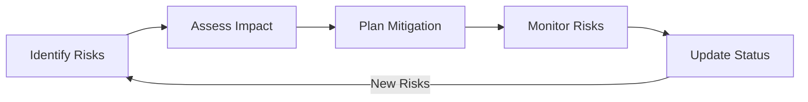
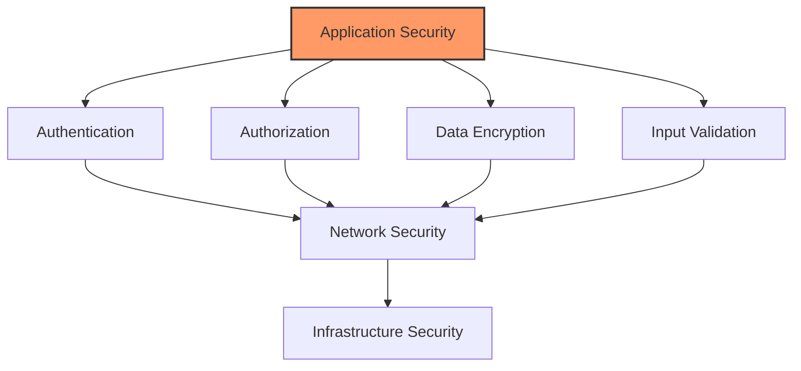

# Technical System Analyst Interview Preparation Guide

## System Analysis Fundamentals

### Q: What is the role of a Technical System Analyst?
A: A Technical System Analyst bridges the gap between business needs and technical solutions by:
- Analyzing business requirements
- Designing system solutions
- Creating technical specifications
- Collaborating with developers and stakeholders
- Ensuring system quality and performance
- Documenting technical processes and architectures

### Q: What is your approach to analyzing a new system requirement?
A: I follow a structured approach:
1. Gather initial requirements from stakeholders
2. Analyze current system state
3. Identify constraints and dependencies
4. Create detailed specifications
5. Validate with stakeholders
6. Document technical requirements
7. Support implementation and testing




## Requirements Engineering

### Q: How do you handle conflicting requirements from different stakeholders?
A: I manage conflicting requirements through:
1. Documenting all requirements with their sources
2. Identifying conflicts and dependencies
3. Analyzing impact on system and business objectives
4. Facilitating stakeholder discussions
5. Proposing compromise solutions
6. Getting formal sign-off on final decisions

### Q: What tools do you use for requirements management?
A: Common tools include:
- JIRA for requirement tracking
- Confluence for documentation
- Draw.io or Lucidchart for diagrams
- Enterprise Architect for UML modeling
- Microsoft Office Suite for documentation
- Agile boards for requirement prioritization

## System Architecture

### Q: How do you approach system architecture design?
A: Key considerations include:



### Q: Can you explain different architectural patterns?
A: Here are key architectural patterns:

1. **Layered Architecture**
    - Presentation Layer
    - Business Layer
    - Data Access Layer
    - Database Layer

2. **Microservices Architecture**
    - Independent services
    - API Gateway
    - Service Discovery
    - Event-driven communication

3. **Event-Driven Architecture**
    - Event producers
    - Event consumers
    - Message brokers
    - Asynchronous processing



## Technical Documentation

### Q: What elements do you include in technical documentation?
A: Essential elements include:
1. System Overview
2. Architecture Diagrams
3. Data Flow Diagrams
4. API Specifications
5. Database Schemas
6. Sequence Diagrams
7. Deployment Instructions
8. Security Considerations
9. Performance Requirements
10. Maintenance Procedures

### Q: How do you document APIs?
A: Key components of API documentation:

```markdown
# API Endpoint Documentation Template

## Endpoint: /api/v1/resource
- Method: POST
- Description: Creates a new resource

### Request Body
```json
{
    "name": "string",
    "type": "string",
    "properties": {}
}
```

### Response
```json
{
    "id": "string",
    "status": "success",
    "data": {}
}
```

### Error Codes
- 400: Bad Request
- 401: Unauthorized
- 403: Forbidden
- 500: Internal Server Error


## Project Management

### Q: How do you handle project risks and issues?
A: I follow a structured risk management approach:



### Q: How do you prioritize technical debt?
A: Technical debt prioritization framework:
1. Impact Assessment
    - System stability
    - Performance impact
    - Maintenance cost
2. Effort Estimation
3. Business Value Analysis
4. Risk Assessment
5. Resource Availability

## Common Technical Scenarios

### Q: How would you improve a slow-performing system?
A: Systematic approach to performance optimization:

1. **Identify Performance Issues**
    - Monitor system metrics
    - Analyze logs
    - Profile code
    - Review database queries

2. **Analysis**
    - Identify bottlenecks
    - Review resource usage
    - Check network latency
    - Analyze database performance

3. **Solutions**
    - Implement caching
    - Optimize queries
    - Scale resources
    - Code optimization
    - Load balancing

### Q: How do you ensure system security?
A: Multi-layered security approach:



### Approach to Analyzing New System Requirements
1. Gather initial requirements from stakeholders
2. Analyze current system state
3. Identify constraints and dependencies
4. Create detailed specifications
5. Validate with stakeholders
6. Document technical requirements
7. Support implementation and testing

## Requirements Engineering

### Handling Conflicting Requirements
1. Document all requirements with sources
2. Identify conflicts and dependencies
3. Analyze impact on system and business objectives
4. Facilitate stakeholder discussions
5. Propose compromise solutions
6. Get formal sign-off on final decisions

### Requirements Management Tools
- JIRA for requirement tracking
- Confluence for documentation
- Draw.io or Lucidchart for diagrams
- Enterprise Architect for UML modeling
- Microsoft Office Suite for documentation
- Agile boards for requirement prioritization

## System Architecture

### Architecture Considerations
- Scalability
   - Horizontal scaling
   - Vertical scaling
   - Load balancing
- Security
   - Authentication
   - Authorization
   - Data encryption
- Performance
   - Caching
   - Optimization
   - Monitoring
- Maintainability
   - Documentation
   - Code standards
   - Version control
- Integration
   - APIs
   - Microservices
   - Event-driven
- Reliability
   - Fault tolerance
   - Backup systems
   - Disaster recovery

### Architectural Patterns

1. **Layered Architecture**
   - Presentation Layer
   - Business Layer
   - Data Access Layer
   - Database Layer

2. **Microservices Architecture**
   - Independent services
   - API Gateway
   - Service Discovery
   - Event-driven communication

3. **Event-Driven Architecture**
   - Event producers
   - Event consumers
   - Message brokers
   - Asynchronous processing

## Technical Documentation

### Essential Documentation Elements
1. System Overview
2. Architecture Diagrams
3. Data Flow Diagrams
4. API Specifications
5. Database Schemas
6. Sequence Diagrams
7. Deployment Instructions
8. Security Considerations
9. Performance Requirements
10. Maintenance Procedures

### API Documentation Template
```markdown
# API Endpoint Documentation

## Endpoint: /api/v1/resource
- Method: POST
- Description: Creates a new resource

### Request Body
{
    "name": "string",
    "type": "string",
    "properties": {}
}

### Response
{
    "id": "string",
    "status": "success",
    "data": {}
}

### Error Codes
- 400: Bad Request
- 401: Unauthorized
- 403: Forbidden
- 500: Internal Server Error
```

## Part 2: AWS & Banking Systems

### AWS Architecture Components

#### Essential AWS Services for Banking Applications
1. **Frontend & Security**
   - Route 53 for DNS
   - CloudFront for content delivery
   - WAF for security
   - Shield for DDoS protection

2. **Computing & Containers**
   - ECS/EKS for containerization
   - EC2 for computing resources
   - Lambda for serverless

3. **Database & Caching**
   - RDS Multi-AZ for databases
   - ElastiCache for session management
   - DynamoDB for high-throughput operations

4. **Monitoring & Compliance**
   - CloudWatch for monitoring
   - CloudTrail for auditing
   - Config for compliance
   - GuardDuty for security

### Banking Systems Integration

#### Core Banking Integration Components
1. **API Layer**
   - REST APIs
   - SOAP interfaces
   - Message queues

2. **Security Measures**
   - Mutual TLS
   - API key management
   - Request signing
   - IP whitelisting

3. **Data Handling**
   - XML/JSON transformation
   - Character encoding
   - Date/time standardization

### Payment Processing Architecture

#### Key Components
1. **Frontend Services**
   - API Gateway
   - Lambda functions
   - Cognito authentication

2. **Processing Layer**
   - Step Functions
   - SQS queues
   - SNS notifications

3. **Storage Solutions**
   - RDS for transactions
   - DynamoDB for sessions
   - S3 for documents

### High Availability & Disaster Recovery

#### Database HA Strategy
1. **Multi-AZ Deployment**
   - Primary database
   - Standby replica
   - Automated failover

2. **Read Scalability**
   - Read replicas
   - Cross-region replication
   - Connection load balancing

3. **Backup Strategy**
   - Automated backups
   - Point-in-time recovery
   - Cross-region copies

### Security & Compliance

#### PCI DSS Compliance in AWS
1. **Network Security**
   - VPC segmentation
   - Security groups
   - Network ACLs
   - VPN connectivity

2. **Data Protection**
   - KMS encryption
   - TLS in transit
   - Key rotation
   - Secure key management

3. **Access Control**
   - IAM roles
   - MFA implementation
   - Least privilege
   - Access reviews

#### Secure CI/CD Pipeline
1. **Source Control**
   - CodeCommit
   - Branch protection
   - Code review

2. **Build & Test**
   - CodeBuild
   - Security scanning
   - Unit testing
   - Integration testing

3. **Deployment**
   - CodeDeploy
   - Blue-green deployment
   - Rollback capability
   - Deployment approval

### Best Practices for Banking Applications

1. **Performance**
   - Cache implementation
   - Connection pooling
   - Query optimization
   - Load balancing

2. **Security**
   - Encryption everywhere
   - Regular audits
   - Penetration testing
   - Security monitoring

3. **Compliance**
   - Audit logging
   - Data retention
   - Access controls
   - Regular reporting

4. **Monitoring**
   - Real-time alerts
   - Performance metrics
   - Error tracking
   - User activity monitoring

### Interview Tips

1. **Prepare Examples**
   - Previous projects
   - Challenge resolutions
   - Architecture decisions
   - Team collaboration

2. **Technical Knowledge**
   - AWS services
   - Banking protocols
   - Security standards
   - Integration patterns

3. **Soft Skills**
   - Communication
   - Problem-solving
   - Team collaboration
   - Project management

4. **Banking Domain**
   - Transaction processing
   - Financial regulations
   - Banking products
   - Security requirements