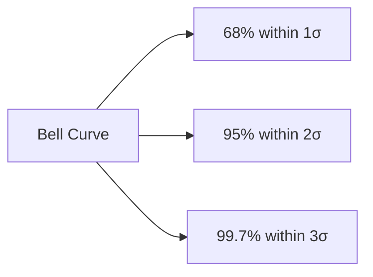
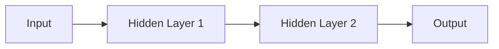
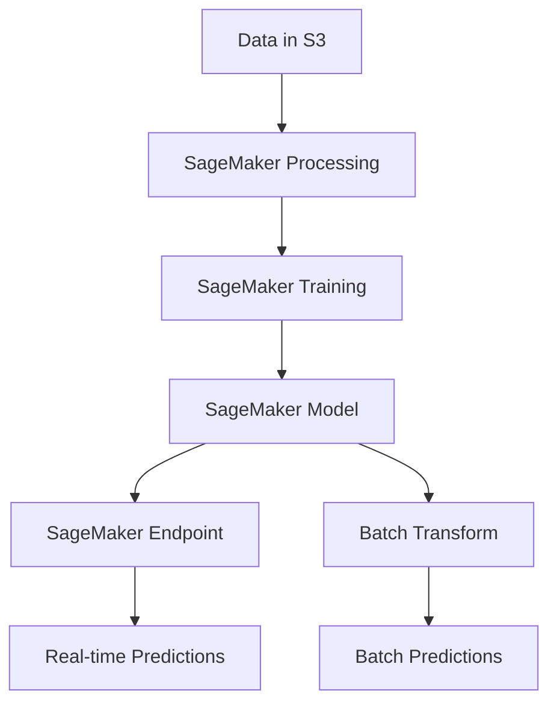
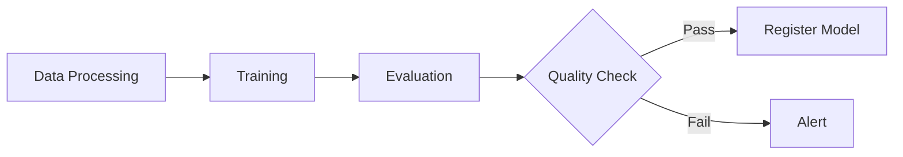

# AWS Certified Machine Learning - Specialty Cheat Sheet

## 1. Data Engineering Fundamentals

### Data Repositories

**Amazon S3**
- Primary storage for ML data
- Supports versioning, encryption, lifecycle policies
- Use S3 Select for filtering data before processing

**Amazon EFS**
- Shared file system for distributed training
- Auto-scaling, low latency

**Amazon FSx for Lustre**
- High-performance file system for HPC/ML workloads
- Integrates with S3

### Data Ingestion

**Batch Ingestion**
- **AWS Data Pipeline**: ETL orchestration
- **AWS Glue**: Serverless ETL, crawler for schema discovery
- **Amazon EMR**: Big data processing (Spark, Hadoop)

**Streaming Ingestion**
- **Amazon Kinesis Data Streams/Flink]**: Real-time data streaming
- **Amazon Kinesis Data Firehose**: Load streaming data to S3, Redshift
- **Amazon Kinesis Data Analytics**: Real-time analytics with SQL

**Migration**
- **AWS DMS**: Database migration
- **AWS Snowball**: Petabyte-scale data transfer

### Data Transformation

**AWS Glue**
- ETL jobs in Python/Scala
- Dynamic Frames for schema flexibility
- Job bookmarks for incremental processing

**Amazon Athena**
- Serverless SQL queries on S3
- Uses Presto engine

**Amazon EMR**
- Managed Hadoop/Spark clusters
- Supports Apache Hive, Pig, HBase

---

## 2. Exploratory Data Analysis (EDA)

### Data Types

- **Numerical**: Continuous (height, weight), Discrete (count)
- **Categorical**: Nominal (colors), Ordinal (ratings)
- **Time Series**: Sequential data points
- **Text**: Unstructured text data
- **Image/Audio**: Binary data

### Descriptive Statistics

**Central Tendency**
- **Mean**: Average value (sensitive to outliers)
- **Median**: Middle value (robust to outliers)
- **Mode**: Most frequent value

**Dispersion**
- **Range**: Max - Min
- **Variance**: Average squared deviation from mean
- **Standard Deviation**: √Variance
- **IQR (Interquartile Range)**: Q3 - Q1

### Data Visualization

**Box Plot**
```
    Q3 ──┐
         │  ← Outliers (•)
    Q2 ──┤  (Median)
         │
    Q1 ──┘

  Min  Q1  Q2  Q3  Max
   │   │   │   │   │
   └───┴───┴───┴───┘
      IQR
```
- Shows distribution, outliers, quartiles
- Outliers: < Q1 - 1.5×IQR or > Q3 + 1.5×IQR

**Scatter Plot**
```
  y │     •
    │   •   •
    │ •   •   •
    │   •   •
    └─────────── x
```
- Shows relationship between two variables
- Identifies correlation patterns

**Histogram**
```
Freq│  ▂▄▆█▆▄▂
    │ ▁▃▅▇▅▃▁
    └──────────
      Values
```
- Shows distribution of single variable
- Reveals skewness, modality

**Correlation Matrix**
- Heatmap showing correlations between features
- Values: -1 (negative) to +1 (positive)

### Data Distribution

**Normal Distribution**


**Skewness**
- **Positive Skew**: Tail extends right (mean > median)
- **Negative Skew**: Tail extends left (mean < median)

**Kurtosis**
- **High**: Sharp peak, heavy tails
- **Low**: Flat distribution

### Handling Missing Data

**Strategies**
- **Deletion**: Remove rows/columns (use when < 5% missing)
- **Imputation**: Fill with mean/median/mode
- **Forward/Backward Fill**: Use previous/next value (time series)
- **Model-based**: Predict missing values
- **Indicator Variable**: Add flag for missing values

### Outlier Detection

**Methods**
- **Z-Score**: |z| > 3 (for normal distribution)
- **IQR Method**: < Q1 - 1.5×IQR or > Q3 + 1.5×IQR
- **Isolation Forest**: ML-based detection
- **DBSCAN**: Density-based clustering

**Treatment**
- Remove outliers
- Cap/floor values (winsorization)
- Transform data (log, sqrt)
- Use robust algorithms

---

## 3. Feature Engineering

### Feature Scaling

**Normalization (Min-Max Scaling)**
- Range: [0, 1]
- Formula: (x - min) / (max - min)
- Use: When features have different ranges

**Standardization (Z-Score)**
- Mean: 0, Std: 1
- Formula: (x - μ) / σ
- Use: For algorithms assuming normal distribution (SVM, Logistic Regression)

**Robust Scaling**
- Uses median and IQR
- Robust to outliers

### Encoding Categorical Variables

**One-Hot Encoding**
- Creates binary columns for each category
- Use: Nominal data, tree-based models
- Issue: High dimensionality with many categories

**Label Encoding**
- Assigns integers to categories
- Use: Ordinal data
- Issue: Implies ordering

**Target Encoding**
- Replace category with target mean
- Risk: Overfitting

**Frequency Encoding**
- Replace with category frequency

### Feature Transformation

**Log Transformation**
- Reduces right skew
- Formula: log(x + 1)

**Box-Cox Transformation**
- Generalizes power transformations
- Requires positive values

**Polynomial Features**
- Creates interaction terms
- Example: x₁, x₂ → x₁², x₁x₂, x₂²

### Dimensionality Reduction

**PCA (Principal Component Analysis)**
- Linear transformation
- Unsupervised
- Maximizes variance
- Use: Remove correlation, reduce features

**t-SNE**
- Non-linear
- Good for visualization
- Computationally expensive

**LDA (Linear Discriminant Analysis)**
- Supervised
- Maximizes class separation

### Feature Selection

**Filter Methods**
- Correlation
- Chi-square test
- Mutual Information

**Wrapper Methods**
- Forward selection
- Backward elimination
- Recursive Feature Elimination (RFE)

**Embedded Methods**
- Lasso (L1 regularization)
- Ridge (L2 regularization)
- Tree-based feature importance

### Handling Imbalanced Data

**Techniques**
- **Oversampling**: SMOTE (Synthetic Minority Over-sampling)
- **Undersampling**: Random undersampling majority class
- **Class Weights**: Assign higher weights to minority class
- **Ensemble Methods**: Balanced random forest

---

## 4. Supervised Learning Algorithms

### Linear Models

**Linear Regression**
- Predicts continuous values
- Assumes linear relationship
- Formula: y = β₀ + β₁x₁ + ... + βₙxₙ
- Metrics: RMSE, MAE, R²

**Logistic Regression**
- Binary classification
- Outputs probability [0, 1]
- Uses sigmoid function
- Metrics: Accuracy, Precision, Recall, F1, AUC-ROC

**Regularization**
- **Lasso (L1)**: Feature selection, sparse models
- **Ridge (L2)**: Prevents overfitting, keeps all features
- **Elastic Net**: Combines L1 + L2

### Tree-Based Models

**Decision Trees**
- Non-linear, interpretable
- Splitting criteria: Gini, Entropy, Information Gain
- Prone to overfitting
- Hyperparameters: max_depth, min_samples_split

**Random Forest**
- Ensemble of decision trees
- Bagging + feature randomness
- Reduces overfitting
- Provides feature importance

**Gradient Boosting**
- Sequential ensemble
- Each tree corrects previous errors
- **XGBoost**: Fast, regularization, handles missing values
- **LightGBM**: Faster, less memory, leaf-wise growth
- **CatBoost**: Handles categorical features natively

**Comparison**
| Algorithm | Speed | Accuracy | Overfitting Risk |
|-----------|-------|----------|------------------|
| Decision Tree | Fast | Medium | High |
| Random Forest | Medium | High | Low |
| XGBoost | Medium | Very High | Medium |
| LightGBM | Fast | Very High | Medium |

### Support Vector Machines (SVM)

- Finds optimal hyperplane
- **Kernel Trick**: Non-linear separation (RBF, polynomial)
- Good for high-dimensional data
- Computationally expensive for large datasets
- Requires feature scaling

### K-Nearest Neighbors (KNN)

- Instance-based, lazy learning
- No training phase
- Sensitive to feature scaling
- Computationally expensive at prediction
- Hyperparameter: k (number of neighbors)

### Naive Bayes

- Based on Bayes' theorem
- Assumes feature independence
- Fast, works well with high dimensions
- Good for text classification
- Types: Gaussian, Multinomial, Bernoulli

---

## 5. Unsupervised Learning Algorithms

### Clustering

**K-Means**
- Partitions data into k clusters
- Minimizes within-cluster variance
- Fast, scalable
- Requires specifying k
- Sensitive to initialization, outliers

**Hierarchical Clustering**
- Creates dendrogram
- Agglomerative (bottom-up) or Divisive (top-down)
- No need to specify k upfront
- Computationally expensive

**DBSCAN**
- Density-based
- Discovers arbitrary shapes
- Handles outliers (noise points)
- No need to specify k
- Hyperparameters: eps, min_samples

**Gaussian Mixture Models (GMM)**
- Probabilistic clustering
- Soft clustering (probabilities)
- More flexible than K-Means

**Choosing K**
- **Elbow Method**: Plot SSE vs k
- **Silhouette Score**: Measures cluster quality [-1, 1]

### Anomaly Detection

**Isolation Forest**
- Tree-based
- Isolates anomalies with fewer splits
- Fast, effective

**One-Class SVM**
- Learns boundary around normal data

**Autoencoder**
- Neural network
- High reconstruction error = anomaly

---

## 6. Deep Learning

### Neural Networks Basics

**Architecture**


**Activation Functions**
- **ReLU**: max(0, x) - Most common, solves vanishing gradient
- **Sigmoid**: 1/(1+e⁻ˣ) - Binary classification output
- **Tanh**: Scaled sigmoid, range [-1, 1]
- **Softmax**: Multi-class classification output
- **Leaky ReLU**: Allows small negative values

**Loss Functions**
- **MSE**: Regression
- **Binary Cross-Entropy**: Binary classification
- **Categorical Cross-Entropy**: Multi-class classification

**Optimizers**
- **SGD**: Basic, with momentum
- **Adam**: Adaptive learning rate, most popular
- **RMSprop**: Good for RNNs
- **AdaGrad**: Adapts learning rate per parameter

### Convolutional Neural Networks (CNN)

**Architecture**
- **Convolutional Layers**: Feature extraction
- **Pooling Layers**: Downsampling (Max, Average)
- **Fully Connected Layers**: Classification

**Use Cases**
- Image classification
- Object detection
- Image segmentation

**Popular Architectures**
- ResNet, VGG, Inception, EfficientNet

**Transfer Learning**
- Use pre-trained models
- Fine-tune on specific dataset
- Reduces training time, data requirements

### Recurrent Neural Networks (RNN)

**Types**
- **LSTM**: Long Short-Term Memory - handles long dependencies
- **GRU**: Gated Recurrent Unit - simpler than LSTM

**Use Cases**
- Time series forecasting
- Natural Language Processing
- Sequential data

**Issues**
- Vanishing/exploding gradients
- Difficult to parallelize

### Transformers

**Architecture**
- Self-attention mechanism
- Parallel processing
- No sequential constraint

**Use Cases**
- NLP (BERT, GPT, T5)
- Translation, summarization, question answering

### Regularization Techniques

**Dropout**
- Randomly drops neurons during training
- Prevents co-adaptation

**Batch Normalization**
- Normalizes layer inputs
- Faster training, regularization effect

**Early Stopping**
- Stop training when validation loss stops improving

**Data Augmentation**
- Artificially expand training data
- Images: rotation, flip, crop, color jitter

### Hyperparameter Tuning

**Learning Rate**
- Too high: Divergence
- Too low: Slow convergence
- Use learning rate schedulers

**Batch Size**
- Small: Noisy gradients, regularization
- Large: Faster training, requires more memory

**Epochs**
- Monitor validation metrics
- Use early stopping

---

## 7. Amazon SageMaker

### SageMaker Components



### SageMaker Studio

- Integrated development environment
- Notebooks, experiments, debugging
- Visual workflow builder

### SageMaker Notebooks

**Instance Types**
- **ml.t3.medium**: Development, testing
- **ml.p3.2xlarge**: GPU training
- **ml.m5.xlarge**: General purpose

**Lifecycle Configurations**
- Scripts run on instance start/create
- Install packages, configure environment

### Built-in Algorithms

**Supervised Learning**
- **Linear Learner**: Regression, classification
- **XGBoost**: Gradient boosting
- **Factorization Machines**: High-dimensional sparse data
- **K-Nearest Neighbors (KNN)**: Classification, regression

**Unsupervised Learning**
- **K-Means**: Clustering
- **PCA**: Dimensionality reduction
- **Random Cut Forest**: Anomaly detection
- **IP Insights**: Suspicious IP addresses

**Image Processing**
- **Image Classification**: ResNet CNN
- **Object Detection**: Single Shot Detector (SSD)
- **Semantic Segmentation**: Pixel-level classification

**Text Processing**
- **BlazingText**: Word2Vec, text classification
- **Sequence2Sequence**: Translation, summarization
- **Latent Dirichlet Allocation (LDA)**: Topic modeling
- **Neural Topic Model (NTM)**: Topic modeling with neural networks

**Time Series**
- **DeepAR**: Probabilistic forecasting with RNN

### Training

**Training Jobs**
```python
estimator = sagemaker.estimator.Estimator(
    image_uri=image,
    role=role,
    instance_count=1,
    instance_type='ml.m5.xlarge',
    output_path=s3_output
)
estimator.fit({'training': s3_train_data})
```

**Distributed Training**
- **Data Parallelism**: Split data across instances
- **Model Parallelism**: Split model across instances
- **Horovod**: Distributed deep learning framework
- **Parameter Server**: For large models

**Managed Spot Training**
- Up to 90% cost savings
- Use checkpointing for interruptions

**Automatic Model Tuning (Hyperparameter Optimization)**
- **Bayesian Optimization**: Efficient search
- **Random Search**: Simple, parallelizable
- **Grid Search**: Exhaustive
- **Hyperband**: Multi-fidelity optimization

**Metrics**
- Defined in training script
- Regex to parse from logs
- Used for tuning, early stopping

### SageMaker Processing

- Run preprocessing, postprocessing jobs
- **SKLearnProcessor**, **PySparkProcessor**
- Fully managed, scalable

### SageMaker Feature Store

- Centralized feature repository
- **Online Store**: Low-latency (DynamoDB)
- **Offline Store**: Training (S3)
- Time-travel queries
- Feature versioning

### Model Deployment

**Real-time Endpoints**
- Synchronous inference
- Auto-scaling based on metrics
- Multi-model endpoints (cost optimization)
- Multi-variant endpoints (A/B testing)

**Batch Transform**
- Asynchronous batch predictions
- No persistent endpoint
- Cost-effective for large datasets

**Inference Pipelines**
- Chain multiple containers
- Preprocessing + inference in single API call

**Edge Deployment**
- SageMaker Neo: Model optimization
- SageMaker Edge Manager: Deploy to edge devices
- Supports IoT Greengrass

### Model Monitoring

**SageMaker Model Monitor**
- **Data Quality**: Detects drift in input data
- **Model Quality**: Monitors prediction quality
- **Bias Drift**: Detects bias changes
- **Feature Attribution Drift**: Explainability changes

**Monitoring Schedule**
- Baseline: Statistics from training data
- Violations: Threshold breaches trigger alerts

### SageMaker Pipelines

- CI/CD for ML workflows
- DAG-based workflow
- Step types: Processing, Training, Transform, Condition, Register Model

**Example Pipeline**


### SageMaker Clarify

**Bias Detection**
- Pre-training bias metrics (e.g., Class Imbalance)
- Post-training bias metrics (e.g., Disparate Impact)

**Explainability**
- **SHAP**: Feature importance for predictions
- Global and local explanations

### SageMaker Debugger

- Captures tensors during training
- Built-in rules: Vanishing gradient, overfitting
- Custom rules
- Real-time alerts

### SageMaker Experiments

- Track, organize, compare training jobs
- Log parameters, metrics, artifacts
- Visualize results

### SageMaker Autopilot

- AutoML solution
- Automatically tries algorithms, hyperparameters
- Generates notebooks with best approach
- Supports regression, classification

### SageMaker Ground Truth

- Data labeling service
- Human labelers (Amazon Mechanical Turk, private workforce)
- Active learning: Reduces labeling cost
- Built-in labeling workflows: Image, text, video

### SageMaker JumpStart

- Pre-trained models
- Solution templates
- One-click deployment

---

## 8. AI Services

### Amazon Rekognition

**Image Analysis**
- Object/scene detection
- Facial analysis, comparison
- Celebrity recognition
- Text in images (OCR)
- Content moderation

**Video Analysis**
- Person tracking
- Activity detection
- Face detection in videos

**Custom Labels**
- Train custom models
- Few-shot learning (30 images minimum)

### Amazon Comprehend

**Text Analysis**
- Sentiment analysis
- Entity recognition (people, places, dates)
- Key phrase extraction
- Language detection
- Topic modeling

**Comprehend Medical**
- Medical entity extraction
- PHI detection

**Custom Classification/Entities**
- Train on custom datasets

### Amazon Translate

- Neural machine translation
- 75+ languages
- Custom terminology
- Real-time and batch

### Amazon Transcribe

- Speech-to-text
- Speaker identification
- Custom vocabulary
- Channel identification
- Real-time and batch

**Transcribe Medical**
- Medical terminology

### Amazon Polly

- Text-to-speech
- Neural voices (more natural)
- SSML support
- Lexicons for pronunciation

### Amazon Textract

- OCR for documents
- Table extraction
- Form extraction
- Key-value pairs

### Amazon Forecast

- Time series forecasting
- AutoML approach
- Built-in algorithms: ARIMA, DeepAR+, Prophet
- Related time series support

### Amazon Personalize

- Recommendation engine
- Real-time personalization
- Recipes: User personalization, similar items, ranking

### Amazon Lex

- Conversational interfaces
- Same technology as Alexa
- Intent recognition
- Slot filling

### Amazon Kendra

- Intelligent search service
- Natural language queries
- Document ranking

---

## 9. Model Evaluation

### Classification Metrics

**Confusion Matrix**
```
                Predicted
              Pos    Neg
Actual  Pos   TP     FN
        Neg   FP     TN
```

**Metrics**
- **Accuracy**: (TP + TN) / Total
- **Precision**: TP / (TP + FP) - "How many predicted positives are correct?"
- **Recall (Sensitivity)**: TP / (TP + FN) - "How many actual positives did we find?"
- **Specificity**: TN / (TN + FP)
- **F1 Score**: 2 × (Precision × Recall) / (Precision + Recall)
- **F-beta**: Weighted F1, β > 1 favors recall, β < 1 favors precision

**When to Use**
- **Precision**: Spam detection (minimize false positives)
- **Recall**: Disease detection (minimize false negatives)
- **F1**: Balance precision and recall

**ROC Curve**
- Plots TPR (Recall) vs FPR (1 - Specificity)
- **AUC-ROC**: Area under curve [0, 1]
- AUC = 0.5: Random classifier
- AUC = 1.0: Perfect classifier

**Precision-Recall Curve**
- Better for imbalanced datasets
- **AUC-PR**: Area under curve

### Regression Metrics

**MAE (Mean Absolute Error)**
- Average absolute difference
- Same units as target
- Less sensitive to outliers

**MSE (Mean Squared Error)**
- Average squared difference
- Penalizes large errors more

**RMSE (Root Mean Squared Error)**
- √MSE
- Same units as target
- Most common

**R² (Coefficient of Determination)**
- Proportion of variance explained
- Range: [0, 1], higher is better
- Can be negative for bad models

**MAPE (Mean Absolute Percentage Error)**
- Percentage error
- Interpretable
- Undefined when actual = 0

### Cross-Validation

**K-Fold CV**
- Split data into k folds
- Train on k-1, validate on 1
- Repeat k times, average results

**Stratified K-Fold**
- Maintains class distribution
- Use for imbalanced data

**Time Series CV**
- Forward chaining
- Respects temporal order

**Leave-One-Out CV**
- k = n (dataset size)
- Computationally expensive

### Bias-Variance Tradeoff

```
Total Error = Bias² + Variance + Irreducible Error
```

- **High Bias**: Underfitting, too simple
- **High Variance**: Overfitting, too complex
- **Goal**: Find balance

---

## 10. MLOps & Production

### Model Versioning

- **SageMaker Model Registry**: Store, version, manage models
- **Approval Status**: Pending, Approved, Rejected
- **Lineage Tracking**: Track data, code, models

### CI/CD for ML

**Components**
- Code versioning (Git)
- Automated testing
- SageMaker Pipelines
- Model registry
- Automated deployment

**MLflow**
- Experiment tracking
- Model registry
- Model deployment

### A/B Testing

- **Multi-variant Endpoints**: Traffic distribution
- **Production Variants**: Different models, instance types
- Monitor metrics, choose winner

### Monitoring in Production

**What to Monitor**
- **Model Performance**: Accuracy, latency
- **Data Quality**: Missing values, distribution shift
- **Infrastructure**: CPU, memory, disk
- **Business Metrics**: Conversion, revenue

**Data Drift**
- Input distribution changes over time
- Kolmogorov-Smirnov test, Population Stability Index (PSI)

**Concept Drift**
- Relationship between features and target changes
- Requires retraining

### Model Retraining

**When to Retrain**
- Performance degradation
- Data drift detected
- New data available
- Business requirements change

**Strategies**
- **Periodic**: Schedule (daily, weekly)
- **On-demand**: Manual trigger
- **Triggered**: Automated when drift detected

### Scaling

**Auto-scaling**
- Target tracking: Scale based on metric (CPU, requests)
- Step scaling: Scale by specific amounts
- Scheduled scaling: Predictable patterns

**Multi-model Endpoints**
- Host multiple models on single endpoint
- Cost optimization
- Dynamic model loading

**Serverless Inference**
- Pay per use
- Auto-scales to zero
- Good for intermittent traffic

---

## 11. Security & Compliance

### IAM (Identity and Access Management)

**Roles**
- **Execution Role**: SageMaker access to AWS resources
- **Least Privilege**: Minimum required permissions

**Policies**
- Grant permissions to S3, ECR, CloudWatch
- Service Control Policies (SCPs)

### Data Encryption

**At Rest**
- **S3**: SSE-S3, SSE-KMS, SSE-C
- **EBS**: Encrypted volumes
- **SageMaker**: KMS encryption for notebooks, training, endpoints

**In Transit**
- TLS/SSL for API calls
- VPC endpoints (PrivateLink)

### VPC (Virtual Private Cloud)

**SageMaker in VPC**
- Network isolation
- Access to VPC resources (databases, applications)
- Security groups, NACLs
- VPC endpoints for AWS services

**VPC Mode**
- Training jobs, processing jobs, endpoints can run in VPC
- Requires subnets, security groups

### Compliance

**HIPAA**
- BAA (Business Associate Agreement)
- Encrypt data, audit logs

**GDPR**
- Data residency
- Right to be forgotten

**Logging & Auditing**
- **CloudTrail**: API call logging
- **CloudWatch Logs**: Application logs
- **SageMaker Debugger**: Training logs

---

## 12. Cost Optimization

### Instance Selection

**Training**
- Use Spot Instances (up to 90% savings)
- Right-size instances
- Use local mode for development

**Inference**
- Multi-model endpoints
- Auto-scaling
- Batch transform for non-real-time
- Serverless inference for intermittent

### Data Transfer

- Minimize cross-region transfers
- Use VPC endpoints (avoid internet gateway)
- S3 Transfer Acceleration for large uploads

### Storage

- S3 lifecycle policies (move to Glacier)
- Delete old models, datasets
- Use compression

### Model Optimization

**SageMaker Neo**
- Compiles models for specific hardware
- Up to 2× performance improvement
- Smaller model size

**Elastic Inference**
- Attach GPU acceleration to CPU instances
- Cost-effective for inference

**Quantization**
- Reduce precision (FP32 → FP16, INT8)
- Smaller models, faster inference

---

## 13. Exam Tips

### Domain Breakdown
- **Data Engineering**: 20%
- **Exploratory Data Analysis**: 24%
- **Modeling**: 36%
- **ML Implementation & Operations**: 20%

### Key Focus Areas
1. SageMaker built-in algorithms (input/output formats, use cases)
2. Hyperparameter tuning strategies
3. Feature engineering techniques
4. Model evaluation metrics (when to use which)
5. SageMaker deployment options
6. Data processing at scale (EMR, Glue, Kinesis)
7. Security best practices
8. Cost optimization strategies
9. AI services capabilities and limitations

### Common Scenarios
- Choose appropriate algorithm for problem type
- Handle imbalanced datasets
- Detect and handle overfitting/underfitting
- Select deployment strategy based on requirements
- Optimize costs while meeting SLAs
- Implement monitoring and retraining pipelines
- Ensure compliance and security

### Time Management
- 180 minutes, 65 questions
- ~2.7 minutes per question
- Flag difficult questions, return later
- Eliminate obviously wrong answers first

### Study Resources
- AWS ML Specialty exam guide
- AWS whitepapers (ML best practices)
- SageMaker documentation
- Hands-on practice in AWS Console
- Practice exams

---

## 14. Mnemonics & Memory Aids

### Precision vs Recall
**"Precision = Positive Predictive Power"**
- **Precision**: Of all I predicted as positive, how many were correct?
- Think: "How **precise** was I when saying YES?"
- Use when: False Positives are costly (spam filter - don't want real emails in spam)

**"Recall = Retrieve All Relevant"**
- **Recall**: Of all actual positives, how many did I find?
- Think: "Did I **recall/remember** all the positives?"
- Use when: False Negatives are costly (cancer detection - can't miss any cases)

**Memory trick**: "**P**recision cares about **P**redictions, **R**ecall cares about **R**eal cases"

### Bias vs Variance
**"Bias = Blind to patterns, Variance = Very sensitive"**

**High Bias** = **"Too Simple, Stays Same"**
- Underfitting
- Doesn't learn enough from training data
- Both training and test error are high
- Fix: More complex model, more features, less regularization

**High Variance** = **"Very Varied performance"**
- Overfitting
- Memorizes training data
- Low training error, high test error
- Fix: More data, regularization, simpler model, dropout

**Remember**: **BV-ST** → **B**ias = **S**imple/Same, **V**ariance = **T**oo complex

### Regularization: L1 vs L2
**"L1 = Less features, L2 = Lower weights"**

**L1 (Lasso)**:
- **"L1 = Lean"** - Creates sparse models
- Sets some weights to exactly 0
- Feature selection
- Use when: You want automatic feature selection

**L2 (Ridge)**:
- **"L2 = Low weights"** - Shrinks all weights
- Keeps all features but makes them smaller
- Use when: You want to keep all features but prevent any from dominating

**Memory**: **L1** has **1** angle (corner) → can hit zero, **L2** is **2**-dimensional circle → smooth shrinkage

### Feature Scaling Methods
**"NZ = 0-1, SZ = μ0σ1"**

**Normalization** = **"N"**ew range [0,1]
- Use for: Neural networks, distance-based algorithms (KNN, K-Means)

**Standardization** = **"S"**tandard normal (μ=0, σ=1)
- Use for: Algorithms assuming normal distribution (SVM, Logistic Regression)

### SageMaker Algorithm Selection
**"Linear = Lines & Labels, XG = eXtremely Good, K-M = Klusters"**

**For Tabular Data**:
- **Linear Learner**: Fast baseline, both regression & classification
- **XGBoost**: First choice for structured data, competition winner
- **Factorization Machines**: Sparse data, recommendations

**For Images**:
- **Image Classification**: Single label per image
- **Object Detection**: Multiple objects with bounding boxes
- **Semantic Segmentation**: Pixel-level classification

**For Text**:
- **BlazingText**: Word embeddings (Word2Vec) or text classification
- **Sequence2Sequence**: Translation, summarization (seq in → seq out)
- **LDA/NTM**: Topic modeling (unsupervised)

**For Time Series**:
- **DeepAR**: Multiple related time series, probabilistic forecasts

**For Clustering**:
- **K-Means**: Fast, need to specify k
- **Random Cut Forest**: Anomaly detection

### Overfitting vs Underfitting Detection
**"Training-Test Gap"**

| Scenario | Training Error | Test Error | Problem | Solution |
|----------|---------------|------------|---------|----------|
| Good Fit | Low | Low | ✓ None | Keep going! |
| Overfitting | Very Low | High | Large gap | More data, regularization, dropout |
| Underfitting | High | High | Both high | More features, complex model, train longer |

**Memory**: If there's a **big gap** between train/test → **Overfitting** (model is too attached to training data)

### Data Drift vs Concept Drift
**"Data Drift = Different Input, Concept Drift = Different Relationship"**

**Data Drift**:
- Input distribution changes (X changes)
- Example: Customer demographics shift
- Detect: Monitor input statistics
- Fix: Retrain with new data distribution

**Concept Drift**:
- Relationship between X and y changes
- Example: What makes a good product changes over time
- Detect: Model performance degrades
- Fix: Retrain model with recent data

**Memory**: **D**ata drift = **D**istribution changes, **C**oncept drift = **C**orrelation changes

### SageMaker Deployment Options
**"Real-time = Right now, Batch = Big jobs, Serverless = Sometimes"**

**Real-time Endpoints**:
- Use when: Need immediate predictions, user-facing apps
- Cost: Pay for running endpoint 24/7
- Latency: Milliseconds

**Batch Transform**:
- Use when: Large datasets, no real-time need, periodic predictions
- Cost: Pay only during batch job
- Latency: Minutes/hours

**Serverless Inference**:
- Use when: Intermittent/unpredictable traffic
- Cost: Pay per request
- Latency: Cold start possible

**Multi-Model Endpoints**:
- Use when: Many models, not all used frequently
- Cost: Share resources across models

### Encoding Categorical Variables
**"One-Hot = Ones & zeros, Label = Numbers, Target = averaGe"**

**One-Hot Encoding**:
- Creates dummy variables (0s and 1s)
- Use for: Nominal data (no order): colors, countries
- Con: High dimensionality with many categories

**Label Encoding**:
- Assigns integers: 0, 1, 2, 3...
- Use for: Ordinal data (has order): small, medium, large
- Con: Implies mathematical relationship

**Target Encoding**:
- Replace with mean of target variable
- Use for: High cardinality features
- Con: Risk of overfitting (use with cross-validation)

### Cross-Validation Strategy
**"K-Fold = K times, Stratified = Same distribution, Time = Forward only"**

**K-Fold**: Use for general cases, balanced data
**Stratified K-Fold**: Use for imbalanced classes (keeps same class ratio in each fold)
**Time Series CV**: Use for temporal data (never use future to predict past)

### AWS Service Selection
**"Sage = Build, Comprehend = Text, Rekognition = Images, Forecast = Future"**

**Build Custom Models**: → **SageMaker**
**Pre-built AI Services**:
- **Text**: Comprehend (entities, sentiment), Translate, Transcribe
- **Images**: Rekognition (objects, faces, celebrities)
- **Time Series**: Forecast
- **Recommendations**: Personalize
- **Conversational**: Lex
- **Search**: Kendra

### Cost Optimization
**"Spot = Savings, Multi-model = Many models, Serverless = Sporadic"**

**Spot Instances**: Up to 90% savings for training
**Multi-Model Endpoints**: Many models, one endpoint
**Batch Transform**: No persistent endpoint needed
**Serverless**: Intermittent traffic
**Auto-scaling**: Match demand
**SageMaker Neo**: Optimize for edge/specific hardware

### Security Best Practices
**"VPC = Private, KMS = Encrypted, IAM = Who can do what"**

**Network Isolation**: VPC, Security Groups
**Encryption**:
- At rest: KMS
- In transit: TLS/SSL
**Access Control**: IAM roles with least privilege
**Logging**: CloudTrail (API calls), CloudWatch (metrics)

### Important Hyperparameters
**"Learning Rate = Speed, Batch Size = Stability, Epochs = Iterations"**

**Learning Rate**:
- Too high: Doesn't converge, bounces around
- Too low: Slow training, might get stuck
- Use: Learning rate schedulers, start high then decrease

**Batch Size**:
- Small (32-128): Noisy gradients, regularization effect, less memory
- Large (256+): Faster, more stable, needs more memory

**Early Stopping**: Stop when validation loss stops improving (prevents overfitting)

### Confusion Matrix Quick Reference
**"TP = True Positive, TN = True Negative, FP = False Positive (Type I), FN = False Negative (Type II)"**

```
         Predicted: YES    Predicted: NO
Actual YES:  TP ✓           FN ✗ (Type II)
Actual NO:   FP ✗ (Type I)  TN ✓
```

**Memory**:
- **Type I Error (FP)**: False alarm - "Crying wolf when there's no wolf"
- **Type II Error (FN)**: Missed detection - "Wolf came but didn't notice"

### Data Ingestion Services
**"Streams = Real-time, Glue = ETL, EMR = Big data"**

**Real-time**: Kinesis Data Streams, Kinesis Firehose
**Batch ETL**: AWS Glue, Data Pipeline
**Big Data Processing**: EMR (Spark, Hadoop)
**Queries on S3**: Athena (serverless SQL)
**Migration**: DMS (databases), Snowball (large files)

---

## Quick Reference Tables

### Algorithm Selection Guide

| Problem Type | Algorithms to Consider |
|--------------|------------------------|
| Binary Classification | Logistic Regression, XGBoost, Linear Learner, Neural Network |
| Multi-class Classification | XGBoost, Random Forest, Neural Network, Linear Learner |
| Regression | Linear Regression, XGBoost, Neural Network, Linear Learner |
| Clustering | K-Means, DBSCAN, Hierarchical |
| Anomaly Detection | Isolation Forest, Random Cut Forest, Autoencoder |
| Recommendation | Factorization Machines, Personalize |
| Time Series | DeepAR, ARIMA, Forecast |
| Image Classification | CNN, Rekognition, Image Classification (built-in) |
| Object Detection | SSD, YOLO, Rekognition |
| NLP - Text Classification | BlazingText, BERT, Comprehend |
| NLP - Sentiment | Comprehend, Custom model |
| Topic Modeling | LDA, NTM |

### SageMaker Built-in Algorithm I/O Formats

| Algorithm | Training Input | Inference Input | Output |
|-----------|---------------|-----------------|--------|
| Linear Learner | recordIO-protobuf, CSV | CSV, JSON | JSON |
| XGBoost | CSV, libsvm, parquet | CSV, libsvm | JSON |
| K-Means | recordIO-protobuf, CSV | CSV, JSON | JSON |
| PCA | recordIO-protobuf, CSV | recordIO-protobuf, CSV | recordIO-protobuf |
| Image Classification | RecordIO, Image (jpg, png) | Image | JSON |
| Object Detection | RecordIO, JSON | Image | JSON |
| BlazingText | Text (1 sentence per line) | JSON | JSON |

### Instance Type Guide

| Use Case | Instance Family | Examples |
|----------|----------------|----------|
| Development/Testing | t3, t2 | ml.t3.medium |
| General Purpose Training | m5, m6i | ml.m5.xlarge |
| Compute Intensive | c5, c6i | ml.c5.2xlarge |
| GPU Training (DL) | p3, p4, g4dn | ml.p3.2xlarge |
| Large Memory | r5, r6i | ml.r5.2xlarge |
| Inference (CPU) | m5, c5 | ml.m5.large |
| Inference (GPU) | p3, g4dn | ml.g4dn.xlarge |

### Metric Selection Cheat Sheet

| Scenario | Metric to Optimize |
|----------|-------------------|
| Balanced dataset, equal error costs | Accuracy |
| Minimize false positives (spam) | Precision |
| Minimize false negatives (disease) | Recall |
| Imbalanced classes | F1 Score, AUC-PR |
| Ranking quality | AUC-ROC |
| Regression, interpretable | MAE |
| Regression, penalize large errors | RMSE |
| Regression, % error | MAPE |
