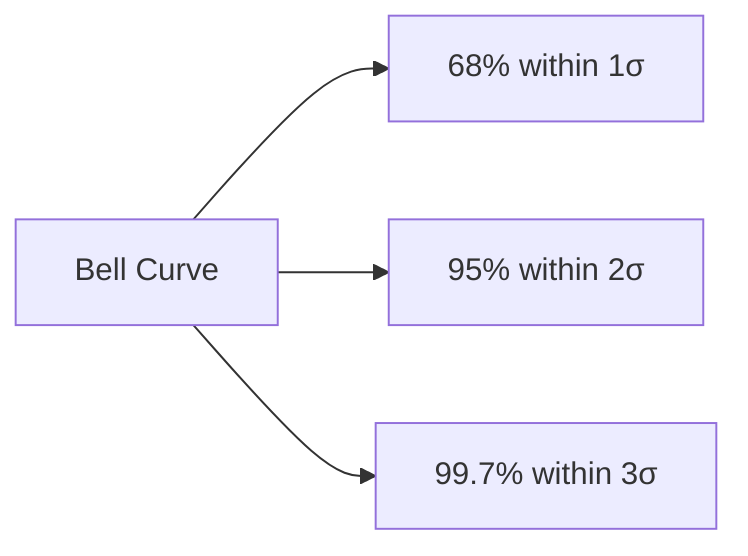
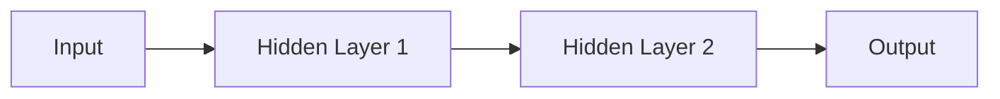
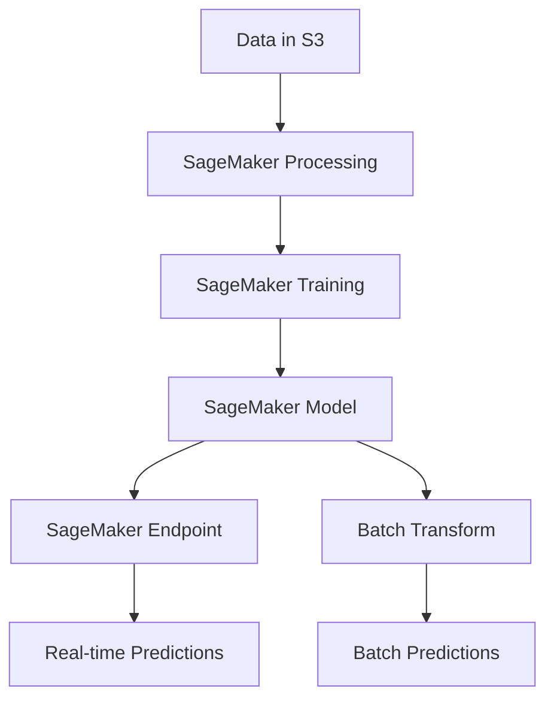
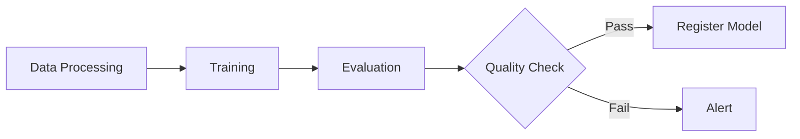

# AWS Certified Machine Learning - Specialty Cheat Sheet

## 1. Data Engineering Fundamentals

> **What is Data Engineering?** It's the process of preparing and managing data that will feed your ML models. Think of it like preparing ingredients before cooking: you need them clean, organized, and in the right place.

### Data Repositories

**What are Data Repositories?** These are the places where we store our data. In ML, we work with large amounts of information, so we need robust and scalable storage systems.

**Amazon S3 (Simple Storage Service)**
- **What is it?** Like a giant hard drive in the cloud where you can store any type of file (images, videos, CSV files, models, etc.)
- **Why use it for ML?**
  - It's the primary storage for ML data because it's cost-effective, scalable, and highly reliable
  - Can handle any data size from kilobytes to petabytes
- **Key features:**
  - **Versioning**: Keeps previous versions of your files (useful if you need to revert to old data)
  - **Encryption**: Protects sensitive data by encrypting it at rest and in transit
  - **Lifecycle policies**: Automatically moves old data to cheaper storage tiers (e.g., Glacier for archival)
  - **S3 Select**: Filters data before downloading it, saving time and money by reducing data transfer
- **Use case example**: Store training datasets, trained models, prediction results

**Amazon EFS (Elastic File System)**
- **What is it?** A shared file system that multiple machines can access simultaneously (like a network drive)
- **When to use it?** When training a model across multiple servers that need to read the same files at the same time
- **Key benefits:**
  - **Auto-scaling**: Automatically grows as you need more space (no manual provisioning)
  - **Low latency**: Fast file access for training jobs
  - **Concurrent access**: Multiple instances can read/write simultaneously
- **Use case example**: Distributed training where several servers read the same dataset in parallel

**Amazon FSx for Lustre**
- **What is it?** A high-performance file system designed for compute-intensive workloads
- **When to use it?** When you need to process massive amounts of data very quickly (hundreds of GB/s throughput)
- **Key benefits:**
  - Optimized for HPC (High Performance Computing) and ML workloads
  - Integrates directly with S3 for fast data access
  - Sub-millisecond latencies
- **Use case example**: Processing millions of images to train a computer vision model, or processing genomic data

### Data Ingestion
ll
**What is Data Ingestion?** The process of moving data from its source (databases, applications, sensors, etc.) into your ML system. It's like filling up a car's gas tank before a trip.

**Batch Ingestion (Processing data in chunks)**
> **When to use:** When you don't need data immediately. Example: processing yesterday's sales every morning.

- **AWS Data Pipeline**
  - **What is it?** An orchestration service that helps you automatically move and transform data
  - **Analogy**: Like a supervisor coordinating different teams to move data from place to place
  - **Key features:**
    - Schedule-based execution (e.g., run every night at 2 AM)
    - Can handle dependencies between tasks
    - Retry logic for failed tasks
  - **Use case example**: Every night at 2 AM, move data from your database to S3 for training

- **AWS Glue**
  - **What is it?** A serverless (no servers to manage) ETL service (Extract, Transform, Load)
  - **Key features:**
    - **Crawler**: Automatically discovers your data structure (columns, data types, partitions)
    - **Serverless**: No infrastructure to provision, just pay for what you use
    - **Data Catalog**: Central repository of metadata about your datasets
  - **Use case example**: Convert CSV files to optimized Parquet format for faster analytics

- **Amazon EMR (Elastic MapReduce)**
  - **What is it?** Managed clusters for processing massive amounts of data using frameworks like Spark and Hadoop
  - **When to use:** When you have terabytes or petabytes of data to process
  - **Key features:**
    - Supports Spark, Hadoop, Hive, Presto, and more
    - Can use Spot instances for cost savings
    - Scales up/down based on workload
  - **Use case example**: Process logs from millions of users to extract behavior patterns

**Streaming Ingestion (Real-time data processing)**
> **When to use:** When you need to process data instantly. Example: detecting fraud in bank transactions in real-time.

- **Amazon Kinesis Data Streams**
  - **What is it?** A service to capture and process data in real-time
  - **Analogy**: Like a conveyor belt that never stops, constantly carrying data
  - **Key features:**
    - Durable (stores data for 24 hours to 365 days)
    - Ordered records per partition key
    - Multiple consumers can read the same stream
  - **Use case example**: Capture user clicks on a website as they browse

- **Amazon Kinesis Data Firehose**
  - **What is it?** Automatically loads streaming data to destinations like S3, Redshift, or Elasticsearch
  - **Difference from Streams**: Simpler, less control but easier to set up (fully managed delivery)
  - **Key features:**
    - No code required for delivery
    - Automatic scaling
    - Can transform data in-flight using Lambda
  - **Use case example**: Automatically save all app events to S3 every 5 minutes

- **Amazon Kinesis Data Analytics**
  - **What is it?** Analyzes streaming data in real-time using SQL queries
  - **Key features:**
    - Standard SQL interface (no need to learn new language)
    - Pre-built templates for common patterns
  - **Use case example**: Calculate average transactions per minute in real-time

**Migration (Moving existing data to AWS)**
> **When to use:** When you need to move large amounts of existing data to AWS for the first time.

- **AWS DMS (Database Migration Service)**
  - **What is it?** Migrates databases to AWS with minimal downtime
  - **Key advantage:** Source database remains operational during migration (no interruption)
  - **Key features:**
    - Supports homogeneous (Oracle to Oracle) and heterogeneous (Oracle to PostgreSQL) migrations
    - Continuous replication for keeping databases in sync
  - **Use case example**: Migrate your on-premises MySQL database to AWS RDS

- **AWS Snowball**
  - **What is it?** A physical device (like a giant hard drive) that AWS ships to you for transferring petabytes of data
  - **When to use:** When you have so much data that uploading it over the internet would take weeks or months
  - **Key features:**
    - 50-80 TB capacity per device
    - Encrypted and tracked during shipping
    - Faster than network transfer for large datasets (Rule of thumb: if transfer would take more than a week, use Snowball)
  - **Use case example**: Transfer 50 TB of historical videos to AWS

### Data Transformation

**What is Data Transformation?** The process of converting "raw" data into a format useful for Machine Learning. Examples: cleaning data, changing formats, calculating new columns, removing duplicates, etc.

**AWS Glue**
- **What it does:** Allows you to create ETL (Extract-Transform-Load) jobs to transform your data
- **Supported languages**: Python and Scala
- **Key features:**
  - **Dynamic Frames**: Flexible data structures that adapt if your schema changes (unlike DataFrames which require fixed schema)
  - **Job Bookmarks**: Remembers which data has been processed to avoid reprocessing the same data
  - **Built-in transformations**: Join, filter, map, aggregate, etc.
- **Use case example**: Convert text dates to date format, remove duplicate rows, normalize numerical values

**Amazon Athena**
- **What is it?** Allows you to run SQL queries directly on files in S3 without loading them into a database
- **Key advantages:**
  - **Serverless**: No servers to configure or manage
  - **Pay per query**: Only pay for the data you scan (cost scales with data size)
  - **Standard SQL**: Use familiar SQL syntax
- **Engine**: Uses Presto (a fast distributed SQL query engine)
- **Use case example**: Query CSV files in S3 to calculate averages without moving them to a database first

**Amazon EMR**
- **What is it?** Managed Hadoop/Spark clusters for massive-scale data processing
- **When to use:** Complex transformations on large data volumes (hundreds of GB to PB)
- **Supported tools**:
  - **Apache Hive**: SQL-like queries on Hadoop
  - **Pig**: Scripting language for data transformation
  - **HBase**: NoSQL database on Hadoop
  - **Spark**: Fast in-memory processing
- **Use case example**: Join 100 large files, apply complex transformations, and generate a clean dataset

---

## 2. Exploratory Data Analysis (EDA)

> **What is EDA?** It's the process of analyzing and understanding your data before building models. Think of it like a doctor examining a patient before prescribing treatment. You need to understand what you're working with first.

### Data Types

**Why does data type matter?** Different types of data require different handling and algorithms. Using the wrong approach for your data type leads to poor results.

- **Numerical (Quantitative)**: Numbers with mathematical meaning
  - **Continuous**: Can take any value in a range (height: 5.7 ft, weight: 150.5 lbs, temperature: 72.3°F)
  - **Discrete**: Whole numbers, counts (number of children: 2, items sold: 100)
  - **How to handle**: Can use mathematical operations (average, sum, etc.)

- **Categorical (Qualitative)**: Categories or labels
  - **Nominal**: No inherent order (colors: red, blue, green; country: USA, France, Japan)
  - **Ordinal**: Has meaningful order (ratings: poor, fair, good, excellent; education: HS, BS, MS, PhD)
  - **How to handle**: Need encoding (One-Hot, Label Encoding) before using in most ML algorithms

- **Time Series**: Sequential data points ordered by time
  - Examples: Stock prices over time, daily temperature, monthly sales
  - **Special consideration**: Order matters! Can't shuffle randomly like other data

- **Text**: Unstructured text data
  - Examples: Customer reviews, tweets, articles
  - **How to handle**: Need special processing (tokenization, embeddings) to convert to numbers

- **Image/Audio**: Binary data
  - Examples: Photos, videos, sound files
  - **How to handle**: Usually processed as arrays of pixel/audio values

### Descriptive Statistics

**Why use descriptive statistics?** They help you understand your data's characteristics at a glance. Like getting a summary of a book before reading it.

**Central Tendency (Where is the "center" of your data?)**

- **Mean (Average)**
  - **What is it?** Sum of all values divided by count (e.g., (10+20+30)/3 = 20)
  - **When to use**: When data is relatively symmetric without extreme outliers
  - **Watch out**: Very sensitive to outliers (one billionaire in a room makes average income misleading)
  - **Example**: Average age of customers, mean temperature

- **Median (Middle value)**
  - **What is it?** The middle value when data is sorted (e.g., in [1, 2, 100], median is 2)
  - **When to use**: When data has outliers or is skewed (like income, house prices)
  - **Advantage**: Robust to outliers (not affected by extreme values)
  - **Example**: Median house price (better than mean when few mansions skew the average)

- **Mode (Most common)**
  - **What is it?** The value that appears most frequently
  - **When to use**: Categorical data or to find the most typical value
  - **Example**: Most popular product color, most common customer age group

**Dispersion (How spread out is your data?)**

- **Range**
  - **What is it?** Max - Min (e.g., if ages are 18 to 75, range is 57)
  - **Use**: Quick sense of spread, but ignores everything in between
  - **Limitation**: Very sensitive to outliers

- **Variance**
  - **What is it?** Average of squared differences from the mean
  - **Why square?** To make negative differences positive and emphasize larger differences
  - **Interpretation**: Hard to interpret directly because it's in squared units

- **Standard Deviation (σ or SD)**
  - **What is it?** Square root of variance (√Variance)
  - **Why use it?** In same units as original data, easier to interpret
  - **Interpretation**:
    - Low SD = data points close to mean (consistent)
    - High SD = data points spread out (variable)
  - **Example**: If mean height is 5.7 ft with SD of 0.1 ft, most people are close to 5.7 ft. If SD is 1 ft, heights vary a lot.

- **IQR (Interquartile Range)**
  - **What is it?** Q3 - Q1 (range of middle 50% of data)
  - **Q1 (25th percentile)**: 25% of data is below this value
  - **Q3 (75th percentile)**: 75% of data is below this value
  - **Why use it?** Robust to outliers (focuses on middle 50%)
  - **Use case**: Detecting outliers (values outside Q1-1.5×IQR to Q3+1.5×IQR are considered outliers)

### Data Visualization

**Why visualize?** Because a picture is worth a thousand numbers. Visualizations help you spot patterns, outliers, and relationships that statistics might miss.

**Box Plot (Box-and-Whisker Plot)**
```
    Q3 ──┐
         │  ← Outliers (•)
    Q2 ──┤  (Median)
         │
    Q1 ──┘

  Min  Q1  Q2  Q3  Max
   │   │   │   │   │
   └───┴───┴───┴───┘
      IQR
```
- **What it shows:** Distribution, median, quartiles, outliers all at once
- **How to read it:**
  - Box contains middle 50% of data
  - Line in box = median
  - Whiskers extend to min/max (excluding outliers)
  - Dots = outliers
- **Outlier detection rule**: < Q1 - 1.5×IQR or > Q3 + 1.5×IQR
- **When to use**: Comparing distributions across groups, identifying outliers
- **Example**: Compare salary distributions across different departments

**Scatter Plot**
```
  y │     •
    │   •   •
    │ •   •   •
    │   •   •
    └─────────── x
```
- **What it shows:** Relationship between two numerical variables
- **What to look for:**
  - **Positive correlation**: Points slope upward (as x increases, y increases)
  - **Negative correlation**: Points slope downward (as x increases, y decreases)
  - **No correlation**: Random scatter, no pattern
  - **Clusters**: Groups of similar points
- **When to use**: Exploring relationships between features before modeling
- **Example**: Plot house size vs. price to see if larger houses cost more

**Histogram**
```
Freq│  ▂▄▆█▆▄▂
    │ ▁▃▅▇▅▃▁
    └──────────
      Values
```
- **What it shows:** Distribution of a single numerical variable (frequency of values in ranges)
- **What to look for:**
  - **Shape**: Bell curve (normal), skewed, multiple peaks
  - **Center**: Where most values concentrate
  - **Spread**: How wide the distribution is
- **Reveals**: Skewness (lopsided), modality (number of peaks)
- **When to use**: Understanding how a variable is distributed
- **Example**: Distribution of customer ages to see if most are young or old

**Correlation Matrix (Heatmap)**
- **What it shows:** Correlations between all pairs of numerical features
- **Values range**: -1 (perfect negative correlation) to +1 (perfect positive correlation)
  - **+1**: Variables move perfectly together (height and weight)
  - **0**: No linear relationship
  - **-1**: Variables move in opposite directions (price and demand)
- **Why important**: Highly correlated features are redundant; some algorithms perform poorly with correlated features
- **When to use**: Feature selection, understanding multicollinearity
- **Example**: Identify that "total_price" and "price_per_unit × quantity" are redundant (correlation = 1)

### Data Distribution

**Why does distribution matter?** Many ML algorithms assume certain distributions. Understanding your data's shape helps you choose the right algorithm or apply appropriate transformations.

**Normal Distribution (Gaussian Distribution)**

- **What is it?** The classic "bell curve" shape - symmetric around the mean
- **Properties (68-95-99.7 rule):**
  - 68% of data falls within 1 standard deviation of mean
  - 95% within 2 standard deviations
  - 99.7% within 3 standard deviations
- **Why important?** Many statistical tests and algorithms assume normal distribution
- **Examples in nature**: Heights, test scores, measurement errors

**Skewness (Asymmetry)**
- **What is it?** Measure of asymmetry in distribution
- **Positive Skew (Right Skew):**
  - Tail extends to the right
  - Mean > Median (mean pulled by extreme high values)
  - Example: Income (few billionaires pull mean up), house prices
- **Negative Skew (Left Skew):**
  - Tail extends to the left
  - Mean < Median (mean pulled by extreme low values)
  - Example: Age at retirement (most around 65, some retire very early)
- **Impact**: Can affect model performance; often needs transformation (log, square root)

**Kurtosis (Tailedness)**
- **What is it?** Measure of "peakedness" and tail heaviness
- **High Kurtosis:**
  - Sharp peak, heavy tails (more extreme values)
  - More outliers than normal distribution
- **Low Kurtosis:**
  - Flat distribution, light tails (fewer extreme values)
- **Why care?** Affects reliability of mean and standard deviation

### Handling Missing Data

**Why handle missing data?** Most ML algorithms can't work with missing values. You must decide how to handle them.

**Common Strategies:**

- **Deletion**
  - **When to use**: When < 5% of data is missing and it's missing randomly
  - **Types:**
    - **Listwise deletion**: Remove entire row if any value is missing
    - **Column deletion**: Remove feature if too many values missing (>30-40%)
  - **Caution**: Can lose valuable information and introduce bias

- **Imputation (Filling in values)**
  - **Mean/Median/Mode imputation:**
    - **Mean**: For normally distributed numerical data
    - **Median**: For skewed numerical data (robust to outliers)
    - **Mode**: For categorical data
    - **Pros**: Simple, fast
    - **Cons**: Reduces variance, doesn't capture relationships

  - **Forward/Backward Fill:**
    - **Use**: Time series data
    - **Forward fill**: Use last known value
    - **Backward fill**: Use next known value
    - **Example**: Missing stock price → use previous day's price

  - **Model-based imputation:**
    - **What**: Use ML model to predict missing values based on other features
    - **When**: When features are correlated and you have enough data
    - **Example**: Predict missing age based on job title and salary

  - **Indicator Variable (Missing Flag):**
    - **What**: Create new binary column indicating if value was missing
    - **When**: When "missingness" itself is informative
    - **Example**: "Income not reported" might indicate high earners wanting privacy

### Outlier Detection

**What are outliers?** Data points significantly different from others. They can be errors or rare but valid observations.

**Detection Methods:**

- **Z-Score Method**
  - **How it works**: Measures how many standard deviations away from mean
  - **Rule**: |z| > 3 is typically considered an outlier
  - **Best for**: Normally distributed data
  - **Formula**: z = (x - mean) / standard_deviation
  - **Example**: If mean=100, SD=10, a value of 140 has z=4 (outlier)

- **IQR Method**
  - **How it works**: Based on quartiles (more robust to outliers than z-score)
  - **Rule**: Values < Q1 - 1.5×IQR or > Q3 + 1.5×IQR are outliers
  - **Best for**: Any distribution, especially skewed data
  - **Example**: Box plots use this method

- **Isolation Forest**
  - **How it works**: ML-based method that isolates anomalies
  - **Best for**: High-dimensional data, complex patterns
  - **Advantage**: Can detect outliers in multivariate data

- **DBSCAN (Density-Based Clustering)**
  - **How it works**: Points in low-density regions are outliers
  - **Best for**: Spatial data, when outliers are isolated points
  - **Advantage**: No assumption about distribution

**Treatment Options:**

- **Remove outliers**: When they're clearly errors or not relevant to your problem
  - **Caution**: Don't remove if they're valid rare events you want to predict

- **Cap/floor values (Winsorization)**: Replace extreme values with less extreme ones
  - **Example**: Cap all values above 95th percentile to the 95th percentile value
  - **When**: You want to reduce impact but keep the data

- **Transform data**: Apply log, square root, or other transformations
  - **Why**: Makes distribution more normal, reduces outlier impact
  - **Example**: Log-transform income to handle billionaires

- **Use robust algorithms**: Some algorithms are naturally resistant to outliers
  - **Examples**: Tree-based models (Random Forest, XGBoost), median-based methods

---

## 3. Feature Engineering

> **What is Feature Engineering?** The process of transforming raw data into features that better represent the problem to the model. It's often said: "Better features beat better algorithms."

### Feature Scaling

**Why scale features?** Many ML algorithms are sensitive to the scale of features. If one feature ranges from 0-1 and another from 0-10000, the algorithm might give too much weight to the larger scale feature.

**Normalization (Min-Max Scaling)**
- **What it does:** Scales features to a fixed range, usually [0, 1]
- **Formula:** (x - min) / (max - min)
- **Result**: Smallest value becomes 0, largest becomes 1, everything else in between
- **When to use:**
  - When you need bounded values (0 to 1)
  - Neural networks (faster convergence)
  - Image processing (pixel values 0-255 → 0-1)
  - Distance-based algorithms (KNN, K-Means) when features have different ranges
- **Drawback:** Sensitive to outliers (one extreme value affects all scaled values)
- **Example:** Ages [18, 25, 30, 80] → [0, 0.11, 0.19, 1]. Note how the outlier 80 compresses the others.

**Standardization (Z-Score Normalization)**
- **What it does:** Centers data around mean=0 with standard deviation=1
- **Formula:** (x - μ) / σ (where μ=mean, σ=standard deviation)
- **Result**: Data has mean of 0 and standard deviation of 1
- **When to use:**
  - Algorithms assuming normal distribution (SVM, Logistic Regression, Linear Regression)
  - When data has different units (age in years, salary in dollars)
  - When outliers are meaningful and shouldn't be suppressed
- **Advantage:** Less affected by outliers than normalization
- **Note:** Results are not bounded (can be negative or > 1)
- **Example:** Values [10, 20, 30] with mean=20, SD=10 → [-1, 0, 1]

**Robust Scaling**
- **What it does:** Uses median and IQR instead of mean and SD
- **Formula:** (x - median) / IQR
- **When to use:** When data has many outliers that you want to preserve
- **Advantage:** Very robust to outliers (outliers don't affect median or IQR much)
- **Example:** Income data where a few billionaires shouldn't affect the scaling of normal salaries

**Quick Decision Guide:**
- **Normalization**: Bounded output needed, neural networks, image data
- **Standardization**: Gaussian assumptions, linear models, outliers are important
- **Robust Scaling**: Lots of outliers, outliers are valid data points

### Encoding Categorical Variables

**Why encode?** ML algorithms work with numbers, not text. We must convert categories (like "Red", "Blue", "Green") into numerical form.

**One-Hot Encoding**
- **What it does:** Creates a new binary (0/1) column for each category
- **Example:**
  ```
  Color: [Red, Blue, Red, Green]
  →
  Color_Red: [1, 0, 1, 0]
  Color_Blue: [0, 1, 0, 0]
  Color_Green: [0, 0, 0, 1]
  ```
- **When to use:**
  - **Nominal data** (no natural order): colors, countries, product types
  - Tree-based models (they handle high dimensionality well)
- **Advantages:** No ordinal relationship implied (each category is independent)
- **Drawback:** High dimensionality with many categories (100 categories → 100 new columns)
- **Note:** Usually drop one column to avoid multicollinearity (dummy variable trap)

**Label Encoding**
- **What it does:** Assigns an integer to each category
- **Example:**
  ```
  Size: [Small, Medium, Large, Small]
  →
  Size: [0, 1, 2, 0]
  ```
- **When to use:**
  - **Ordinal data** (has natural order): sizes (S, M, L, XL), education levels, ratings (poor, fair, good)
  - Tree-based models (they don't assume linear relationships)
- **Advantages:** Compact (only one column), preserves ordinality
- **Drawback:** Implies mathematical relationship (Large - Small = 2), problematic for linear models with nominal data
- **Caution:** Don't use for nominal data with linear models (model might think Blue=1 is "between" Red=0 and Green=2)

**Target Encoding (Mean Encoding)**
- **What it does:** Replaces category with the mean of the target variable for that category
- **Example:**
  ```
  City: [NYC, LA, NYC]
  Target (Price): [500, 300, 600]
  →
  City_encoded: [550, 300, 550]  (NYC mean = (500+600)/2 = 550, LA mean = 300)
  ```
- **When to use:** High-cardinality features (many unique categories like cities, zip codes)
- **Advantage:** Captures relationship with target, compact representation
- **Risk:** **Overfitting!** Model might memorize training data
- **Solution:** Use cross-validation to calculate target means (don't use same data)

**Frequency Encoding**
- **What it does:** Replaces category with how often it appears
- **Example:**
  ```
  City: [NYC, NYC, LA, Boston, NYC]
  →
  City_freq: [0.6, 0.6, 0.2, 0.2, 0.6]  (NYC appears 3/5=60%, LA & Boston 1/5=20%)
  ```
- **When to use:** When frequency is informative (common categories might behave differently)
- **Advantage:** Compact, captures popularity
- **Example use case:** Common brands vs. rare brands might have different quality

### Feature Transformation

**Why transform features?** To make data more suitable for ML algorithms, especially to handle skewness and create non-linear relationships.

**Log Transformation**
- **What it does:** Applies logarithm to reduce right skew (long tail to the right)
- **Formula:** log(x + 1) (add 1 to handle zeros)
- **When to use:**
  - Right-skewed data (income, house prices, population)
  - Data spanning several orders of magnitude (1 to 1,000,000)
- **Effect:** Compresses large values more than small ones
- **Example:** Income [1000, 10000, 1000000] → log transformed is much more evenly distributed
- **Caution:** Only works with positive values

**Box-Cox Transformation**
- **What it does:** Generalizes power transformations (includes log, square root, etc.)
- **How it works:** Finds the best power transformation (λ parameter) to make data more normal
- **When to use:** When you want to automatically find the best transformation
- **Requirement:** All values must be positive
- **Advantage:** More flexible than log (can be log, square root, or other power)

**Polynomial Features**
- **What it does:** Creates interaction and higher-order terms from existing features
- **Example:**
  ```
  Original features: x₁, x₂
  →
  Polynomial features: x₁, x₂, x₁², x₁x₂, x₂²
  ```
- **Why use:** Captures non-linear relationships
- **When to use:** Linear models on non-linear problems
- **Example use case:** House price might depend on size² (bigger houses disproportionately more expensive) or size×location interaction
- **Caution:** Can quickly create too many features (curse of dimensionality)

### Dimensionality Reduction

**Why reduce dimensions?** Too many features can cause: slow training, overfitting, hard to visualize, multicollinearity. Reducing features often improves performance.

**PCA (Principal Component Analysis)**
- **What it does:** Finds new features (principal components) that are combinations of original features, ordered by how much variance they capture
- **How it works:**
  - Finds directions (components) where data varies most
  - PC1 = direction of maximum variance
  - PC2 = direction of second-most variance (perpendicular to PC1)
  - And so on...
- **Type:** Unsupervised (doesn't use target variable), linear transformation
- **When to use:**
  - Reduce correlated features
  - Visualize high-dimensional data (reduce to 2-3 components)
  - Speed up training
- **Example:** 100 features → 10 principal components that capture 95% of variance
- **Drawback:** New features are hard to interpret (they're combinations of original features)

**t-SNE (t-Distributed Stochastic Neighbor Embedding)**
- **What it does:** Maps high-dimensional data to 2-3 dimensions for visualization
- **Type:** Non-linear, unsupervised
- **When to use:** **Visualization only** (not for feeding into models)
- **Advantage:** Good at preserving local structure (similar points stay close)
- **Drawbacks:**
  - Computationally expensive (slow on large datasets)
  - Non-deterministic (different runs give different results)
  - Can't transform new data (must rerun on entire dataset)
- **Example use case:** Visualize clusters in customer data

**LDA (Linear Discriminant Analysis)**
- **What it does:** Finds features that best separate classes
- **Type:** Supervised (uses target labels), linear
- **When to use:** Classification problems where you want to maximize class separation
- **Difference from PCA:** PCA maximizes variance, LDA maximizes class separation
- **Example:** Reduce features while keeping ability to distinguish between spam/not spam

### Feature Selection

**Why select features?** Not all features are useful. Removing irrelevant features: reduces overfitting, speeds up training, improves interpretability.

**Filter Methods** (Fast, independent of model)
- **How they work:** Score each feature based on statistical tests, select top-k
- **Methods:**
  - **Correlation:** Remove features highly correlated with others or weakly correlated with target
  - **Chi-square test:** For categorical features and categorical target
  - **Mutual Information:** Measures dependency between feature and target (works for non-linear relationships)
- **Advantages:** Fast, simple
- **Drawbacks:** Doesn't consider feature interactions, ignores the model

**Wrapper Methods** (Slower, model-specific)
- **How they work:** Try different feature subsets and evaluate model performance
- **Methods:**
  - **Forward selection:** Start with 0 features, add one at a time (greedy)
  - **Backward elimination:** Start with all features, remove one at a time
  - **RFE (Recursive Feature Elimination):** Iteratively removes least important features
- **Advantages:** Considers feature interactions, optimizes for specific model
- **Drawbacks:** Computationally expensive (must train many models)

**Embedded Methods** (Built into algorithm)
- **How they work:** Feature selection happens during model training
- **Methods:**
  - **Lasso (L1 regularization):** Shrinks some coefficients to exactly zero (automatic feature selection)
  - **Ridge (L2 regularization):** Shrinks coefficients but doesn't eliminate features
  - **Tree-based feature importance:** Decision trees naturally rank features by importance
- **Advantages:** Faster than wrapper methods, considers feature interactions
- **Example:** Train Lasso regression, features with zero coefficients are removed

### Handling Imbalanced Data

**What is imbalanced data?** When one class is much more common than others. Example: 99% normal transactions, 1% fraud. Models trained on imbalanced data often just predict the majority class.

**Why is it a problem?** A model that always predicts "not fraud" gets 99% accuracy but is useless! It never detects actual fraud.

**Techniques:**

**Oversampling** (Increase minority class)
- **What:** Create more samples of the minority class
- **SMOTE (Synthetic Minority Over-sampling Technique):**
  - **How it works:** Creates synthetic examples by interpolating between existing minority samples
  - **Advantage:** More robust than just duplicating (avoids exact copies)
  - **Example:** If you have 100 fraud cases and 10,000 normal, SMOTE creates synthetic fraud cases to balance
- **Simple oversampling:** Just duplicate minority samples (risk: overfitting to those exact samples)

**Undersampling** (Decrease majority class)
- **What:** Remove samples from the majority class
- **Random undersampling:** Randomly remove majority samples until balanced
- **Advantages:** Faster training, less memory
- **Drawback:** Loses potentially useful information
- **When to use:** When you have lots of data and can afford to throw some away

**Class Weights** (Make minority class more important)
- **What:** Assign higher penalties to misclassifying minority class
- **How:** Set class_weight parameter in model (e.g., class_weight='balanced' in scikit-learn)
- **Advantage:** No data modification, just changes loss function
- **Example:** Misclassifying fraud costs 99× more than misclassifying normal transaction

**Ensemble Methods**
- **Balanced Random Forest:** Each tree trained on balanced subset
- **EasyEnsemble:** Multiple models on different undersampled subsets
- **Advantage:** Combines multiple balanced models for better performance

**Metric Selection** (Use appropriate metrics)
- **Don't use:** Accuracy (misleading on imbalanced data)
- **Use instead:**
  - **Precision/Recall/F1:** Focus on minority class performance
  - **AUC-PR (Precision-Recall curve):** Better than AUC-ROC for imbalanced data
  - **Confusion Matrix:** See actual performance on each class

---

## 4. Supervised Learning Algorithms

> **What is Supervised Learning?** Learning from labeled data. You show the algorithm examples with correct answers (features + labels), and it learns to predict labels for new examples.

### Linear Models

**Linear Regression**
- **What is it?** Predicts a continuous numerical value based on input features
- **How it works:** Fits a straight line (or hyperplane) through data to minimize prediction error
- **Formula:** y = β₀ + β₁x₁ + β₂x₂ + ... + βₙxₙ
  - β₀ = intercept (baseline value)
  - β₁...βₙ = coefficients (how much each feature affects the prediction)
- **Assumptions:**
  - Linear relationship between features and target
  - Features are independent (no multicollinearity)
  - Errors are normally distributed
- **When to use:** Predicting continuous values with linear relationships
- **Examples:** House price prediction, temperature forecasting, sales prediction
- **Metrics:** RMSE (most common), MAE, R²
- **Strengths:** Simple, interpretable, fast
- **Weaknesses:** Poor on non-linear relationships, sensitive to outliers

**Logistic Regression**
- **What is it?** Classification algorithm (despite the name "regression")
- **What it predicts:** Probability that an example belongs to a class (0 to 1)
- **How it works:** Applies sigmoid function to linear combination of features to get probability
  - If probability > 0.5 → predict class 1
  - If probability ≤ 0.5 → predict class 0
- **Sigmoid function:** Converts any value to range [0, 1]
- **When to use:**
  - Binary classification (spam/not spam, fraud/not fraud)
  - When you need probability estimates (not just yes/no)
  - When relationship is roughly linear (in log-odds space)
- **Examples:** Email spam detection, disease diagnosis, customer churn prediction
- **Metrics:** Accuracy, Precision, Recall, F1, AUC-ROC
- **Strengths:** Simple, interpretable, outputs probabilities, works well for linearly separable data
- **Weaknesses:** Assumes linear decision boundary, struggles with complex patterns
- **Note:** Can be extended to multi-class (Multinomial Logistic Regression)

**Regularization** (Preventing Overfitting)
**Why regularize?** Without regularization, models can become too complex and memorize training data instead of learning patterns.

- **Lasso (L1 Regularization)**
  - **What it does:** Adds penalty based on absolute value of coefficients (|β|)
  - **Effect:** Shrinks some coefficients to exactly zero → automatic feature selection
  - **When to use:**
    - When you have many features and want to identify the most important ones
    - When you suspect many features are irrelevant
  - **Result:** Sparse model (many features eliminated)
  - **Example:** 100 features → Lasso might keep only 15 most important

- **Ridge (L2 Regularization)**
  - **What it does:** Adds penalty based on square of coefficients (β²)
  - **Effect:** Shrinks all coefficients toward zero but doesn't eliminate any
  - **When to use:**
    - When all features might be somewhat useful
    - When features are correlated
  - **Result:** All features kept but with smaller coefficients
  - **Advantage:** More stable than Lasso when features are correlated

- **Elastic Net**
  - **What it does:** Combines L1 and L2 (α × L1 + (1-α) × L2)
  - **When to use:** When you want benefits of both (feature selection + stability)
  - **Advantage:** Best of both worlds, especially with correlated features

### Tree-Based Models

**Decision Trees**
- **What is it?** A tree structure where each internal node tests a feature, each branch represents a test outcome, and each leaf represents a prediction
- **How it works:**
  - Recursively splits data based on features
  - At each step, chooses the split that best separates the classes (or reduces variance for regression)
- **Splitting criteria:**
  - **Gini Impurity:** Measures how often a random element would be incorrectly classified (lower is better)
  - **Entropy / Information Gain:** Measures disorder in data (higher gain is better)
  - For regression: Variance reduction
- **When to use:**
  - Non-linear relationships
  - Mixed feature types (numerical + categorical)
  - When you need interpretability (can visualize the tree)
- **Strengths:**
  - Easy to understand and interpret
  - Handles non-linear data
  - No feature scaling needed
  - Handles missing values
- **Weaknesses:**
  - **Very prone to overfitting** (can memorize training data)
  - Unstable (small data changes can change tree significantly)
- **Key hyperparameters:**
  - **max_depth:** Maximum tree depth (prevent overfitting)
  - **min_samples_split:** Minimum samples to split a node
  - **min_samples_leaf:** Minimum samples in a leaf

**Random Forest**
- **What is it?** An ensemble of many decision trees, each trained on random subset of data and features
- **How it works:**
  - **Bagging (Bootstrap Aggregating):** Each tree trained on random sample of data (with replacement)
  - **Feature randomness:** Each split considers only random subset of features
  - **Prediction:** Average (regression) or vote (classification) from all trees
- **Why it works:** Individual trees overfit differently, averaging reduces overfitting
- **When to use:**
  - Most tabular data problems (excellent default choice)
  - When you need feature importance scores
  - When you want good performance without much tuning
- **Strengths:**
  - Reduces overfitting compared to single tree
  - Provides feature importance rankings
  - Works well out-of-the-box
  - Handles missing values
- **Weaknesses:**
  - Slower to train and predict than single tree
  - Less interpretable than single tree
  - Can be memory-intensive
- **Typical use:** One of the best algorithms for structured/tabular data

**Gradient Boosting** (Sequential ensembles)
- **What is it?** Builds trees sequentially, where each tree tries to correct the errors of previous trees
- **How it works:**
  1. Start with a simple model
  2. Calculate errors (residuals)
  3. Train new tree to predict these errors
  4. Add new tree to ensemble
  5. Repeat
- **Key difference from Random Forest:** Sequential (each tree learns from previous) vs. parallel (independent trees)

**XGBoost (eXtreme Gradient Boosting)**
- **What makes it special:**
  - Very fast implementation with optimizations
  - Built-in regularization (prevents overfitting)
  - Handles missing values automatically
  - Can use GPU acceleration
- **When to use:** Structured data, Kaggle competitions (often wins)
- **Strengths:** Usually best accuracy on tabular data
- **Weaknesses:** Requires more hyperparameter tuning than Random Forest

**LightGBM (Light Gradient Boosting Machine)**
- **What makes it special:**
  - Faster than XGBoost
  - Uses less memory
  - **Leaf-wise growth** (vs. level-wise) → faster convergence
- **When to use:** Very large datasets where speed matters
- **Strengths:** Faster training, handles large data well
- **Weakness:** Can overfit easier than XGBoost on small datasets

**CatBoost (Categorical Boosting)**
- **What makes it special:**
  - Handles categorical features natively (no encoding needed)
  - Robust to overfitting
  - Good default parameters
- **When to use:** Data with many categorical features
- **Advantage:** Less preprocessing needed

**Comparison**
| Algorithm | Speed | Accuracy | Overfitting Risk | Best For |
|-----------|-------|----------|------------------|----------|
| Decision Tree | Fast | Medium | High | Interpretability, quick baseline |
| Random Forest | Medium | High | Low | General purpose, robust default |
| XGBoost | Medium | Very High | Medium | Competitions, max accuracy |
| LightGBM | Fast | Very High | Medium | Large datasets, speed priority |
| CatBoost | Medium | Very High | Low | Categorical features, less tuning |

### Support Vector Machines (SVM)

- **What is it?** Finds the optimal hyperplane (decision boundary) that best separates classes
- **How it works:**
  - Finds the hyperplane that maximizes the margin (distance) between classes
  - Data points closest to the hyperplane are called "support vectors"
- **Key concept: Kernel Trick**
  - Transforms data to higher dimensions where it becomes linearly separable
  - **Common kernels:**
    - **Linear:** For linearly separable data
    - **RBF (Radial Basis Function):** Most common, for non-linear data
    - **Polynomial:** For polynomial relationships
- **When to use:**
  - High-dimensional data (more features than samples)
  - Clear margin of separation
  - Small to medium datasets
- **Strengths:**
  - Effective in high-dimensional spaces
  - Memory efficient (only stores support vectors)
  - Versatile (different kernels)
- **Weaknesses:**
  - **Computationally expensive** for large datasets (O(n²) to O(n³))
  - Requires feature scaling (sensitive to scale)
  - Difficult to interpret
  - Choosing right kernel and parameters is tricky
- **Examples:** Text classification, image classification, bioinformatics

### K-Nearest Neighbors (KNN)

- **What is it?** Classifies based on the k closest training examples
- **How it works:**
  1. Find k nearest neighbors to the new data point (using distance metric, usually Euclidean)
  2. **Classification:** Vote - assign most common class among neighbors
  3. **Regression:** Average - predict mean of neighbors' values
- **Type:** Instance-based learning (lazy learning) - no training phase
- **When to use:**
  - Small to medium datasets
  - Non-linear decision boundaries
  - When interpretability is important (can explain: "predicted cat because 5 nearest examples were cats")
- **Key hyperparameter: k**
  - **k too small (e.g., k=1):** Overfits, sensitive to noise
  - **k too large:** Underfits, decision boundary too smooth
  - **Rule of thumb:** k = √n or try odd numbers to avoid ties
- **Strengths:**
  - Simple to understand
  - No training time
  - Naturally handles multi-class
- **Weaknesses:**
  - **Very sensitive to feature scaling** (must normalize)
  - **Computationally expensive at prediction time** (must calculate distance to all training points)
  - **Curse of dimensionality:** Performance degrades with many features
  - Sensitive to irrelevant features
- **Note:** Not suitable for large datasets or real-time predictions

### Naive Bayes

- **What is it?** Probabilistic classifier based on Bayes' theorem
- **"Naive" assumption:** All features are independent (which is usually not true, but algorithm works well anyway)
- **How it works:**
  - Calculates probability of each class given the features: P(Class|Features)
  - Chooses class with highest probability
- **Types:**
  - **Gaussian Naive Bayes:** For continuous features (assumes normal distribution)
  - **Multinomial Naive Bayes:** For count features (word counts in text)
  - **Bernoulli Naive Bayes:** For binary features (word present/absent)
- **When to use:**
  - Text classification (spam detection, sentiment analysis)
  - Small datasets
  - When you need fast training and prediction
  - When features are actually independent or nearly so
- **Strengths:**
  - **Very fast** to train and predict
  - Works well with high-dimensional data
  - Performs well even with small training data
  - Not sensitive to irrelevant features
  - Good for multi-class problems
- **Weaknesses:**
  - Naive independence assumption (features are rarely truly independent)
  - Can't learn feature interactions
  - If a feature value doesn't appear in training, it assigns probability zero (solution: Laplace smoothing)
- **Classic use case:** Email spam filtering (word counts are reasonably independent)

---

## 5. Unsupervised Learning Algorithms

> **What is Unsupervised Learning?** Learning from unlabeled data. The algorithm finds patterns, groups, or structure without being told what to look for.

### Clustering

**What is clustering?** Grouping similar data points together without predefined labels. Like organizing books by topic when you don't know the categories in advance.

**K-Means**
- **What is it?** Partitions data into k distinct, non-overlapping clusters
- **How it works:**
  1. Choose k (number of clusters)
  2. Randomly initialize k cluster centers (centroids)
  3. Assign each point to nearest centroid
  4. Update centroids to mean of assigned points
  5. Repeat steps 3-4 until convergence
- **Goal:** Minimize within-cluster variance (sum of squared distances to centroids)
- **When to use:**
  - Customer segmentation
  - Image compression
  - When clusters are roughly spherical and similar size
- **Strengths:**
  - Fast and scalable (works on large datasets)
  - Simple to understand and implement
- **Weaknesses:**
  - **Must specify k in advance** (how many clusters?)
  - **Sensitive to initialization** (can converge to local minimum) - solution: run multiple times
  - **Sensitive to outliers** (outliers pull centroids)
  - Assumes spherical clusters of similar size
  - Only finds convex cluster shapes
- **Example:** Group customers into 5 segments based on purchase behavior

**Hierarchical Clustering**
- **What is it?** Builds a hierarchy (tree) of clusters
- **Types:**
  - **Agglomerative (bottom-up):** Start with each point as cluster, merge similar clusters
  - **Divisive (top-down):** Start with one cluster, recursively split
- **Output:** Dendrogram (tree diagram) - you can cut at different levels to get different numbers of clusters
- **When to use:**
  - When you want to explore different numbers of clusters
  - Small to medium datasets (computationally expensive)
  - When hierarchical relationships are important (e.g., taxonomy)
- **Strengths:**
  - **No need to specify k upfront** (decide after seeing dendrogram)
  - Produces a hierarchy showing relationships
  - Deterministic (same result every time)
- **Weaknesses:**
  - **Computationally expensive:** O(n²) to O(n³)
  - Doesn't work well on large datasets
  - Once points are merged/split, can't undo
- **Example:** Organizing species into taxonomic tree

**DBSCAN (Density-Based Spatial Clustering)**
- **What is it?** Groups points that are closely packed together, marking outliers as noise
- **How it works:**
  - **Core points:** Points with at least min_samples neighbors within eps distance
  - **Border points:** Within eps of core point but don't have min_samples neighbors
  - **Noise:** All other points (outliers)
  - Clusters are formed by connecting core points
- **Key hyperparameters:**
  - **eps (ε):** Maximum distance between two points to be considered neighbors
  - **min_samples:** Minimum points to form a dense region (cluster)
- **When to use:**
  - Unknown number of clusters
  - Clusters of arbitrary shapes (not just spherical)
  - Data with noise/outliers
  - Spatial data (geographic, sensor data)
- **Strengths:**
  - **No need to specify k** (finds number of clusters automatically)
  - **Discovers arbitrary shapes** (not limited to spherical)
  - **Handles outliers well** (marks them as noise)
  - Robust to noise
- **Weaknesses:**
  - Struggles with varying density clusters
  - Sensitive to eps and min_samples parameters
  - Not suitable for high-dimensional data (curse of dimensionality)
- **Example:** Finding dense areas of restaurants in a city, identifying fraudulent transaction patterns

**Gaussian Mixture Models (GMM)**
- **What is it?** Probabilistic model assuming data comes from mixture of Gaussian distributions
- **How it works:**
  - Assumes each cluster is a Gaussian distribution
  - Fits multiple Gaussians to data
  - Each point has probability of belonging to each cluster (soft clustering)
- **Difference from K-Means:**
  - **K-Means:** Hard clustering (each point belongs to exactly one cluster)
  - **GMM:** Soft clustering (each point has probability for each cluster)
- **When to use:**
  - When clusters have different sizes and shapes (elliptical)
  - When you need probability estimates
  - When clusters overlap
- **Strengths:**
  - More flexible than K-Means (elliptical clusters of different sizes)
  - Provides probability of cluster membership
  - Can model complex cluster shapes
- **Weaknesses:**
  - More computationally expensive than K-Means
  - Requires specifying number of components (k)
  - Can be sensitive to initialization
- **Example:** Modeling height distributions of adults (separate Gaussians for males and females)

**Choosing K (Number of Clusters)**

**Elbow Method**
- **What:** Plot Sum of Squared Errors (SSE) or inertia vs. number of clusters k
- **How:** Look for "elbow" - point where adding more clusters doesn't reduce SSE much
- **Limitation:** Elbow not always clear

**Silhouette Score**
- **What:** Measures how similar a point is to its own cluster vs. other clusters
- **Range:** -1 to +1
  - **+1:** Point is well-matched to its cluster, far from others (ideal)
  - **0:** Point is on border between clusters
  - **-1:** Point might be in wrong cluster
- **How to use:** Try different k values, choose k with highest average silhouette score
- **Advantage:** More objective than elbow method

### Anomaly Detection

**Isolation Forest**
- Tree-based
- Isolates anomalies with fewer splits
- Fast, effective

**One-Class SVM**
- Learns boundary around normal data

**Autoencoder**
- Neural network
- High reconstruction error = anomaly

---

## 6. Deep Learning

### Neural Networks Basics

**Architecture**


**Activation Functions**
- **ReLU**: max(0, x) - Most common, solves vanishing gradient
- **Sigmoid**: 1/(1+e⁻ˣ) - Binary classification output
- **Tanh**: Scaled sigmoid, range [-1, 1]
- **Softmax**: Multi-class classification output
- **Leaky ReLU**: Allows small negative values

**Loss Functions**
- **MSE**: Regression
- **Binary Cross-Entropy**: Binary classification
- **Categorical Cross-Entropy**: Multi-class classification

**Optimizers**
- **SGD**: Basic, with momentum
- **Adam**: Adaptive learning rate, most popular
- **RMSprop**: Good for RNNs
- **AdaGrad**: Adapts learning rate per parameter

### Convolutional Neural Networks (CNN)

**Architecture**
- **Convolutional Layers**: Feature extraction
- **Pooling Layers**: Downsampling (Max, Average)
- **Fully Connected Layers**: Classification

**Use Cases**
- Image classification
- Object detection
- Image segmentation

**Popular Architectures**
- ResNet, VGG, Inception, EfficientNet

**Transfer Learning**
- Use pre-trained models
- Fine-tune on specific dataset
- Reduces training time, data requirements

### Recurrent Neural Networks (RNN)

**Types**
- **LSTM**: Long Short-Term Memory - handles long dependencies
- **GRU**: Gated Recurrent Unit - simpler than LSTM

**Use Cases**
- Time series forecasting
- Natural Language Processing
- Sequential data

**Issues**
- Vanishing/exploding gradients
- Difficult to parallelize

### Transformers

**Architecture**
- Self-attention mechanism
- Parallel processing
- No sequential constraint

**Use Cases**
- NLP (BERT, GPT, T5)
- Translation, summarization, question answering

### Regularization Techniques

**Dropout**
- Randomly drops neurons during training
- Prevents co-adaptation

**Batch Normalization**
- Normalizes layer inputs
- Faster training, regularization effect

**Early Stopping**
- Stop training when validation loss stops improving

**Data Augmentation**
- Artificially expand training data
- Images: rotation, flip, crop, color jitter

### Hyperparameter Tuning

**Learning Rate**
- Too high: Divergence
- Too low: Slow convergence
- Use learning rate schedulers

**Batch Size**
- Small: Noisy gradients, regularization
- Large: Faster training, requires more memory

**Epochs**
- Monitor validation metrics
- Use early stopping

---

## 7. Amazon SageMaker

### SageMaker Components



### SageMaker Studio

- Integrated development environment
- Notebooks, experiments, debugging
- Visual workflow builder

### SageMaker Notebooks

**Instance Types**
- **ml.t3.medium**: Development, testing
- **ml.p3.2xlarge**: GPU training
- **ml.m5.xlarge**: General purpose

**Lifecycle Configurations**
- Scripts run on instance start/create
- Install packages, configure environment

### Built-in Algorithms

**Supervised Learning**
- **Linear Learner**: Regression, classification
- **XGBoost**: Gradient boosting
- **Factorization Machines**: High-dimensional sparse data
- **K-Nearest Neighbors (KNN)**: Classification, regression

**Unsupervised Learning**
- **K-Means**: Clustering
- **PCA**: Dimensionality reduction
- **Random Cut Forest**: Anomaly detection
- **IP Insights**: Suspicious IP addresses

**Image Processing**
- **Image Classification**: ResNet CNN
- **Object Detection**: Single Shot Detector (SSD)
- **Semantic Segmentation**: Pixel-level classification

**Text Processing**
- **BlazingText**: Word2Vec, text classification
- **Sequence2Sequence**: Translation, summarization
- **Latent Dirichlet Allocation (LDA)**: Topic modeling
- **Neural Topic Model (NTM)**: Topic modeling with neural networks

**Time Series**
- **DeepAR**: Probabilistic forecasting with RNN

### Training

**Training Jobs**
```python
estimator = sagemaker.estimator.Estimator(
    image_uri=image,
    role=role,
    instance_count=1,
    instance_type='ml.m5.xlarge',
    output_path=s3_output
)
estimator.fit({'training': s3_train_data})
```

**Distributed Training**
- **Data Parallelism**: Split data across instances
- **Model Parallelism**: Split model across instances
- **Horovod**: Distributed deep learning framework
- **Parameter Server**: For large models

**Managed Spot Training**
- Up to 90% cost savings
- Use checkpointing for interruptions

**Automatic Model Tuning (Hyperparameter Optimization)**
- **Bayesian Optimization**: Efficient search
- **Random Search**: Simple, parallelizable
- **Grid Search**: Exhaustive
- **Hyperband**: Multi-fidelity optimization

**Metrics**
- Defined in training script
- Regex to parse from logs
- Used for tuning, early stopping

### SageMaker Processing

- Run preprocessing, postprocessing jobs
- **SKLearnProcessor**, **PySparkProcessor**
- Fully managed, scalable

### SageMaker Feature Store

- Centralized feature repository
- **Online Store**: Low-latency (DynamoDB)
- **Offline Store**: Training (S3)
- Time-travel queries
- Feature versioning

### Model Deployment

**Real-time Endpoints**
- Synchronous inference
- Auto-scaling based on metrics
- Multi-model endpoints (cost optimization)
- Multi-variant endpoints (A/B testing)

**Batch Transform**
- Asynchronous batch predictions
- No persistent endpoint
- Cost-effective for large datasets

**Inference Pipelines**
- Chain multiple containers
- Preprocessing + inference in single API call

**Edge Deployment**
- SageMaker Neo: Model optimization
- SageMaker Edge Manager: Deploy to edge devices
- Supports IoT Greengrass

### Model Monitoring

**SageMaker Model Monitor**
- **Data Quality**: Detects drift in input data
- **Model Quality**: Monitors prediction quality
- **Bias Drift**: Detects bias changes
- **Feature Attribution Drift**: Explainability changes

**Monitoring Schedule**
- Baseline: Statistics from training data
- Violations: Threshold breaches trigger alerts

### SageMaker Pipelines

- CI/CD for ML workflows
- DAG-based workflow
- Step types: Processing, Training, Transform, Condition, Register Model

**Example Pipeline**


### SageMaker Clarify

**Bias Detection**
- Pre-training bias metrics (e.g., Class Imbalance)
- Post-training bias metrics (e.g., Disparate Impact)

**Explainability**
- **SHAP**: Feature importance for predictions
- Global and local explanations

### SageMaker Debugger

- Captures tensors during training
- Built-in rules: Vanishing gradient, overfitting
- Custom rules
- Real-time alerts

### SageMaker Experiments

- Track, organize, compare training jobs
- Log parameters, metrics, artifacts
- Visualize results

### SageMaker Autopilot

- AutoML solution
- Automatically tries algorithms, hyperparameters
- Generates notebooks with best approach
- Supports regression, classification

### SageMaker Ground Truth

- Data labeling service
- Human labelers (Amazon Mechanical Turk, private workforce)
- Active learning: Reduces labeling cost
- Built-in labeling workflows: Image, text, video

### SageMaker JumpStart

- Pre-trained models
- Solution templates
- One-click deployment

---

## 8. AI Services

### Amazon Rekognition

**Image Analysis**
- Object/scene detection
- Facial analysis, comparison
- Celebrity recognition
- Text in images (OCR)
- Content moderation

**Video Analysis**
- Person tracking
- Activity detection
- Face detection in videos

**Custom Labels**
- Train custom models
- Few-shot learning (30 images minimum)

### Amazon Comprehend

**Text Analysis**
- Sentiment analysis
- Entity recognition (people, places, dates)
- Key phrase extraction
- Language detection
- Topic modeling

**Comprehend Medical**
- Medical entity extraction
- PHI detection

**Custom Classification/Entities**
- Train on custom datasets

### Amazon Translate

- Neural machine translation
- 75+ languages
- Custom terminology
- Real-time and batch

### Amazon Transcribe

- Speech-to-text
- Speaker identification
- Custom vocabulary
- Channel identification
- Real-time and batch

**Transcribe Medical**
- Medical terminology

### Amazon Polly

- Text-to-speech
- Neural voices (more natural)
- SSML support
- Lexicons for pronunciation

### Amazon Textract

- OCR for documents
- Table extraction
- Form extraction
- Key-value pairs

### Amazon Forecast

- Time series forecasting
- AutoML approach
- Built-in algorithms: ARIMA, DeepAR+, Prophet
- Related time series support

### Amazon Personalize

- Recommendation engine
- Real-time personalization
- Recipes: User personalization, similar items, ranking

### Amazon Lex

- Conversational interfaces
- Same technology as Alexa
- Intent recognition
- Slot filling

### Amazon Kendra

- Intelligent search service
- Natural language queries
- Document ranking

---

## 9. Model Evaluation

> **Why evaluate?** To measure how well your model performs and choose the right metric for your problem. Different problems require different metrics!

### Classification Metrics

**Understanding the Confusion Matrix**
```
                Predicted
              Pos    Neg
Actual  Pos   TP     FN    ← Actually Positive
        Neg   FP     TN    ← Actually Negative
              ↑      ↑
        Predicted   Predicted
         Positive   Negative
```
- **TP (True Positive):** Correctly predicted positive (✓ Predicted disease when patient has disease)
- **TN (True Negative):** Correctly predicted negative (✓ Predicted healthy when patient is healthy)
- **FP (False Positive):** Incorrectly predicted positive - Type I Error (✗ False alarm - predicted disease but patient is healthy)
- **FN (False Negative):** Incorrectly predicted negative - Type II Error (✗ Missed it - predicted healthy but patient has disease)

**Core Metrics Explained**

**Accuracy** = (TP + TN) / Total
- **What it means:** Overall, what percentage did we get right?
- **When to use:** Balanced datasets where all classes are equally important
- **When NOT to use:** Imbalanced data (99% class A, 1% class B)
- **Example:** 95% accuracy sounds great, but if 95% of data is one class, a dumb model that always predicts that class gets 95%!

**Precision** = TP / (TP + FP)
- **What it means:** "Of all instances I predicted as positive, how many were actually positive?"
- **Think:** How precise was I when saying YES?
- **Focus:** Minimizing false positives
- **When to use:** When false positives are costly
- **Examples:**
  - Spam filter: Don't want real emails in spam (FP is bad)
  - Drug approval: Don't want to approve unsafe drugs
  - Fraud detection in low-risk scenarios
- **Intuition:** High precision = when I say "positive", I'm usually right

**Recall (Sensitivity, TPR)** = TP / (TP + FN)
- **What it means:** "Of all actual positive instances, how many did I find?"
- **Think:** Did I recall/remember all the positives?
- **Focus:** Minimizing false negatives
- **When to use:** When false negatives are costly (can't afford to miss positives)
- **Examples:**
  - Disease detection: Can't miss any cancer cases (FN is catastrophic)
  - Fraud detection: Must catch fraud even if some false alarms
  - Security screening: Better safe than sorry
- **Intuition:** High recall = I found most of the actual positives

**Precision vs Recall Trade-off:**
- Increasing one often decreases the other
- Lowering threshold → more predictions → higher recall, lower precision
- Raising threshold → fewer predictions → higher precision, lower recall

**Specificity** = TN / (TN + FP)
- **What it means:** "Of all actual negatives, how many did I correctly identify?"
- **Complement of FPR:** 1 - FPR where FPR = FP / (FP + TN)
- **When important:** Medical tests (true negative rate matters)

**F1 Score** = 2 × (Precision × Recall) / (Precision + Recall)
- **What it means:** Harmonic mean of precision and recall
- **When to use:** When you need balance between precision and recall
- **Advantage:** Single metric combining both
- **Why harmonic mean?** Penalizes extreme values (if either precision or recall is low, F1 is low)
- **Example:** F1 good for imbalanced classes when you care about both precision and recall

**F-beta Score** = (1 + β²) × (Precision × Recall) / (β² × Precision + Recall)
- **What it means:** Weighted F-score that allows you to favor precision or recall
- **β > 1:** Favors recall (finding all positives is more important)
  - **β = 2:** Recall is twice as important as precision
- **β < 1:** Favors precision (being correct when predicting positive is more important)
  - **β = 0.5:** Precision is twice as important as recall
- **β = 1:** F1 score (equal weight)

**ROC Curve (Receiver Operating Characteristic)**
- **What it plots:** TPR (Recall) on y-axis vs. FPR (1 - Specificity) on x-axis at various threshold values
- **How to read:**
  - Curve closer to top-left corner = better model
  - Diagonal line = random guessing
- **AUC-ROC (Area Under Curve):** Single number summarizing ROC
  - **1.0:** Perfect classifier
  - **0.5:** Random classifier (no better than coin flip)
  - **< 0.5:** Worse than random (something is wrong!)
- **When to use:** Comparing models, balanced datasets
- **What it tells you:** Overall ability to discriminate between classes across all thresholds

**Precision-Recall Curve**
- **What it plots:** Precision vs. Recall at various thresholds
- **When to use:** **Imbalanced datasets** (better than ROC curve)
- **Why better for imbalanced data?** ROC can be overly optimistic when negative class dominates
- **AUC-PR:** Area under precision-recall curve
  - Higher is better
  - Random classifier baseline varies with class balance (not always 0.5)
- **Example:** With 1% positive class, ROC might look good even if model is poor, but PR curve shows the truth

**Quick Decision Guide:**
| Scenario | Metric to Optimize |
|----------|-------------------|
| Balanced classes, equal cost | Accuracy |
| Cannot afford false positives (spam filter) | Precision |
| Cannot afford false negatives (cancer detection) | Recall |
| Need balance, imbalanced data | F1 Score |
| Imbalanced data, compare models | AUC-PR |
| Balanced data, compare models | AUC-ROC |

### Regression Metrics

**MAE (Mean Absolute Error)**
- **Formula:** Average of |actual - predicted|
- **What it means:** On average, how far off are my predictions?
- **Units:** Same as target variable (e.g., dollars, meters)
- **Characteristics:**
  - **Easy to interpret:** If MAE = 5, predictions are off by 5 units on average
  - **Less sensitive to outliers** than MSE/RMSE
  - Treats all errors equally (linear penalty)
- **When to use:** When all errors are equally bad, and you want interpretability
- **Example:** If predicting house prices with MAE = $10,000, you're off by $10k on average

**MSE (Mean Squared Error)**
- **Formula:** Average of (actual - predicted)²
- **What it means:** Average squared error
- **Characteristics:**
  - **Penalizes large errors more** (squaring makes big errors much bigger)
  - Units are squared (e.g., dollars² - hard to interpret)
  - More sensitive to outliers than MAE
- **When to use:** When large errors are especially bad (e.g., safety-critical applications)
- **Why use it?** Mathematically convenient for optimization (differentiable)

**RMSE (Root Mean Squared Error)**
- **Formula:** √MSE
- **What it means:** Like MSE but in original units
- **Units:** Same as target variable (interpretable)
- **Characteristics:**
  - **Most common metric** for regression
  - Penalizes large errors more than MAE
  - More sensitive to outliers
- **When to use:** Default choice for most regression problems
- **Interpretation:** Roughly the standard deviation of prediction errors
- **Comparison:** RMSE ≥ MAE (equality only when all errors are the same magnitude)

**MAE vs RMSE:**
- If RMSE >> MAE: You have some large errors (outliers)
- If RMSE ≈ MAE: Errors are consistent in magnitude

**R² (Coefficient of Determination)**
- **Formula:** 1 - (SS_residual / SS_total)
- **What it means:** Proportion of variance in target explained by features
- **Range:**
  - **1.0:** Perfect prediction (explains all variance)
  - **0.0:** No better than predicting the mean
  - **Negative:** Worse than predicting the mean (very bad!)
- **Interpretation:** "My model explains X% of the variance"
- **Example:** R² = 0.85 means model explains 85% of variance in target
- **Advantages:**
  - **Scale-independent** (always between 0 and 1 for reasonable models)
  - Easy to interpret
- **Limitations:**
  - Can be misleading if comparing models with different features
  - Adding features always increases R² (even useless ones) → use adjusted R²
- **When to use:** Comparing models, understanding model fit

**MAPE (Mean Absolute Percentage Error)**
- **Formula:** Average of |actual - predicted| / |actual| × 100%
- **What it means:** Average percentage error
- **Interpretation:** "On average, I'm off by X%"
- **Advantages:**
  - **Scale-independent:** Can compare across different problems
  - Very interpretable (everyone understands percentages)
- **Disadvantages:**
  - **Undefined when actual = 0** (division by zero)
  - **Biased toward underestimations** (penalizes overestimations more)
  - Sensitive to small actual values (small denominator → huge MAPE)
- **When to use:** When relative error matters more than absolute (e.g., forecasting sales)
- **Example:** MAPE = 10% means predictions are off by 10% on average

**Which Metric to Use?**
| Scenario | Metric | Reason |
|----------|--------|--------|
| General regression | RMSE | Industry standard, penalizes large errors |
| Outliers present, equal error importance | MAE | Robust to outliers |
| Need to explain model fit | R² | Shows proportion of variance explained |
| Comparing different scales | MAPE or R² | Scale-independent |
| Large errors are catastrophic | RMSE or MSE | Heavily penalizes large errors |

### Cross-Validation

**K-Fold CV**
- Split data into k folds
- Train on k-1, validate on 1
- Repeat k times, average results

**Stratified K-Fold**
- Maintains class distribution
- Use for imbalanced data

**Time Series CV**
- Forward chaining
- Respects temporal order

**Leave-One-Out CV**
- k = n (dataset size)
- Computationally expensive

### Bias-Variance Tradeoff

```
Total Error = Bias² + Variance + Irreducible Error
```

- **High Bias**: Underfitting, too simple
- **High Variance**: Overfitting, too complex
- **Goal**: Find balance

---

## 10. MLOps & Production

### Model Versioning

- **SageMaker Model Registry**: Store, version, manage models
- **Approval Status**: Pending, Approved, Rejected
- **Lineage Tracking**: Track data, code, models

### CI/CD for ML

**Components**
- Code versioning (Git)
- Automated testing
- SageMaker Pipelines
- Model registry
- Automated deployment

**MLflow**
- Experiment tracking
- Model registry
- Model deployment

### A/B Testing

- **Multi-variant Endpoints**: Traffic distribution
- **Production Variants**: Different models, instance types
- Monitor metrics, choose winner

### Monitoring in Production

**What to Monitor**
- **Model Performance**: Accuracy, latency
- **Data Quality**: Missing values, distribution shift
- **Infrastructure**: CPU, memory, disk
- **Business Metrics**: Conversion, revenue

**Data Drift**
- Input distribution changes over time
- Kolmogorov-Smirnov test, Population Stability Index (PSI)

**Concept Drift**
- Relationship between features and target changes
- Requires retraining

### Model Retraining

**When to Retrain**
- Performance degradation
- Data drift detected
- New data available
- Business requirements change

**Strategies**
- **Periodic**: Schedule (daily, weekly)
- **On-demand**: Manual trigger
- **Triggered**: Automated when drift detected

### Scaling

**Auto-scaling**
- Target tracking: Scale based on metric (CPU, requests)
- Step scaling: Scale by specific amounts
- Scheduled scaling: Predictable patterns

**Multi-model Endpoints**
- Host multiple models on single endpoint
- Cost optimization
- Dynamic model loading

**Serverless Inference**
- Pay per use
- Auto-scales to zero
- Good for intermittent traffic

---

## 11. Security & Compliance

### IAM (Identity and Access Management)

**Roles**
- **Execution Role**: SageMaker access to AWS resources
- **Least Privilege**: Minimum required permissions

**Policies**
- Grant permissions to S3, ECR, CloudWatch
- Service Control Policies (SCPs)

### Data Encryption

**At Rest**
- **S3**: SSE-S3, SSE-KMS, SSE-C
- **EBS**: Encrypted volumes
- **SageMaker**: KMS encryption for notebooks, training, endpoints

**In Transit**
- TLS/SSL for API calls
- VPC endpoints (PrivateLink)

### VPC (Virtual Private Cloud)

**SageMaker in VPC**
- Network isolation
- Access to VPC resources (databases, applications)
- Security groups, NACLs
- VPC endpoints for AWS services

**VPC Mode**
- Training jobs, processing jobs, endpoints can run in VPC
- Requires subnets, security groups

### Compliance

**HIPAA**
- BAA (Business Associate Agreement)
- Encrypt data, audit logs

**GDPR**
- Data residency
- Right to be forgotten

**Logging & Auditing**
- **CloudTrail**: API call logging
- **CloudWatch Logs**: Application logs
- **SageMaker Debugger**: Training logs

---

## 12. Cost Optimization

### Instance Selection

**Training**
- Use Spot Instances (up to 90% savings)
- Right-size instances
- Use local mode for development

**Inference**
- Multi-model endpoints
- Auto-scaling
- Batch transform for non-real-time
- Serverless inference for intermittent

### Data Transfer

- Minimize cross-region transfers
- Use VPC endpoints (avoid internet gateway)
- S3 Transfer Acceleration for large uploads

### Storage

- S3 lifecycle policies (move to Glacier)
- Delete old models, datasets
- Use compression

### Model Optimization

**SageMaker Neo**
- Compiles models for specific hardware
- Up to 2× performance improvement
- Smaller model size

**Elastic Inference**
- Attach GPU acceleration to CPU instances
- Cost-effective for inference

**Quantization**
- Reduce precision (FP32 → FP16, INT8)
- Smaller models, faster inference

---

## 13. Exam Tips

### Domain Breakdown
- **Data Engineering**: 20%
- **Exploratory Data Analysis**: 24%
- **Modeling**: 36%
- **ML Implementation & Operations**: 20%

### Key Focus Areas
1. SageMaker built-in algorithms (input/output formats, use cases)
2. Hyperparameter tuning strategies
3. Feature engineering techniques
4. Model evaluation metrics (when to use which)
5. SageMaker deployment options
6. Data processing at scale (EMR, Glue, Kinesis)
7. Security best practices
8. Cost optimization strategies
9. AI services capabilities and limitations

### Common Scenarios
- Choose appropriate algorithm for problem type
- Handle imbalanced datasets
- Detect and handle overfitting/underfitting
- Select deployment strategy based on requirements
- Optimize costs while meeting SLAs
- Implement monitoring and retraining pipelines
- Ensure compliance and security

### Time Management
- 180 minutes, 65 questions
- ~2.7 minutes per question
- Flag difficult questions, return later
- Eliminate obviously wrong answers first

### Study Resources
- AWS ML Specialty exam guide
- AWS whitepapers (ML best practices)
- SageMaker documentation
- Hands-on practice in AWS Console
- Practice exams

---

## 14. Mnemonics & Memory Aids

### Precision vs Recall
**"Precision = Positive Predictive Power"**
- **Precision**: Of all I predicted as positive, how many were correct?
- Think: "How **precise** was I when saying YES?"
- Use when: False Positives are costly (spam filter - don't want real emails in spam)

**"Recall = Retrieve All Relevant"**
- **Recall**: Of all actual positives, how many did I find?
- Think: "Did I **recall/remember** all the positives?"
- Use when: False Negatives are costly (cancer detection - can't miss any cases)

**Memory trick**: "**P**recision cares about **P**redictions, **R**ecall cares about **R**eal cases"

### Bias vs Variance
**"Bias = Blind to patterns, Variance = Very sensitive"**

**High Bias** = **"Too Simple, Stays Same"**
- Underfitting
- Doesn't learn enough from training data
- Both training and test error are high
- Fix: More complex model, more features, less regularization

**High Variance** = **"Very Varied performance"**
- Overfitting
- Memorizes training data
- Low training error, high test error
- Fix: More data, regularization, simpler model, dropout

**Remember**: **BV-ST** → **B**ias = **S**imple/Same, **V**ariance = **T**oo complex

### Regularization: L1 vs L2
**"L1 = Less features, L2 = Lower weights"**

**L1 (Lasso)**:
- **"L1 = Lean"** - Creates sparse models
- Sets some weights to exactly 0
- Feature selection
- Use when: You want automatic feature selection

**L2 (Ridge)**:
- **"L2 = Low weights"** - Shrinks all weights
- Keeps all features but makes them smaller
- Use when: You want to keep all features but prevent any from dominating

**Memory**: **L1** has **1** angle (corner) → can hit zero, **L2** is **2**-dimensional circle → smooth shrinkage

### Feature Scaling Methods
**"NZ = 0-1, SZ = μ0σ1"**

**Normalization** = **"N"**ew range [0,1]
- Use for: Neural networks, distance-based algorithms (KNN, K-Means)

**Standardization** = **"S"**tandard normal (μ=0, σ=1)
- Use for: Algorithms assuming normal distribution (SVM, Logistic Regression)

### SageMaker Algorithm Selection
**"Linear = Lines & Labels, XG = eXtremely Good, K-M = Klusters"**

**For Tabular Data**:
- **Linear Learner**: Fast baseline, both regression & classification
- **XGBoost**: First choice for structured data, competition winner
- **Factorization Machines**: Sparse data, recommendations

**For Images**:
- **Image Classification**: Single label per image
- **Object Detection**: Multiple objects with bounding boxes
- **Semantic Segmentation**: Pixel-level classification

**For Text**:
- **BlazingText**: Word embeddings (Word2Vec) or text classification
- **Sequence2Sequence**: Translation, summarization (seq in → seq out)
- **LDA/NTM**: Topic modeling (unsupervised)

**For Time Series**:
- **DeepAR**: Multiple related time series, probabilistic forecasts

**For Clustering**:
- **K-Means**: Fast, need to specify k
- **Random Cut Forest**: Anomaly detection

### Overfitting vs Underfitting Detection
**"Training-Test Gap"**

| Scenario | Training Error | Test Error | Problem | Solution |
|----------|---------------|------------|---------|----------|
| Good Fit | Low | Low | ✓ None | Keep going! |
| Overfitting | Very Low | High | Large gap | More data, regularization, dropout |
| Underfitting | High | High | Both high | More features, complex model, train longer |

**Memory**: If there's a **big gap** between train/test → **Overfitting** (model is too attached to training data)

### Data Drift vs Concept Drift
**"Data Drift = Different Input, Concept Drift = Different Relationship"**

**Data Drift**:
- Input distribution changes (X changes)
- Example: Customer demographics shift
- Detect: Monitor input statistics
- Fix: Retrain with new data distribution

**Concept Drift**:
- Relationship between X and y changes
- Example: What makes a good product changes over time
- Detect: Model performance degrades
- Fix: Retrain model with recent data

**Memory**: **D**ata drift = **D**istribution changes, **C**oncept drift = **C**orrelation changes

### SageMaker Deployment Options
**"Real-time = Right now, Batch = Big jobs, Serverless = Sometimes"**

**Real-time Endpoints**:
- Use when: Need immediate predictions, user-facing apps
- Cost: Pay for running endpoint 24/7
- Latency: Milliseconds

**Batch Transform**:
- Use when: Large datasets, no real-time need, periodic predictions
- Cost: Pay only during batch job
- Latency: Minutes/hours

**Serverless Inference**:
- Use when: Intermittent/unpredictable traffic
- Cost: Pay per request
- Latency: Cold start possible

**Multi-Model Endpoints**:
- Use when: Many models, not all used frequently
- Cost: Share resources across models

### Encoding Categorical Variables
**"One-Hot = Ones & zeros, Label = Numbers, Target = averaGe"**

**One-Hot Encoding**:
- Creates dummy variables (0s and 1s)
- Use for: Nominal data (no order): colors, countries
- Con: High dimensionality with many categories

**Label Encoding**:
- Assigns integers: 0, 1, 2, 3...
- Use for: Ordinal data (has order): small, medium, large
- Con: Implies mathematical relationship

**Target Encoding**:
- Replace with mean of target variable
- Use for: High cardinality features
- Con: Risk of overfitting (use with cross-validation)

### Cross-Validation Strategy
**"K-Fold = K times, Stratified = Same distribution, Time = Forward only"**

**K-Fold**: Use for general cases, balanced data
**Stratified K-Fold**: Use for imbalanced classes (keeps same class ratio in each fold)
**Time Series CV**: Use for temporal data (never use future to predict past)

### AWS Service Selection
**"Sage = Build, Comprehend = Text, Rekognition = Images, Forecast = Future"**

**Build Custom Models**: → **SageMaker**
**Pre-built AI Services**:
- **Text**: Comprehend (entities, sentiment), Translate, Transcribe
- **Images**: Rekognition (objects, faces, celebrities)
- **Time Series**: Forecast
- **Recommendations**: Personalize
- **Conversational**: Lex
- **Search**: Kendra

### Cost Optimization
**"Spot = Savings, Multi-model = Many models, Serverless = Sporadic"**

**Spot Instances**: Up to 90% savings for training
**Multi-Model Endpoints**: Many models, one endpoint
**Batch Transform**: No persistent endpoint needed
**Serverless**: Intermittent traffic
**Auto-scaling**: Match demand
**SageMaker Neo**: Optimize for edge/specific hardware

### Security Best Practices
**"VPC = Private, KMS = Encrypted, IAM = Who can do what"**

**Network Isolation**: VPC, Security Groups
**Encryption**:
- At rest: KMS
- In transit: TLS/SSL
**Access Control**: IAM roles with least privilege
**Logging**: CloudTrail (API calls), CloudWatch (metrics)

### Important Hyperparameters
**"Learning Rate = Speed, Batch Size = Stability, Epochs = Iterations"**

**Learning Rate**:
- Too high: Doesn't converge, bounces around
- Too low: Slow training, might get stuck
- Use: Learning rate schedulers, start high then decrease

**Batch Size**:
- Small (32-128): Noisy gradients, regularization effect, less memory
- Large (256+): Faster, more stable, needs more memory

**Early Stopping**: Stop when validation loss stops improving (prevents overfitting)

### Confusion Matrix Quick Reference
**"TP = True Positive, TN = True Negative, FP = False Positive (Type I), FN = False Negative (Type II)"**

```
         Predicted: YES    Predicted: NO
Actual YES:  TP ✓           FN ✗ (Type II)
Actual NO:   FP ✗ (Type I)  TN ✓
```

**Memory**:
- **Type I Error (FP)**: False alarm - "Crying wolf when there's no wolf"
- **Type II Error (FN)**: Missed detection - "Wolf came but didn't notice"

### Data Ingestion Services
**"Streams = Real-time, Glue = ETL, EMR = Big data"**

**Real-time**: Kinesis Data Streams, Kinesis Firehose
**Batch ETL**: AWS Glue, Data Pipeline
**Big Data Processing**: EMR (Spark, Hadoop)
**Queries on S3**: Athena (serverless SQL)
**Migration**: DMS (databases), Snowball (large files)

---

## Quick Reference Tables

### Algorithm Selection Guide

| Problem Type | Algorithms to Consider |
|--------------|------------------------|
| Binary Classification | Logistic Regression, XGBoost, Linear Learner, Neural Network |
| Multi-class Classification | XGBoost, Random Forest, Neural Network, Linear Learner |
| Regression | Linear Regression, XGBoost, Neural Network, Linear Learner |
| Clustering | K-Means, DBSCAN, Hierarchical |
| Anomaly Detection | Isolation Forest, Random Cut Forest, Autoencoder |
| Recommendation | Factorization Machines, Personalize |
| Time Series | DeepAR, ARIMA, Forecast |
| Image Classification | CNN, Rekognition, Image Classification (built-in) |
| Object Detection | SSD, YOLO, Rekognition |
| NLP - Text Classification | BlazingText, BERT, Comprehend |
| NLP - Sentiment | Comprehend, Custom model |
| Topic Modeling | LDA, NTM |

### SageMaker Built-in Algorithm I/O Formats

| Algorithm | Training Input | Inference Input | Output |
|-----------|---------------|-----------------|--------|
| Linear Learner | recordIO-protobuf, CSV | CSV, JSON | JSON |
| XGBoost | CSV, libsvm, parquet | CSV, libsvm | JSON |
| K-Means | recordIO-protobuf, CSV | CSV, JSON | JSON |
| PCA | recordIO-protobuf, CSV | recordIO-protobuf, CSV | recordIO-protobuf |
| Image Classification | RecordIO, Image (jpg, png) | Image | JSON |
| Object Detection | RecordIO, JSON | Image | JSON |
| BlazingText | Text (1 sentence per line) | JSON | JSON |

### Instance Type Guide

| Use Case | Instance Family | Examples |
|----------|----------------|----------|
| Development/Testing | t3, t2 | ml.t3.medium |
| General Purpose Training | m5, m6i | ml.m5.xlarge |
| Compute Intensive | c5, c6i | ml.c5.2xlarge |
| GPU Training (DL) | p3, p4, g4dn | ml.p3.2xlarge |
| Large Memory | r5, r6i | ml.r5.2xlarge |
| Inference (CPU) | m5, c5 | ml.m5.large |
| Inference (GPU) | p3, g4dn | ml.g4dn.xlarge |

### Metric Selection Cheat Sheet

| Scenario | Metric to Optimize |
|----------|-------------------|
| Balanced dataset, equal error costs | Accuracy |
| Minimize false positives (spam) | Precision |
| Minimize false negatives (disease) | Recall |
| Imbalanced classes | F1 Score, AUC-PR |
| Ranking quality | AUC-ROC |
| Regression, interpretable | MAE |
| Regression, penalize large errors | RMSE |
| Regression, % error | MAPE |
