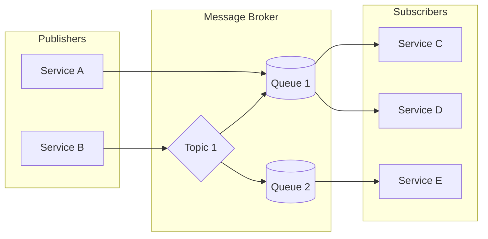
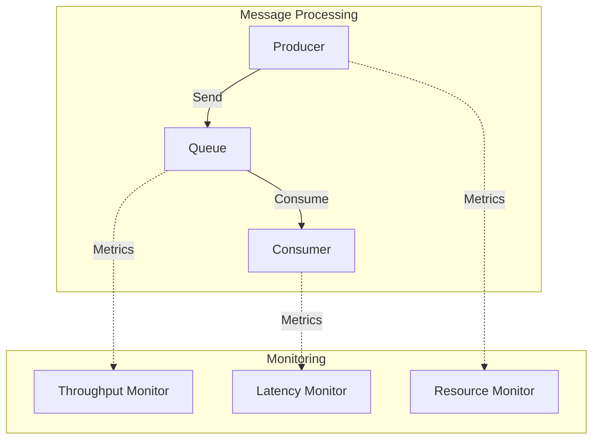

# 📡 Components Communication: Async Patterns

## 1. 🎯 Overview and Problem Statement

Modern distributed systems often require components to communicate without tight coupling or direct dependencies. This creates several challenges:

- Components may operate at different speeds or availability levels
- Direct communication can lead to system brittleness
- Scaling becomes difficult with synchronous dependencies
- System resilience suffers when components are tightly coupled

Async patterns solve these challenges by:
- Decoupling components temporally and spatially
- Improving system resilience
- Enabling better scalability
- Supporting system evolution

Business value:
- Reduced downtime
- Better user experience
- Easier maintenance
- Improved scalability
- Lower operational costs

## 2. 🏗 Detailed Solution/Architecture

### Core Concepts

1. Message-Based Communication
    - Events
    - Commands
    - Queries
    - Messages

2. Communication Styles
    - Publish/Subscribe
    - Request/Response
    - Fire-and-Forget
    - Broadcast

### Key Components

1. Message Broker
    - Queue management
    - Message persistence
    - Delivery guarantees
    - Dead letter handling

2. Publishers
    - Message creation
    - Routing logic
    - Retry mechanisms

3. Subscribers
    - Message handling
    - Error management
    - Processing guarantees

Let's visualize the basic architecture:



## 3. 💻 Technical Implementation

### Message Queue Implementation

Purpose: Basic message queue implementation with producer and consumer
Problem: Asynchronous communication between services
Dependencies: RabbitMQ

```typescript
// Producer
import amqp from 'amqplib';

class MessageProducer {
  private connection: amqp.Connection;
  private channel: amqp.Channel;

  async connect() {
    this.connection = await amqp.connect('amqp://localhost');
    this.channel = await this.connection.createChannel();
  }

  async sendMessage(queue: string, message: any) {
    await this.channel.assertQueue(queue);
    return this.channel.sendToQueue(
      queue,
      Buffer.from(JSON.stringify(message)),
      { persistent: true }
    );
  }
}

// Consumer
class MessageConsumer {
  private connection: amqp.Connection;
  private channel: amqp.Channel;

  async connect() {
    this.connection = await amqp.connect('amqp://localhost');
    this.channel = await this.connection.createChannel();
  }

  async consume(queue: string, handler: (message: any) => Promise<void>) {
    await this.channel.assertQueue(queue);
    this.channel.prefetch(1);
    
    this.channel.consume(queue, async (msg) => {
      if (msg) {
        try {
          const content = JSON.parse(msg.content.toString());
          await handler(content);
          this.channel.ack(msg);
        } catch (error) {
          this.channel.nack(msg);
        }
      }
    });
  }
}
```

### Publish/Subscribe Pattern

Purpose: Implementation of pub/sub pattern with topics
Problem: Broadcasting messages to multiple subscribers
Dependencies: Redis

```typescript
import Redis from 'ioredis';

class PubSubService {
  private publisher: Redis;
  private subscriber: Redis;

  constructor() {
    this.publisher = new Redis();
    this.subscriber = new Redis();
  }

  async publish(topic: string, message: any) {
    await this.publisher.publish(
      topic,
      JSON.stringify(message)
    );
  }

  async subscribe(topic: string, handler: (message: any) => Promise<void>) {
    await this.subscriber.subscribe(topic);
    
    this.subscriber.on('message', async (channel, message) => {
      if (channel === topic) {
        try {
          const parsedMessage = JSON.parse(message);
          await handler(parsedMessage);
        } catch (error) {
          console.error('Error processing message:', error);
        }
      }
    });
  }
}
```

## 4. 🔍 Decision Criteria & Evaluation

### When to Use Async Patterns

1. Message Queues
    - High-volume data processing
    - Task offloading
    - Guaranteed delivery requirements

2. Pub/Sub
    - Event broadcasting
    - Loose coupling requirements
    - Multiple subscribers needed

3. Event Sourcing
    - Audit requirements
    - Complex domain logic
    - Event replay needs

Comparison Matrix:

| Pattern | Coupling | Scalability | Complexity | Use Case |
|---------|----------|-------------|------------|----------|
| Message Queue | Low | High | Medium | Task processing |
| Pub/Sub | Very Low | Very High | Medium | Event broadcasting |
| Request/Reply | Medium | Medium | Low | Synchronous needs |
| Event Sourcing | Low | High | High | Audit trails |

## 5. 📊 Performance Metrics & Optimization

### Key Performance Indicators

1. Message Throughput
    - Messages per second
    - Batch processing rates
    - Queue depth

2. Latency
    - End-to-end delivery time
    - Processing time
    - Queue wait time

3. Resource Utilization
    - Memory usage
    - CPU usage
    - Network bandwidth

Let's visualize the monitoring setup:



## 8. ⚠️ Anti-Patterns

1. Fire and Forget Without Monitoring
   ```typescript
   // ❌ Bad Practice
   async function sendMessage(message: any) {
     await queue.send(message);
     // No tracking or monitoring
   }

   // ✅ Good Practice
   async function sendMessage(message: any) {
     const messageId = generateId();
     await queue.send({ ...message, messageId });
     await metrics.trackMessage(messageId);
     await logger.info(`Message sent: ${messageId}`);
   }
   ```

2. Missing Dead Letter Queues
   ```typescript
   // ❌ Bad Practice
   channel.consume(queue, (msg) => {
     try {
       processMessage(msg);
     } catch (error) {
       channel.nack(msg);
     }
   });

   // ✅ Good Practice
   channel.consume(queue, async (msg) => {
     try {
       await processMessage(msg);
       channel.ack(msg);
     } catch (error) {
       await moveToDeadLetter(msg);
       channel.ack(msg);
     }
   });
   ```

## 9. ❓ FAQ Section

1. How to handle message ordering?
    - Use message sequencing
    - Implement idempotency
    - Consider single-threaded consumers

2. What about message persistence?
    - Enable persistence in broker
    - Implement message store
    - Use transaction logs

3. How to scale consumers?
    - Implement consumer groups
    - Use competing consumers pattern
    - Consider partitioning

## 10. 📝 Best Practices & Guidelines

1. Design Principles
    - Use idempotent consumers
    - Implement retry policies
    - Monitor queue depths
    - Handle poison messages

2. Security Considerations
    - Message encryption
    - Authentication
    - Authorization
    - Audit logging

Implementation example:

```typescript
class SecureMessageQueue {
  async send(message: any) {
    const encrypted = await encrypt(message);
    const signed = await sign(encrypted);
    await this.queue.send(signed);
    await this.audit.log({
      action: 'message_sent',
      messageId: message.id,
      timestamp: new Date()
    });
  }

  async receive(handler: MessageHandler) {
    return this.queue.receive(async (message) => {
      if (!await verify(message)) {
        throw new SecurityError('Invalid signature');
      }
      const decrypted = await decrypt(message);
      await handler(decrypted);
    });
  }
}
```

## 11. 🔧 Troubleshooting Guide

Common Issues:
1. Message Loss
    - Enable persistence
    - Implement acknowledgments
    - Monitor dead letter queues

2. Performance Degradation
    - Monitor queue depths
    - Scale consumers
    - Optimize message size

3. Consumer Failures
    - Implement circuit breakers
    - Use retry policies
    - Monitor error rates

## 12. 🧪 Testing Strategies

Example of consumer testing:

```typescript
describe('MessageConsumer', () => {
  it('should process messages successfully', async () => {
    // Arrange
    const consumer = new MessageConsumer();
    const message = { id: 1, data: 'test' };
    const mockQueue = new MockQueue();
    
    // Act
    await consumer.consume(mockQueue, async (msg) => {
      expect(msg).toEqual(message);
    });
    
    // Assert
    await mockQueue.send(message);
    expect(await mockQueue.getProcessedCount()).toBe(1);
  });

  it('should handle errors gracefully', async () => {
    // Arrange
    const consumer = new MessageConsumer();
    const errorMessage = { id: 2, data: 'error' };
    
    // Act & Assert
    await expect(
      consumer.consume(async () => {
        throw new Error('Processing failed');
      })
    ).rejects.toBeInstanceOf(Error);
  });
});
```

## 13. 🌟 Real-world Use Cases

1. E-commerce Order Processing
    - Order placement events
    - Inventory updates
    - Shipping notifications
    - Payment processing

2. Financial Transactions
    - Payment processing
    - Account updates
    - Fraud detection
    - Audit logging

3. IoT Data Processing
    - Sensor data collection
    - Real-time analytics
    - Device management
    - Alert generation

## 14. 📚 References and Additional Resources

1. Books
    - "Enterprise Integration Patterns" by Gregor Hohpe
    - "Designing Data-Intensive Applications" by Martin Kleppmann

2. Articles
    - "Messaging Patterns in Distributed Systems"
    - "Understanding Message Queues"

3. Documentation
    - RabbitMQ Official Documentation
    - Apache Kafka Documentation
    - Redis Pub/Sub Guide

4. Community Resources
    - Stack Overflow Tags: async-patterns, message-queues
    - GitHub Examples: messaging-patterns
    - Developer Forums: distributed-systems
