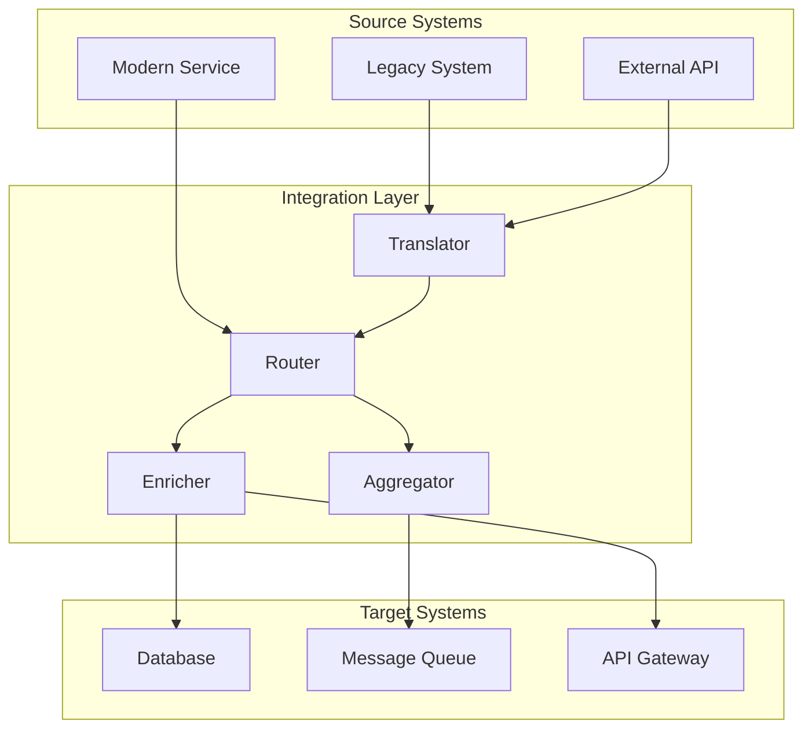

I'll create comprehensive documentation about Integration Patterns for component communication.


# 🔗 Components Communication: Integration Patterns

## 1. 🎯 Overview and Problem Statement

Integration patterns solve the complex challenge of connecting different components, services, and systems in a distributed architecture. Key challenges addressed include:

- System interoperability
- Data format transformation
- Protocol differences
- Timing and coordination
- Error handling and recovery
- System evolution
- Legacy system integration

Business value:
- Reduced integration costs
- Improved system flexibility
- Better maintainability
- Enhanced reliability
- Faster time to market
- Simplified system evolution

## 2. 🏗 Detailed Solution/Architecture

### Core Integration Patterns

1. Message Patterns
    - Message Router
    - Message Translator
    - Message Filter
    - Message Aggregator
    - Message Splitter
    - Content Enricher

2. Integration Styles
    - File Transfer
    - Shared Database
    - Remote Procedure Call
    - Messaging

Let's visualize the integration patterns architecture:



## 3. 💻 Technical Implementation

### Message Router Implementation

Purpose: Route messages based on content and rules
Problem: Direct messages to appropriate handlers
Dependencies: None

```typescript
interface Message {
  type: string;
  payload: any;
  metadata: Record<string, any>;
}

interface RouteRule {
  condition: (message: Message) => boolean;
  handler: (message: Message) => Promise<void>;
}

class MessageRouter {
  private rules: RouteRule[] = [];

  addRule(rule: RouteRule): void {
    this.rules.push(rule);
  }

  async route(message: Message): Promise<void> {
    const matchingRules = this.rules.filter(rule => 
      rule.condition(message)
    );

    if (matchingRules.length === 0) {
      throw new Error(`No matching rule for message type: ${message.type}`);
    }

    await Promise.all(
      matchingRules.map(rule => rule.handler(message))
    );
  }
}

// Usage Example
const router = new MessageRouter();

router.addRule({
  condition: msg => msg.type === 'ORDER_CREATED',
  handler: async msg => {
    await notifyInventorySystem(msg);
  }
});

router.addRule({
  condition: msg => msg.payload.priority === 'HIGH',
  handler: async msg => {
    await sendPriorityAlert(msg);
  }
});
```

### Message Translator Implementation

Purpose: Transform messages between different formats
Problem: System interoperability
Dependencies: None

```typescript
interface TranslationRule {
  sourceFormat: string;
  targetFormat: string;
  transform: (source: any) => any;
}

class MessageTranslator {
  private rules: Map<string, TranslationRule> = new Map();

  addRule(rule: TranslationRule): void {
    const key = `${rule.sourceFormat}->${rule.targetFormat}`;
    this.rules.set(key, rule);
  }

  async translate(
    message: any,
    sourceFormat: string,
    targetFormat: string
  ): Promise<any> {
    const key = `${sourceFormat}->${targetFormat}`;
    const rule = this.rules.get(key);

    if (!rule) {
      throw new Error(
        `No translation rule found: ${sourceFormat} -> ${targetFormat}`
      );
    }

    try {
      return await rule.transform(message);
    } catch (error) {
      throw new Error(
        `Translation failed: ${error.message}`
      );
    }
  }
}

// Usage Example
const translator = new MessageTranslator();

translator.addRule({
  sourceFormat: 'XML',
  targetFormat: 'JSON',
  transform: (xml) => {
    // XML to JSON transformation logic
    return JSON.parse(convertXMLtoJSON(xml));
  }
});

translator.addRule({
  sourceFormat: 'SOAP',
  targetFormat: 'REST',
  transform: (soapMessage) => {
    // SOAP to REST transformation logic
    return {
      method: extractMethod(soapMessage),
      body: extractBody(soapMessage)
    };
  }
});
```

### Content Enricher Implementation

Purpose: Add additional information to messages
Problem: Incomplete message data
Dependencies: None

```typescript
interface EnrichmentSource {
  type: string;
  fetch: (key: string) => Promise<any>;
}

class ContentEnricher {
  private sources: Map<string, EnrichmentSource> = new Map();

  addSource(source: EnrichmentSource): void {
    this.sources.set(source.type, source);
  }

  async enrich(message: any): Promise<any> {
    const enriched = { ...message };

    for (const [type, source] of this.sources) {
      if (this.needsEnrichment(message, type)) {
        const data = await source.fetch(message.id);
        enriched[type] = data;
      }
    }

    return enriched;
  }

  private needsEnrichment(message: any, type: string): boolean {
    return !message[type] || message[type].incomplete;
  }
}

// Usage Example
const enricher = new ContentEnricher();

enricher.addSource({
  type: 'userDetails',
  fetch: async (userId) => {
    return await userService.getDetails(userId);
  }
});

enricher.addSource({
  type: 'productDetails',
  fetch: async (productId) => {
    return await productService.getDetails(productId);
  }
});
```

## 4. 🔍 Decision Criteria & Evaluation

### Pattern Selection Matrix

| Pattern | Use Case | Pros | Cons |
|---------|----------|------|------|
| Message Router | Content-based routing | Flexible, Decoupled | Complex rules |
| Message Translator | Format conversion | Clean integration | Translation overhead |
| Content Enricher | Data completion | Complete data | Additional latency |
| Message Filter | Data filtering | Reduced load | Potential data loss |
| Aggregator | Message combining | Complete view | Increased complexity |
| Splitter | Message decomposition | Simplified processing | Message tracking |

### Decision Factors

1. System Requirements
    - Performance needs
    - Scalability requirements
    - Reliability requirements
    - Maintenance requirements

2. Integration Complexity
    - Number of systems
    - Data format differences
    - Protocol differences
    - Timing requirements

## 5. 📊 Performance Considerations

### Performance Metrics

1. Throughput
    - Messages per second
    - Transactions per second
    - Response time

2. Resource Usage
    - CPU utilization
    - Memory consumption
    - Network bandwidth

3. Reliability
    - Error rates
    - Recovery time
    - System availability

## 8. ⚠️ Anti-Patterns

1. Point-to-Point Integration

```typescript
// ❌ Bad Practice: Direct Integration
class OrderService {
  async processOrder(order: Order) {
    await this.inventoryService.updateStock(order);
    await this.shippingService.createShipment(order);
    await this.billingService.charge(order);
  }
}

// ✅ Good Practice: Message-Based Integration
class OrderService {
  async processOrder(order: Order) {
    const message = {
      type: 'ORDER_CREATED',
      payload: order,
      timestamp: new Date()
    };
    
    await this.messageRouter.route(message);
  }
}
```

2. Tight Coupling Through Shared Formats

```typescript
// ❌ Bad Practice: Shared DTOs
interface OrderDTO {
  id: string;
  items: Array<{
    productId: string;
    quantity: number;
  }>;
}

// ✅ Good Practice: Message Transformation
class OrderTransformer {
  toInventoryFormat(order: any) {
    return {
      orderId: order.id,
      stockUpdates: order.items.map(item => ({
        sku: item.productId,
        quantity: -item.quantity
      }))
    };
  }

  toShippingFormat(order: any) {
    return {
      reference: order.id,
      packages: this.calculatePackages(order.items)
    };
  }
}
```

## 9. ❓ FAQ Section

1. How to handle versioning?
    - Use version numbers in messages
    - Implement transformation for each version
    - Maintain backward compatibility
    - Phase out old versions gradually

2. How to ensure reliability?
    - Implement retry mechanisms
    - Use dead letter queues
    - Monitor system health
    - Implement circuit breakers

3. How to scale integration patterns?
    - Use horizontal scaling
    - Implement load balancing
    - Consider message partitioning
    - Use caching strategies

## 10. 📝 Best Practices & Guidelines

### Implementation Example

```typescript
class IntegrationService {
  private router: MessageRouter;
  private translator: MessageTranslator;
  private enricher: ContentEnricher;
  private monitor: PerformanceMonitor;

  async processMessage(message: any) {
    try {
      this.monitor.startTransaction();

      // Translate if needed
      const translated = await this.translator.translate(
        message,
        message.sourceFormat,
        this.targetFormat
      );

      // Enrich with additional data
      const enriched = await this.enricher.enrich(translated);

      // Route to appropriate handlers
      await this.router.route(enriched);

      this.monitor.endTransaction('success');
    } catch (error) {
      this.monitor.endTransaction('error');
      await this.handleError(error, message);
    }
  }

  private async handleError(error: Error, message: any) {
    await this.deadLetterQueue.send({
      originalMessage: message,
      error: error.message,
      timestamp: new Date()
    });
  }
}
```

## 11. 🔧 Troubleshooting Guide

1. Message Loss
    - Check system logs
    - Verify message acknowledgments
    - Monitor dead letter queues
    - Validate retry mechanisms

2. Performance Issues
    - Monitor system metrics
    - Check resource utilization
    - Analyze message patterns
    - Verify system configuration

## 12. 🧪 Testing Strategies

```typescript
describe('Integration Patterns', () => {
  let service: IntegrationService;

  beforeEach(() => {
    service = new IntegrationService({
      router: new MessageRouter(),
      translator: new MessageTranslator(),
      enricher: new ContentEnricher()
    });
  });

  it('should process message successfully', async () => {
    // Arrange
    const message = {
      type: 'ORDER_CREATED',
      payload: {
        orderId: '123',
        items: [{
          productId: 'P1',
          quantity: 2
        }]
      }
    };

    // Act
    await service.processMessage(message);

    // Assert
    expect(monitor.getSuccessCount()).toBe(1);
    expect(deadLetterQueue.isEmpty()).toBe(true);
  });
});
```

## 13. 🌟 Real-world Use Cases

1. E-commerce Integration
    - Order processing
    - Inventory management
    - Shipping integration
    - Payment processing

2. Financial Systems
    - Transaction processing
    - Account management
    - Regulatory reporting
    - Risk assessment

3. Healthcare Systems
    - Patient records
    - Lab results
    - Insurance claims
    - Appointment scheduling

## 14. 📚 References and Additional Resources

1. Books
    - "Enterprise Integration Patterns" by Gregor Hohpe
    - "Integration Patterns" by Bobby Woolf
    - "Microservices Patterns" by Chris Richardson

2. Articles
    - "Understanding Integration Patterns"
    - "Modern Integration Strategies"
    - "Event-Driven Integration"

3. Documentation
    - Apache Camel Documentation
    - Spring Integration Guide
    - MuleSoft Integration Patterns

4. Community Resources
    - Integration Patterns Catalog
    - Enterprise Integration Forums
    - System Integration Blog Posts
