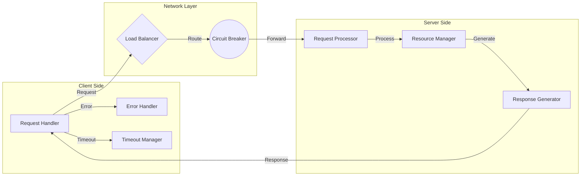

# 🔄 Components Communication: Sync Patterns

## 1. 🎯 Overview and Problem Statement

Synchronous communication patterns are fundamental in distributed systems where immediate responses are required. These patterns address:

- Need for real-time data consistency
- Direct component interactions
- Request-response workflows
- API-driven architectures

Key challenges solved:
- Immediate data availability
- Strong consistency requirements
- Interactive user experiences
- Transaction management
- System coordination

Business value:
- Reduced latency
- Improved user experience
- Real-time data accuracy
- Simplified error handling
- Better transaction management

## 2. 🏗 Detailed Solution/Architecture

### Core Concepts

1. Request-Response Pattern
    - HTTP/REST
    - gRPC
    - GraphQL
    - WebSocket

2. Communication Styles
    - Point-to-Point
    - Request-Reply
    - Remote Procedure Call (RPC)
    - Bidirectional Streaming

### Key Components

1. Client
    - Request formation
    - Response handling
    - Error management
    - Timeout handling

2. Server
    - Request processing
    - Response generation
    - Resource management
    - Connection handling

Let's visualize the basic architecture:



## 3. 💻 Technical Implementation

### REST API Implementation

Purpose: Basic REST API implementation with error handling and timeout
Problem: Synchronous HTTP communication between services
Dependencies: Express.js, Axios

```typescript
// Server Implementation
import express from 'express';
import { validate } from './validators';

class UserService {
  async createUser(req: express.Request, res: express.Response) {
    try {
      const userData = req.body;
      
      // Validate request
      const validationResult = validate(userData);
      if (!validationResult.success) {
        return res.status(400).json({
          error: 'Validation failed',
          details: validationResult.errors
        });
      }

      // Process request
      const user = await this.userRepository.create(userData);
      
      return res.status(201).json({
        success: true,
        data: user
      });
    } catch (error) {
      return res.status(500).json({
        error: 'Internal server error',
        message: error.message
      });
    }
  }
}

// Client Implementation with Retry Logic
import axios, { AxiosInstance } from 'axios';

class UserClient {
  private client: AxiosInstance;
  private maxRetries: number = 3;
  
  constructor() {
    this.client = axios.create({
      baseURL: 'http://api.example.com',
      timeout: 5000
    });
  }

  async createUser(userData: UserData, retryCount = 0): Promise<User> {
    try {
      const response = await this.client.post('/users', userData);
      return response.data;
    } catch (error) {
      if (this.shouldRetry(error) && retryCount < this.maxRetries) {
        await this.delay(Math.pow(2, retryCount) * 1000);
        return this.createUser(userData, retryCount + 1);
      }
      throw this.handleError(error);
    }
  }

  private shouldRetry(error: any): boolean {
    return error.response?.status >= 500 || error.code === 'ECONNABORTED';
  }

  private delay(ms: number): Promise<void> {
    return new Promise(resolve => setTimeout(resolve, ms));
  }
}
```

### gRPC Implementation

Purpose: Bidirectional streaming with gRPC
Problem: Real-time data exchange between services
Dependencies: grpc-js

```typescript
// Proto definition
syntax = "proto3";

service UserService {
  rpc CreateUser (User) returns (UserResponse);
  rpc StreamUsers (UserFilter) returns (stream User);
}

// Server Implementation
import * as grpc from '@grpc/grpc-js';
import { User, UserResponse } from './proto/user_pb';

class UserServiceImpl {
  createUser(
    call: grpc.ServerUnaryCall<User, UserResponse>,
    callback: grpc.sendUnaryData<UserResponse>
  ) {
    const user = call.request;
    try {
      // Process user creation
      const response = new UserResponse();
      response.setId(generateId());
      response.setSuccess(true);
      callback(null, response);
    } catch (error) {
      callback({
        code: grpc.status.INTERNAL,
        message: error.message
      });
    }
  }

  streamUsers(call: grpc.ServerWritableStream<UserFilter, User>) {
    const filter = call.request;
    
    this.userRepository.subscribe(user => {
      if (this.matchesFilter(user, filter)) {
        call.write(user);
      }
    });
  }
}
```

## 4. 🔍 Decision Criteria & Evaluation

### When to Use Sync Patterns

1. REST
    - CRUD operations
    - Simple request-response flows
    - Web API requirements

2. gRPC
    - High-performance requirements
    - Streaming data needs
    - Strong typing requirements

3. GraphQL
    - Flexible data requirements
    - Multiple client types
    - Bandwidth optimization needs

Comparison Matrix:

| Pattern | Performance | Complexity | Tooling | Use Case |
|---------|-------------|------------|---------|----------|
| REST | Medium | Low | Excellent | Web APIs |
| gRPC | High | Medium | Good | Microservices |
| GraphQL | Medium | High | Good | Mobile Apps |
| WebSocket | High | Medium | Good | Real-time |

## 5. 📊 Performance Metrics & Optimization

### Key Performance Indicators

1. Response Time
    - Time to first byte
    - Total request duration
    - Processing time

2. Throughput
    - Requests per second
    - Concurrent connections
    - Success rate

3. Resource Usage
    - CPU utilization
    - Memory usage
    - Network bandwidth

## 8. ⚠️ Anti-Patterns

1. Missing Timeout Handling
```typescript
// ❌ Bad Practice
async function fetchData() {
  const response = await fetch('/api/data');
  return response.json();
}

// ✅ Good Practice
async function fetchData() {
  const controller = new AbortController();
  const timeoutId = setTimeout(() => controller.abort(), 5000);
  
  try {
    const response = await fetch('/api/data', {
      signal: controller.signal
    });
    return response.json();
  } finally {
    clearTimeout(timeoutId);
  }
}
```

2. Improper Error Handling
```typescript
// ❌ Bad Practice
app.get('/api/users', (req, res) => {
  try {
    const users = getUsers();
    res.json(users);
  } catch (error) {
    res.status(500).send('Error');
  }
});

// ✅ Good Practice
app.get('/api/users', async (req, res) => {
  try {
    const users = await getUsers();
    res.json({
      success: true,
      data: users
    });
  } catch (error) {
    console.error('Error fetching users:', error);
    res.status(500).json({
      success: false,
      error: {
        message: 'Failed to fetch users',
        code: error.code,
        details: process.env.NODE_ENV === 'development' ? error.stack : undefined
      }
    });
  }
});
```

## 9. ❓ FAQ Section

1. How to handle network failures?
    - Implement retry logic
    - Use circuit breakers
    - Set appropriate timeouts
    - Handle errors gracefully

2. What about scaling?
    - Use load balancers
    - Implement caching
    - Connection pooling
    - Request throttling

3. Security considerations?
    - Use TLS/SSL
    - Implement authentication
    - Add request validation
    - Rate limiting

## 10. 📝 Best Practices & Guidelines

### Implementation Example

```typescript
class APIClient {
  private retryCount: number = 3;
  private circuitBreaker: CircuitBreaker;

  constructor() {
    this.circuitBreaker = new CircuitBreaker({
      failureThreshold: 5,
      resetTimeout: 60000
    });
  }

  async request<T>(config: RequestConfig): Promise<T> {
    return this.circuitBreaker.execute(async () => {
      const controller = new AbortController();
      const timeout = setTimeout(
        () => controller.abort(),
        config.timeout || 5000
      );

      try {
        const response = await fetch(config.url, {
          ...config,
          signal: controller.signal,
          headers: {
            ...config.headers,
            'X-Request-ID': generateRequestId()
          }
        });

        if (!response.ok) {
          throw new APIError(response);
        }

        return response.json();
      } finally {
        clearTimeout(timeout);
      }
    });
  }
}
```

## 11. 🔧 Troubleshooting Guide

1. High Latency
    - Check network conditions
    - Monitor server resources
    - Analyze database queries
    - Review caching strategy

2. Connection Errors
    - Verify network connectivity
    - Check DNS resolution
    - Validate SSL certificates
    - Monitor load balancers

## 12. 🧪 Testing Strategies

```typescript
describe('UserService', () => {
  let service: UserService;
  let mockDb: MockDatabase;

  beforeEach(() => {
    mockDb = new MockDatabase();
    service = new UserService(mockDb);
  });

  it('should create user successfully', async () => {
    // Arrange
    const userData = {
      name: 'John Doe',
      email: 'john@example.com'
    };

    // Act
    const response = await service.createUser(userData);

    // Assert
    expect(response.success).toBe(true);
    expect(response.data.id).toBeDefined();
    expect(mockDb.users).toHaveLength(1);
  });

  it('should handle validation errors', async () => {
    // Arrange
    const invalidData = {
      name: '',
      email: 'invalid-email'
    };

    // Act & Assert
    await expect(
      service.createUser(invalidData)
    ).rejects.toThrow(ValidationError);
  });
});
```

## 13. 🌟 Real-world Use Cases

1. E-commerce Platform
    - Product catalog API
    - Shopping cart management
    - Order processing
    - Payment integration

2. Social Media Platform
    - User authentication
    - Content delivery
    - Real-time notifications
    - Media upload

3. Banking System
    - Account management
    - Transaction processing
    - Balance inquiries
    - Security verification

## 14. 📚 References and Additional Resources

1. Books
    - "RESTful Web Services" by Leonard Richardson
    - "gRPC: Up and Running" by Kasun Indrasiri
    - "GraphQL in Action" by Samer Buna

2. Articles
    - "Understanding REST Principles"
    - "gRPC Best Practices"
    - "GraphQL vs REST"

3. Documentation
    - OpenAPI Specification
    - gRPC Documentation
    - GraphQL Documentation

4. Community Resources
    - Stack Overflow: rest-api, grpc
    - GitHub: awesome-rest
    - Dev.to: API design articles
