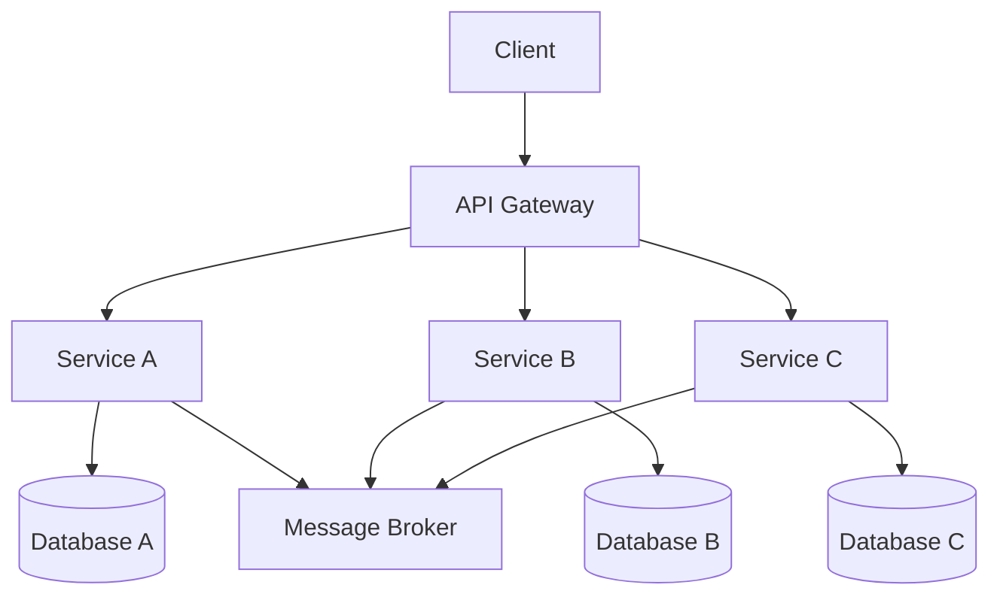

# 📊 Microservices Data Management
*Technical Documentation for Principal Engineers*

## 1. Overview and Problem Statement 🎯

### Definition
Microservices data management encompasses the strategies, patterns, and practices for handling data in a distributed microservices architecture, ensuring data consistency, availability, and reliability across multiple independent services.

### Problems Solved
- Data consistency across distributed services
- Service autonomy and independent scaling
- Data redundancy and duplication management
- Cross-service transactions
- Query efficiency and data access patterns
- Data ownership and boundaries

### Business Value
- Increased system scalability and flexibility
- Better fault isolation
- Improved development velocity
- Enhanced system maintainability
- Reduced time-to-market for new features
- Better resource utilization

## 2. Detailed Solution/Architecture 🏗️

### Core Concepts

#### 2.1 Data Sovereignty
- Each microservice owns its data exclusively
- Private internal data structures
- Data access only through service APIs
- Clear boundaries and responsibilities

#### 2.2 Data Patterns
1. **Database per Service**
    - Separate database for each microservice
    - Complete data isolation
    - Independent technology choices

2. **Event-Driven Architecture**
    - Event sourcing
    - CQRS (Command Query Responsibility Segregation)
    - Message-based communication

3. **Shared Data Patterns**
    - Data replication
    - Data views
    - Materialized views

### Key Components



## 3. Technical Implementation 💻

### 3.1 Database Per Service Pattern

#### Example Implementation (Spring Boot)

```java
@Service
public class OrderService {
    private final OrderRepository orderRepository;
    private final EventPublisher eventPublisher;

    @Transactional
    public Order createOrder(OrderRequest request) {
        // Create order in local database
        Order order = orderRepository.save(new Order(request));
        
        // Publish event for other services
        eventPublisher.publish(new OrderCreatedEvent(order));
        
        return order;
    }
}
```

#### Example Implementation (Node.js)

```javascript
class OrderService {
  constructor(orderRepo, eventPublisher) {
    this.orderRepo = orderRepo;
    this.eventPublisher = eventPublisher;
  }

  async createOrder(orderData) {
    // Start transaction
    const session = await this.orderRepo.startSession();
    try {
      await session.startTransaction();
      
      // Create order
      const order = await this.orderRepo.create(orderData, { session });
      
      // Publish event
      await this.eventPublisher.publish('OrderCreated', order);
      
      await session.commitTransaction();
      return order;
    } catch (error) {
      await session.abortTransaction();
      throw error;
    }
  }
}
```

### 3.2 Event Sourcing Pattern

```typescript
interface Event {
  id: string;
  timestamp: Date;
  type: string;
  data: any;
}

class OrderAggregate {
  private state: OrderState;
  private events: Event[] = [];

  applyEvent(event: Event) {
    switch (event.type) {
      case 'OrderCreated':
        this.state = {
          ...this.state,
          status: 'created',
          items: event.data.items
        };
        break;
      case 'OrderPaid':
        this.state = {
          ...this.state,
          status: 'paid',
          paymentDetails: event.data.payment
        };
        break;
    }
    this.events.push(event);
  }
}
```

## 4. Decision Criteria & Evaluation 📊

### Comparison Matrix

| Pattern | Consistency | Scalability | Complexity | Query Flexibility |
|---------|------------|-------------|------------|------------------|
| Database per Service | High | High | Medium | Low |
| Shared Database | High | Low | Low | High |
| CQRS | High | High | High | High |
| Event Sourcing | Eventually | High | High | Medium |

### Key Differentiators
1. **Database per Service**
    - Pros: High autonomy, independent scaling
    - Cons: Complex queries, data duplication

2. **CQRS**
    - Pros: Optimized read/write operations
    - Cons: Increased complexity, eventual consistency

## 5. Performance Metrics & Optimization ⚡

### KPIs
- Query response time
- Transaction throughput
- Data consistency lag
- Resource utilization
- Cache hit ratio

### Optimization Techniques

```java
@Service
public class OrderQueryService {
    private final Cache<String, OrderDTO> orderCache;
    
    public OrderDTO getOrder(String orderId) {
        return orderCache.get(orderId, key -> {
            OrderDTO order = orderRepository.findById(key)
                .map(this::toDTO)
                .orElseThrow();
            
            // Cache for 5 minutes
            orderCache.put(key, order, 5, TimeUnit.MINUTES);
            return order;
        });
    }
}
```

## 8. Anti-Patterns ⚠️

### 8.1 Distributed Transactions

❌ **Wrong Implementation**:
```java
@Transactional
public void createOrderWithPayment() {
    orderService.createOrder();  // Service A
    paymentService.processPayment();  // Service B
    shippingService.createShipment();  // Service C
}
```

✅ **Correct Implementation**:
```java
public void createOrderWithPayment() {
    // Create order and emit event
    OrderCreatedEvent orderEvent = orderService.createOrder();
    
    // Other services react to event
    eventPublisher.publish(orderEvent);
}
```

### 8.2 Data Coupling

❌ **Wrong**:
```javascript
class OrderService {
  async getOrderWithCustomerDetails(orderId) {
    const order = await orderRepo.findById(orderId);
    // Direct call to another service's database
    const customer = await customerRepo.findById(order.customerId);
    return { ...order, customer };
  }
}
```

✅ **Correct**:
```javascript
class OrderService {
  async getOrderWithCustomerDetails(orderId) {
    const order = await orderRepo.findById(orderId);
    // Use API call or event-driven approach
    const customer = await customerService.getCustomer(order.customerId);
    return { ...order, customer };
  }
}
```

## 9. FAQ Section ❓

### Q: How to handle data consistency across services?
A: Use event-driven architecture with eventual consistency:
1. Emit events for state changes
2. Implement compensation/rollback mechanisms
3. Use saga pattern for distributed transactions

### Q: How to handle service-to-service authentication?
A: Implement:
1. API Gateway authentication
2. Service-to-service JWT tokens
3. Mutual TLS (mTLS)

## 10. Best Practices & Guidelines 📚

### 10.1 Data Design Principles
1. **Service Autonomy**
    - Own your data
    - Avoid shared databases
    - Use APIs for data access

2. **Event-First Design**
    - Design around domain events
    - Use event sourcing where applicable
    - Implement eventual consistency

### 10.2 Security Considerations
```java
@Configuration
@EnableWebSecurity
public class SecurityConfig {
    @Bean
    public SecurityFilterChain filterChain(HttpSecurity http) {
        return http
            .oauth2ResourceServer()
            .jwt()
            .and()
            .authorizeRequests()
            .anyRequest().authenticated()
            .and()
            .build();
    }
}
```

## 11. Troubleshooting Guide 🔧

### Common Issues

1. **Data Inconsistency**
    - Symptom: Different services show different data states
    - Solution: Implement event tracking and reconciliation

   ```sql
   -- Reconciliation query
   SELECT o.order_id, o.status as order_status, 
          p.status as payment_status
   FROM orders o
   LEFT JOIN payments p ON o.order_id = p.order_id
   WHERE o.status != p.status;
   ```

2. **Performance Degradation**
    - Symptom: Increased response times
    - Solution: Implement caching and monitoring

## 12. Testing Strategies 🧪

### 12.1 Integration Testing

```java
@SpringBootTest
class OrderServiceIntegrationTest {
    @Autowired
    private OrderService orderService;
    
    @Autowired
    private TestEventListener eventListener;
    
    @Test
    void whenOrderCreated_thenEventEmitted() {
        // Given
        OrderRequest request = new OrderRequest();
        
        // When
        Order order = orderService.createOrder(request);
        
        // Then
        verify(eventListener).onOrderCreated(any(OrderCreatedEvent.class));
        assertThat(order).isNotNull();
    }
}
```

## 13. Real-world Use Cases 🌍

### E-commerce Platform Example
- Order service manages orders
- Inventory service handles stock
- Payment service processes payments
- Communication via events
- Each service has its database
- Eventual consistency model

## 14. References and Additional Resources 📚

### Books
- "Building Microservices" by Sam Newman
- "Domain-Driven Design" by Eric Evans

### Articles
- Martin Fowler's blog posts on microservices
- AWS microservices architecture guides
- Netflix technical blog

### Documentation
- Spring Cloud Data Flow
- Apache Kafka
- MongoDB multi-document transactions

For additional information and updates, refer to:
- [Spring Documentation](https://spring.io/microservices)
- [Microsoft Microservices Architecture](https://docs.microsoft.com/en-us/azure/architecture/microservices/)