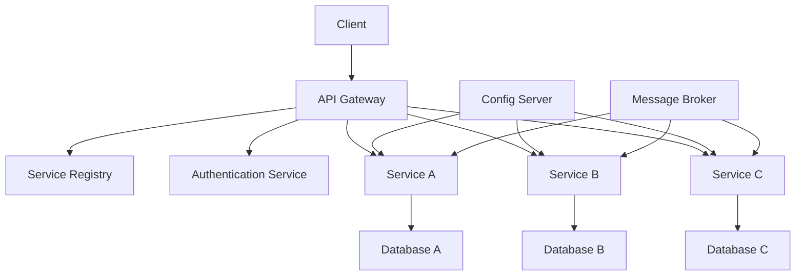

# 🏗️ Microservices Fundamentals
*Technical Documentation for Principal Engineers*

## 1. Overview and Problem Statement 🎯

### Definition
Microservices architecture is a design approach where a single application is built as a suite of small, independent services, each running in its own process and communicating through well-defined APIs. Each service is built around specific business capabilities and can be independently deployed, scaled, and maintained.

### Problems Solved
- Monolithic application complexity
- Scale and deployment challenges
- Development team coordination
- Technology stack limitations
- Long release cycles
- Single points of failure

### Business Value
- Faster time to market
- Independent scaling
- Technology flexibility
- Better fault isolation
- Improved team autonomy
- Enhanced system maintainability

## 2. Detailed Solution/Architecture 📐

### Core Concepts

#### 2.1 Service Independence
- Single responsibility principle
- Independent deployment
- Decentralized data management
- Autonomous teams
- API contracts

#### 2.2 Architecture Components



### Key Components

1. **API Gateway**
    - Entry point for clients
    - Request routing
    - Protocol translation
    - Authentication/Authorization

2. **Service Registry**
    - Service discovery
    - Load balancing
    - Health monitoring

3. **Config Server**
    - Centralized configuration
    - Environment management
    - Secret management

## 3. Technical Implementation 💻

### 3.1 Basic Service Implementation

#### Spring Boot Example

```java
@SpringBootApplication
@EnableDiscoveryClient
public class OrderServiceApplication {
    public static void main(String[] args) {
        SpringApplication.run(OrderServiceApplication.class, args);
    }
}

@RestController
@RequestMapping("/api/orders")
public class OrderController {
    private final OrderService orderService;
    
    @PostMapping
    public ResponseEntity<Order> createOrder(@RequestBody OrderRequest request) {
        Order order = orderService.createOrder(request);
        return ResponseEntity.ok(order);
    }
    
    @GetMapping("/{id}")
    public ResponseEntity<Order> getOrder(@PathVariable String id) {
        return orderService.findById(id)
            .map(ResponseEntity::ok)
            .orElse(ResponseEntity.notFound().build());
    }
}
```

#### Node.js Example

```javascript
// app.js
const express = require('express');
const app = express();

class OrderService {
  async createOrder(orderData) {
    // Implementation
  }
  
  async getOrder(id) {
    // Implementation
  }
}

app.post('/api/orders', async (req, res) => {
  try {
    const order = await orderService.createOrder(req.body);
    res.json(order);
  } catch (error) {
    res.status(500).json({ error: error.message });
  }
});

app.listen(3000, () => console.log('Order service running on port 3000'));
```

### 3.2 Service Discovery Implementation

```java
@Configuration
public class ServiceDiscoveryConfig {
    @Bean
    @LoadBalanced
    public RestTemplate restTemplate() {
        return new RestTemplate();
    }
}

@Service
public class OrderService {
    private final RestTemplate restTemplate;
    
    public OrderDetails getOrderWithPayment(String orderId) {
        Order order = findById(orderId);
        // Service discovery using logical service name
        Payment payment = restTemplate.getForObject(
            "http://payment-service/api/payments/{orderId}",
            Payment.class,
            orderId
        );
        return new OrderDetails(order, payment);
    }
}
```

## 4. Decision Criteria & Evaluation 📊

### Service Boundaries Decision Matrix

| Criterion | Monolithic | Microservices |
|-----------|------------|---------------|
| Deployment | Simple    | Complex       |
| Scaling    | Limited   | Flexible      |
| Development| Coupled   | Independent   |
| Testing    | Simple    | Complex       |
| Resilience | Limited   | High          |

### When to Use Microservices
1. Large, complex applications
2. Different scaling requirements
3. Multiple development teams
4. Need for technology diversity
5. High availability requirements

## 5. Performance Metrics & Optimization ⚡

### Key Metrics
- Service response time
- Transaction throughput
- Error rate
- Resource utilization
- API latency

### Monitoring Implementation

```java
@Configuration
public class MetricsConfig {
    @Bean
    public MeterRegistry meterRegistry() {
        return new SimpleMeterRegistry();
    }
}

@Service
public class MonitoredService {
    private final MeterRegistry registry;
    
    @Timed(value = "service.operation")
    public void performOperation() {
        registry.counter("operation.count").increment();
        // Operation implementation
    }
}
```

## 8. Anti-Patterns ⚠️

### 8.1 Chatty Services

❌ **Wrong Implementation**:
```java
@Service
public class OrderService {
    private final RestTemplate restTemplate;
    
    public OrderDetails getOrderDetails(String orderId) {
        Order order = getOrder(orderId);
        // Multiple API calls for single operation
        Customer customer = getCustomer(order.getCustomerId());
        Payment payment = getPayment(orderId);
        Shipping shipping = getShipping(orderId);
        return new OrderDetails(order, customer, payment, shipping);
    }
}
```

✅ **Correct Implementation**:
```java
@Service
public class OrderService {
    private final RestTemplate restTemplate;
    
    public OrderDetails getOrderDetails(String orderId) {
        // Single API call with composite response
        return restTemplate.getForObject(
            "http://order-aggregator-service/api/orders/{orderId}/details",
            OrderDetails.class,
            orderId
        );
    }
}
```

### 8.2 Shared Libraries

❌ **Wrong**:
```java
// Shared domain objects across services
package com.company.shared.domain;

public class Order {
    private String id;
    private Customer customer;
    private Payment payment;
    // Shared domain logic
}
```

✅ **Correct**:
```java
// Service-specific domain objects
package com.company.orderservice.domain;

public class Order {
    private String id;
    private String customerId;
    private String paymentId;
    // Service-specific logic
}
```

## 9. FAQ Section ❓

### Q: How to handle service-to-service communication?
A: Options include:
1. Synchronous (REST, gRPC)
2. Asynchronous (Message Queues)
3. Event-driven architecture

### Q: How to manage service discovery?
A: Use:
1. Service registry (Eureka, Consul)
2. DNS-based discovery
3. Load balancers

## 10. Best Practices & Guidelines 📚

### 10.1 Design Principles
1. **Single Responsibility**
    - One service per business capability
    - Clear boundaries
    - Independent data stores

2. **API First**
    - Define contracts early
    - Use API versioning
    - Implement backward compatibility

### 10.2 Security Implementation

```java
@Configuration
@EnableWebSecurity
public class SecurityConfig {
    @Bean
    public SecurityFilterChain filterChain(HttpSecurity http) {
        return http
            .oauth2ResourceServer()
            .jwt()
            .and()
            .authorizeRequests()
            .antMatchers("/api/public/**").permitAll()
            .anyRequest().authenticated()
            .and()
            .build();
    }
}
```

## 11. Troubleshooting Guide 🔧

### Common Issues

1. **Service Discovery Failures**
    - Symptom: Services unable to find each other
    - Solution: Check registry health and network connectivity

2. **Circuit Breaker Issues**
   ```java
   @CircuitBreaker(name = "orderService", fallbackMethod = "fallbackMethod")
   public Order getOrder(String orderId) {
       // Implementation
   }
   
   public Order fallbackMethod(String orderId, Exception ex) {
       // Fallback logic
   }
   ```

## 12. Testing Strategies 🧪

### 12.1 Testing Pyramid

1. **Unit Tests**
```java
@Test
void whenCreateOrder_thenSuccess() {
    OrderRequest request = new OrderRequest("product1", 1);
    Order order = orderService.createOrder(request);
    assertNotNull(order);
    assertEquals("product1", order.getProductId());
}
```

2. **Integration Tests**
```java
@SpringBootTest
class OrderServiceIntegrationTest {
    @Autowired
    private TestRestTemplate restTemplate;
    
    @Test
    void whenCallOrderAPI_thenSuccess() {
        ResponseEntity<Order> response = restTemplate.getForEntity(
            "/api/orders/{id}",
            Order.class,
            "order1"
        );
        assertEquals(HttpStatus.OK, response.getStatusCode());
    }
}
```

## 13. Real-world Use Cases 🌍

### E-commerce Platform
- Product Catalog Service
- Order Management Service
- Payment Processing Service
- User Management Service
- Inventory Service

### Implementation Example
```java
@Service
public class OrderProcessingService {
    private final OrderRepository orderRepository;
    private final EventPublisher eventPublisher;
    
    @Transactional
    public Order processOrder(OrderRequest request) {
        // Create order
        Order order = orderRepository.save(new Order(request));
        
        // Publish event for other services
        eventPublisher.publish(new OrderCreatedEvent(order));
        
        return order;
    }
}
```

## 14. References and Additional Resources 📚

### Books
- "Building Microservices" by Sam Newman
- "Microservices Patterns" by Chris Richardson

### Articles
- Martin Fowler's Microservices Guide
- Netflix Tech Blog
- AWS Microservices Architecture

### Documentation
- Spring Cloud
- Docker
- Kubernetes

For additional information and updates, refer to:
- [Spring Cloud Documentation](https://spring.io/projects/spring-cloud)
- [Microsoft Azure Microservices](https://docs.microsoft.com/en-us/azure/architecture/microservices/)
- [AWS Microservices](https://aws.amazon.com/microservices/)