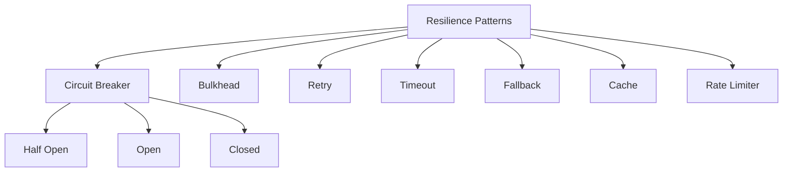

# 🛡️ Microservices Resilience Patterns
*Technical Documentation for Principal Engineers*

## 1. Overview and Problem Statement 🎯

### Definition
Resilience patterns in microservices architecture are design approaches and implementation techniques that enable systems to handle failures gracefully, maintain service availability, and recover from errors automatically.

### Problems Solved
- Service failures and downtime
- Cascading failures
- Network unreliability
- Resource exhaustion
- Traffic surges
- Data inconsistency during failures

### Business Value
- Improved system reliability
- Higher availability
- Better user experience
- Reduced operational costs
- Faster recovery from failures
- Predictable system behavior

## 2. Detailed Solution/Architecture 📐

### Core Resilience Patterns



### Key Components

1. **Circuit Breaker**
    - Failure detection
    - State management
    - Recovery monitoring
    - Threshold configuration

2. **Bulkhead**
    - Resource isolation
    - Thread pool separation
    - Connection pool management

3. **Retry**
    - Backoff strategies
    - Retry policies
    - Failure categorization

## 3. Technical Implementation 💻

### 3.1 Circuit Breaker Pattern

#### Using Resilience4j

```java
@Service
public class OrderService {
    private final PaymentService paymentService;
    private final CircuitBreaker circuitBreaker;

    public OrderService(PaymentService paymentService) {
        this.paymentService = paymentService;
        this.circuitBreaker = CircuitBreaker.ofDefaults("paymentService");
    }

    public Payment processPayment(OrderId orderId, Money amount) {
        return circuitBreaker.executeSupplier(() -> 
            paymentService.processPayment(orderId, amount));
    }
}

@Configuration
public class CircuitBreakerConfig {
    @Bean
    public CircuitBreakerRegistry circuitBreakerRegistry() {
        CircuitBreakerConfig config = CircuitBreakerConfig.custom()
            .failureRateThreshold(50)
            .waitDurationInOpenState(Duration.ofMillis(1000))
            .permittedNumberOfCallsInHalfOpenState(2)
            .slidingWindowSize(2)
            .build();
            
        return CircuitBreakerRegistry.of(config);
    }
}
```

### 3.2 Bulkhead Pattern

```java
@Service
public class OrderProcessingService {
    private final ThreadPoolExecutor orderPool;
    private final ThreadPoolExecutor paymentPool;

    public OrderProcessingService() {
        this.orderPool = new ThreadPoolExecutor(
            10, 20, 1, TimeUnit.MINUTES, 
            new ArrayBlockingQueue<>(100)
        );
        
        this.paymentPool = new ThreadPoolExecutor(
            5, 10, 1, TimeUnit.MINUTES,
            new ArrayBlockingQueue<>(50)
        );
    }

    public CompletableFuture<Order> processOrder(OrderRequest request) {
        return CompletableFuture.supplyAsync(() -> {
            // Order processing logic
            return createOrder(request);
        }, orderPool).thenComposeAsync(order -> 
            processPayment(order), paymentPool
        );
    }
}
```

### 3.3 Retry Pattern

```typescript
interface RetryConfig {
    maxAttempts: number;
    backoffPeriod: number;
    maxBackoffPeriod: number;
    retryableErrors: Set<string>;
}

class RetryableService {
    private readonly config: RetryConfig;

    async executeWithRetry<T>(
        operation: () => Promise<T>
    ): Promise<T> {
        let lastError: Error;
        let attempt = 0;

        while (attempt < this.config.maxAttempts) {
            try {
                return await operation();
            } catch (error) {
                lastError = error;
                
                if (!this.isRetryable(error)) {
                    throw error;
                }

                const backoff = Math.min(
                    this.config.backoffPeriod * Math.pow(2, attempt),
                    this.config.maxBackoffPeriod
                );
                
                await this.delay(backoff);
                attempt++;
            }
        }

        throw lastError;
    }

    private isRetryable(error: Error): boolean {
        return this.config.retryableErrors.has(error.name);
    }

    private delay(ms: number): Promise<void> {
        return new Promise(resolve => setTimeout(resolve, ms));
    }
}
```

### 3.4 Rate Limiter Implementation

```java
@Service
public class RateLimitedService {
    private final RateLimiter rateLimiter;

    public RateLimitedService() {
        RateLimiterConfig config = RateLimiterConfig.custom()
            .limitForPeriod(100)
            .limitRefreshPeriod(Duration.ofSeconds(1))
            .timeoutDuration(Duration.ofMillis(500))
            .build();
            
        this.rateLimiter = RateLimiter.of("api", config);
    }

    public Response processRequest(Request request) {
        return rateLimiter.executeSupplier(() -> {
            // Process request
            return processRequestInternal(request);
        });
    }
}
```

## 4. Pattern Combinations & Integration 🔄

### 4.1 Combined Resilience Strategy

```java
@Service
public class ResilientService {
    private final CircuitBreaker circuitBreaker;
    private final RateLimiter rateLimiter;
    private final Bulkhead bulkhead;
    private final Retry retry;

    public <T> T executeOperation(Supplier<T> operation) {
        return Decorators.ofSupplier(operation)
            .withCircuitBreaker(circuitBreaker)
            .withRateLimiter(rateLimiter)
            .withBulkhead(bulkhead)
            .withRetry(retry)
            .decorate()
            .get();
    }
}
```

## 5. Anti-Patterns ⚠️

### 5.1 Improper Timeout Handling

❌ **Wrong Implementation**:
```java
public class TimeoutService {
    public Response callService() {
        // No timeout configuration
        return externalService.call();
    }
}
```

✅ **Correct Implementation**:
```java
public class TimeoutService {
    @Timeout(value = 1000)
    public Response callService() {
        return Try.of(() -> 
            externalService.call()
        ).getOrElseThrow(() -> 
            new TimeoutException("Service call timed out")
        );
    }
}
```

### 5.2 Missing Fallback Strategies

❌ **Wrong**:
```java
@CircuitBreaker(name = "service")
public Order processOrder(OrderRequest request) {
    return externalService.process(request);
    // No fallback handling
}
```

✅ **Correct**:
```java
@CircuitBreaker(name = "service", fallbackMethod = "fallbackProcess")
public Order processOrder(OrderRequest request) {
    return externalService.process(request);
}

public Order fallbackProcess(OrderRequest request, Exception ex) {
    if (ex instanceof TimeoutException) {
        return processOrderOffline(request);
    }
    return createTemporaryOrder(request);
}
```

## 6. Testing Strategies 🧪

### 6.1 Circuit Breaker Testing

```java
@Test
void testCircuitBreakerBehavior() {
    CircuitBreaker breaker = CircuitBreaker.ofDefaults("test");
    AtomicInteger counter = new AtomicInteger(0);

    // Simulate failures
    IntStream.range(0, 5).forEach(i -> {
        try {
            breaker.executeSupplier(() -> {
                throw new RuntimeException("Simulated failure");
            });
        } catch (Exception ignored) {
            counter.incrementAndGet();
        }
    });

    // Verify circuit is open
    assertThrows(CallNotPermittedException.class, () ->
        breaker.executeSupplier(() -> "test")
    );
}
```

### 6.2 Chaos Testing

```java
@Test
void testSystemResilience() {
    ChaosMonkey chaosMonkey = new ChaosMonkey();
    
    chaosMonkey.injectLatency(
        ServiceIdentifier.of("payment-service"),
        Duration.ofSeconds(2)
    );

    Order result = orderService.processOrder(new OrderRequest());
    
    assertThat(result.getStatus())
        .isEqualTo(OrderStatus.PENDING);
}
```

## 7. Monitoring & Observability 📊

### 7.1 Metrics Collection

```java
@Configuration
public class MetricsConfig {
    @Bean
    public MeterRegistry meterRegistry() {
        return new SimpleMeterRegistry();
    }

    @Bean
    public CircuitBreakerMetrics circuitBreakerMetrics(
        CircuitBreakerRegistry circuitBreakerRegistry
    ) {
        return new CircuitBreakerMetrics(
            circuitBreakerRegistry,
            meterRegistry()
        );
    }
}
```

### 7.2 Health Indicators

```java
@Component
public class CircuitBreakerHealthIndicator extends AbstractHealthIndicator {
    private final CircuitBreakerRegistry registry;

    @Override
    protected void doHealthCheck(Health.Builder builder) {
        Map<String, CircuitBreaker.State> states = new HashMap<>();
        
        registry.getAllCircuitBreakers().forEach(breaker ->
            states.put(breaker.getName(), breaker.getState())
        );
        
        boolean anyOpen = states.values().contains(CircuitBreaker.State.OPEN);
        
        if (anyOpen) {
            builder.down().withDetails(states);
        } else {
            builder.up().withDetails(states);
        }
    }
}
```

## 8. Real-world Use Cases 🌍

### E-commerce Platform Example

```java
@Service
public class OrderProcessingService {
    @CircuitBreaker(name = "payment")
    @Bulkhead(name = "payment")
    @RateLimiter(name = "payment")
    public OrderResult processOrder(Order order) {
        try {
            Payment payment = paymentService.process(order);
            return OrderResult.success(payment);
        } catch (Exception e) {
            return OrderResult.failure(e);
        }
    }

    @Retry(name = "inventory")
    public boolean checkInventory(Order order) {
        return inventoryService.checkAvailability(order.getItems());
    }
}
```

## 9. Best Practices & Guidelines 📚

1. **Configuration Management**
```yaml
resilience4j:
  circuitbreaker:
    instances:
      paymentService:
        failureRateThreshold: 50
        waitDurationInOpenState: 1000
        permittedNumberOfCallsInHalfOpenState: 2
  bulkhead:
    instances:
      paymentService:
        maxConcurrentCalls: 10
  ratelimiter:
    instances:
      paymentService:
        limitForPeriod: 100
        limitRefreshPeriod: 1s
```

2. **Error Handling**
```java
@ControllerAdvice
public class ResilientErrorHandler {
    @ExceptionHandler(CircuitBreakerException.class)
    public ResponseEntity<ErrorResponse> handleCircuitBreakerException(
        CircuitBreakerException ex
    ) {
        return ResponseEntity
            .status(HttpStatus.SERVICE_UNAVAILABLE)
            .body(new ErrorResponse(
                "Service temporarily unavailable",
                ex.getMessage()
            ));
    }
}
```

## 10. References and Additional Resources 📚

### Books
- "Release It!" by Michael Nygard
- "Designing Distributed Systems" by Brendan Burns

### Articles
- Netflix Tech Blog on Resilience
- AWS Best Practices for Microservices
- Microsoft Azure Resilience Patterns

### Documentation
- Resilience4j Documentation
- Spring Cloud Circuit Breaker
- Hystrix Wiki (Archive)

For additional information and updates, refer to:
- [Resilience4j Documentation](https://resilience4j.readme.io/)
- [Spring Cloud Circuit Breaker Guide](https://spring.io/projects/spring-cloud-circuit-breaker)
- [Microsoft Resilience Patterns](https://docs.microsoft.com/en-us/azure/architecture/patterns/category/resiliency)