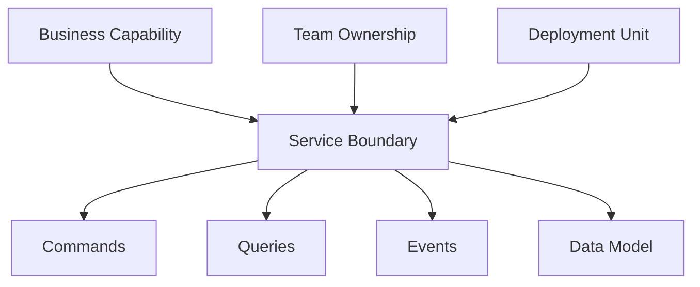

# 🔲 Microservices Service Boundaries
*Technical Documentation for Principal Engineers*

## 1. Overview and Problem Statement 🎯

### Definition
Service boundaries in microservices architecture define the scope, responsibilities, and interactions of individual services within a distributed system. They establish clear delineations between different business capabilities and determine how services communicate and share data.

### Problems Solved
- Unclear service responsibilities
- Tight coupling between services
- Data redundancy and inconsistency
- Team ownership conflicts
- Scaling bottlenecks
- Complex dependencies

### Business Value
- Clear ownership and accountability
- Improved maintainability
- Better scalability
- Faster feature delivery
- Reduced technical debt
- Enhanced team autonomy

## 2. Detailed Solution/Architecture 🏗️

### Core Concepts

#### 2.1 Domain-Driven Design (DDD) Concepts
- Bounded Contexts
- Aggregates
- Entities
- Value Objects
- Domain Events

#### 2.2 Service Boundary Patterns



### Key Components

1. **Business Capability Boundaries**
    - Focused functionality
    - Clear domain scope
    - Independent data ownership
    - Team alignment

2. **Communication Boundaries**
    - API contracts
    - Event boundaries
    - Data sharing policies
    - Integration patterns

## 3. Technical Implementation 💻

### 3.1 Domain Model Implementation

```java
// Order Bounded Context
@Aggregate
public class Order {
    @AggregateIdentifier
    private OrderId id;
    private CustomerId customerId;
    private Money totalAmount;
    private OrderStatus status;
    private List<OrderLine> orderLines;

    public Order(CreateOrderCommand cmd) {
        validateOrder(cmd);
        apply(new OrderCreatedEvent(cmd.getOrderId(), cmd.getCustomerId()));
    }

    public void addOrderLine(AddOrderLineCommand cmd) {
        validateOrderLine(cmd);
        apply(new OrderLineAddedEvent(id, cmd.getProductId(), cmd.getQuantity()));
    }

    @EventSourcingHandler
    public void on(OrderCreatedEvent event) {
        this.id = event.getOrderId();
        this.customerId = event.getCustomerId();
        this.status = OrderStatus.CREATED;
    }
}
```

### 3.2 Service API Design

```typescript
// Order Service API
interface OrderService {
  // Commands
  createOrder(order: CreateOrderDto): Promise<OrderId>;
  updateOrder(orderId: OrderId, update: UpdateOrderDto): Promise<void>;
  cancelOrder(orderId: OrderId): Promise<void>;

  // Queries
  getOrder(orderId: OrderId): Promise<OrderDto>;
  getOrdersByCustomer(customerId: CustomerId): Promise<OrderDto[]>;
  
  // Events
  subscribeToOrderEvents(): Observable<OrderEvent>;
}

// Clear boundary with other services
interface OrderDto {
  orderId: string;
  customerId: string;
  status: OrderStatus;
  totalAmount: Money;
  lines: OrderLineDto[];
}
```

### 3.3 Event-Driven Integration

```java
@Service
public class OrderProcessingService {
    private final EventPublisher eventPublisher;
    private final OrderRepository orderRepository;

    @Transactional
    public void processOrder(ProcessOrderCommand cmd) {
        Order order = orderRepository.findById(cmd.getOrderId())
            .orElseThrow(() -> new OrderNotFoundException(cmd.getOrderId()));
            
        // Process within boundary
        order.process();
        orderRepository.save(order);
        
        // Communicate across boundary via events
        eventPublisher.publish(new OrderProcessedEvent(
            order.getId(),
            order.getStatus(),
            order.getTotalAmount()
        ));
    }
}
```

## 4. Decision Criteria & Evaluation 📊

### Service Boundary Decision Matrix

| Criterion | Single Service | Multiple Services |
|-----------|---------------|-------------------|
| Business Capability | Single, cohesive | Multiple, distinct |
| Data Ownership | Single model | Separate models |
| Team Structure | One team | Multiple teams |
| Change Frequency | Similar pace | Different paces |
| Performance | Unified | Independent |

### Boundary Identification Checklist
1. Business capability alignment
2. Data ownership clarity
3. Team organization
4. Change patterns
5. Scalability requirements

## 5. Anti-Patterns ⚠️

### 5.1 Shared Domain Models

❌ **Wrong Implementation**:
```java
// Shared domain model across services
public class Customer {
    private CustomerId id;
    private String name;
    private Address address;
    private PaymentInfo paymentInfo;
    private List<Order> orders;
}
```

✅ **Correct Implementation**:
```java
// Order service's view of Customer
public class CustomerReference {
    private CustomerId id;
    private String name;
    // Only necessary customer information for Orders
}

// Order aggregate with proper boundaries
public class Order {
    private OrderId id;
    private CustomerReference customer;
    private List<OrderLine> lines;
}
```

### 5.2 Improper Service Communication

❌ **Wrong**:
```java
@Service
public class OrderService {
    private final CustomerService customerService;
    private final PaymentService paymentService;
    
    public Order createOrder(CreateOrderRequest request) {
        // Direct synchronous calls crossing boundaries
        Customer customer = customerService.getCustomer(request.getCustomerId());
        Payment payment = paymentService.processPayment(request.getPaymentDetails());
        return createOrderWithDetails(customer, payment);
    }
}
```

✅ **Correct**:
```java
@Service
public class OrderService {
    private final EventPublisher eventPublisher;
    
    public Order createOrder(CreateOrderRequest request) {
        // Create order within boundary
        Order order = new Order(request);
        
        // Publish event for other bounded contexts
        eventPublisher.publish(new OrderCreatedEvent(order.getId(), request));
        
        return order;
    }
}
```

## 6. Best Practices & Guidelines 📚

### 6.1 Service Boundary Design Principles

1. **Single Responsibility**
```java
// Good: Focused service boundary
@Service
public class OrderManagementService {
    public Order createOrder(CreateOrderCommand cmd) { /* ... */ }
    public void updateOrder(UpdateOrderCommand cmd) { /* ... */ }
    public void cancelOrder(CancelOrderCommand cmd) { /* ... */ }
}

// Bad: Mixed responsibilities
@Service
public class OrderService {
    public Order createOrder(CreateOrderCommand cmd) { /* ... */ }
    public void processPayment(PaymentDetails details) { /* ... */ }
    public void updateInventory(InventoryUpdate update) { /* ... */ }
}
```

2. **API Design**
```typescript
// Clear API contract at boundary
interface OrderApi {
    // Commands
    createOrder(order: CreateOrderRequest): Promise<OrderId>;
    
    // Queries
    getOrder(orderId: OrderId): Promise<OrderDetails>;
    
    // Events
    orderEvents(): Observable<OrderEvent>;
}
```

### 6.2 Data Consistency Patterns

```java
@Service
public class OrderBoundaryService {
    @Transactional
    public void processOrder(OrderId orderId) {
        // Handle consistency within boundary
        Order order = repository.findById(orderId)
            .orElseThrow(() -> new OrderNotFoundException(orderId));
            
        order.process();
        repository.save(order);
        
        // Use eventual consistency across boundaries
        eventPublisher.publish(new OrderProcessedEvent(order));
    }
}
```

## 7. Testing Strategies 🧪

### 7.1 Boundary Testing

```java
@SpringBootTest
class OrderBoundaryTests {
    @Autowired
    private OrderService orderService;
    
    @Test
    void whenCreateOrder_thenStaysWithinBoundary() {
        // Given
        CreateOrderCommand cmd = new CreateOrderCommand(/*...*/);
        
        // When
        OrderId orderId = orderService.createOrder(cmd);
        
        // Then
        Order order = orderService.getOrder(orderId);
        assertThat(order).isNotNull();
        verify(eventPublisher).publish(any(OrderCreatedEvent.class));
        // Verify no direct calls to other services
        verifyNoInteractions(customerService, paymentService);
    }
}
```

## 8. Real-world Use Cases 🌍

### E-commerce Domain Boundaries

1. **Order Management Bounded Context**
```java
public class Order {
    private OrderId id;
    private CustomerId customerId;
    private Money totalAmount;
    private OrderStatus status;
    private List<OrderLine> lines;
}
```

2. **Inventory Bounded Context**
```java
public class InventoryItem {
    private ProductId productId;
    private int quantityAvailable;
    private WarehouseId warehouseId;
}
```

3. **Customer Bounded Context**
```java
public class Customer {
    private CustomerId id;
    private String name;
    private ContactInfo contactInfo;
    private List<Address> addresses;
}
```

## 9. References and Additional Resources 📚

### Books
- "Domain-Driven Design" by Eric Evans
- "Implementing Domain-Driven Design" by Vaughn Vernon
- "Building Microservices" by Sam Newman

### Articles
- Strategic Domain-Driven Design
- Bounded Context Canvas
- Team Topologies

### Documentation
- Microsoft Domain-Driven Design fundamentals
- AWS Microservices Boundaries
- DDD Community Resources

For additional information and updates, refer to:
- [Microsoft DDD Guide](https://docs.microsoft.com/en-us/azure/architecture/microservices/model/domain-analysis)
- [Martin Fowler's Blog](https://martinfowler.com/tags/domain%20driven%20design.html)