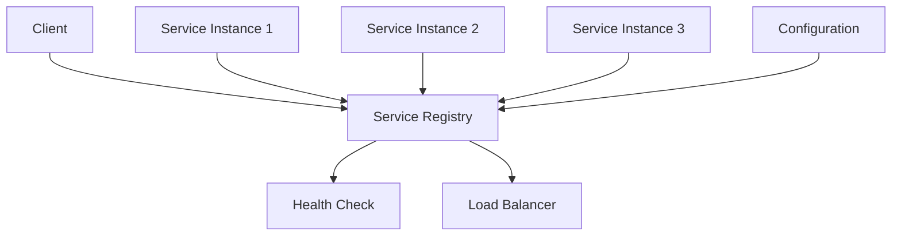

# 🔍 Service Discovery in Microservices
*Technical Documentation for Principal Engineers*

## 1. Overview and Problem Statement 🎯

### Definition
Service Discovery is a mechanism that enables microservices to locate and communicate with each other dynamically in a distributed system. It provides automatic detection of services and their instances as they become available or unavailable.

### Problems Solved
- Dynamic service location
- Load balancing
- Service health monitoring
- Instance registration/deregistration
- Network location abstraction
- Service redundancy

### Business Value
- Improved system reliability
- Automatic scaling support
- Reduced operational overhead
- Enhanced system maintainability
- Better fault tolerance
- Dynamic service management

## 2. Detailed Solution/Architecture 📐

### Core Components



### Implementation Patterns

1. **Client-Side Discovery**
    - Client queries registry
    - Client performs load balancing
    - Direct service communication

2. **Server-Side Discovery**
    - Load balancer queries registry
    - Centralized request routing
    - Client unaware of service locations

## 3. Technical Implementation 💻

### 3.1 Service Registration (Spring Cloud Netflix)

```java
@SpringBootApplication
@EnableDiscoveryClient
public class OrderServiceApplication {
    public static void main(String[] args) {
        SpringApplication.run(OrderServiceApplication.class, args);
    }
}

@Configuration
public class ServiceConfig {
    @Bean
    public ServiceRegistry serviceRegistry() {
        return new EurekaServiceRegistry();
    }
}
```

### 3.2 Service Discovery Client

```java
@Service
@LoadBalanced
public class OrderServiceClient {
    private final RestTemplate restTemplate;
    private final DiscoveryClient discoveryClient;

    public Order getOrder(String orderId) {
        // Using service ID instead of direct URL
        return restTemplate.getForObject(
            "http://order-service/orders/{id}",
            Order.class,
            orderId
        );
    }

    public List<ServiceInstance> getServiceInstances() {
        return discoveryClient.getInstances("order-service");
    }
}
```

### 3.3 Custom Service Registry Implementation

```java
public class CustomServiceRegistry implements ServiceRegistry<Registration> {
    private final ConcurrentHashMap<String, List<ServiceInstance>> services = 
        new ConcurrentHashMap<>();
    private final ScheduledExecutorService healthChecker = 
        Executors.newScheduledThreadPool(1);

    @Override
    public void register(Registration registration) {
        String serviceId = registration.getServiceId();
        ServiceInstance instance = createServiceInstance(registration);
        
        services.computeIfAbsent(serviceId, k -> new CopyOnWriteArrayList<>())
               .add(instance);
               
        startHealthCheck(instance);
    }

    @Override
    public void deregister(Registration registration) {
        String serviceId = registration.getServiceId();
        services.getOrDefault(serviceId, Collections.emptyList())
               .removeIf(instance -> 
                   instance.getInstanceId().equals(registration.getInstanceId())
               );
    }

    private void startHealthCheck(ServiceInstance instance) {
        healthChecker.scheduleAtFixedRate(() -> {
            if (!isHealthy(instance)) {
                deregister(instance.getRegistration());
            }
        }, 0, 30, TimeUnit.SECONDS);
    }
}
```

### 3.4 Load Balancer Integration

```java
@Configuration
public class LoadBalancerConfig {
    @Bean
    @LoadBalanced
    public RestTemplate restTemplate() {
        return new RestTemplate();
    }

    @Bean
    public LoadBalancerClient loadBalancerClient(
        DiscoveryClient discoveryClient
    ) {
        return new RoundRobinLoadBalancerClient(discoveryClient);
    }
}

public class RoundRobinLoadBalancerClient implements LoadBalancerClient {
    private final DiscoveryClient discoveryClient;
    private final AtomicInteger counter = new AtomicInteger(0);

    @Override
    public ServiceInstance choose(String serviceId) {
        List<ServiceInstance> instances = 
            discoveryClient.getInstances(serviceId);
            
        if (instances.isEmpty()) {
            return null;
        }
        
        int index = counter.getAndIncrement() % instances.size();
        return instances.get(index);
    }
}
```

## 4. Implementation Patterns 🔄

### 4.1 Client-Side Discovery Pattern

```java
@Service
public class ClientSideDiscoveryService {
    private final DiscoveryClient discoveryClient;
    private final LoadBalancerClient loadBalancer;

    public <T> T executeRequest(String serviceId, Function<URI, T> request) {
        ServiceInstance instance = loadBalancer.choose(serviceId);
        if (instance == null) {
            throw new ServiceNotFoundException(serviceId);
        }
        
        URI uri = instance.getUri();
        return request.apply(uri);
    }
}
```

### 4.2 Server-Side Discovery Pattern

```java
@Configuration
public class ApiGatewayConfig {
    @Bean
    public RouteLocator customRouteLocator(
        RouteLocatorBuilder builder,
        DiscoveryClient discoveryClient
    ) {
        return builder.routes()
            .route("order_service", r -> r.path("/orders/**")
                .filters(f -> f.rewritePath("/orders/(?<segment>.*)", 
                                          "/${segment}"))
                .uri("lb://order-service"))
            .build();
    }
}
```

## 5. Health Checking 🏥

### 5.1 Health Check Implementation

```java
@Component
public class ServiceHealthCheck implements HealthIndicator {
    private final ServiceInstance instance;
    private final RestTemplate restTemplate;

    @Override
    public Health health() {
        try {
            ResponseEntity<Health> response = restTemplate.getForEntity(
                instance.getUri().resolve("/actuator/health"),
                Health.class
            );
            
            if (response.getStatusCode() == HttpStatus.OK) {
                return Health.up()
                    .withDetails(response.getBody().getDetails())
                    .build();
            }
        } catch (Exception e) {
            return Health.down()
                .withException(e)
                .build();
        }
        
        return Health.down().build();
    }
}
```

## 6. Anti-Patterns ⚠️

### 6.1 Hard-Coded Service URLs

❌ **Wrong Implementation**:
```java
@Service
public class OrderService {
    private static final String PAYMENT_SERVICE_URL = 
        "http://localhost:8080/payments";

    public Payment processPayment(Order order) {
        return restTemplate.postForObject(
            PAYMENT_SERVICE_URL,
            order,
            Payment.class
        );
    }
}
```

✅ **Correct Implementation**:
```java
@Service
public class OrderService {
    private final DiscoveryClient discoveryClient;
    private final LoadBalancerClient loadBalancer;

    public Payment processPayment(Order order) {
        ServiceInstance instance = 
            loadBalancer.choose("payment-service");
            
        return restTemplate.postForObject(
            instance.getUri().resolve("/payments"),
            order,
            Payment.class
        );
    }
}
```

### 6.2 Missing Circuit Breaking

❌ **Wrong**:
```java
@Service
public class ServiceDiscoveryClient {
    public ServiceInstance getService(String serviceId) {
        List<ServiceInstance> instances = 
            discoveryClient.getInstances(serviceId);
            
        if (instances.isEmpty()) {
            throw new ServiceNotFoundException(serviceId);
        }
        
        return instances.get(0);
    }
}
```

✅ **Correct**:
```java
@Service
public class ServiceDiscoveryClient {
    @CircuitBreaker(name = "discoveryService")
    public ServiceInstance getService(String serviceId) {
        List<ServiceInstance> instances = 
            discoveryClient.getInstances(serviceId);
            
        if (instances.isEmpty()) {
            return fallbackService(serviceId);
        }
        
        return loadBalancer.choose(instances);
    }

    private ServiceInstance fallbackService(String serviceId) {
        // Implement fallback strategy
        return cachedServiceInstance(serviceId);
    }
}
```

## 7. Testing Strategies 🧪

### 7.1 Service Discovery Testing

```java
@SpringBootTest
class ServiceDiscoveryTest {
    @Autowired
    private DiscoveryClient discoveryClient;
    
    @Test
    void whenServiceRegistered_thenCanBeDiscovered() {
        // Given
        String serviceId = "test-service";
        
        // When
        List<ServiceInstance> instances = 
            discoveryClient.getInstances(serviceId);
        
        // Then
        assertThat(instances)
            .isNotEmpty()
            .allMatch(instance -> 
                instance.getServiceId().equals(serviceId)
            );
    }
}
```

### 7.2 Load Balancer Testing

```java
@Test
void testLoadBalancing() {
    LoadBalancerClient loadBalancer = new RoundRobinLoadBalancerClient();
    String serviceId = "test-service";
    
    // Create multiple requests
    List<ServiceInstance> selectedInstances = IntStream.range(0, 100)
        .mapToObj(i -> loadBalancer.choose(serviceId))
        .collect(Collectors.toList());
        
    // Verify even distribution
    Map<String, Long> distribution = selectedInstances.stream()
        .collect(Collectors.groupingBy(
            ServiceInstance::getInstanceId,
            Collectors.counting()
        ));
        
    assertThat(distribution.values())
        .allMatch(count -> 
            Math.abs(count - selectedInstances.size() / 
                distribution.size()) <= 1
        );
}
```

## 8. Best Practices & Guidelines 📚

### 8.1 Configuration Management

```yaml
spring:
  cloud:
    discovery:
      client:
        simple:
          instances:
            service1:
              - uri: http://instance1:8080
                metadata:
                  zone: zone1
                  version: 1.0
              - uri: http://instance2:8080
                metadata:
                  zone: zone2
                  version: 1.0
```

### 8.2 Security Configuration

```java
@Configuration
@EnableWebSecurity
public class ServiceDiscoverySecurityConfig {
    @Bean
    public SecurityFilterChain filterChain(HttpSecurity http) {
        return http
            .csrf()
            .disable()
            .authorizeRequests()
            .antMatchers("/eureka/**")
            .hasRole("DISCOVERY_CLIENT")
            .and()
            .httpBasic()
            .and()
            .build();
    }
}
```

## 9. Monitoring & Observability 📊

### 9.1 Metrics Collection

```java
@Configuration
public class MetricsConfig {
    @Bean
    public MeterRegistry meterRegistry() {
        return new SimpleMeterRegistry();
    }

    @Bean
    public DiscoveryClientMetrics discoveryClientMetrics(
        DiscoveryClient discoveryClient
    ) {
        return new DiscoveryClientMetrics(discoveryClient);
    }
}

@Component
public class DiscoveryClientMetrics {
    private final MeterRegistry registry;
    private final DiscoveryClient discoveryClient;

    public void recordMetrics() {
        discoveryClient.getServices().forEach(serviceId -> {
            List<ServiceInstance> instances = 
                discoveryClient.getInstances(serviceId);
                
            registry.gauge(
                "discovery.service.instances", 
                instances.size(),
                Tags.of("serviceId", serviceId)
            );
        });
    }
}
```

## 10. References and Additional Resources 📚

### Books
- "Microservices Patterns" by Chris Richardson
- "Building Microservices" by Sam Newman

### Articles
- Netflix Eureka Wiki
- Consul by HashiCorp Documentation
- Spring Cloud Service Discovery Guide

### Documentation
- Spring Cloud Netflix
- Kubernetes Service Discovery
- Consul Service Discovery

For additional information and updates, refer to:
- [Spring Cloud Netflix Documentation](https://spring.io/projects/spring-cloud-netflix)
- [Kubernetes Service Discovery](https://kubernetes.io/docs/concepts/services-networking/service/)
- [HashiCorp Consul](https://www.consul.io/docs/discovery/services)