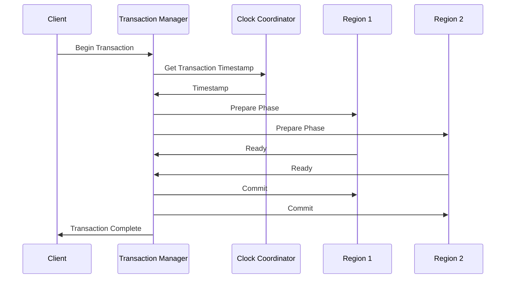
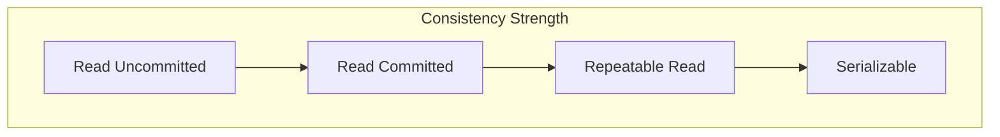

# 🔒 NewSQL: ACID Guarantees - Technical Documentation

## 1. Overview and Problem Statement 🎯

ACID guarantees in NewSQL systems represent a significant evolution in how we maintain data consistency across distributed database systems. Traditional ACID properties (Atomicity, Consistency, Isolation, Durability) were straightforward to implement in single-node databases but became challenging in distributed environments. NewSQL systems have innovated by providing these guarantees at scale without sacrificing performance.

The fundamental challenge lies in maintaining ACID properties across geographically distributed nodes while handling:
- Network partitions and latency
- Concurrent transactions at global scale
- Node failures and recovery
- Clock synchronization issues
- Partial system failures

The business value of NewSQL ACID guarantees manifests in several critical ways:
- Ensures data integrity for financial transactions
- Maintains consistency for inventory management
- Provides reliable audit trails for compliance
- Enables strong consistency for user-facing applications
- Simplifies application development by providing familiar transaction semantics

## 2. Detailed Solution/Architecture 🏗️

NewSQL systems implement ACID guarantees through a sophisticated combination of distributed protocols and careful system design. Let's examine how each ACID property is maintained:

### Transaction Flow with ACID Guarantees



### Isolation Levels Implementation



## 3. Technical Implementation 💻

Let's examine how to implement ACID guarantees in a distributed NewSQL environment:

### Atomic Transaction Manager

```java
/**
 * Implements atomic transactions across distributed nodes using
 * a two-phase commit protocol with failure recovery.
 */
public class DistributedTransactionManager {
    private final ConsensusProtocol consensus;
    private final LockManager lockManager;
    private final ClockService clockService;
    
    public TransactionResult executeTransaction(Transaction tx) {
        try {
            // Acquire global transaction timestamp
            Timestamp txTimestamp = clockService.getGlobalTimestamp();
            tx.setTimestamp(txTimestamp);
            
            // Phase 1: Prepare - all participants must acknowledge
            PrepareResult prepareResult = prepare(tx);
            if (!prepareResult.isSuccessful()) {
                rollback(tx);
                return TransactionResult.failure("Prepare phase failed");
            }
            
            // Phase 2: Commit - persist changes across all nodes
            CommitResult commitResult = commit(tx);
            if (!commitResult.isSuccessful()) {
                rollback(tx);
                return TransactionResult.failure("Commit phase failed");
            }
            
            return TransactionResult.success();
            
        } catch (Exception e) {
            rollback(tx);
            return TransactionResult.failure(e.getMessage());
        }
    }
    
    private PrepareResult prepare(Transaction tx) {
        // Acquire necessary locks
        Set<Lock> locks = lockManager.acquireLocks(tx.getResourceSet());
        
        // Validate transaction against consistency rules
        ValidationResult validation = validateTransaction(tx);
        if (!validation.isValid()) {
            lockManager.releaseLocks(locks);
            return PrepareResult.failure(validation.getReason());
        }
        
        // Get prepare votes from all participants
        return consensus.getPrepareVotes(tx.getParticipants());
    }
}
```

### Isolation Level Implementation

```python
class IsolationManager:
    """
    Manages transaction isolation levels and ensures proper
    visibility of data across concurrent transactions.
    """
    def __init__(self):
        self.version_manager = MultiversionsManager()
        self.lock_manager = GlobalLockManager()
        
    def start_transaction(self, isolation_level):
        """
        Begins a new transaction with specified isolation level.
        Sets up appropriate locks and visibility rules.
        """
        tx = Transaction()
        
        if isolation_level == IsolationLevel.SERIALIZABLE:
            # Set up predicate locks for serializable isolation
            tx.lock_strategy = PredicateLockStrategy()
            tx.visibility_rule = SnapshotVisibility()
            
        elif isolation_level == IsolationLevel.REPEATABLE_READ:
            # Set up range locks for repeatable read
            tx.lock_strategy = RangeLockStrategy()
            tx.visibility_rule = CommittedVisibility()
            
        elif isolation_level == IsolationLevel.READ_COMMITTED:
            # Set up read locks that are released immediately
            tx.lock_strategy = ReadLockStrategy()
            tx.visibility_rule = CommittedVisibility()
            
        return tx
        
    def read_data(self, tx, key):
        """
        Reads data according to transaction's isolation level.
        Handles visibility rules and concurrent access.
        """
        # Get appropriate version based on isolation level
        version = self.version_manager.get_version(
            key, 
            tx.visibility_rule
        )
        
        # Acquire necessary locks based on isolation level
        self.lock_manager.acquire_read_lock(
            key,
            tx.lock_strategy
        )
        
        return version.get_data()
```

## 4. Decision Criteria & Evaluation 📊

When implementing ACID guarantees in NewSQL systems, consider these trade-offs:

### Isolation Level Selection Matrix

| Isolation Level | Consistency | Performance | Use Case |
|----------------|-------------|-------------|-----------|
| Serializable | Strongest | Lowest | Financial transactions |
| Repeatable Read | Strong | Moderate | Inventory management |
| Read Committed | Moderate | High | Analytics queries |
| Read Uncommitted | Weak | Highest | Real-time metrics |

## 5. Performance Metrics & Optimization ⚡

Monitor these key metrics to ensure ACID guarantees are maintained efficiently:

```python
class ACIDMetricsCollector:
    """
    Collects and analyzes metrics related to ACID guarantee
    maintenance and transaction performance.
    """
    def collect_acid_metrics(self):
        metrics = {
            'transaction_abort_rate': self._measure_abort_rate(),
            'lock_contention': self._measure_lock_contention(),
            'deadlock_frequency': self._measure_deadlocks(),
            'isolation_violations': self._detect_isolation_violations(),
            'durability_lag': self._measure_durability_lag()
        }
        
        # Analyze metrics for potential issues
        self._analyze_metrics(metrics)
        
        # Take corrective action if needed
        if self._requires_intervention(metrics):
            self._adjust_transaction_parameters(metrics)
            
        return metrics
```

## 8. Anti-Patterns ⚠️

Let's examine common mistakes in implementing ACID guarantees:

### Incorrect Lock Management

```java
// INCORRECT: Risk of deadlock
public class DeadlockProneManager {
    public void executeTransactions(Transaction tx1, Transaction tx2) {
        // May lead to circular wait
        tx1.acquireLock(resourceA);
        tx2.acquireLock(resourceB);
        tx1.acquireLock(resourceB);  // Potential deadlock
        tx2.acquireLock(resourceA);  // Potential deadlock
    }
}

// CORRECT: Deadlock prevention
public class SafeLockManager {
    public void executeTransactions(Transaction tx1, Transaction tx2) {
        // Acquire locks in consistent order
        List<Resource> orderedResources = sortResourcesByGlobalId(
            resourceA, 
            resourceB
        );
        
        for (Resource resource : orderedResources) {
            tx1.acquireLock(resource);
        }
        
        // Process transaction
        tx1.execute();
        
        // Release locks in reverse order
        for (Resource resource : orderedResources.reverse()) {
            tx1.releaseLock(resource);
        }
    }
}
```

## 11. Troubleshooting Guide 🔧

When ACID guarantee issues arise, follow this systematic approach:

```python
class ACIDTroubleshooter:
    """
    Diagnoses and resolves issues related to ACID guarantee
    violations in distributed NewSQL systems.
    """
    def diagnose_acid_violation(self, symptoms):
        # Check atomicity
        if not self._verify_atomicity():
            return self._resolve_atomicity_issue()
            
        # Verify consistency
        if not self._verify_consistency():
            return self._resolve_consistency_issue()
            
        # Check isolation
        if not self._verify_isolation():
            return self._resolve_isolation_issue()
            
        # Verify durability
        if not self._verify_durability():
            return self._resolve_durability_issue()
```

## 13. Real-world Use Cases 🌐

### Global Banking System Implementation

A major international bank implemented NewSQL ACID guarantees to handle:
- Cross-border transactions
- Real-time fraud detection
- Regulatory compliance
- Multi-currency operations

Implementation approach:
```python
class GlobalBankingTransaction:
    """
    Implements ACID guarantees for cross-border banking
    transactions with strict consistency requirements.
    """
    def execute_international_transfer(self, transfer):
        with self.transaction_manager.begin(
            isolation_level=IsolationLevel.SERIALIZABLE
        ) as tx:
            # Verify source account
            source = self.validate_account(
                transfer.source_account,
                tx
            )
            
            # Check destination account
            destination = self.validate_account(
                transfer.destination_account,
                tx
            )
            
            # Execute currency conversion
            converted_amount = self.currency_converter.convert(
                transfer.amount,
                source.currency,
                destination.currency
            )
            
            # Update both accounts atomically
            source.debit(transfer.amount)
            destination.credit(converted_amount)
            
            # Record for audit
            self.audit_logger.log_transfer(transfer, tx)
```

## 14. References and Additional Resources 📚

Essential reading for understanding ACID guarantees in NewSQL:
- "Principles of Transaction Processing" by Philip A. Bernstein
- "Designing Data-Intensive Applications" by Martin Kleppmann
- "Transaction Processing: Concepts and Techniques" by Jim Gray

Research Papers:
- "Large-scale Incremental Processing Using Distributed Transactions and Notifications"
- "Calvin: Fast Distributed Transactions for Partitioned Database Systems"
- "Spanner: Google's Globally-Distributed Database"