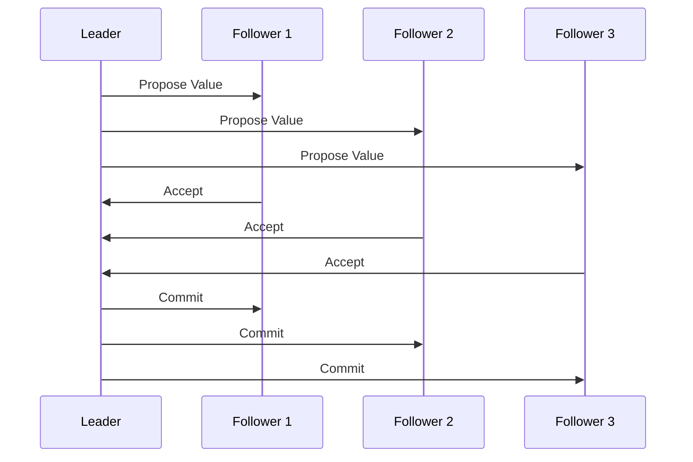
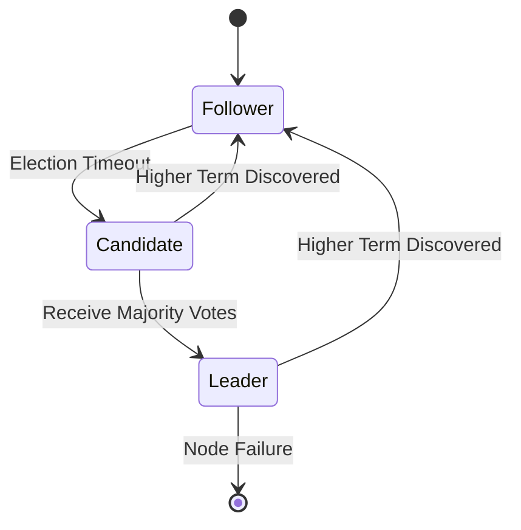

# 🤝 NewSQL: Consensus Protocols - Technical Documentation

## 1. Overview and Problem Statement 🎯

Consensus protocols form the backbone of NewSQL systems, enabling distributed nodes to agree on a single source of truth despite network delays, partitions, and node failures. These protocols solve the fundamental challenge of achieving agreement in distributed systems while maintaining performance and reliability.

The core challenges that consensus protocols address include:
- Ensuring all nodes agree on transaction ordering
- Maintaining consistency during network partitions
- Handling node failures gracefully
- Balancing consistency with performance
- Managing clock synchronization
- Dealing with split-brain scenarios

The business impact of robust consensus protocols manifests in:
- Reliable financial transactions across distributed systems
- Consistent user experience across global applications
- High availability without sacrificing consistency
- Reduced operational complexity for distributed deployments
- Improved disaster recovery capabilities

## 2. Detailed Solution/Architecture 🏗️

NewSQL systems typically implement variations of well-known consensus protocols, enhanced for distributed database requirements. Let's examine the core components and flows:

### Basic Consensus Flow



### Leader Election Process



## 3. Technical Implementation 💻

Let's examine the implementation of key consensus components:

### Raft Consensus Implementation

```java
/**
 * Implements the Raft consensus protocol for distributed agreement.
 * Handles leader election, log replication, and membership changes.
 */
public class RaftConsensus {
    private final NodeId nodeId;
    private final RaftLog log;
    private final RaftState state;
    private final ElectionTimer electionTimer;
    
    public void handleAppendEntries(AppendEntriesRequest request) {
        // First, validate the term
        if (request.term() < state.getCurrentTerm()) {
            return AppendEntriesResponse.failure(state.getCurrentTerm());
        }
        
        // Update term if necessary
        if (request.term() > state.getCurrentTerm()) {
            state.setCurrentTerm(request.term());
            state.setVotedFor(null);
            state.setRole(RaftRole.FOLLOWER);
        }
        
        // Reset election timer since we heard from leader
        electionTimer.reset();
        
        // Verify log consistency
        if (!log.verifyPreviousEntry(
            request.prevLogIndex(), 
            request.prevLogTerm()
        )) {
            return AppendEntriesResponse.failure(state.getCurrentTerm());
        }
        
        // Append new entries and commit as needed
        log.appendEntries(request.entries());
        if (request.leaderCommit() > log.getCommitIndex()) {
            log.commitTo(Math.min(
                request.leaderCommit(),
                log.getLastLogIndex()
            ));
        }
        
        return AppendEntriesResponse.success(state.getCurrentTerm());
    }
}
```

### Leader Election Implementation

```python
class RaftNode:
    """
    Implements a node in the Raft consensus protocol,
    handling state transitions and voting.
    """
    def __init__(self, node_id, cluster_config):
        self.node_id = node_id
        self.state = RaftState.FOLLOWER
        self.current_term = 0
        self.voted_for = None
        self.log = RaftLog()
        self.cluster = cluster_config
        
    def start_election(self):
        """
        Initiates a leader election when election timeout occurs.
        Implements the candidate phase of the Raft protocol.
        """
        self.state = RaftState.CANDIDATE
        self.current_term += 1
        self.voted_for = self.node_id
        
        # Prepare request vote messages
        request = RequestVoteRequest(
            term=self.current_term,
            candidate_id=self.node_id,
            last_log_index=self.log.last_index,
            last_log_term=self.log.last_term
        )
        
        # Collect votes from all nodes
        votes_received = 1  # Vote for self
        for node in self.cluster.get_other_nodes():
            response = node.request_vote(request)
            if response.vote_granted:
                votes_received += 1
                
        # Check if we won the election
        if votes_received > len(self.cluster.nodes) / 2:
            self.become_leader()
        else:
            self.state = RaftState.FOLLOWER
```

## 4. Decision Criteria & Evaluation 📊

When selecting a consensus protocol, consider these factors:

### Protocol Comparison Matrix

| Feature | Raft | Paxos | Zab | Multi-Paxos |
|---------|------|-------|-----|-------------|
| Complexity | Lower | Higher | Medium | Higher |
| Performance | Good | Excellent | Good | Excellent |
| Implementation Availability | Many | Few | Few | Very Few |
| Documentation | Excellent | Limited | Good | Limited |
| Recovery Time | Fast | Medium | Fast | Medium |

## 5. Performance Metrics & Optimization ⚡

Monitor these key metrics to ensure optimal consensus performance:

```python
class ConsensusMonitor:
    """
    Monitors and analyzes consensus protocol performance metrics.
    Helps identify bottlenecks and optimization opportunities.
    """
    def collect_metrics(self):
        metrics = {
            'leader_election_time': self._measure_election_time(),
            'log_replication_latency': self._measure_replication_lag(),
            'commit_latency': self._measure_commit_time(),
            'network_round_trips': self._count_round_trips(),
            'term_changes': self._count_term_changes()
        }
        
        # Analyze metrics for potential issues
        anomalies = self._detect_anomalies(metrics)
        
        # Take corrective action if needed
        if anomalies:
            self._optimize_consensus_parameters(anomalies)
            
        return metrics
```

## 8. Anti-Patterns ⚠️

Let's examine common mistakes in consensus protocol implementations:

### Incorrect Leader Election

```java
// INCORRECT: Unsafe leader election
public class UnsafeLeaderElection {
    public void handleElectionTimeout() {
        // Dangerous: No term number check
        becomeCandidate();
        collectVotes();
        becomeLeader();  // Might result in split-brain
    }
}

// CORRECT: Safe leader election
public class SafeLeaderElection {
    public void handleElectionTimeout() {
        // Increment term and reset state
        currentTerm++;
        votedFor = nodeId;
        
        // Prepare vote request with current log state
        VoteRequest request = new VoteRequest(
            currentTerm,
            nodeId,
            log.getLastIndex(),
            log.getLastTerm()
        );
        
        // Only become leader if majority votes received
        int votes = requestVotes(request);
        if (votes > clusterSize / 2) {
            becomeLeader();
        } else {
            // Fall back to follower state
            becomeFollower(currentTerm);
        }
    }
}
```

## 11. Troubleshooting Guide 🔧

When consensus issues arise, follow this systematic approach:

```python
class ConsensusTroubleshooter:
    """
    Provides systematic approaches to diagnose and resolve
    consensus-related issues in distributed systems.
    """
    def diagnose_consensus_issue(self, symptoms):
        # Check cluster health
        if not self._verify_cluster_health():
            return self._handle_cluster_issue()
            
        # Verify term numbers
        if not self._verify_term_consistency():
            return self._handle_term_inconsistency()
            
        # Check log consistency
        if not self._verify_log_consistency():
            return self._handle_log_inconsistency()
            
        # Examine network partitions
        return self._analyze_network_partitions()
```

## 13. Real-world Use Cases 🌐

### Global Stock Trading Platform

A major stock exchange implemented a consensus protocol to handle:
- Million+ trades per second
- Sub-millisecond commit times
- Zero downtime requirement
- Global regulatory compliance

Implementation approach:
```python
class TradingConsensus:
    """
    Implements a high-performance consensus protocol for
    stock trading operations with strict timing requirements.
    """
    def process_trade(self, trade_order):
        # Acquire distributed lock
        with self.lock_manager.acquire_lock(
            trade_order.symbol
        ):
            # Propose trade to all nodes
            proposal = self.create_proposal(trade_order)
            consensus_result = self.achieve_consensus(proposal)
            
            if consensus_result.is_successful():
                # Execute trade atomically
                self.execute_trade(trade_order)
                
                # Notify all participants
                self.notify_participants(trade_order)
                
                return TradeResult.SUCCESS
            else:
                return TradeResult.CONSENSUS_FAILED
```

## 14. References and Additional Resources 📚

Essential reading for mastering consensus protocols:
- "In Search of an Understandable Consensus Algorithm" (Raft paper)
- "Paxos Made Simple" by Leslie Lamport
- "Consensus: Bridging Theory and Practice" by Diego Ongaro

Research Papers:
- "The Part-Time Parliament" (Original Paxos paper)
- "ZooKeeper: Wait-free coordination for Internet-scale systems"
- "In Search of an Understandable Consensus Algorithm"

Implementation Resources:
- Raft Consensus Algorithm Website
- etcd Documentation
- ZooKeeper Documentation