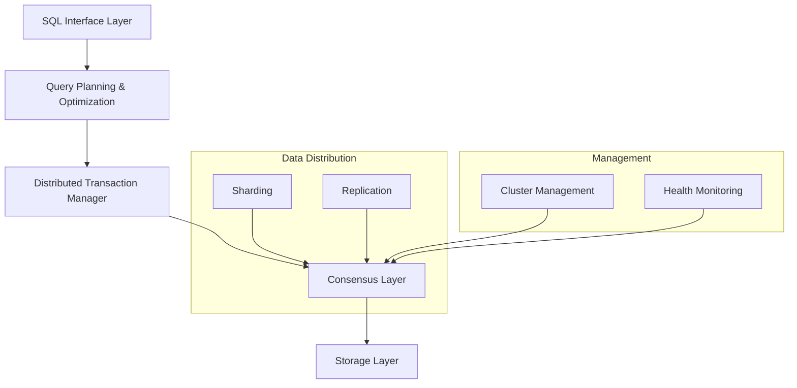
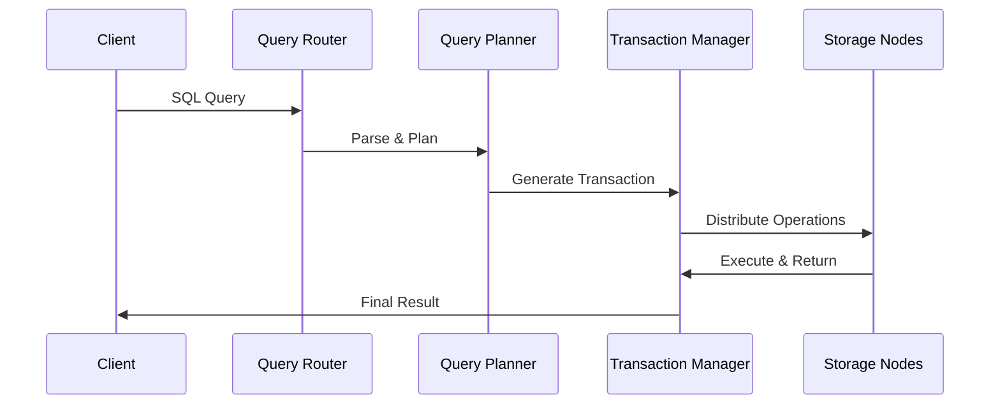

# 🏗️ Distributed SQL Architecture - Technical Documentation

## 1. Overview and Problem Statement 🎯

Distributed SQL architecture represents a fundamental shift in how we design and implement relational database systems for cloud-native environments. It addresses the growing need for globally distributed applications to maintain strong consistency while scaling horizontally across multiple regions and data centers.

Traditional monolithic SQL databases weren't designed for distributed environments, leading to challenges with:
- Geographic distribution of data
- Horizontal scalability
- High availability across regions
- Consistent performance at scale
- Complex failure scenarios

Distributed SQL architecture solves these challenges by reimagining the traditional database architecture from the ground up, incorporating distributed systems principles while maintaining the familiar SQL interface and ACID guarantees that developers rely on.

The business impact of this architectural approach includes:
- Reduced operational complexity for global applications
- Lower latency for geographically distributed users
- Improved fault tolerance and disaster recovery capabilities
- Better resource utilization across the infrastructure
- Simplified application development through familiar SQL interfaces

## 2. Detailed Solution/Architecture 🏗️

Distributed SQL systems are built on several foundational layers that work together to provide a cohesive database system. Let's examine each layer and its responsibilities:

### Core Architectural Layers



### Query Processing Flow



## 3. Technical Implementation 💻

Let's explore the implementation of key components in a distributed SQL system:

### Query Router Implementation

```java
/**
 * QueryRouter handles the initial processing of incoming SQL queries and
 * determines the optimal execution strategy across the distributed system.
 */
public class QueryRouter {
    private final QueryPlanner planner;
    private final ClusterMetadata metadata;
    private final LoadBalancer loadBalancer;
    
    public ExecutionPlan routeQuery(SQLQuery query) {
        // First, analyze the query to understand its requirements
        QueryAnalysis analysis = planner.analyzeQuery(query);
        
        // Determine which shards contain relevant data
        Set<DataShard> targetShards = metadata.getRelevantShards(
            analysis.getTableAccess(),
            analysis.getPredicates()
        );
        
        // Select optimal nodes for execution
        List<ExecutionNode> executionNodes = loadBalancer.selectNodes(
            targetShards,
            analysis.getResourceRequirements()
        );
        
        // Build the distributed execution plan
        return new ExecutionPlan(
            executionNodes,
            analysis.getOperations(),
            analysis.getDataFlow()
        );
    }
}
```

### Distributed Transaction Manager

```python
class DistributedTransactionManager:
    """
    Manages distributed transactions across multiple nodes while
    maintaining ACID properties and handling partial failures.
    """
    def __init__(self):
        self.consensus_manager = ConsensusManager()
        self.lock_manager = DistributedLockManager()
        self.recovery_manager = RecoveryManager()
        
    def begin_transaction(self, transaction_scope):
        """
        Initiates a new distributed transaction with the specified scope.
        Implements snapshot isolation by default.
        """
        # Generate globally unique transaction ID
        tx_id = self.generate_transaction_id()
        
        # Create transaction snapshot
        snapshot = self.create_snapshot(transaction_scope)
        
        # Acquire necessary distributed locks
        locks = self.lock_manager.acquire_locks(
            transaction_scope.get_resources()
        )
        
        return Transaction(tx_id, snapshot, locks)
        
    def commit_transaction(self, transaction):
        """
        Commits a distributed transaction using two-phase commit protocol.
        Ensures atomicity across all participating nodes.
        """
        # Phase 1: Prepare
        prepare_result = self.consensus_manager.prepare_commit(
            transaction.get_participants()
        )
        
        if not prepare_result.is_successful():
            self.rollback_transaction(transaction)
            raise TransactionException("Prepare phase failed")
            
        # Phase 2: Commit
        commit_result = self.consensus_manager.commit(
            transaction.get_participants()
        )
        
        if commit_result.is_successful():
            self.cleanup_transaction(transaction)
        else:
            self.initiate_recovery(transaction)
```

## 4. Decision Criteria & Evaluation 📊

When evaluating or implementing a distributed SQL architecture, consider these key factors:

### Architectural Trade-offs Matrix

| Component | Centralized Approach | Distributed Approach |
|-----------|---------------------|---------------------|
| Query Planning | Simpler, complete view | Complex, partial views |
| Transaction Management | Direct coordination | Consensus required |
| Data Consistency | Straightforward | Requires protocols |
| Failure Handling | Single point | Multiple scenarios |
| Performance | Predictable | Variable by region |

## 5. Performance Metrics & Optimization ⚡

### Key Performance Indicators

Monitor these essential metrics to ensure optimal system performance:

```python
class PerformanceMonitor:
    """
    Monitors and analyzes system performance across the distributed architecture.
    Provides insights for optimization and troubleshooting.
    """
    def collect_metrics(self):
        metrics = {
            'query_latency': self._measure_query_latency(),
            'transaction_throughput': self._measure_throughput(),
            'consensus_latency': self._measure_consensus_time(),
            'network_partition_events': self._count_network_events(),
            'replication_lag': self._measure_replication_lag()
        }
        
        # Analyze metrics against thresholds
        anomalies = self._detect_anomalies(metrics)
        
        # Take corrective action if needed
        if anomalies:
            self._initiate_corrective_actions(anomalies)
            
        return metrics
```

## 8. Anti-Patterns ⚠️

### Common Architectural Mistakes

1. Incorrect Sharding Strategy

```java
// INCORRECT: Using a non-uniform sharding key
public class PoorShardingStrategy {
    public ShardId determineShardId(Record record) {
        // This will lead to hot spots
        return new ShardId(record.getTimestamp() % totalShards);
    }
}

// CORRECT: Using a distributed hash-based approach
public class BetterShardingStrategy {
    public ShardId determineShardId(Record record) {
        // Ensures uniform distribution
        byte[] hash = calculateHash(record.getKey());
        return new ShardId(distributedHash(hash, totalShards));
    }
}
```

## 11. Troubleshooting Guide 🔧

When issues arise in a distributed SQL system, follow this systematic approach:

```python
class DistributedSystemDiagnostics:
    """
    Provides systematic diagnosis and resolution steps for
    common distributed SQL system issues.
    """
    def diagnose_system_issue(self, symptoms):
        # Check cluster health
        if not self._verify_cluster_health():
            return self._handle_cluster_issue()
            
        # Verify network connectivity
        if not self._verify_network_connectivity():
            return self._handle_network_issue()
            
        # Check consensus system
        if not self._verify_consensus_health():
            return self._handle_consensus_issue()
            
        # Examine transaction logs
        return self._analyze_transaction_logs()
```

## 13. Real-world Use Cases 🌐

### Global E-commerce Platform

A major e-commerce platform implemented distributed SQL architecture to handle:
- 100,000+ transactions per second
- Sub-50ms latency requirements
- 99.999% availability target
- Global user base across 6 continents

Implementation approach:
1. Geographic sharding by region
2. Local replicas for read operations
3. Global consensus for write operations
4. Active-active multi-region deployment

```python
class GlobalEcommerceArchitecture:
    """
    Implements a globally distributed SQL architecture for
    e-commerce workloads with strict latency requirements.
    """
    def process_order(self, order):
        # Route to nearest region
        region = self.get_nearest_region(order.customer_location)
        
        # Begin distributed transaction
        with self.transaction_manager.begin() as tx:
            # Update inventory (global consensus required)
            inventory_result = self.update_inventory(
                order.items,
                tx
            )
            
            # Process payment (regional operation)
            payment_result = self.process_payment(
                order.payment_details,
                tx
            )
            
            # Commit if all operations successful
            if inventory_result and payment_result:
                tx.commit()
                return OrderSuccess(order.id)
            else:
                tx.rollback()
                return OrderFailure(order.id)
```

## 14. References and Additional Resources 📚

Essential reading for mastering distributed SQL architecture:
- "Designing Data-Intensive Applications" by Martin Kleppmann
- "Database Internals" by Alex Petrov
- "Readings in Database Systems" (Red Book) - Chapter on Distributed Databases

Research Papers:
- "Spanner: Google's Globally-Distributed Database"
- "Amazon Aurora: Design Considerations for High Throughput Cloud-Native Relational Databases"
- "Calvin: Fast Distributed Transactions for Partitioned Database Systems"

Community Resources:
- Distributed Systems Weekly Newsletter
- NewSQL Database Architects Forum
- Cloud Native Database Special Interest Group