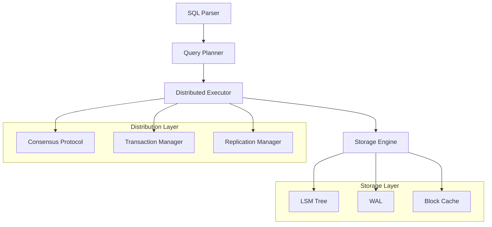

# 🌐 Distributed SQL Implementation - Technical Documentation

## 1. Overview and Problem Statement 🎯

Implementing a distributed SQL system represents one of the most challenging endeavors in database engineering. The goal is to create a system that provides the familiar SQL interface and ACID guarantees while operating reliably across multiple nodes and geographic regions. Understanding how to implement such a system requires deep knowledge of distributed systems, database internals, and modern infrastructure.

Traditional monolithic SQL databases weren't designed with distribution in mind, leading to several fundamental challenges:
- How do we partition data across nodes while maintaining SQL semantics?
- How can we execute distributed transactions while preserving ACID guarantees?
- What mechanisms ensure consistent performance across a distributed environment?
- How do we handle partial failures without compromising data integrity?

A properly implemented distributed SQL system provides immense value:
- Applications can scale horizontally while maintaining familiar SQL semantics
- Organizations can distribute data closer to their users
- Systems become more resilient to hardware and network failures
- Query performance improves through parallel execution
- Data remains consistent even in the face of network partitions

## 2. Core Implementation Components 🏗️

Let's examine each major component of a distributed SQL system and how they work together:



## 3. Technical Implementation 💻

Let's implement each core component, starting with the distributed query executor:

### Distributed Query Executor

```java
/**
 * The QueryExecutor class orchestrates the execution of SQL queries across
 * multiple nodes in the distributed system. It handles query planning,
 * partition routing, and result aggregation.
 */
public class DistributedQueryExecutor {
    private final PartitionManager partitionManager;
    private final TransactionManager txManager;
    private final ClusterMetadata metadata;
    
    /**
     * Executes a distributed SQL query while maintaining consistency.
     * Steps through parsing, planning, and distributed execution.
     */
    public QueryResult executeQuery(String sql) {
        // Parse and analyze the SQL query
        QueryPlan plan = QueryPlanner.createPlan(sql);
        
        // Determine affected partitions
        Set<Partition> partitions = partitionManager.getRelevantPartitions(plan);
        
        // Start distributed transaction
        TransactionContext tx = txManager.beginTransaction();
        try {
            // Create execution plan for each partition
            Map<Partition, ExecutionPlan> executionPlans = 
                createPartitionPlans(plan, partitions);
            
            // Execute in parallel across partitions
            List<Future<PartitionResult>> futures = executePartitionPlans(
                executionPlans,
                tx
            );
            
            // Gather and merge results
            QueryResult result = mergeResults(futures);
            
            // Commit transaction
            tx.commit();
            
            return result;
            
        } catch (Exception e) {
            tx.rollback();
            throw new QueryExecutionException(e);
        }
    }
    
    /**
     * Executes partition-local portions of the query in parallel.
     * Handles data locality and network optimization.
     */
    private List<Future<PartitionResult>> executePartitionPlans(
        Map<Partition, ExecutionPlan> plans,
        TransactionContext tx
    ) {
        List<Future<PartitionResult>> futures = new ArrayList<>();
        
        for (Map.Entry<Partition, ExecutionPlan> entry : plans.entrySet()) {
            Partition partition = entry.getKey();
            ExecutionPlan plan = entry.getValue();
            
            // Submit execution task to partition's node
            futures.add(executor.submit(() -> {
                Node node = metadata.getNodeForPartition(partition);
                return node.executeLocalPlan(plan, tx);
            }));
        }
        
        return futures;
    }
}
```

### Transaction Management

The transaction manager handles distributed ACID transactions:

```python
class DistributedTransactionManager:
    """
    Manages distributed transactions using two-phase commit protocol.
    Ensures ACID properties across partitions and handles failures.
    """
    def __init__(self):
        self.lock_manager = DistributedLockManager()
        self.log_manager = TransactionLogManager()
        self.coordinator = TransactionCoordinator()
        
    def begin_transaction(self) -> Transaction:
        """
        Starts a new distributed transaction with snapshot isolation.
        Creates transaction context and acquires necessary locks.
        """
        # Generate globally unique transaction ID
        tx_id = self.generate_tx_id()
        
        # Create transaction snapshot
        snapshot = self.create_snapshot()
        
        # Initialize transaction state
        tx = Transaction(
            id=tx_id,
            snapshot=snapshot,
            coordinator=self.coordinator
        )
        
        # Log transaction start
        self.log_manager.log_begin(tx)
        
        return tx
        
    def prepare_commit(self, transaction: Transaction) -> bool:
        """
        First phase of two-phase commit protocol.
        Ensures all participants are ready to commit.
        """
        participants = transaction.get_participants()
        
        # Ask all participants to prepare
        prepare_responses = self.coordinator.prepare_transaction(
            transaction,
            participants
        )
        
        # Check if all participants are ready
        all_prepared = all(
            response.is_prepared() 
            for response in prepare_responses
        )
        
        if not all_prepared:
            # If any participant failed to prepare, abort
            self.abort_transaction(transaction)
            return False
            
        # Log prepare decision
        self.log_manager.log_prepare(transaction)
        
        return True
```

### Distributed Query Planning

Here's how to implement efficient distributed query planning:

```python
class DistributedQueryPlanner:
    """
    Plans query execution across distributed nodes while optimizing
    for data locality and minimizing network traffic.
    """
    def create_execution_plan(self, sql_query: str) -> DistributedPlan:
        # Parse SQL into abstract syntax tree
        ast = self.parser.parse(sql_query)
        
        # Analyze query requirements
        analysis = self.analyzer.analyze(ast)
        
        # Determine optimal partitioning scheme
        partitioning = self.determine_partitioning(analysis)
        
        # Create sub-plans for each partition
        partition_plans = {}
        for partition in partitioning.get_partitions():
            local_plan = self.create_partition_plan(
                analysis,
                partition
            )
            partition_plans[partition] = local_plan
            
        # Create merge plan for results
        merge_plan = self.create_merge_plan(
            partition_plans,
            analysis.get_output_schema()
        )
        
        return DistributedPlan(
            partition_plans=partition_plans,
            merge_plan=merge_plan,
            cost_estimate=self.estimate_cost(partition_plans, merge_plan)
        )
        
    def create_partition_plan(
        self,
        analysis: QueryAnalysis,
        partition: Partition
    ) -> ExecutionPlan:
        """
        Creates an execution plan for a single partition that
        minimizes data transfer between nodes.
        """
        # Determine which predicates can be pushed down
        pushdown_predicates = self.get_pushdown_predicates(
            analysis.predicates,
            partition
        )
        
        # Create optimal join ordering for partition
        join_order = self.optimize_join_order(
            analysis.joins,
            partition
        )
        
        # Build execution operators
        operators = []
        
        # Add table scans with pushed-down predicates
        for table in analysis.tables:
            if partition.contains_table(table):
                scan = TableScanOperator(
                    table,
                    pushdown_predicates
                )
                operators.append(scan)
        
        # Add joins in optimal order
        for join in join_order:
            join_op = HashJoinOperator(
                left=operators[-1],
                right=self.build_join_subtree(join),
                condition=join.condition
            )
            operators.append(join_op)
            
        return ExecutionPlan(operators)
```

## 4. Performance Optimization 🚀

Implementing effective performance optimization requires careful monitoring and tuning:

```python
class PerformanceOptimizer:
    """
    Monitors and optimizes distributed SQL performance through
    various techniques and automatic tuning.
    """
    def optimize_query_performance(self, workload: QueryWorkload):
        # Analyze query patterns
        patterns = self.analyze_query_patterns(workload)
        
        # Identify optimization opportunities
        optimizations = []
        
        # Check partition distribution
        if self.detect_partition_skew():
            optimizations.append(
                self.rebalance_partitions()
            )
            
        # Analyze join performance
        if self.detect_expensive_joins():
            optimizations.append(
                self.optimize_join_strategies()
            )
            
        # Check index usage
        if self.detect_missing_indexes():
            optimizations.append(
                self.recommend_indexes()
            )
            
        # Implement optimizations
        for opt in optimizations:
            self.apply_optimization(opt)
            
        # Validate improvements
        return self.measure_performance_impact(optimizations)
```

## 5. Failure Handling and Recovery 🔧

Robust failure handling is crucial for distributed SQL systems:

```python
class FailureHandler:
    """
    Handles various types of failures in distributed SQL systems
    while maintaining data consistency.
    """
    def handle_node_failure(self, failed_node: Node):
        # Detect failure type
        failure_type = self.diagnose_failure(failed_node)
        
        if failure_type == FailureType.NETWORK_PARTITION:
            # Handle network partition
            self.handle_network_partition(failed_node)
            
        elif failure_type == FailureType.HARDWARE_FAILURE:
            # Initiate failover
            self.initiate_failover(failed_node)
            
        elif failure_type == FailureType.SOFTWARE_CRASH:
            # Attempt restart
            self.restart_node(failed_node)
            
    def handle_network_partition(self, isolated_node: Node):
        """
        Handles network partitions while preventing split-brain scenarios.
        Uses consensus protocol to maintain consistency.
        """
        # Check if we're in majority partition
        if self.consensus.is_in_majority_partition():
            # Continue operating in majority partition
            self.operate_in_majority()
            
            # Monitor for partition healing
            self.monitor_partition_healing()
            
        else:
            # Enter read-only mode in minority partition
            self.enter_readonly_mode()
            
    def recover_node(self, node: Node):
        """
        Recovers a failed node and brings it back into sync.
        """
        # Verify node health
        if not self.verify_node_health(node):
            raise NodeUnhealthyException()
            
        # Replay transaction log
        self.replay_transaction_log(node)
        
        # Synchronize state
        self.synchronize_state(node)
        
        # Verify consistency
        if self.verify_consistency(node):
            # Resume normal operation
            self.resume_operation(node)
        else:
            # Initiate full restore
            self.initiate_full_restore(node)
```

## 6. Real-world Use Cases 🌍

Let's examine a real-world implementation for a global e-commerce platform:

```python
class EcommerceDistributedSQL:
    """
    Implements distributed SQL for a global e-commerce platform
    handling millions of transactions per day.
    """
    def process_order(self, order: Order) -> OrderResult:
        # Start distributed transaction
        with self.transaction_manager.begin() as tx:
            try:
                # Check inventory (distributed query)
                inventory = self.check_inventory(
                    order.items,
                    tx
                )
                
                if not inventory.is_available():
                    return OrderResult.INSUFFICIENT_INVENTORY
                    
                # Process payment (must be atomic)
                payment = self.process_payment(
                    order.payment,
                    tx
                )
                
                if not payment.is_successful():
                    return OrderResult.PAYMENT_FAILED
                    
                # Update inventory and create order
                self.update_inventory(order.items, tx)
                self.create_order_record(order, tx)
                
                # Commit transaction
                tx.commit()
                
                return OrderResult.SUCCESS
                
            except Exception as e:
                # Rollback on any error
                tx.rollback()
                return OrderResult.ERROR
```

This implementation handles:
- Global inventory management
- Atomic order processing
- Payment processing
- Consistent order state
- High availability requirements

## 7. Best Practices and Guidelines 📚

When implementing distributed SQL systems, follow these key principles:

1. Data Locality: Keep related data together to minimize network communication
2. Partition Tolerance: Design for network partitions and node failures
3. Consistency Levels: Provide flexible consistency levels for different use cases
4. Monitoring: Implement comprehensive monitoring and alerting
5. Recovery Planning: Have clear procedures for various failure scenarios
6. Performance Optimization: Continuously monitor and optimize performance
7. Security: Implement proper authentication and encryption
8. Testing: Thoroughly test distributed scenarios and failure cases

## 8. Common Pitfalls to Avoid ⚠️

### Incorrect Transaction Management

```java
// INCORRECT: Unsafe transaction handling
public class UnsafeTransactionManager {
    public void processTransaction(Transaction tx) {
        // Dangerous: No timeout or failure handling
        tx.prepare();
        tx.commit();  // May hang indefinitely
    }
}

// CORRECT: Safe transaction handling
public class SafeTransactionManager {
    public void processTransaction(Transaction tx) {
        try {
            // Set reasonable timeout
            CompletableFuture<Boolean> prepareResult = tx.prepareAsync()
                .orTimeout(5, TimeUnit.SECONDS);
                
            if (prepareResult.get()) {
                CompletableFuture<Boolean> commitResult = tx.commitAsync()
                    .orTimeout(5, TimeUnit.SECONDS);
                    
                if (!commitResult.get()) {
                    tx.rollback();
                }
            } else {
                tx.rollback();
            }
        } catch (TimeoutException e) {
            tx.rollback();
            throw new TransactionTimeoutException(e);
        }
    }
}
```

## 9. Testing and Validation 🧪

Thorough testing is crucial for distributed SQL implementations:

```python
class DistributedSQLTester:
    """
    Comprehensive testing framework for distributed SQL implementations.
    Tests various failure scenarios and consistency guarantees.
    """
    def test_distributed_queries(self):
        """
        Tests distributed query execution under various conditions.
        """
        # Test basic queries
        self.test_basic_crud_operations()
        
        # Test complex joins
        self.test_distributed_joins()
        
        # Test consistency levels
        self.test_consistency_guarantees()
        
        # Test failure scenarios
        self.test_node_failures()
        self.test_network_partitions()
        
        # Test recovery
        self.test_node_recovery()
        self.test_partition_healing()
        
    def test_consistency_guarantees(self):
        """
        Validates that ACID properties are maintained under stress.
        Implements comprehensive testing of isolation levels and
        consistency guarantees across distributed nodes.
        """
        # Test isolation levels
        for isolation_level in IsolationLevel:
            # Setup test data
            test_data = self.generate_test_data()
            
            # Run concurrent transactions
            with ThreadPoolExecutor(max_workers=10) as executor:
                futures = []
                for _ in range(100):
                    futures.append(executor.submit(
                        self.run_test_transaction,
                        test_data,
                        isolation_level
                    ))
                    
                # Verify results maintain consistency
                results = [f.result() for f in futures]
                self.verify_consistency(results)
                
    def test_network_partitions(self):
        """
        Tests system behavior during network partitions,
        ensuring consistency is maintained.
        """
        # Create network partition
        partition = self.simulate_network_partition()
        
        try:
            # Test writes to majority partition
            majority_writes = self.test_writes_majority_partition()
            assert majority_writes.is_successful()
            
            # Test minority partition behavior
            minority_writes = self.test_writes_minority_partition()
            assert minority_writes.is_rejected()
            
            # Test reads during partition
            read_results = self.test_reads_during_partition()
            self.verify_read_consistency(read_results)
            
        finally:
            # Heal partition and verify recovery
            self.heal_network_partition(partition)
            self.verify_partition_recovery()
```

## 10. Data Migration and Schema Changes 🔄

Implementing safe schema changes in a distributed environment:

```java
/**
 * Manages distributed schema changes ensuring zero-downtime
 * and consistency across all nodes.
 */
public class DistributedSchemaManager {
    private final ConsensusProtocol consensus;
    private final TransactionManager txManager;
    private final ClusterMetadata metadata;
    
    public void performSchemaChange(SchemaChange change) {
        // First, validate schema change
        SchemaValidationResult validation = validateSchemaChange(change);
        if (!validation.isValid()) {
            throw new InvalidSchemaException(validation.getErrors());
        }
        
        // Create distributed schema change transaction
        try (Transaction tx = txManager.beginTransaction()) {
            // Phase 1: Prepare all nodes
            PrepareResult prepare = prepareSchemaChange(change, tx);
            if (!prepare.isSuccessful()) {
                tx.rollback();
                throw new SchemaChangeException("Prepare failed");
            }
            
            // Phase 2: Apply schema change
            boolean success = applySchemaChange(change, tx);
            if (!success) {
                tx.rollback();
                throw new SchemaChangeException("Apply failed");
            }
            
            // Phase 3: Verify schema change
            VerificationResult verification = verifySchemaChange(change, tx);
            if (!verification.isSuccessful()) {
                tx.rollback();
                throw new SchemaChangeException("Verification failed");
            }
            
            // Commit schema change
            tx.commit();
        }
    }
    
    private boolean applySchemaChange(SchemaChange change, Transaction tx) {
        try {
            // Apply change to each partition in sequence
            for (Partition partition : metadata.getPartitions()) {
                // Get node for partition
                Node node = metadata.getNodeForPartition(partition);
                
                // Apply change to node
                ChangeResult result = node.applySchemaChange(change, tx);
                if (!result.isSuccessful()) {
                    return false;
                }
                
                // Verify node health after change
                if (!node.isHealthy()) {
                    return false;
                }
            }
            
            return true;
        } catch (Exception e) {
            logger.error("Schema change failed", e);
            return false;
        }
    }
}
```

## 11. Monitoring and Observability 📊

Implementing comprehensive monitoring for distributed SQL systems:

```python
class DistributedSQLMonitor:
    """
    Provides comprehensive monitoring and observability for
    distributed SQL deployments. Tracks key metrics and health indicators.
    """
    def __init__(self):
        self.metric_collector = MetricCollector()
        self.alert_manager = AlertManager()
        self.health_checker = HealthChecker()
        
    def collect_system_metrics(self):
        """
        Collects and analyzes system-wide metrics for monitoring
        and performance optimization.
        """
        metrics = {
            'query_metrics': self.collect_query_metrics(),
            'transaction_metrics': self.collect_transaction_metrics(),
            'node_metrics': self.collect_node_metrics(),
            'network_metrics': self.collect_network_metrics()
        }
        
        # Analyze metrics for anomalies
        anomalies = self.detect_anomalies(metrics)
        
        # Generate alerts if needed
        if anomalies:
            self.alert_manager.generate_alerts(anomalies)
            
        # Store metrics for trending
        self.metric_collector.store_metrics(metrics)
        
        return metrics
        
    def collect_query_metrics(self):
        """
        Collects detailed query performance metrics across the cluster.
        """
        return {
            'query_latency': self.measure_query_latency(),
            'query_throughput': self.measure_query_throughput(),
            'query_errors': self.count_query_errors(),
            'slow_queries': self.identify_slow_queries(),
            'query_patterns': self.analyze_query_patterns()
        }
        
    def measure_node_health(self, node):
        """
        Performs comprehensive health check for a single node.
        """
        return {
            'cpu_usage': node.get_cpu_usage(),
            'memory_usage': node.get_memory_usage(),
            'disk_usage': node.get_disk_usage(),
            'network_health': node.check_network_health(),
            'replication_lag': node.get_replication_lag(),
            'transaction_errors': node.get_transaction_errors()
        }
```

## 12. Security Implementation 🔒

Implementing security in a distributed SQL environment:

```python
class DistributedSQLSecurity:
    """
    Implements comprehensive security measures for distributed SQL systems.
    Handles authentication, authorization, and encryption.
    """
    def __init__(self):
        self.auth_manager = AuthenticationManager()
        self.access_control = AccessControlManager()
        self.encryption = EncryptionManager()
        
    def secure_connection(self, client_connection):
        """
        Establishes secure connection with client including
        authentication and encryption.
        """
        # Establish TLS connection
        secure_channel = self.encryption.establish_tls(
            client_connection,
            self.get_server_certificates()
        )
        
        # Authenticate client
        auth_result = self.auth_manager.authenticate_client(
            secure_channel
        )
        
        if not auth_result.is_successful():
            raise AuthenticationException(
                auth_result.get_error()
            )
            
        # Set up session encryption
        session = self.encryption.create_secure_session(
            secure_channel,
            auth_result.get_client_id()
        )
        
        return session
        
    def authorize_query(self, query, user_context):
        """
        Performs authorization check for query execution.
        Implements role-based access control.
        """
        # Parse query to understand required permissions
        required_permissions = self.access_control.analyze_query_permissions(
            query
        )
        
        # Check user permissions
        for permission in required_permissions:
            if not self.access_control.has_permission(
                user_context,
                permission
            ):
                raise AuthorizationException(
                    f"Missing permission: {permission}"
                )
                
        return True
```

## 13. Disaster Recovery Implementation 🚨

Implementing robust disaster recovery capabilities:

```python
class DisasterRecoveryManager:
    """
    Implements comprehensive disaster recovery capabilities
    for distributed SQL systems.
    """
    def __init__(self):
        self.backup_manager = BackupManager()
        self.recovery_manager = RecoveryManager()
        self.replication_manager = ReplicationManager()
        
    def create_recovery_point(self):
        """
        Creates a consistent recovery point across all nodes.
        """
        # Start distributed snapshot
        snapshot = self.backup_manager.start_distributed_snapshot()
        
        try:
            # Freeze writes during snapshot
            with self.transaction_manager.pause_writes():
                # Take consistent snapshot across all nodes
                for node in self.cluster.get_nodes():
                    node_snapshot = self.backup_manager.snapshot_node(node)
                    snapshot.add_node_snapshot(node_snapshot)
                    
                # Verify snapshot consistency
                if not self.verify_snapshot_consistency(snapshot):
                    raise SnapshotException("Inconsistent snapshot")
                    
            return snapshot
            
        finally:
            # Always cleanup snapshot resources
            self.backup_manager.cleanup_snapshot_resources()
            
    def recover_from_disaster(self, disaster_event):
        """
        Implements recovery process after a disaster event.
        """
        # Assess damage
        impact_assessment = self.assess_disaster_impact(disaster_event)
        
        # Create recovery plan
        recovery_plan = self.create_recovery_plan(impact_assessment)
        
        # Execute recovery steps
        try:
            for step in recovery_plan.get_steps():
                step_result = self.execute_recovery_step(step)
                if not step_result.is_successful():
                    raise RecoveryException(f"Step failed: {step}")
                    
            # Verify recovery
            if not self.verify_recovery_success():
                raise RecoveryException("Recovery verification failed")
                
        except Exception as e:
            # Initiate fallback plan
            self.execute_fallback_plan(recovery_plan)
            raise
```

## 14. Deployment and Operations 🚀

Best practices for deploying and operating distributed SQL systems:

1. Always implement proper monitoring and alerting
2. Use automated deployment tools and infrastructure as code
3. Implement comprehensive backup and recovery procedures
4. Regularly test disaster recovery scenarios
5. Monitor and optimize query performance
6. Implement proper security measures
7. Keep documentation up to date
8. Train operations team on troubleshooting procedures
9. Implement change management procedures
10. Regularly review and update security measures

Remember that operating a distributed SQL system requires ongoing attention to:
- Performance optimization
- Security updates
- Backup verification
- Disaster recovery testing
- Capacity planning
- Monitoring and alerting
- Team training and documentation

These implementations provide a foundation for building robust, scalable distributed SQL systems while maintaining proper security, monitoring, and disaster recovery capabilities.